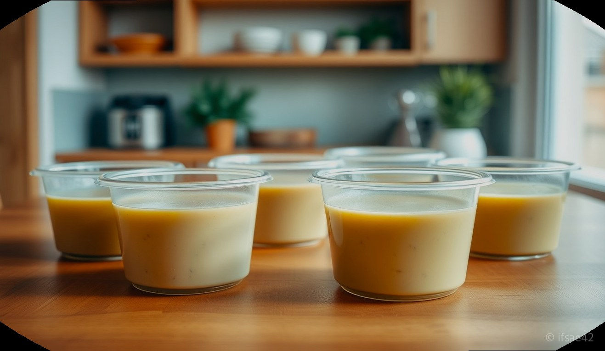
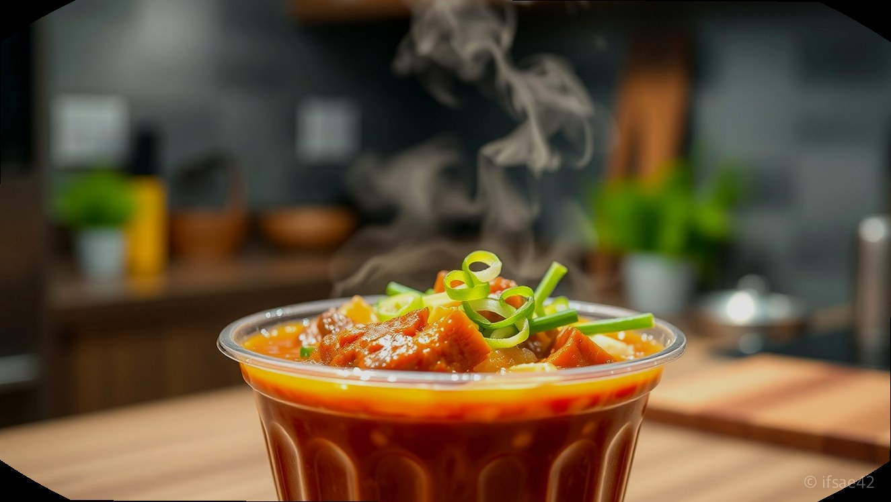
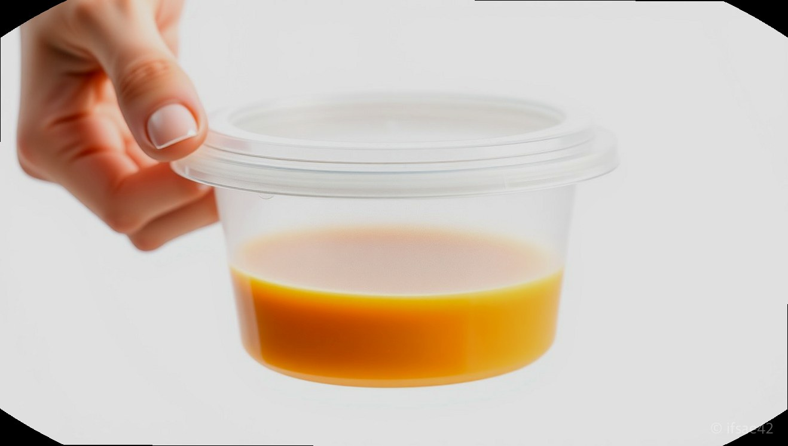

> 자동 생성 초안 · 2026-06-04

# 195파이 소 탕용기 내돈내산 후기, 국물 샘 없는 배달 필수템 400세트 가성비 분석

배달 전문점을 운영하시거나 가정에서 대용량 음식을 소분해 보관하시는 분들이라면, 가장 고민되는 부분 중 하나가 바로 '용기의 밀폐력'입니다. 특히 국물 요리는 조금만 틈이 생겨도 배달 가방이 엉망이 되기 일쑤라 용기 선택에 신중할 수밖에 없는데요. 오늘은 제가 직접 사용해 보고 정착하게 된 '195파이 소' 탕용기에 대한 솔직한 내돈내산 후기를 공유해 드립니다.

많은 사장님께서 왜 195파이 규격을 선호하시는지, 그리고 200개입과 400개입 세트 중 어떤 것이 실질적인 운영 비용을 절감하는 데 도움이 될지 상세히 분석해 보았습니다. 배달 용기 고민으로 시간을 보내고 계신 분들께 이 글이 명쾌한 해답이 되기를 바랍니다.

## 195파이 소 용량 체감 및 최적화 메뉴 추천

195파이 소 사이즈는 보통 800ml에서 1000ml 사이의 용량을 가지고 있습니다. '소'라는 명칭 때문에 작다고 생각하실 수 있지만, 실제 음식물을 담아보면 생각보다 넉넉한 수납력을 자랑합니다.

*   **순대국 및 국밥류:** 1인분 분량의 순대국이나 돼지국밥을 담았을 때, 국물과 건더기를 포함해 용기 높이의 80% 정도가 차오릅니다. 넘치지 않으면서도 푸짐해 보이는 최적의 비율입니다.
*   **냉면 및 칼국수:** 면 요리의 경우 육수를 넉넉히 부어도 면이 잠길 공간이 충분합니다. 특히 195파이의 넓은 입구는 면을 넣고 빼기에 매우 편리한 구조입니다.
*   **떡볶이 및 찜 요리:** 국물이 자작한 떡볶이나 찜닭 1인분을 담기에 안성맞춤입니다. 용기 자체가 탄탄해서 뜨거운 음식을 담아도 형태가 무너지지 않는 것이 큰 장점입니다.

## 국물 샘 방지 기능 및 실사용 내구성 테스트

배달 용기의 생명은 무엇보다 '결합력'입니다. 제가 사용한 195파이 소 제품은 뚜껑과 본체가 맞물리는 '딸깍' 소리가 명확하게 들리는 타입입니다. 

실제 테스트를 위해 용기에 물을 가득 채우고 뚜껑을 닫은 뒤, 배달 가방 안에서 흔들리는 상황을 가정해 1분간 강하게 흔들어 보았습니다. 결과는 놀라웠습니다. 단 한 방울의 누수도 발생하지 않았습니다. 이는 뚜껑의 정교한 설계 덕분인데, 배달 중 오토바이가 급커브를 돌거나 방지턱을 넘어도 국물이 샐 걱정을 덜어줍니다. 또한, PP 소재 특유의 내열성 덕분에 전자레인지 사용이 가능해 고객들이 집에서 바로 데워 먹기에도 매우 편리합니다.

## 대량 구매 가성비 분석: 200개입 vs 400개입

배달 매장을 운영할 때 소모품 비용은 무시할 수 없는 고정비입니다. 200개입 세트와 400개입 세트를 비교해 보면, 장기적인 관점에서 400개입 세트가 압도적인 가성비를 보여줍니다.

1.  **단가 절감:** 400개입 세트는 200개입 대비 개당 단가가 약 10~15% 저렴하게 형성되어 있습니다. 매달 수천 개의 용기를 사용하는 매장이라면 이 차이가 곧 순이익으로 직결됩니다.
2.  **보관 및 적재:** 195파이 용기는 뚜껑과 본체가 차곡차곡 쌓이는 구조로 설계되어 있어, 400개를 한 번에 받아도 생각보다 공간을 많이 차지하지 않습니다. 주방의 좁은 틈새에 수직으로 적재할 수 있어 공간 효율이 높습니다.
3.  **배송비 절약:** 대량으로 구매할수록 묶음 배송의 혜택을 받을 수 있어, 배송비 부담을 한 번에 해결할 수 있습니다. 

## 배달 용기 선택 체크리스트

성공적인 배달 운영을 위해 용기를 구매하기 전, 아래 항목들을 반드시 체크해 보세요.

- [ ] **뚜껑 결합력:** 본체와 뚜껑이 헐겁지 않고 견고하게 맞물리는가?
- [ ] **적재 편의성:** 주방 선반이나 배달 가방에 쌓았을 때 흔들림 없이 안정적인가?
- [ ] **내열성:** 뜨거운 국물 요리를 담았을 때 용기가 변형되지 않는 PP 소재인가?
- [ ] **투명도:** 내용물이 밖에서 적당히 보여 고객이 주문한 메뉴를 쉽게 확인할 수 있는가?
- [ ] **가성비:** 200개 단위보다는 400개 단위로 구매하여 단가를 낮출 수 있는가?

## FAQ: 자주 묻는 질문

**Q1. 195파이 소 사이즈에 뼈해장국 1인분이 들어갈까요?**
A1. 네, 충분히 들어갑니다. 뼈해장국 1인분은 보통 국물 양이 많지만, 195파이 소 용량이면 넘치지 않고 깔끔하게 포장 가능합니다.

**Q2. 전자레인지에 바로 돌려도 환경호르몬 걱정은 없나요?**
A2. 대부분의 195파이 탕용기는 내열 PP 소재로 제작되어 전자레인지 사용이 가능합니다. 다만, 뚜껑은 열에 약할 수 있으니 뚜껑을 살짝 열거나 제거하고 데우는 것을 권장합니다.

**Q3. 400개입을 사면 보관이 너무 힘들지 않을까요?**
A3. 195파이 용기는 중첩 적재가 가능해 400개라도 가로세로 약 40cm 정도의 공간만 있으면 충분히 보관할 수 있습니다. 

### 마무리하며

195파이 소 탕용기는 배달 시장에서 가장 검증된 '실패 없는 선택'입니다. 국물 샘 방지라는 기본기에 충실하면서도, 400개입 대량 구매를 통해 운영 비용까지 절감할 수 있다는 점이 가장 큰 매력입니다. 여러분의 매장 운영에 이 용기가 든든한 지원군이 되길 바랍니다. 추가로 궁금한 점이 있다면 댓글로 남겨주세요!

#195파이소 #배달용기추천 #탕용기후기
