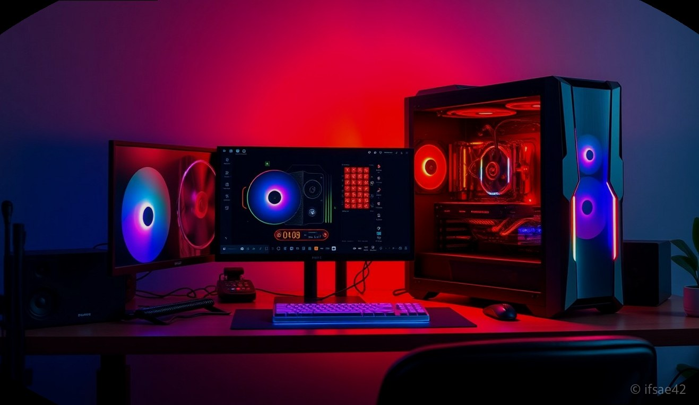
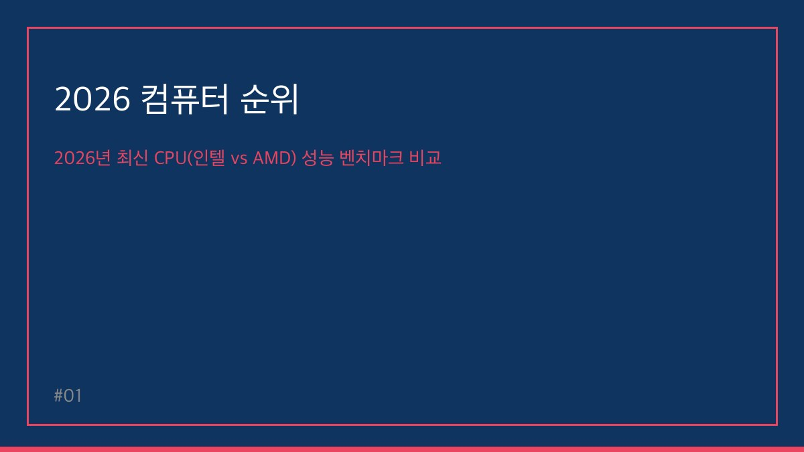

> 자동 생성 초안 · 2026-06-01

# 2026 컴퓨터 CPU 성능 순위 총정리: 용도별 최적의 조립 PC 견적 가이드

2026년 4월, 컴퓨터 시장은 그 어느 때보다 기술적 변화가 빠른 시기를 지나고 있습니다. 매년 쏟아져 나오는 신제품들 속에서 나에게 맞는 최적의 프로세서를 선택하는 일은 이제 단순한 성능 비교를 넘어, AI 연산 능력과 전력 효율성까지 고려해야 하는 복잡한 과정이 되었습니다.

많은 분이 '무조건 비싼 CPU가 최고'라고 생각하시지만, 실제로는 사용 목적에 따라 가성비와 효율이 완전히 달라집니다. 오늘은 2026년 최신 벤치마크 데이터를 바탕으로, 게이밍부터 전문 작업까지 여러분의 예산과 목적에 딱 맞는 CPU 선택 기준을 명확하게 정리해 드립니다.

## 2026년 최신 CPU(인텔 vs AMD) 성능 벤치마크 비교

2026년 현재, CPU 시장은 AMD의 '3D V-Cache' 기술을 앞세운 게이밍 우위와 인텔의 '코어 울트라(Core Ultra)' 시리즈를 통한 AI 연산 및 작업 효율성 강화라는 양강 구도로 재편되었습니다.

AMD 라이젠 시리즈는 게임 실행 시 L3 캐시를 극대화하는 설계를 통해 압도적인 프레임 방어율을 보여줍니다. 반면, 인텔은 최신 아키텍처를 통해 멀티코어 작업에서의 안정성과 AI 가속기(NPU) 내장을 통한 최신 소프트웨어 최적화에 강점을 보입니다. 벤치마크 점수만 맹신하기보다는, 본인이 주로 사용하는 프로그램이 어떤 아키텍처에 최적화되어 있는지를 확인하는 것이 2026년 CPU 선택의 핵심입니다.

## 사용 목적별 최적의 CPU 추천 가이드

### 1. 게이밍 최강자: AMD 라이젠 X3D 시리즈
고사양 게임을 즐기는 게이머라면 고민할 필요 없이 AMD의 X3D 라인업을 추천합니다. 3D V-Cache 기술은 게임 내 최소 프레임을 비약적으로 상승시켜, 끊김 없는 부드러운 화면을 제공합니다. 

### 2. 영상 편집 및 전문 작업: 인텔 코어 울트라 9 & 라이젠 9
4K 영상 편집, 3D 렌더링, 대규모 데이터 처리가 주 목적이라면 멀티코어 성능이 가장 중요합니다. 인텔 코어 울트라 9 시리즈는 고효율 코어와 고성능 코어의 조화로 작업 시간을 획기적으로 단축해 줍니다. 라이젠 9 시리즈 역시 압도적인 코어 수를 바탕으로 고부하 작업에서 탁월한 성능을 발휘합니다.

### 3. 사무용 및 가성비 게이밍: 인텔 i5 & 라이젠 5
일반적인 오피스 업무와 가벼운 게임을 즐긴다면 굳이 최상급 라인업을 고집할 필요가 없습니다. 인텔 i5와 라이젠 5 시리즈는 전력 효율이 뛰어나며, 발열 관리가 쉬워 조립 PC 구성 시 전체적인 비용을 크게 절감할 수 있습니다.

## 2026년 프로세서 트렌드: AI 연산과 전력 효율

2026년 CPU 시장의 화두는 단연 '온디바이스 AI'입니다. 최신 프로세서에는 AI 연산을 전담하는 NPU가 탑재되어 있어, 영상 편집 프로그램의 자동 자막 생성이나 이미지 보정, 보안 작업 등을 CPU 부하 없이 빠르게 처리합니다. 

또한, 전력 효율(Performance per Watt)이 매우 중요해졌습니다. 과거에는 높은 성능을 위해 무조건 많은 전력을 소비하는 방식이었으나, 현재는 낮은 전력으로도 높은 성능을 내는 것이 기술력의 척도가 되었습니다. 이는 전기 요금 절감뿐만 아니라, 시스템의 발열을 낮춰 부품의 수명을 연장하는 데 큰 도움을 줍니다.

---

### [체크리스트] CPU 구매 전 확인하세요!
- [ ] **주 사용 목적은 무엇인가요?** (게임 vs 영상 편집 vs 사무)
- [ ] **선택한 CPU의 소켓이 메인보드와 호환되나요?** (최신 규격 확인 필수)
- [ ] **AI 기능을 활용할 소프트웨어를 사용하시나요?** (NPU 탑재 모델 고려)
- [ ] **쿨링 솔루션은 충분한가요?** (고성능 CPU일수록 수랭 쿨러 권장)
- [ ] **예산 내에서 그래픽카드와 CPU의 밸런스가 맞나요?** (병목 현상 방지)

### FAQ: 자주 묻는 질문
**Q1. 게이밍용으로 인텔과 AMD 중 무엇이 더 좋나요?**
A1. 순수 게이밍 성능을 원하신다면 AMD의 X3D 시리즈가 현재 가장 높은 평가를 받습니다. 하지만 다양한 작업과 게임을 병행하신다면 인텔의 최신 코어 울트라 시리즈도 훌륭한 선택지입니다.

**Q2. 2026년에 CPU를 살 때 AI 기능이 꼭 필요한가요?**
A2. 당장은 필수가 아닐 수 있지만, 향후 출시되는 소프트웨어들이 AI 가속을 기본으로 탑재하는 추세입니다. 3년 이상 사용할 PC라면 NPU가 탑재된 모델을 선택하는 것이 장기적으로 유리합니다.

**Q3. 가성비 조립 PC 조합은 어떻게 할까요?**
A3. 라이젠 5 또는 인텔 i5급 CPU에 RTX 4060 Ti 이상의 그래픽카드를 조합하면 대부분의 최신 게임과 FHD/QHD 작업 환경을 쾌적하게 누릴 수 있습니다.

---

2026년 4월 기준, 컴퓨터 CPU 성능 순위는 단순히 숫자의 나열이 아니라 여러분의 작업 환경을 결정짓는 중요한 지표입니다. 오늘 정리해 드린 내용을 바탕으로 여러분의 예산과 목적에 맞는 최고의 시스템을 구성해 보시길 바랍니다. 조립 PC 구성에 대해 더 궁금한 점이 있다면 언제든 댓글로 질문해 주세요!

#2026컴퓨터순위 #CPU성능순위 #조립PC견적
