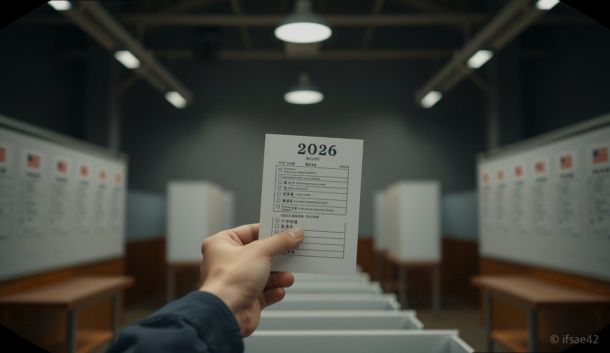

> 자동 생성 초안 · 2026-06-01

# 2026년 지방선거 일정 및 사전투표 준비물 총정리 (제9회 전국동시지방선거)

대한민국의 지역 살림을 책임질 일꾼을 뽑는 제9회 전국동시지방선거가 다가오고 있습니다. 지방선거는 우리 동네의 교육, 복지, 개발 등 실생활과 직결된 정책을 결정하는 중요한 선거인만큼, 유권자라면 미리 일정을 숙지하고 투표권을 행사하는 것이 무엇보다 중요합니다.

이번 선거는 2026년 6월 3일 수요일에 실시됩니다. 투표 당일 개인적인 사정으로 투표가 어려운 분들을 위한 사전투표 제도와 투표 시 반드시 챙겨야 할 준비물, 그리고 많은 분이 관심을 가지시는 선거 사무원 모집 정보까지 상세히 정리해 드립니다.

## 제9회 전국동시지방선거 상세 일정 및 투표 안내

제9회 전국동시지방선거는 2026년 6월 3일(수)에 진행됩니다. 투표 시간은 오전 6시부터 오후 6시까지이며, 해당일은 법정 공휴일로 지정되어 모든 유권자가 투표에 참여할 수 있도록 보장됩니다.

만약 선거 당일 투표소 방문이 어렵다면 사전투표 기간을 활용하시기 바랍니다. 사전투표는 선거일 전 5일인 2026년 5월 29일(금)부터 5월 30일(토)까지 이틀간 진행됩니다. 사전투표의 가장 큰 장점은 별도의 신고 절차 없이 전국 어디서나 가까운 사전투표소에서 투표할 수 있다는 점입니다. 

투표소 위치는 중앙선거관리위원회 홈페이지나 '선거정보' 모바일 앱을 통해 실시간으로 확인할 수 있습니다. 본인의 주소지 관할 투표소는 투표 안내문을 통해서도 상세히 안내되니 사전에 미리 확인해 두시는 것을 권장합니다.

## 사전투표 제도 활용 및 투표 준비물 체크리스트

투표소에 방문하실 때는 반드시 본인 확인을 위한 신분증을 지참해야 합니다. 투표소에서 본인 확인 절차를 거치지 않으면 투표가 불가능하므로 아래의 준비물을 꼭 확인해 주시기 바랍니다.

**[투표 준비물 체크리스트]**
*   **필수 지참:** 관공서 또는 공공기관이 발행한 사진이 부착된 신분증
*   **인정되는 신분증:** 주민등록증, 운전면허증, 여권, 국가유공자증, 학생증(사진 부착), 장애인 복지카드 등
*   **주의사항:** 신분증은 반드시 원본이어야 하며, 촬영본이나 복사본은 인정되지 않습니다.

외국인 투표권의 경우, 영주권 취득 후 3년이 경과하고 외국인 등록대장에 올라 있는 외국인에게 지방선거 투표권이 부여됩니다. 최근 외국인 유권자 수 증가에 따른 지역별 선거 영향력이 주요 관전 포인트로 떠오르고 있는 만큼, 관련 이슈를 선관위 공식 자료를 통해 확인해 보시는 것도 좋습니다.

## 선거 관리 사무원 모집 공고 및 신청 방법

선거 시즌이 되면 각 지자체 선거관리위원회에서는 투표소 및 개표소 운영을 도울 선거 사무원을 모집합니다. 이는 선거의 공정한 관리를 위해 필수적인 인력으로, 보통 선거일 2~3개월 전부터 공고가 시작됩니다.

*   **모집 대상:** 만 18세 이상의 대한민국 국민 (선거사무 종사 가능자)
*   **주요 업무:** 투표소 안내, 본인 확인, 개표 사무 보조 등
*   **신청 방법:** 거주지 관할 시·군·구 선거관리위원회 홈페이지 공고 확인 후 신청서 제출
*   **팁:** 선거 사무원은 단기 아르바이트 형태의 공공 일자리로 수요가 많습니다. 희망하시는 분들은 2026년 3월경부터 각 지역 선관위 게시판을 수시로 확인하는 것이 좋습니다.

## 자주 묻는 질문 (FAQ)

**Q1. 사전투표소는 아무 곳이나 가도 되나요?**
A1. 네, 사전투표는 별도의 신고 없이 전국에 설치된 사전투표소 어디서나 투표가 가능합니다. 본인 거주지와 무관하게 가까운 곳을 이용하시면 됩니다.

**Q2. 모바일 신분증도 사용 가능한가요?**
A2. 네, 정부24 앱이나 모바일 신분증 앱을 통해 발급받은 모바일 신분증도 본인 확인용으로 사용 가능합니다. 다만, 화면을 캡처한 이미지는 인정되지 않으니 반드시 앱을 직접 실행해 보여주셔야 합니다.

**Q3. 투표소 위치는 어디서 확인하나요?**
A3. 중앙선거관리위원회 홈페이지 내 '투표소 찾기' 서비스나 포털 사이트 검색, 혹은 각 가정으로 발송되는 투표 안내문을 통해 확인하실 수 있습니다.

---

2026년 지방선거는 우리 지역의 미래를 결정하는 중요한 권리 행사입니다. 오늘 정리해 드린 일정과 준비물을 잘 숙지하셔서, 소중한 한 표를 행사하시길 바랍니다. 선거와 관련한 보다 상세한 정보는 [중앙선거관리위원회 공식 홈페이지](https://www.nec.go.kr)에서 확인 가능합니다.

#2026년지방선거 #제9회전국동시지방선거 #지방선거준비물
