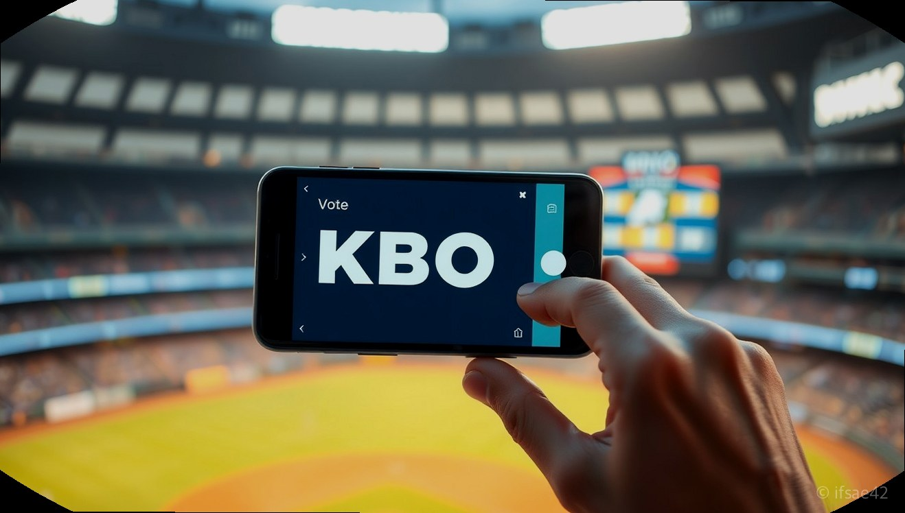

> 자동 생성 초안 · 2026-06-05

# 2026 KBO 리그 순위 및 경기 일정 총정리, 실시간 업데이트 확인하기

2026 KBO 리그가 시즌 중반을 지나며 순위 경쟁이 더욱 치열해지고 있습니다. 매일 바뀌는 팀 순위와 주요 경기 일정은 야구 팬들에게 가장 중요한 정보일 텐데요. 특히 올해는 ABS 시스템 도입과 주요 선수들의 이적 소식 등 리그 전반에 걸쳐 큰 변화가 많았던 만큼, 팬들의 관심이 그 어느 때보다 뜨겁습니다.

오늘은 2026 KBO 리그의 현재 순위와 주요 경기 일정, 그리고 최근 야구계를 뜨겁게 달구고 있는 주요 이슈들을 정리해 드립니다. 실시간 순위 확인 방법부터 올스타전 투표 가이드까지, 야구 팬이라면 반드시 알아야 할 핵심 내용들을 지금 바로 확인해 보시기 바랍니다.

## 2026 KBO 리그 순위 및 주요 이슈 분석

현재 2026 KBO 리그는 상위권과 중위권 팀들의 승차 차이가 크지 않아 한 경기 결과에 따라 순위가 요동치고 있습니다. 특히 최근 도입된 ABS(자동 투구 판정 시스템)를 둘러싼 현장의 목소리가 끊이지 않고 있습니다. LG 트윈스의 오지환 선수가 인터뷰를 통해 "구장마다 스트라이크존 체감이 다르다"며 ABS의 공정성에 의문을 제기한 사례는 리그 전체의 화두가 되었습니다. 기술적인 도입은 환영받았으나, 현장 선수들이 느끼는 괴리감을 어떻게 좁혀 나갈지가 향후 리그 운영의 핵심 과제가 될 것으로 보입니다.

또한, 이적 시장 역시 뜨겁습니다. 고교 최대어 하현승 선수가 30억 원의 해외 진출 제안을 뒤로하고 키움 히어로즈 입단을 결정한 것은 KBO 리그의 위상을 다시금 생각하게 하는 사건이었습니다. 반면, 두산 베어스에서 방출된 타무라 선수가 일본 복귀 후 인터뷰에서 "KBO 리그의 환경 적응이 예상보다 훨씬 어려웠다"고 토로한 점은 외국인 선수 영입 전략에 대한 구단들의 고민을 깊게 만들고 있습니다. 이러한 뉴스들은 단순히 기록을 넘어, 리그의 수준과 환경이 어떻게 변화하고 있는지 보여주는 중요한 지표입니다.

## KBO 올스타전 투표 방법 및 베스트 12 선정 가이드

매년 6월 야구 팬들의 가장 큰 축제인 KBO 올스타전 투표가 시작되었습니다. 올해는 명단 오류 문제로 재투표가 진행되는 등 우여곡절이 있었지만, 팬들의 열기는 여전히 뜨겁습니다. 베스트 12를 선정하는 과정은 팬들이 직접 자신이 응원하는 선수를 그라운드의 주인공으로 만드는 과정이기에 그 의미가 남다릅니다.

올스타전 투표는 KBO 공식 홈페이지와 앱을 통해 누구나 참여할 수 있습니다. 투표 시에는 각 포지션별로 가장 뛰어난 활약을 펼친 선수를 신중하게 선택하는 것이 중요하며, 특정 구단에 편중되지 않은 균형 잡힌 시각이 필요합니다. 재투표가 진행된 만큼, 기존에 참여하셨던 분들도 다시 한번 자신의 투표 내역을 확인하고 소중한 한 표를 행사하시길 바랍니다. 올스타전은 리그의 중간 점검이자 팬 서비스의 정점인 만큼, 공정한 투표를 통해 최고의 선수들이 선발되기를 기대합니다.

## KBO 리그 관람을 위한 체크리스트

- [ ] KBO 공식 홈페이지를 통해 실시간 순위표 및 경기 결과 확인하기
- [ ] 응원하는 팀의 잔여 경기 일정을 달력에 미리 표시해두기
- [ ] ABS 판정 논란 등 리그 내 주요 이슈 기사 챙겨보기
- [ ] KBO 올스타전 투표 기간 내 베스트 12 선정 참여하기
- [ ] 구단별 선수 영입 및 부상 복귀 소식 등 로스터 변화 확인하기

## 자주 묻는 질문(FAQ)

**Q1. 2026 KBO 리그의 실시간 순위는 어디서 가장 정확하게 확인할 수 있나요?**
A1. KBO 리그 공식 홈페이지와 공식 모바일 앱인 신한 SOL뱅크를 통해 가장 빠르고 정확한 실시간 순위와 경기 데이터를 확인하실 수 있습니다.

**Q2. ABS 시스템 도입 이후 선수들의 불만은 구체적으로 어떤 점인가요?**
A2. 일부 선수들은 구장별로 설치된 기계의 미세한 오차나 스트라이크존 설정의 체감 차이를 언급하며, 경기마다 일관성이 부족하다는 점을 주된 불만 사항으로 지적하고 있습니다.

**Q3. KBO 올스타전 베스트 12 투표는 어떻게 참여하나요?**
A3. KBO 공식 홈페이지 내 올스타전 투표 페이지에 접속하여 본인 인증 후, 각 포지션별 선수를 선택하여 투표하기 버튼을 누르면 참여가 완료됩니다.

2026 KBO 리그는 매 경기 예측할 수 없는 승부와 선수들의 치열한 경쟁으로 야구 팬들에게 큰 즐거움을 주고 있습니다. 오늘 정리해 드린 정보가 여러분의 즐거운 야구 관람에 도움이 되길 바랍니다. 여러분이 응원하는 팀은 현재 몇 위인가요? 댓글로 응원의 한마디를 남겨주세요.

#KBO #프로야구 #야구순위
