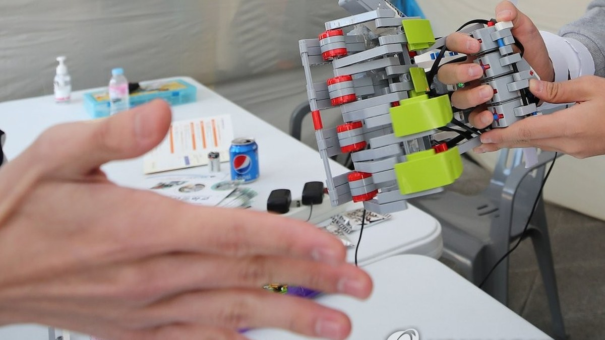
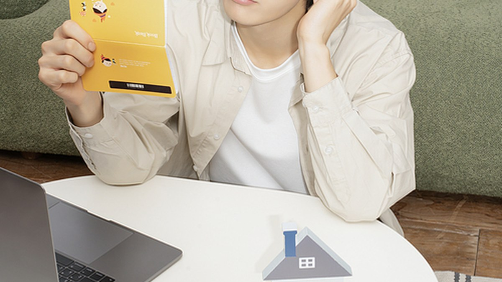
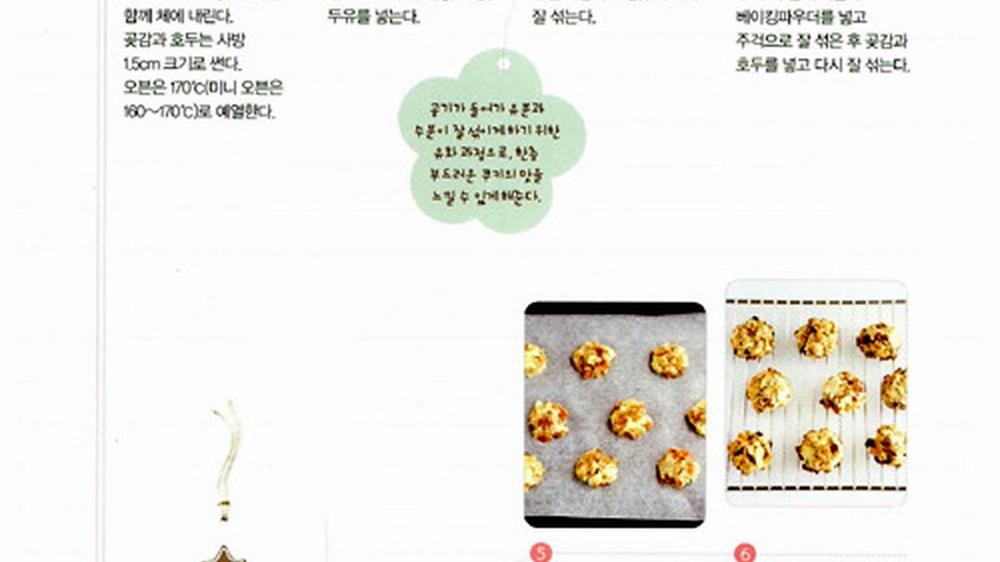
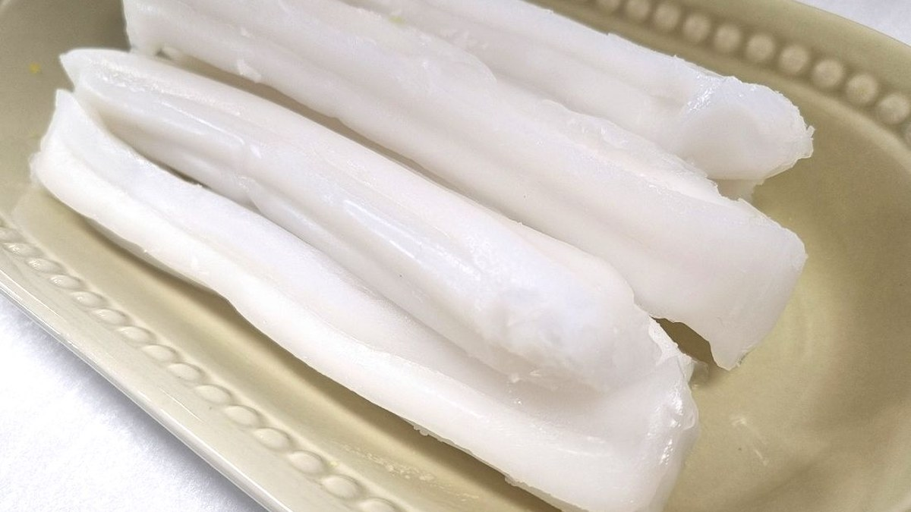
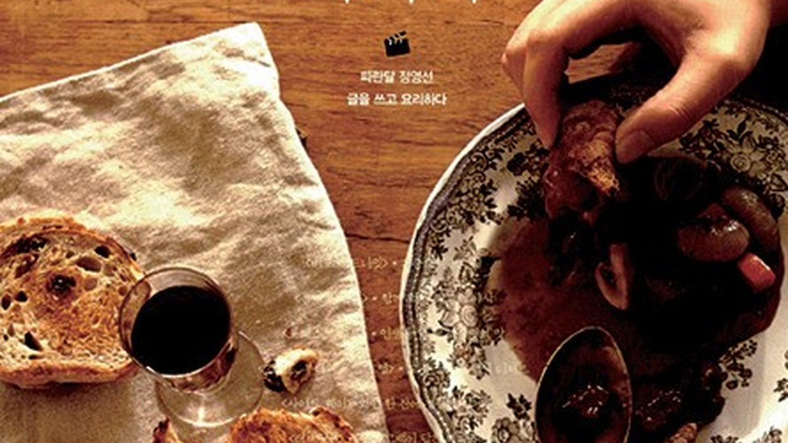
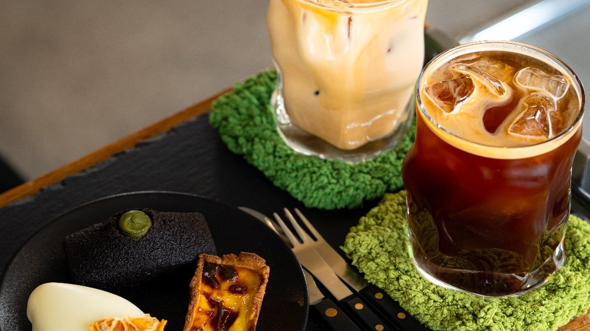

> 자동 생성 초안 · 2026-05-31

# 가위바위보 이기는 법부터 뉴진면 조합까지! 일상 속 재미있는 심리 활용 꿀팁 3가지

어린 시절, 친구들과 놀이터에서, 혹은 학창 시절 반에서 순서를 정할 때, 우리는 자연스럽게 '가위바위보'를 외치며 승부를 겨뤘습니다. 단순한 놀이를 넘어, 가위바위보는 우리의 일상 곳곳에 스며들어 있습니다. 최근에는 인기 아이돌 그룹의 신곡 제목으로도 등장하며 다시 한번 대중의 관심을 받고 있을 만큼, 가위바위보는 단순한 게임 이상의 의미를 지니고 있습니다.

이처럼 우리에게 친숙한 가위바위보, 혹시 단순히 운에 맡기고 계시지는 않으신가요? 사실 가위바위보에는 상대방의 심리를 파악하고 예측하는 재미있는 심리전이 숨어 있습니다. 오늘은 단순한 승부를 넘어, 일상 속에서 가위바위보를 더욱 흥미롭게 즐길 수 있는 심리 활용 꿀팁 3가지를 소개해 드리고자 합니다.

## 1. 가위바위보 심리학: 이기는 법과 상대방의 심리 분석

가위바위보에서 이기는 것은 단순히 운이 좋아서만은 아닙니다. 상대방의 심리를 읽고 나의 전략을 효과적으로 구사한다면 승률을 높일 수 있습니다. 몇 가지 심리적인 팁을 통해 가위바위보의 숨겨진 전략을 파헤쳐 보겠습니다.

### 상대방의 첫 수는 예측 가능하다?

많은 사람들이 첫 번째 가위바위보에서 '바위'를 내는 경향이 있습니다. 이는 바위가 가장 강력하고 안정적인 형태라고 느끼기 때문입니다. 따라서 상대방이 첫 수를 바위로 낼 것이라고 예상한다면, 우리는 '보'를 내어 이길 확률을 높일 수 있습니다. 물론 모든 사람이 이 경향을 따르는 것은 아니지만, 첫 번째 판에서 상대방의 패턴을 관찰하는 것은 좋은 전략이 될 수 있습니다.

### 연속된 패는 피하라!

상대방이 연속해서 같은 패를 내는 경우는 드뭅니다. 만약 상대방이 두 번 연속으로 '가위'를 냈다면, 다음에는 '바위'나 '보'를 낼 확률이 높습니다. 이럴 때 우리는 상대방이 내지 않을 것이라고 예상되는 패를 선택하거나, 혹은 상대방이 낼 법한 패를 역으로 예측하여 카운터하는 전략을 사용할 수 있습니다.

### 승자의 심리, 패자의 심리

가위바위보에서 이긴 사람은 다음 판에서도 같은 것을 내는 경향이 있습니다. 이는 승리의 경험이 자신감을 주기 때문입니다. 반대로 진 사람은 이전에 졌던 것을 피하려는 심리가 작용합니다. 따라서 상대방이 이겼다면 다음 판에 같은 것을 낼 확률이 높다고 예상하고, 상대방이 졌다면 다음 판에 이전에 냈던 것을 피할 것이라고 예상하여 나의 패를 결정하는 것이 좋습니다.

### 숫자로 보는 가위바위보 심리

재미있는 연구 결과도 있습니다. 특정 연구에 따르면, 사람들은 무작위로 가위바위보를 낼 때, '보'를 가장 적게 내고 '가위'를 가장 많이 내는 경향이 있다고 합니다. 물론 이 또한 절대적인 것은 아니지만, 상대방이 '가위'를 자주 낸다면 '바위'로 대응하는 것이 유리할 수 있습니다.

## 2. 가위바위보를 활용한 아이들 교육 및 역할극 활용법

가위바위보는 단순한 놀이를 넘어, 아이들의 교육과 사회성 발달에도 긍정적인 영향을 줄 수 있는 훌륭한 도구입니다. 가위바위보를 활용한 교육 및 역할극 방법을 소개해 드립니다.

### 동기 부여 및 의사 결정 훈련

아이들이 어떤 활동을 하기 싫어하거나 망설일 때, 가위바위보를 통해 순서를 정하거나 참여 여부를 결정하게 하면 좋습니다. 예를 들어, "누가 먼저 그림을 그릴지 가위바위보로 정하자!"와 같이 활용할 수 있습니다. 이는 아이들에게 공정한 규칙 안에서 의사를 결정하는 경험을 제공하고, 결과에 승복하는 태도를 길러줍니다.

### 역할극 놀이를 통한 공감 능력 향상

가위바위보에서 이긴 사람과 진 사람의 역할을 바꾸어 역할극을 해보는 것은 아이들의 공감 능력과 상상력을 키우는 데 도움이 됩니다. 이긴 사람은 기뻐하는 역할, 진 사람은 아쉬워하는 역할을 맡아 감정을 표현하고 서로의 입장을 이해하는 연습을 할 수 있습니다. 또한, "만약 내가 이겼다면 어땠을까?", "만약 내가 졌다면 어떤 기분이었을까?"와 같은 질문을 통해 아이들은 다양한 상황을 간접적으로 경험하며 사회성을 배울 수 있습니다.

### 규칙 학습 및 인내심 기르기

가위바위보는 명확한 규칙이 있는 게임입니다. 아이들은 가위바위보를 통해 규칙을 배우고, 게임 결과에 따라 인내심을 기를 수 있습니다. 특히, 친구와 함께 가위바위보를 하면서 이기고 지는 경험을 통해 감정을 조절하는 법을 배우는 것은 매우 중요합니다.

## 3. 가위바위보가 등장하는 일상 속 재미있는 에피소드 및 꿈 해몽

가위바위보는 우리의 일상 속에서 예상치 못한 재미있는 상황을 만들어내기도 하며, 때로는 꿈 속에서도 등장하여 특별한 의미를 지니기도 합니다.

### 여행지에서의 가위바위보 추억

즐거운 여행지에서 맛있는 음식을 앞에 두고 무엇을 먼저 먹을지, 혹은 어떤 메뉴를 고를지 결정해야 할 때, 가위바위보는 유용하게 사용될 수 있습니다. 예를 들어, 다낭의 한 해산물 식당에서는 랍스터를 앞에 두고 가위바위보를 하며 메뉴 선택의 재미를 더했다는 후기가 있습니다. 이처럼 가위바위보는 평범한 순간에 특별한 추억을 더해주는 역할을 하기도 합니다.

### 가위바위보와 관련된 꿈 해몽

꿈 속에서 가위바위보를 하는 것은 종종 중요한 결정을 앞두고 있거나, 어떤 문제에 대한 해결책을 찾고 있음을 나타낼 수 있습니다.

*   **가위:** 결단력 있는 거절이나 관계의 단절을 상징할 수 있습니다.
*   **바위:** 강한 의지, 고집, 혹은 변화에 대한 저항을 의미할 수 있습니다.
*   **보:** 포용력, 수용, 혹은 새로운 시작을 나타낼 수 있습니다.

꿈에서 어떤 패를 냈는지, 그리고 그 결과가 어떠했는지에 따라 해석이 달라질 수 있습니다. 꿈 해몽은 과학적인 근거는 없지만, 자신의 내면을 들여다보는 재미있는 방법이 될 수 있습니다.

### 트렌디한 가위바위보 이슈

최근에는 인기 아이돌 그룹의 신곡 제목이나 앨범 콘셉트로 '가위바위보'가 등장하며 다시 한번 화제가 되고 있습니다. 이러한 트렌드는 가위바위보가 단순한 놀이를 넘어, 대중문화 속에서도 창의적으로 활용될 수 있음을 보여줍니다. 이러한 이슈들은 가위바위보에 대한 관심을 높이고, 새로운 시각으로 가위바위보를 즐길 수 있게 합니다.

---

### 가위바위보 심리 활용 체크리스트

*   상대방이 첫 판에 '바위'를 낼 확률이 높다고 생각하시나요?
*   상대방이 연속해서 같은 패를 내지 않을 것이라고 예상하시나요?
*   이긴 사람과 진 사람의 심리를 파악하여 다음 패를 예측하시나요?
*   아이들과 함께 가위바위보를 통해 순서를 정하거나 규칙을 배우나요?
*   가위바위보를 하는 꿈을 꾸었을 때, 어떤 의미일지 생각해 본 적이 있나요?

---

### 자주 묻는 질문 (FAQ)

**Q1: 가위바위보에서 항상 이기는 방법이 있나요?**

A1: 가위바위보에서 100% 항상 이기는 방법은 없습니다. 가위바위보는 기본적으로 확률 게임이며 상대방의 심리, 무작위성 등 다양한 요소가 작용하기 때문입니다. 하지만 위에서 설명해 드린 심리 분석 팁들을 활용하면 승률을 높이는 데 도움이 될 수 있습니다.

**Q2: 아이들에게 가위바위보를 가르칠 때 주의할 점이 있나요?**

A2: 아이들에게 가위바위보를 가르칠 때는 승패에 너무 집착하기보다는, 게임의 규칙을 이해하고 즐겁게 참여하는 것에 초점을 맞추는 것이 좋습니다. 또한, 이겼을 때 너무 자만하거나 졌을 때 지나치게 실망하지 않도록 지도하며, 공정한 경쟁과 결과에 대한 승복을 가르치는 것이 중요합니다.

**Q3: 가위바위보 노래나 앨범은 어떤 것이 있나요?**

A3: B1A4와 같은 아이돌 그룹이 '가위바위보'라는 제목의 노래와 앨범을 발매한 바 있습니다. 이 외에도 가위바위보를 모티브로 한 다양한 창작물들이 존재합니다.

---

가위바위보, 이제 단순한 놀이가 아닌 흥미로운 심리 게임이자 교육 도구로 바라보시는 것은 어떨까요? 오늘 소개해 드린 팁들을 활용하여 일상 속에서 가위바위보를 더욱 재미있게 즐기시길 바랍니다.

**혹시 여러분만의 가위바위보 필승 전략이나 재미있는 에피소드가 있다면 댓글로 공유해 주세요!**

#가위바위보 #심리게임 #일상꿀팁

