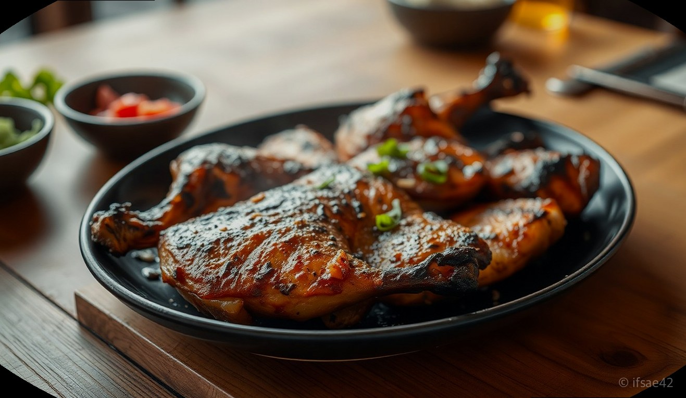
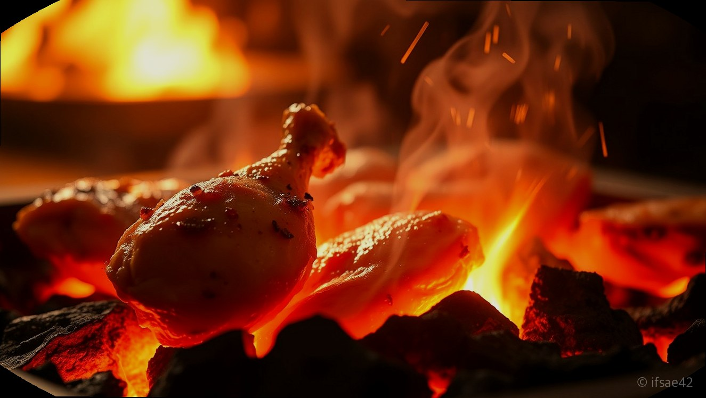
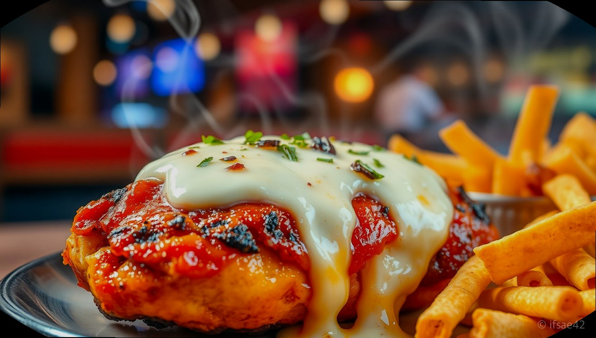

> 자동 생성 초안 · 2026-06-04

# 감탄계 숯불치킨 메뉴 추천, 기름기 쏙 뺀 담백함에 반한 솔직 후기

평소 기름진 튀김 옷을 입힌 치킨을 먹고 나면 속이 더부룩하거나 죄책감이 들 때가 많습니다. 건강을 생각하면서도 치킨의 풍미를 포기할 수 없는 분들이라면, 참숯의 향이 깊게 배어 있는 숯불치킨에 주목해 보시는 건 어떨까요. 오늘은 최근 많은 사랑을 받고 있는 감탄계숯불치킨을 직접 방문하여 맛본 생생한 후기와 함께, 왜 이곳이 남녀노소 모두에게 인기 있는 맛집인지 상세히 소개해 드리겠습니다.

300도 이상의 고온에서 참숯으로 구워낸 감탄계숯불치킨은 튀기지 않아 담백하면서도 육즙은 그대로 보존하고 있다는 점이 가장 큰 매력입니다. 매장에 들어서는 순간부터 코끝을 자극하는 은은한 숯불 향 덕분에 식사 전부터 기대감이 한껏 높아졌습니다. 깔끔하고 모던한 인테리어 덕분에 데이트 코스는 물론, 가족 모임이나 퇴근 후 가벼운 술자리로도 손색이 없었습니다.

## 참숯 300도의 마법, 차원이 다른 풍미의 비밀

감탄계숯불치킨이 다른 치킨집과 차별화되는 가장 큰 이유는 바로 조리 방식에 있습니다. 일반적인 프라이드 치킨이 기름에 튀겨지는 것과 달리, 이곳은 치악산 참숯을 사용하여 300도 이상의 고온에서 정성스럽게 구워냅니다. 이러한 방식은 닭고기 내부의 불필요한 기름기는 쏙 빼주면서, 고기 본연의 쫄깃한 식감과 촉촉한 육즙은 그대로 가두는 역할을 합니다.

실제로 한 입 베어 물면 입안 가득 퍼지는 숯불 향이 일품입니다. 튀김 옷이 없으니 칼로리 부담도 덜할뿐더러, 소화도 훨씬 잘 되는 느낌을 받았습니다. 겉은 살짝 그을려 바삭하면서도 속살은 야들야들한 식감을 자랑하니, 한 번 맛보면 일반 치킨으로 돌아가기 어려울 정도입니다. 건강한 외식을 지향하는 분들에게 이보다 더 완벽한 선택지는 없을 것입니다.

## 시그니처 메뉴 분석: 소금구이부터 양념, 치즈 조합까지

감탄계숯불치킨의 메뉴는 선택의 폭이 넓어 취향대로 즐기기 좋습니다. 가장 기본이 되는 '소금구이'는 숯불 향을 가장 정직하게 느낄 수 있는 메뉴입니다. 담백한 맛을 선호하신다면 소금구이를 먼저 드셔보시길 추천합니다. 닭고기 본연의 감칠맛을 온전히 느낄 수 있어 남녀노소 누구나 좋아할 맛입니다.

조금 더 자극적인 맛을 원하신다면 단짠의 조화가 완벽한 '양념구이'를 추천합니다. 너무 맵지 않으면서도 입맛을 돋우는 감칠맛 나는 양념이 숯불 향과 어우러져 중독성이 강합니다. 특히 치즈가 듬뿍 올라간 메뉴는 비주얼부터 압도적입니다. 고소한 치즈가 매콤달콤한 양념 치킨을 감싸 안아 풍미를 극대화해주는데, 여기에 사이드 메뉴인 나쵸를 곁들이면 최고의 궁합을 자랑합니다. 치즈 소스가 발린 나쵸 위에 치킨 조각을 올려 먹으면 바삭함과 부드러움이 공존하는 환상적인 식감을 경험하실 수 있습니다.

## 분위기 좋은 공간과 실용적인 방문 팁

감탄계숯불치킨은 단순히 맛만 좋은 것이 아니라, 매장 분위기 또한 훌륭합니다. 세련된 조명과 쾌적한 테이블 배치 덕분에 연인과 오붓하게 데이트를 즐기거나, 친구들과 모임을 가지기에도 안성맞춤입니다. 청결하게 관리된 매장 덕분에 아이들과 함께 방문하는 가족 단위 손님들도 편안하게 식사하는 모습을 자주 볼 수 있었습니다.

방문 전 알아두면 좋은 팁도 있습니다. 많은 매장에서 지역화폐 사용이 가능하여 알뜰하게 외식을 즐길 수 있으며, 포장이나 배달 서비스를 이용하면 집에서도 매장의 맛을 그대로 느낄 수 있습니다. 특히 포장 시 제공되는 혜택을 챙기면 더욱 합리적인 가격에 푸짐한 한 상을 차릴 수 있으니, 방문 전 해당 지점의 이벤트 정보를 미리 확인해 보시는 것을 권장합니다.

## 감탄계숯불치킨 이용 체크리스트

- 튀기지 않은 담백한 치킨을 원한다면 소금구이를 먼저 선택하세요.
- 매콤한 맛을 좋아한다면 양념구이에 치즈 추가 옵션을 잊지 마세요.
- 사이드 메뉴인 나쵸는 치킨과 함께 먹을 때 가장 맛있는 꿀조합입니다.
- 매장 방문 전 지역화폐 사용 가능 여부와 포장 할인 혜택을 확인하세요.
- 데이트나 모임 장소로 이용할 경우 사전에 예약하면 더욱 편리합니다.

## FAQ

**Q1. 감탄계숯불치킨은 기름에 튀긴 치킨보다 칼로리가 낮은가요?**
A1. 네, 기름에 튀기지 않고 참숯으로 구워 조리하기 때문에 일반적인 프라이드 치킨에 비해 기름기가 적고 칼로리 부담이 상대적으로 낮습니다.

**Q2. 아이들과 함께 방문하기에도 적합한 분위기인가요?**
A2. 매장이 깔끔하고 쾌적하게 관리되고 있어 어린아이를 동반한 가족 단위 손님들이 식사하기에 아주 좋습니다.

**Q3. 포장이나 배달 주문 시에도 매장과 동일한 맛을 느낄 수 있나요?**
A3. 네, 감탄계숯불치킨은 포장 및 배달 서비스도 활발히 운영 중이며 집에서도 숯불의 풍미를 충분히 즐기실 수 있도록 꼼꼼하게 포장해 드립니다.

오늘 소개해 드린 감탄계숯불치킨, 어떠셨나요? 기름진 음식은 부담스럽지만 맛있는 치킨은 포기할 수 없는 날, 숯불 향 가득한 이곳에서 건강하고 만족스러운 한 끼를 즐겨보시길 바랍니다. 오늘 저녁, 숯불치킨과 함께 행복한 시간을 보내시는 건 어떨까요?

#감탄계숯불치킨 #숯불치킨맛집 #치킨추천
