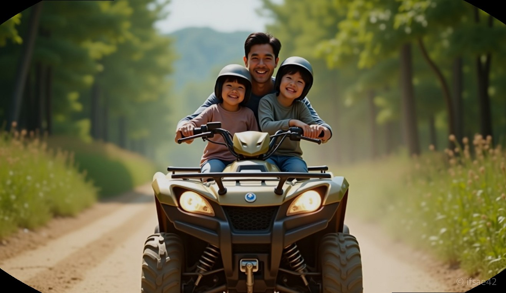
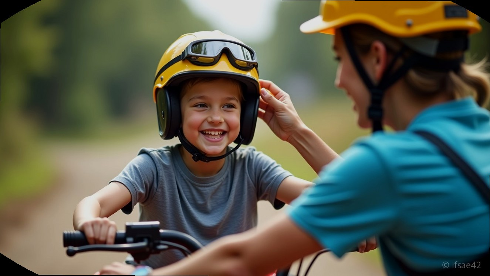
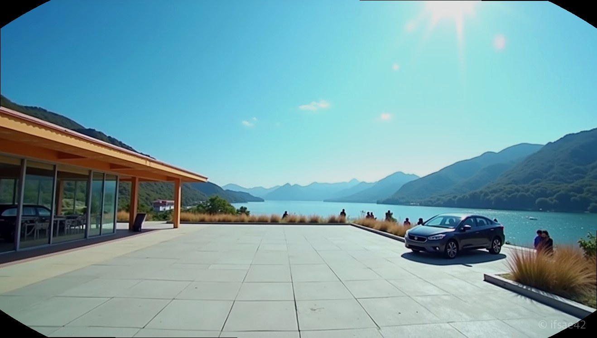

> 자동 생성 초안 · 2026-07-14

# 경주 아이랑 가볼만한곳 보문단지 ATV 체험, 아이 동반 탑승부터 준비물 꿀팁까지

아이와 함께하는 경주 여행, 매번 유적지 관람이나 박물관 방문만 반복해서 고민이신가요? 활동적인 에너지를 발산하고 싶은 아이들을 위해 보문단지 근처에서 즐길 수 있는 특별한 액티비티, 바로 **경주ATV** 체험을 추천합니다. 결론부터 말씀드리면, 어린 자녀와 함께라면 보호자가 운전하는 ATV에 동반 탑승하는 방식으로 안전하고 즐겁게 오프로드를 누빌 수 있습니다.

## 아이와 동반 탑승 및 안전
경주ATV 체험장은 기본적으로 18세 이상부터 단독 운전이 가능하도록 규정되어 있습니다. 하지만 부모님이 운전하고 아이가 뒷좌석에 앉는 '동반 탑승'이 가능하기 때문에 가족 단위 여행객에게 인기가 높습니다. 아이와 함께 탑승할 때는 무엇보다 안전이 최우선입니다. 출발 전 현장 전문가가 헬멧과 보호 장구 착용을 도와주며, 조작법과 안전 수칙을 충분히 숙지할 수 있도록 상세히 교육합니다. 아이가 탑승했을 때는 급커브나 과속을 자제하고, 코스 안내에 따라 천천히 주행하는 것이 가족 모두가 즐거운 시간을 보내는 핵심입니다.

## 보문단지 위치 및 편의성
많은 분이 숙소로 잡는 보문단지 내에 체험장이 위치해 있다는 점은 큰 장점입니다. 특히 경주월드와 인접해 있어 여행 동선을 짜기에 매우 효율적입니다. 대형 풍선 간판이 대로변에 설치되어 있어 초행길이라도 쉽게 찾을 수 있고, 무엇보다 전용 주차장이 완비되어 있어 렌터카를 이용하는 가족 여행객도 주차 스트레스 없이 방문할 수 있습니다. 짐이 많은 아이 동반 가족에게 주차 편의성은 여행의 질을 결정하는 아주 중요한 요소입니다.

## 체험 시간과 코스 난이도
보통 경주ATV 체험은 총 45분 정도로 구성됩니다. 이 중 약 20분은 안전 교육과 코스 주행 연습에 할애하며, 나머지 25분은 실제 오프로드 코스를 자유롭게 누비는 시간입니다. 초보자도 쉽게 따라올 수 있도록 평탄한 길부터 약간의 스릴을 느낄 수 있는 비포장도로까지 다양하게 조성되어 있습니다. 아이와 함께라면 너무 거친 지형보다는 풍경을 감상하며 달릴 수 있는 완만한 코스를 선택하는 것이 좋습니다. 거친 흙길을 달리는 동안 아이들이 느끼는 해방감과 성취감은 일반적인 관광지에서는 경험하기 힘든 특별한 추억이 됩니다.

## 복장 팁 및 필수 준비물
현장에서 가장 강조하는 부분 중 하나는 바로 '신발'입니다. 멋을 내기 위해 슬리퍼나 크록스를 신고 오시는 경우가 많은데, 오프로드 특성상 흙먼지가 날리고 발이 노출될 위험이 있어 운동화 착용이 필수입니다. 옷은 활동하기 편한 긴바지와 소매가 있는 상의를 권장합니다. 흙먼지가 옷에 묻을 수 있으니 세탁이 쉬운 옷을 입는 것이 마음 편합니다. 또한, 햇빛이 강한 날에는 선글라스나 가벼운 바람막이를 챙기면 더욱 쾌적하게 레이싱을 즐길 수 있습니다.

## 알찬 여행 코스 추천
경주ATV 체험은 경주 여행의 중간 일정으로 넣기에 최적입니다. 오전에 보문단지 내 산책이나 박물관을 둘러본 뒤, 오후 활력이 필요할 때 체험장을 방문해 보세요. 체험 후에는 바로 근처에 위치한 경주월드에서 놀이기구를 타거나, 저녁 무렵 보문호수 산책로를 걸으며 하루를 마무리하는 코스를 추천합니다. 활동적인 아빠와 아이, 그리고 여유를 즐기고 싶은 엄마까지 모두 만족할 수 있는 완벽한 가족 나들이가 될 것입니다.

**Q1. 아이 동반 탑승은 몇 살부터 가능한가요?**
A1. 업체마다 규정이 조금씩 다르지만 보통 초등학생 저학년부터는 보호자 동반 하에 안전하게 탑승이 가능합니다.

**Q2. 비 오는 날에도 체험이 가능한가요?**
A2. 폭우가 쏟아지는 경우가 아니라면 정상 운영하는 편이나, 예약 전 현장에 직접 문의하여 운영 여부를 확인하는 것이 정확합니다.

#경주ATV #경주아이랑가볼만한곳 #경주액티비티
