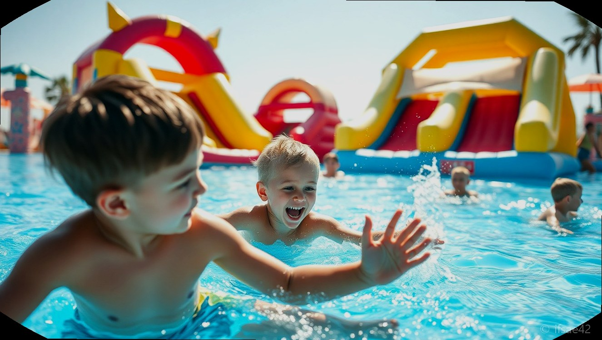
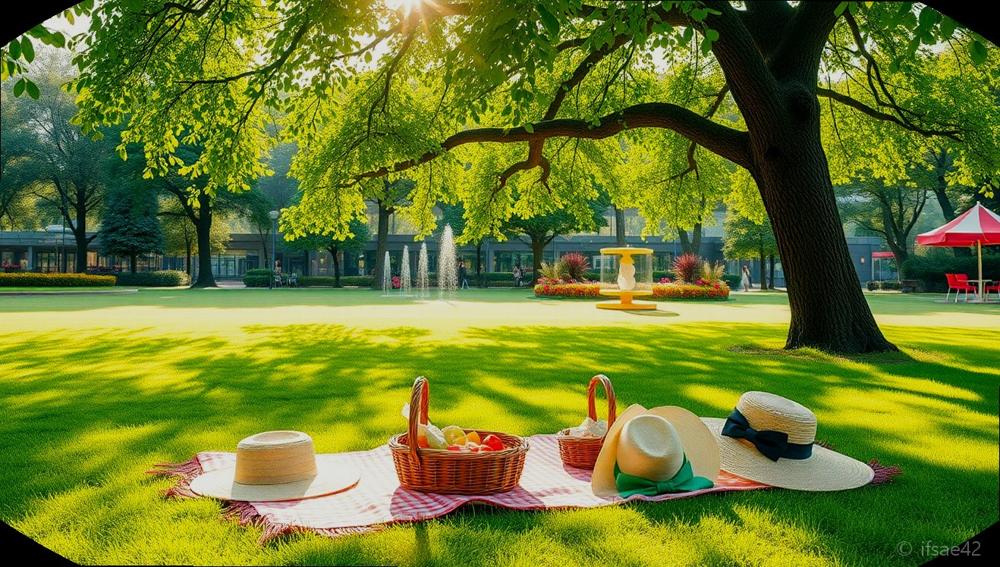

> 자동 생성 초안 · 2026-06-28

# 경주 MCY파크 아이랑 가볼만한곳, 수영장부터 포토존까지 이용 꿀팁 총정리

아이와 함께하는 경주 여행을 계획 중이라면, 볼거리와 놀 거리가 가득한 곳을 찾기 마련입니다. 특히 여름철에는 시원한 물놀이와 함께 인생 사진까지 남길 수 있는 곳이라면 금상첨화인데요. 오늘은 경주 아이랑 가볼만한곳으로 입소문이 자자한 경주MCY파크를 완벽하게 즐기는 방법을 소개해 드리려고 합니다.

약 1만 평의 넓은 부지에 알록달록한 스쿨버스 포토존부터 신나는 수영장, 에어바운스까지 갖춘 경주MCY파크는 아이들에게는 천국 같은 공간입니다. 당일치기 여행은 물론, 캠프닉을 즐기기에도 최적화된 이곳의 매력과 방문 전 꼭 알아두어야 할 실용적인 정보들을 상세히 정리해 보았습니다.

## 경주MCY파크 시설 총정리: 포토존부터 물놀이까지

경주MCY파크의 가장 큰 매력은 단연 12대의 실제 스쿨버스를 활용한 테마파크라는 점입니다. 각기 다른 컬러와 컨셉으로 꾸며진 버스들은 그 자체로 훌륭한 포토존이 됩니다. 아이들이 직접 운전석에 앉아 핸들을 잡아보거나 버스 내부를 탐험하는 모습은 부모님들에게도 잊지 못할 추억이 됩니다. 알록달록한 색감 덕분에 어디서 찍어도 사진이 정말 잘 나옵니다.

활동적인 아이들을 위한 시설도 완벽합니다. 여름철 아이들의 에너지를 쏟아내기에 최고인 수영장과 대형 에어바운스는 경주MCY파크의 핵심입니다. 에어바운스는 오전 10시부터 오후 7시까지 운영되어 아이들이 지칠 때까지 마음껏 뛰어놀 수 있습니다. 시설 관리가 잘 되어 있어 쾌적하게 물놀이를 즐길 수 있으며, 주변의 캠프닉 공간을 활용하면 아이들이 노는 동안 부모님들은 여유로운 휴식을 취할 수 있습니다.

## 방문 전 필수 준비물 및 이용 꿀팁

경주MCY파크를 제대로 즐기기 위해서는 몇 가지 준비물이 필요합니다. 야외 활동이 많은 만큼 아이들을 위한 선크림과 모자, 선글라스는 필수입니다. 특히 물놀이를 계획 중이라면 수영복, 여벌 옷, 수건, 그리고 물놀이 용품을 꼼꼼히 챙겨주세요. 현장 매점이 운영되어 라면이나 간단한 간식을 사 먹을 수 있지만, 아이들이 좋아하는 과자나 음료를 미리 준비해 가면 더욱 편리합니다.

방문 팁을 드리자면, 가급적 오픈 시간에 맞춰 방문하는 것을 추천합니다. 오전 10시에 입장하면 한낮의 더위를 피해 비교적 한산할 때 포토존에서 인생 사진을 남길 수 있습니다. 또한, 캠프닉을 계획하신다면 돗자리나 캠핑 의자를 챙겨 그늘 아래 자리를 잡는 것이 좋습니다. 주말에는 방문객이 많을 수 있으니 미리 예매 정보를 확인하고 방문하시길 권장합니다.

## 운영 시간, 입장료 및 방문 정보

경주MCY파크는 경상북도 경주시 천북남로 196에 위치해 있습니다. 운영 시간은 평일 오전 10시부터 오후 7시까지이며, 주말 및 공휴일에는 오후 8시까지 연장 운영하여 더욱 여유롭게 즐길 수 있습니다. 입장료와 예매 정보는 시즌별로 변동될 수 있으므로 방문 전 공식 홈페이지나 네이버 예약을 통해 최신 정보를 확인하는 것이 가장 정확합니다.

주변에는 식당가가 잘 형성되어 있어 물놀이 후 허기진 배를 채우기에도 좋습니다. 입구 근처에 맛집들이 많아 당일치기 여행 코스로 동선을 짜기에 매우 편리합니다. 아이와 함께 즐거운 추억을 쌓고 맛있는 음식으로 마무리하는 완벽한 하루를 경주MCY파크에서 만들어 보시길 바랍니다.

## 방문 전 체크리스트
- [ ] 네이버 예약을 통해 입장권 사전 예매 완료하기
- [ ] 수영복, 수건, 여벌 옷, 아쿠아슈즈 챙기기
- [ ] 선크림, 모자, 선글라스 등 자외선 차단 용품 준비
- [ ] 캠프닉을 위한 돗자리나 간단한 캠핑 의자 챙기기
- [ ] 운영 시간 확인 후 오픈런 준비하기

## 자주 묻는 질문(FAQ)
**Q1. 경주MCY파크의 운영 시간은 어떻게 되나요?**
A1. 평일은 오전 10시부터 오후 7시까지이며 주말 및 공휴일에는 오전 10시부터 오후 8시까지 운영합니다.
**Q2. 에어바운스와 수영장은 몇 시까지 이용할 수 있나요?**
A2. 에어바운스는 보통 오전 10시부터 오후 7시까지 이용 가능하며 수영장 운영 시간은 현장 상황에 따라 다를 수 있으니 방문 전 확인이 필요합니다.
**Q3. 외부 음식 반입이 가능한가요?**
A3. 내부 매점이 운영 중이나 간단한 간식이나 음료는 챙겨오실 수 있으며 캠프닉을 즐기기에 좋은 환경입니다.

이번 주말, 아이와 함께 특별한 추억을 만들고 싶다면 경주MCY파크로 떠나보시는 건 어떨까요? 알록달록한 스쿨버스 앞에서 아이의 웃음꽃 핀 사진도 남기고, 시원한 물놀이까지 즐기며 행복한 하루를 보내시길 바랍니다. 혹시 여러분만의 경주MCY파크 방문 꿀팁이 있다면 댓글로 공유해 주세요!

#경주MCY파크 #경주아이랑가볼만한곳 #경주수영장
