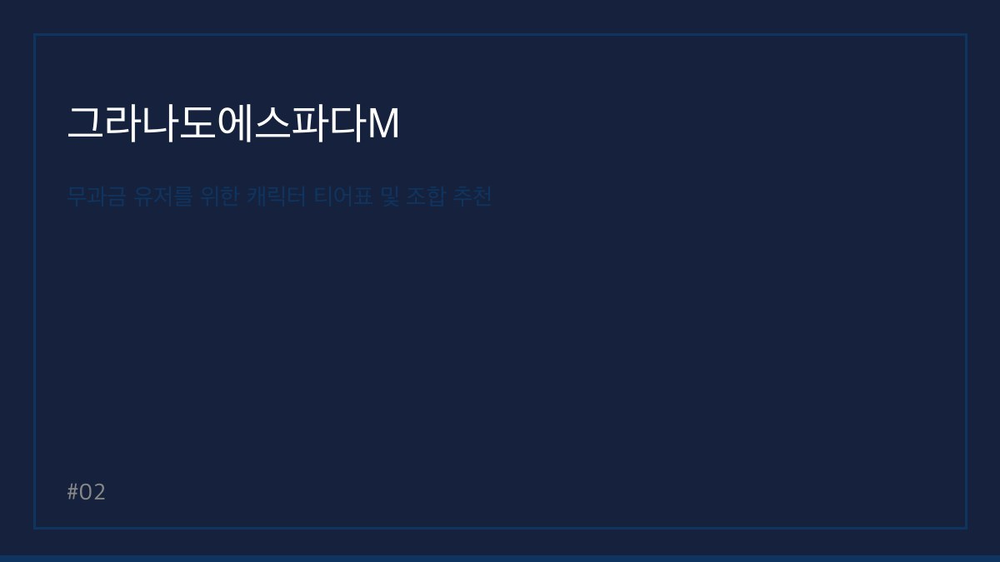

> 자동 생성 초안 · 2026-06-09

# 그라나도에스파다M 6월 최신 쿠폰 코드 및 무과금 캐릭터 티어표 완벽 정리

많은 게이머의 향수를 자극하며 꾸준한 인기를 누리고 있는 그라나도에스파다M이 6월을 맞아 새로운 업데이트와 함께 풍성한 혜택을 제공하고 있습니다. 특히 바이런 2차 대규모 업데이트와 카스티야 지역의 확장으로 인해 복귀 유저와 신규 유저들의 유입이 크게 늘어나고 있는 시점입니다.

오늘은 게임을 처음 시작하거나 다시 복귀하는 무과금 유저분들을 위해 꼭 알아두어야 할 6월 최신 쿠폰 코드 정보와 효율적인 캐릭터 육성 가이드를 정리해 드립니다. 체계적인 성장을 통해 그라나도 대륙의 숨겨진 비밀을 파헤치고 더욱 강력한 팀을 구성해 보시기 바랍니다.

## 6월 최신 쿠폰 코드 및 입력 방법

무과금 유저에게 쿠폰은 초반 성장의 원동력이자 필수 요소입니다. 6월 기준 현재 사용 가능한 쿠폰을 확인하여 보상을 챙겨두시기 바랍니다. 쿠폰은 주기적으로 업데이트되므로 공식 카페를 수시로 확인하는 습관이 중요합니다.

**[6월 사용 가능 쿠폰 코드]**
*   GE6MONTH: 고급 소환권 10장 및 강화석 상자
*   BYRONUPDATE: 바이런 업데이트 기념 특별 보상 상자
*   CASTILLA2024: 카스티야 지역 정복 지원 패키지
*   WELCOMEGE: 신규 복귀 유저 전용 성장 지원 상자

**[쿠폰 입력 방법]**
1. 게임 내 우측 상단 메뉴(줄 세 개 아이콘)를 클릭합니다.
2. 설정(톱니바퀴 아이콘) 메뉴로 이동합니다.
3. 계정 탭 내에 있는 '쿠폰 입력' 버튼을 누릅니다.
4. 위 코드를 정확히 입력한 후 우편함에서 보상을 수령합니다.

*참고: 쿠폰은 계정당 1회만 사용 가능하며, 만료 기한이 존재할 수 있으니 최대한 빠르게 입력하는 것을 권장합니다.*

[공식 카페 바로가기](https://cafe.naver.com/granadoespadam)를 통해 더 많은 커뮤니티 정보와 운영진의 공지사항을 실시간으로 확인하실 수 있습니다.

## 무과금 유저를 위한 캐릭터 티어표 및 조합 추천

그라나도에스파다M은 3명의 캐릭터를 조합하여 팀을 구성하는 방식입니다. 무과금 유저라면 범용성이 높고 사냥 효율이 좋은 캐릭터 위주로 육성하는 것이 핵심입니다. 아래는 현재 메타를 반영한 무과금 추천 티어표입니다.

| 등급 | 캐릭터 이름 | 역할 | 추천 이유 |
| :--- | :--- | :--- | :--- |
| S | 파이터 | 탱커/딜러 | 높은 생존력과 안정적인 광역 공격 보유 |
| S | 머스킷티어 | 원거리 딜러 | 빠른 사냥 속도와 보스전 화력 지원 |
| A | 위자드 | 마법 딜러 | 강력한 광역 스킬로 도감작 및 사냥 최적화 |
| A | 스카우트 | 서포터 | 자가 치유 및 파티원 회복으로 유지력 상승 |
| B | 워락 | 마법 딜러 | 특정 상황에서 강력하지만 생존력이 다소 낮음 |

**[무과금 추천 조합]**
*   **안정형:** 파이터 + 스카우트 + 머스킷티어 (초반 퀘스트 및 안정적인 사냥에 최적화)
*   **사냥 효율형:** 머스킷티어 + 위자드 + 스카우트 (빠른 레벨업과 도감작을 목표로 할 때 추천)

## 초보자를 위한 핵심 공략: 도감작과 퀘스트 진행

그라나도에스파다M에서 가장 중요한 콘텐츠 중 하나는 바로 '몬스터 도감'입니다. 보스가 없는 지역부터 차근차근 도감을 채워나가면 캐릭터의 기본 능력치를 영구적으로 상승시킬 수 있습니다. 특히 카스티야 혼돈의 탑과 같은 지역은 몬스터 도감을 완료할 때마다 스탯 보너스가 상당하므로, 퀘스트 진행 중간중간 자동 사냥을 활용해 도감을 완성해 보시기 바랍니다.

또한, 바이런 지역 공략 시에는 속성 저항을 고려한 장비 세팅이 필수입니다. 무과금 유저라면 무리하게 상위 장비를 제작하기보다, 현재 진행 중인 퀘스트 보상으로 얻는 장비를 강화하여 효율을 극대화하는 전략을 추천합니다.

## FAQ

**Q1. 무과금 유저가 가장 먼저 우선해야 할 콘텐츠는 무엇인가요?**
A1. 메인 퀘스트를 최우선으로 진행하여 콘텐츠를 개방하고 그 과정에서 획득하는 장비와 재화를 도감작에 투자하는 것이 가장 효율적입니다.

**Q2. 캐릭터 레벨업을 빠르게 하는 팁이 있을까요?**
A2. 핫타임 이벤트 시간에 맞춰 경험치 물약을 사용하고, 몬스터 밀집도가 높은 사냥터에서 자동 전투를 돌리는 것이 가장 효과적입니다.

**Q3. 바이런 지역은 언제부터 진입하는 것이 좋나요?**
A3. 메인 퀘스트 흐름에 따라 자연스럽게 진입하게 되며, 최소 권장 전투력을 맞춘 뒤 진입해야 사냥 유지력이 확보됩니다.

**Q4. 쿠폰 입력이 되지 않을 때는 어떻게 해야 하나요?**
A4. 코드의 대소문자를 정확히 확인하거나, 이미 사용한 쿠폰인지 확인한 뒤 게임을 완전히 종료 후 재접속하여 시도해 보시기 바랍니다.

그라나도에스파다M은 꾸준함이 곧 강함이 되는 게임입니다. 6월에 제공되는 쿠폰 보상을 알뜰하게 챙기시고, 오늘 정리해 드린 티어표를 참고하여 나만의 최강 팀을 만들어 보시길 바랍니다. 궁금한 점은 언제든 댓글로 남겨주시면 답변해 드리겠습니다.

#그라나도에스파다M #그라나도에스파다M쿠폰 #그라나도에스파다M무과금
