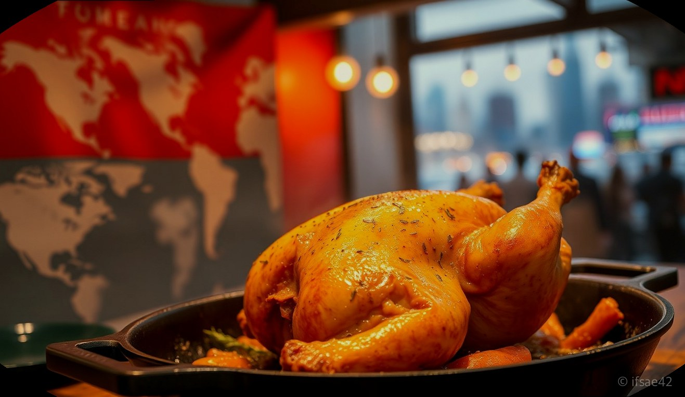
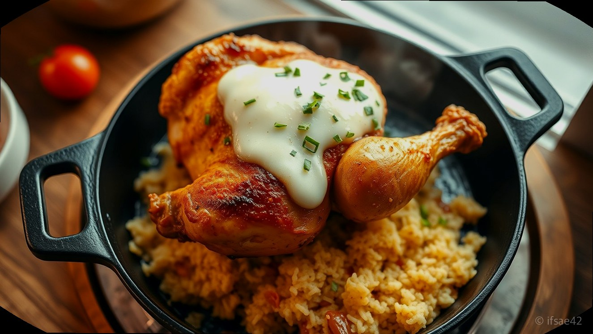
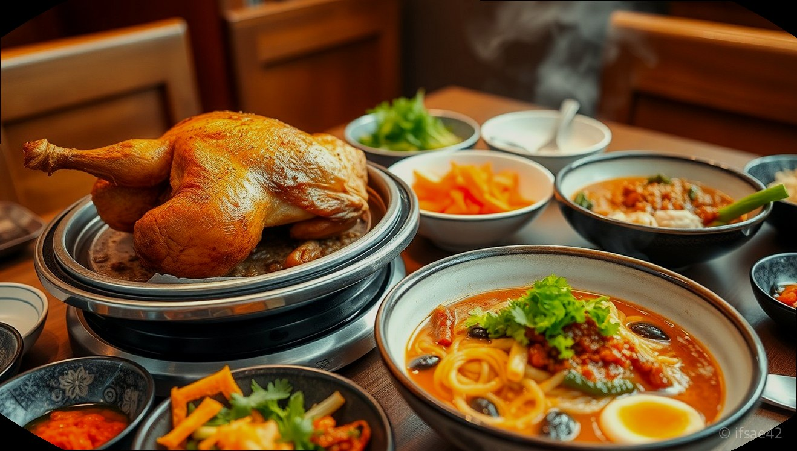

> 자동 생성 초안 · 2026-06-04

# 김종용누룽지통닭 메뉴 추천 및 솔직 후기, 겉바속촉 보양식으로 최고!

요즘처럼 기운이 없고 몸보신이 필요한 날이면 어김없이 생각나는 음식이 있습니다. 바로 기름기를 쫙 빼서 담백하고, 바닥에 깔린 누룽지의 고소함이 일품인 김종용누룽지통닭입니다. 일반적인 튀긴 치킨과는 달리 건강한 조리 방식을 고수하고 있어 남녀노소 누구에게나 사랑받는 메뉴이기도 합니다.

단순히 배를 채우는 야식이 아니라, 마치 삼계탕을 먹은 것처럼 든든한 한 끼를 해결할 수 있다는 점이 이 브랜드만의 가장 큰 매력입니다. 오늘은 제가 직접 방문해 즐겨본 김종용누룽지통닭의 베스트 메뉴와 함께, 더욱 맛있게 즐길 수 있는 꿀팁까지 상세하게 소개해 드리겠습니다.

## 누룽지통닭의 매력과 베스트 메뉴 상세 분석

김종용누룽지통닭은 기본 메뉴인 '누룽지통닭'을 시작으로 토핑에 따라 다양한 메뉴로 변주됩니다. 가장 기본이 되는 누룽지통닭은 닭의 기름기가 완전히 제거되어 껍질은 얇고 바삭하며, 속살은 촉촉한 '겉바속촉'의 정석을 보여줍니다. 닭 뱃속에 들어있는 찹쌀은 철판 위에서 노릇하게 눌어붙어 고소한 누룽지로 변신하는데, 이 누룽지 한 숟가락이면 세상 부러울 것이 없습니다.

가장 인기가 많은 메뉴는 단연 '누룽지콘닭'과 '누룽지치즈닭'입니다. 누룽지콘닭은 톡톡 터지는 옥수수 콘의 달콤함과 담백한 닭고기가 어우러져 아이들에게도 인기가 많고, 누룽지치즈닭은 철판 가득 덮인 치즈가 고소함을 극대화해 맥주 안주로 제격입니다. 가격대는 메뉴별로 19,000원에서 23,000원 사이로 형성되어 있어, 퀄리티 대비 합리적인 외식을 즐길 수 있습니다.

## 실패 없는 조합, 사이드 메뉴와 맛있게 먹는 꿀팁

김종용누룽지통닭을 200% 즐기기 위해서는 사이드 메뉴 선택이 매우 중요합니다. 많은 단골이 입을 모아 추천하는 조합은 바로 '쟁반막국수'입니다. 매콤달콤한 막국수의 양념이 자칫 담백하기만 할 수 있는 통닭의 맛을 잡아주어 마지막 한 점까지 질리지 않고 먹을 수 있게 도와줍니다.

또한, 기본으로 제공되는 양배추 샐러드와 열무김치, 그리고 특제 소스를 적극 활용해 보세요. 바삭하게 익은 닭 껍질에 열무김치를 한 점 올려 싸 먹으면 느끼함은 사라지고 개운함만 남습니다. 혼술을 하러 오시는 분들도 많을 만큼 매장 분위기가 편안하고, 가족 단위 외식이나 퇴근길 직장인들의 회식 장소로도 손색이 없습니다.

## 방문 전 알아두면 좋은 웨이팅 및 포장 팁

인기 지점의 경우 저녁 피크 시간대에 방문하면 웨이팅이 발생할 확률이 높습니다. 가급적 이른 저녁 시간에 방문하거나, 미리 전화로 포장 주문을 해두는 것을 추천합니다. 포장을 하면 매장에서 먹는 것보다 누룽지가 약간 덜 눌어붙을 수 있지만, 집에서 편하게 보양식을 즐길 수 있다는 장점이 있습니다. 주차 공간이 협소한 매장이 많으니 방문 전 해당 지점에 주차 가능 여부를 미리 확인하시기 바랍니다.

### 김종용누룽지통닭 이용 체크리스트
- [ ] 첫 방문이라면 기본 '누룽지통닭'으로 담백한 맛을 먼저 즐겨보세요.
- [ ] 2인 이상 방문 시에는 쟁반막국수를 추가해 맛의 밸런스를 맞추세요.
- [ ] 철판에 눌어붙은 누룽지는 숟가락으로 긁어 끝까지 야무지게 드세요.
- [ ] 웨이팅이 걱정된다면 오픈 직후나 식사 피크 시간을 피해 방문하세요.
- [ ] 포장 시에는 매장보다 조금 더 일찍 주문하여 대기 시간을 줄이세요.

### 자주 묻는 질문 (FAQ)
**Q1. 김종용누룽지통닭은 어떤 방식으로 조리되나요?**
A1. 기름기를 쫙 뺀 전기구이 방식으로 조리되어 일반 치킨보다 칼로리가 낮고 담백한 맛이 특징입니다.
**Q2. 매장에서 혼술을 해도 괜찮은 분위기인가요?**
A2. 네, 편안한 매장 분위기 덕분에 혼자 방문해 통닭 한 마리와 생맥주를 즐기는 혼술족도 매우 많습니다.
**Q3. 가장 추천하는 사이드 메뉴 조합은 무엇인가요?**
A3. 매콤한 양념이 매력적인 쟁반막국수를 곁들이면 통닭의 담백함과 조화롭게 어우러져 최고의 궁합을 자랑합니다.

지금까지 김종용누룽지통닭의 메뉴와 맛있게 즐기는 팁을 정리해 드렸습니다. 오늘 저녁, 건강하고 든든한 보양식을 찾고 계신다면 고민하지 말고 가까운 매장을 방문해 보세요. 고소한 누룽지와 촉촉한 통닭이 여러분의 하루를 기분 좋게 마무리해 줄 것입니다.

#김종용누룽지통닭 #누룽지통닭맛집 #겉바속촉보양식
