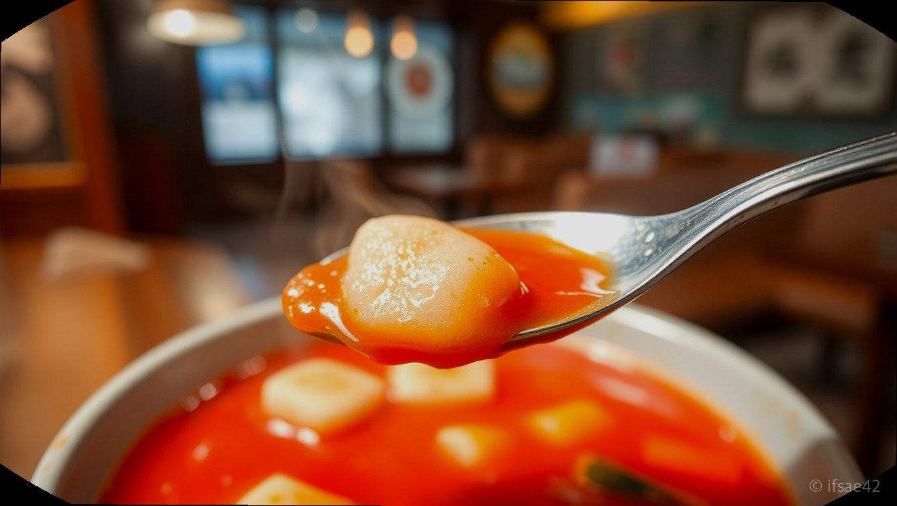
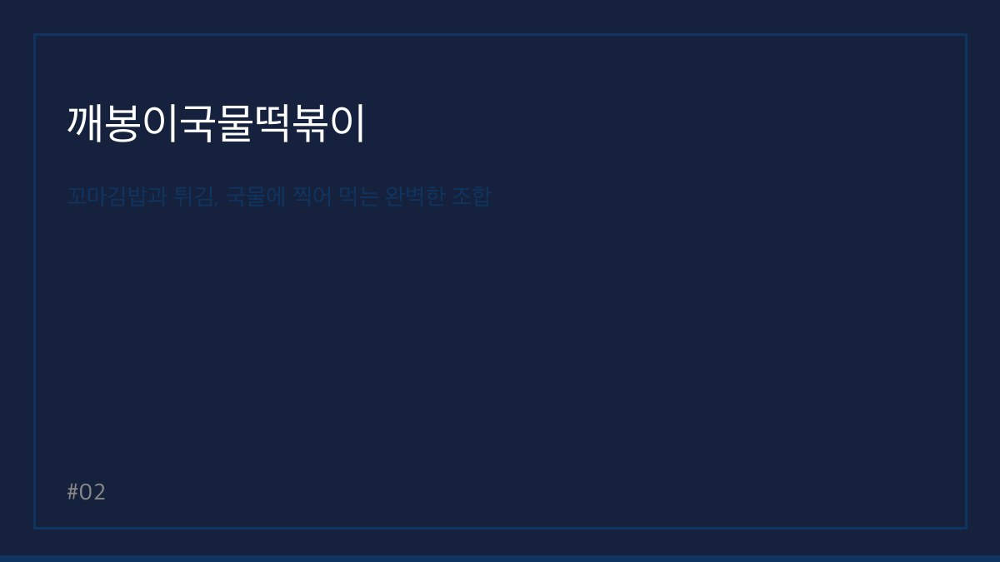

> 자동 생성 초안 · 2026-06-04

# 송탄 깨봉이국물떡볶이 솔직 후기, 텁텁함 없는 깔끔한 국물과 꼬마김밥의 환상 조합

평소 분식을 워낙 좋아해서 송탄 지역에서 맛있는 떡볶이집을 찾다가 발견한 곳이 바로 깨봉이국물떡볶이입니다. 떡볶이는 언제 먹어도 질리지 않는 소울푸드이지만, 가끔 너무 자극적이거나 먹고 나서 입안이 텁텁해지는 곳들이 있어 아쉬울 때가 많았습니다. 이번에 방문한 깨봉이국물떡볶이는 깔끔한 국물 맛으로 입소문이 자자해 기대감을 안고 직접 다녀오게 되었습니다.

특히 송탄에서 떡볶이와 곁들일 맛있는 사이드 메뉴를 찾고 계신 분들에게 이곳은 탁월한 선택지가 될 것입니다. 단순히 떡볶이만 맛있는 것이 아니라 꼬마김밥과 각종 튀김류가 국물과 어우러지는 조합이 일품이라, 왜 많은 분이 이곳을 찾는지 단번에 이해할 수 있었습니다. 지금부터 제가 직접 경험한 솔직한 맛과 정보들을 상세히 공유해 드리겠습니다.

## 텁텁함 없는 깔끔한 국물과 맵기 조절의 묘미

깨봉이국물떡볶이의 가장 큰 특징은 역시 국물입니다. 보통 국물 떡볶이라고 하면 고추장 베이스의 묵직함을 떠올리기 쉬운데, 이곳은 가루 양념을 사용하여 맛을 냈는지 끝맛이 매우 깔끔합니다. 숟가락으로 국물을 떠먹었을 때 느껴지는 개운함 덕분에 마지막까지 질리지 않고 맛있게 즐길 수 있었습니다.

맵기 정도는 누구나 부담 없이 즐길 수 있는 수준부터 매운맛을 선호하는 분들을 위한 단계까지 세심하게 구성되어 있습니다. 저는 중간 정도의 맵기를 선택했는데, 적당히 칼칼하면서도 달큰한 감칠맛이 올라와 식욕을 자극했습니다. 자극적이기만 한 매운맛이 아니라 재료 본연의 맛을 살린 깔끔한 매운맛이라 남녀노소 누구나 좋아할 만한 맛입니다.

## 꼬마김밥과 튀김, 국물에 찍어 먹는 완벽한 조합

이곳에 방문하신다면 떡볶이만 주문하는 것은 추천하지 않습니다. 깨봉이국물떡볶이의 진가는 바로 '찍먹'에서 나타나기 때문입니다. 특히 꼬마김밥은 떡볶이 국물에 적셔 먹었을 때 그 맛이 배가 됩니다. 갓 만든 꼬마김밥의 고소함과 떡볶이의 매콤한 국물이 만나면 입안에서 완벽한 조화를 이룹니다.

또한 김말이, 만두, 치즈스틱 등 다양한 튀김류도 빼놓을 수 없습니다. 튀김의 바삭한 식감을 즐기다가 절반쯤 먹었을 때 국물에 푹 담가서 눅눅해진 상태로 먹으면 또 다른 별미가 됩니다. 양도 푸짐한 편이라 가성비 면에서도 충분히 만족스러웠습니다. 혼자 방문해서 간단히 먹기에도 좋고, 여럿이서 다양한 사이드 메뉴를 조합해 푸짐하게 즐기기에도 부족함이 없습니다.

## 방문 전 꼭 확인해야 할 실용 정보

깨봉이국물떡볶이는 매장 방문뿐만 아니라 배달 서비스도 활발하게 운영되고 있어 집에서도 편하게 즐길 수 있습니다. 매장마다 운영 시간은 다소 차이가 있을 수 있으나, 일반적으로 오전부터 밤늦게까지 영업하는 경우가 많아 야식으로도 인기가 높습니다. 방문 전에는 네이버 지도나 배달 앱을 통해 해당 지점의 정확한 영업시간과 브레이크 타임을 확인하시는 것을 권장합니다.

- 운영 시간: 지점별 상이하므로 방문 전 네이버 지도 확인 필수
- 위치: 송탄 내 주요 거점 및 배달 가능 지역 확인
- 메뉴 추천: 떡볶이와 꼬마김밥, 김말이 튀김 조합
- 주문 팁: 국물을 넉넉히 요청하여 다양한 사이드 메뉴를 찍어 먹을 것

## 자주 묻는 질문(FAQ)

**Q1. 깨봉이국물떡볶이의 국물 맛은 어떤 특징이 있나요?**
A1. 가루 양념을 사용하여 텁텁함 없이 깔끔하고 개운한 감칠맛이 특징입니다.

**Q2. 가장 추천하는 사이드 메뉴 조합은 무엇인가요?**
A2. 꼬마김밥과 김말이 튀김을 떡볶이 국물에 듬뿍 찍어 드시는 조합을 가장 추천합니다.

**Q3. 맵기 조절이 가능한가요?**
A3. 네, 매운맛 단계를 선택할 수 있어 취향에 맞게 조절하여 주문이 가능합니다.

**Q4. 배달 주문도 가능한가요?**
A4. 네, 대부분의 지점에서 배달 앱을 통한 주문이 가능하여 집에서도 편하게 맛볼 수 있습니다.

이번에 방문한 깨봉이국물떡볶이는 맛과 가성비, 그리고 깔끔한 국물까지 모든 면에서 만족스러웠습니다. 송탄에서 실패 없는 분식집을 찾고 계신다면 꼭 한번 들러보시길 바랍니다. 저는 다음번에 친구들과 함께 방문하여 더 다양한 튀김 메뉴를 곁들여 먹어볼 생각입니다. 여러분도 오늘 저녁은 떡볶이 국물에 찍어 먹는 꼬마김밥으로 행복한 식사 시간 보내시길 바랍니다.

#송탄맛집 #깨봉이국물떡볶이 #송탄분식추천
