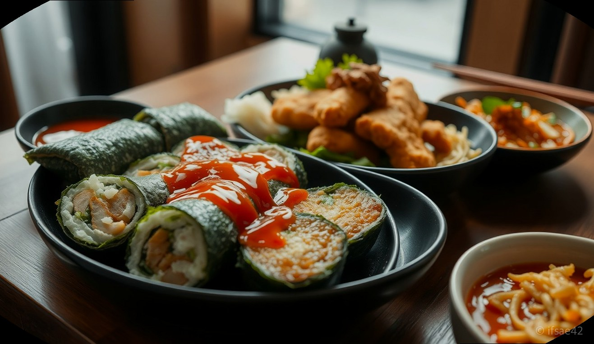
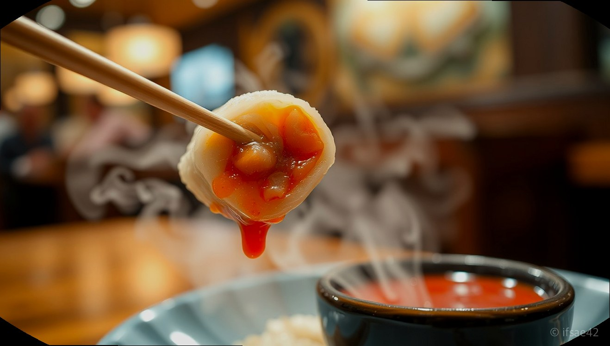

> 자동 생성 초안 · 2026-06-04

# 단풍애김밥 메뉴 추천, 김밥과 돈까스 쫄면까지 완벽한 혼밥 조합 솔직 후기

바쁜 일상 속에서 빠르고 든든하게 한 끼를 해결하고 싶을 때, 가장 먼저 떠오르는 메뉴는 단연 김밥입니다. 하지만 단순히 한 줄의 김밥으로 끝내기엔 아쉬울 때가 많죠. 오늘은 분식의 정석이자 혼밥족들의 성지로 불리는 '단풍애김밥'을 방문해 보았습니다.

단풍애김밥은 분당 수내점, 남부터미널점, 둔촌역점 등 주요 거점마다 깔끔한 매장과 정갈한 맛으로 입소문이 난 곳입니다. 단순히 김밥만 파는 분식집을 넘어, 돈까스와 쫄면, 시원한 라면까지 완벽한 조화를 자랑하는 이곳의 매력을 상세히 소개해 드리겠습니다.

## 단풍애김밥 매장 정보 및 분위기

단풍애김밥은 지점마다 차이가 있지만, 대체로 오전 7시부터 오후 9시까지 운영하여 이른 아침 식사부터 늦은 저녁까지 편리하게 이용할 수 있습니다. 예를 들어 수내점의 경우 매달 정기 휴무일이 지정되어 있으니 방문 전 확인이 필요합니다.

매장에 들어서면 가장 먼저 느껴지는 것은 '청결함'입니다. 오픈형 주방 구조를 갖춘 곳이 많아 조리 과정을 눈으로 직접 확인할 수 있어 위생에 민감한 분들도 안심하고 식사할 수 있습니다. 특히 1인 테이블이 잘 마련되어 있어 혼밥족들이 눈치 보지 않고 여유롭게 식사를 즐길 수 있다는 점이 큰 장점입니다. 조용하면서도 활기찬 분위기 덕분에 짧은 점심시간을 활용해 방문하기에도 최적입니다.

## 실패 없는 메뉴 조합: 김밥, 돈까스, 그리고 쫄면

단풍애김밥에서 꼭 주문해야 할 메뉴 조합은 '김밥 + 돈까스 + 쫄면'입니다.

1. **단풍애김밥 & 참치김밥**: 기본 메뉴인 단풍애김밥은 신선한 야채가 듬뿍 들어가 아삭한 식감이 일품입니다. 참치김밥은 마요네즈와 참치의 비율이 적절하여 고소함이 극대화됩니다. 김밥만 먹기엔 양이 부족하다 싶을 때 가장 먼저 선택해야 할 필수 메뉴입니다.
2. **등심돈까스**: 분식집 돈까스라고 무시하면 안 됩니다. 바삭하게 튀겨진 등심돈까스는 고기 잡내가 전혀 없고 소스가 자극적이지 않아 김밥과 곁들이기 좋습니다. 든든한 단백질 보충을 원하신다면 강력 추천합니다.
3. **쫄면**: 돈까스의 기름진 맛을 잡아주는 최고의 파트너입니다. 매콤달콤한 양념장에 쫄깃한 면발이 어우러져 입맛을 돋워줍니다. 김밥 한 알을 쫄면 양념에 살짝 찍어 먹으면 그야말로 별미입니다.
4. **단풍애라면**: 이곳 라면의 특징은 콩나물과 양파가 듬뿍 들어간다는 점입니다. 국물이 일반 라면보다 훨씬 시원하고 깊은 맛을 내어 해장용으로도 손색이 없습니다.

## 아이와 함께 방문한다면? 추천 메뉴 및 사이드

가족 단위 방문객을 위한 배려도 돋보입니다. 아이들이 먹기 좋은 크기의 '어린이 김밥'은 자극적이지 않은 재료로 구성되어 있어 부모님들의 만족도가 높습니다. 또한, 계산대 근처에서 판매하는 '과즙 젤리'는 식사 후 아이들의 입가심용 간식으로 인기가 많으니 꼭 챙겨보시길 바랍니다. 맛있는 식사 후 달콤한 후식까지 해결할 수 있어 아이와 함께하는 외식 장소로도 제격입니다.

---

### 단풍애김밥 방문 체크리스트
- [ ] 방문 전 네이버 지도 등을 통해 해당 지점의 정기 휴무일을 확인했는가?
- [ ] 혼밥이라면 1인석이 마련된 매장인지 확인했는가?
- [ ] 김밥만 주문하기보다 돈까스나 쫄면을 추가해 영양 밸런스를 맞췄는가?
- [ ] 라면 주문 시 콩나물과 야채가 들어간 시원한 국물을 즐길 준비가 되었는가?
- [ ] 아이와 함께라면 어린이 김밥과 과즙 젤리를 잊지 않았는가?

---

### 자주 묻는 질문 (FAQ)

**Q1. 단풍애김밥에서 가장 추천하는 혼밥 조합은 무엇인가요?**
A1. 김밥 한 줄과 쫄면 혹은 라면 조합을 추천합니다. 조금 더 배부르게 드시고 싶다면 등심돈까스를 추가하는 것이 가장 만족도가 높습니다.

**Q2. 아이들이 먹기에는 어떤 메뉴가 좋나요?**
A2. 자극적이지 않은 재료가 들어간 어린이 김밥을 추천합니다. 식후에는 매장에서 판매하는 과즙 젤리를 곁들이면 아이들이 아주 좋아합니다.

**Q3. 라면이 다른 분식집과 다른 점이 있나요?**
A3. 콩나물과 양파 등 신선한 야채를 함께 넣어 끓이기 때문에 국물 맛이 훨씬 시원하고 깊은 것이 특징입니다.

---

든든한 한 끼가 그리운 날, 깔끔한 매장에서 정성 가득한 분식을 맛볼 수 있는 단풍애김밥에 방문해 보시는 건 어떨까요? 여러분의 취향을 저격할 나만의 조합을 찾아보시길 바랍니다.

#단풍애김밥 #분식맛집 #혼밥추천
