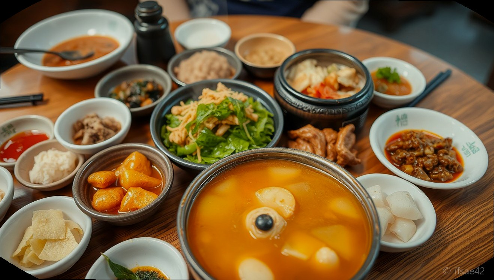

> 자동 생성 초안 · 2026-06-28

# 충주 동촌CC 라운딩 후기: 송호 설계 코스 공략법과 클럽하우스 조식 맛집 추천

골프를 사랑하는 분들이라면 한 번쯤 들어보셨을 이름, 충주 동촌CC는 국내 유명 골프 코스 설계가인 송호의 손길이 닿아 더욱 특별한 곳입니다. 평소 전략적인 플레이를 즐기는 골퍼들에게 동촌CC는 도전 의식을 불러일으키는 매력적인 구장으로 손꼽히는데요.

지난 2025년 6월 7일, 오후 2시 8분 티오프로 동촌CC를 다시 방문하게 되었습니다. 그린피 13만 5천 원이라는 합리적인 가격에 정규홀의 묘미를 느낄 수 있어 만족도가 매우 높았던 라운딩이었습니다. 오늘은 제가 직접 경험한 동촌CC의 코스 공략법과 라운딩 전후로 들르기 좋은 맛집 정보를 상세히 공유해 드리겠습니다.

## 송호 설계의 정수, 동촌CC 코스 공략법과 난이도 분석

동촌CC는 송호 설계 특유의 조형미가 돋보이는 곳입니다. 전체적으로 코스가 치기 편해 보이면서도 막상 플레이를 시작하면 곳곳에 숨겨진 함정이 많아 방심할 수 없는 난이도를 자랑합니다. 특히 동촌CC는 레이디 우대 정책이 잘 되어 있어 여성 골퍼들에게도 인기가 많으며, 전반적인 코스 관리가 매우 훌륭합니다.

동촌 코스는 자연 지형을 최대한 살리면서도 전략적인 배치로 골퍼의 실력을 시험합니다. 몇몇 홀은 페어웨이 언듈레이션이 있어 정확한 세컨드 샷이 요구되며, 그린 주변의 벙커 배치가 매우 위협적입니다. 티샷을 할 때는 무조건 장타를 노리기보다 랜딩 존을 정확히 파악하는 것이 중요합니다. 특히 그린 공략 시에는 핀 위치를 고려해 한 클럽 길게 잡거나 짧게 잡는 등 섬세한 전략이 필수입니다.

## 라운딩 전후 필수 코스, 동촌CC 인근 맛집 추천

이른 아침 티오프를 앞두고 든든한 한 끼를 고민하시는 분들께는 '정가네명태'를 강력하게 추천합니다. 동촌CC 인근 맛집으로 이미 유명한 이곳은 아침 일찍 문을 열어 라운딩 전 식사하기에 최적의 장소입니다. 특히 이곳의 코다리조림과 생돼지두루치기는 입맛을 제대로 돋워주어 라운딩 전 에너지를 충전하기에 부족함이 없습니다.

라운딩 후에는 지인들과 함께 담소를 나누며 식사하기 좋은 장소들이 주변에 많습니다. 동촌CC 인근은 충주의 로컬 식재료를 활용한 한식당이 많아 라운딩의 피로를 풀기에 좋습니다. 정가네명태 외에도 주변에 위치한 여러 식당들은 골퍼들의 입맛을 맞추기 위한 정갈한 밑반찬과 든든한 메인 요리를 제공하니 취향에 맞춰 방문해 보시기 바랍니다.

## 클럽하우스 시설 및 이용 꿀팁

동촌CC 클럽하우스는 고급스러우면서도 편안한 분위기를 자아냅니다. 로비에 들어서는 순간 느껴지는 쾌적함은 라운딩 전 설렘을 더해주는데요. 조인 라운딩을 이용하시는 분들도 많아 골프를 사랑하는 사람들과 자연스럽게 어우러질 수 있는 환경입니다.

클럽하우스 내 레스토랑 조식 메뉴는 구성이 알차고 맛도 훌륭합니다. 시간이 부족하다면 클럽하우스 조식을 이용하는 것이 가장 효율적이지만, 여유가 있다면 앞서 언급한 인근 맛집을 들르는 것도 좋은 선택입니다. 라운딩 후에는 클럽하우스 내 사우나 시설을 이용해 보세요. 관리가 잘 되어 있어 라운딩 후 개운하게 마무리하기에 안성맞춤입니다.

### 동촌CC 라운딩 체크리스트
*   티오프 시간 확인 및 최소 1시간 전 도착하기
*   송호 설계 코스의 특징인 벙커 위치를 미리 앱으로 확인하기
*   레이디 우대 티 박스를 활용한 전략적 공략 준비
*   라운딩 전후 식사 장소(정가네명태 등) 예약 및 영업시간 확인
*   계절별 날씨에 맞는 기능성 의류와 충분한 수분 보충제 준비

### 자주 묻는 질문(FAQ)
**Q1. 동촌CC는 초보자가 라운딩하기에 어떤가요?**
A1. 동촌CC는 코스가 전략적이지만 전반적으로 관리가 잘 되어 있고 레이디 우대도 좋아 초보자부터 상급자까지 모두 즐겁게 플레이할 수 있습니다.

**Q2. 동촌CC 주변에 아침 식사가 가능한 맛집이 있나요?**
A2. 네, 정가네명태와 같이 아침 일찍 영업을 시작하며 골퍼들에게 입소문 난 맛집들이 인근에 위치해 있어 든든한 식사가 가능합니다.

**Q3. 그린피는 어느 정도 수준인가요?**
A3. 시기와 시간대에 따라 다르지만, 평일 정규 타임 기준으로 13만 원대에서 10만 원 후반대의 합리적인 가격으로 이용할 수 있습니다.

동촌CC는 매번 방문할 때마다 새로운 재미를 주는 매력적인 구장입니다. 송호 설계의 묘미를 느끼며 전략적인 플레이를 즐기고 싶은 분들이라면 꼭 한 번 방문해 보시길 권합니다. 맛있는 음식과 훌륭한 코스, 그리고 동반자와의 즐거운 추억이 기다리고 있을 것입니다. 여러분의 다음 라운딩이 성공적이기를 응원하겠습니다.

#동촌CC #충주골프장 #송호설계골프장
