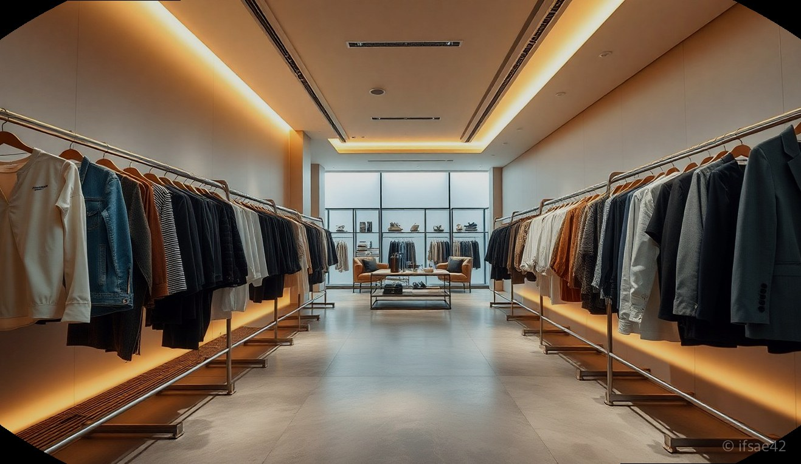
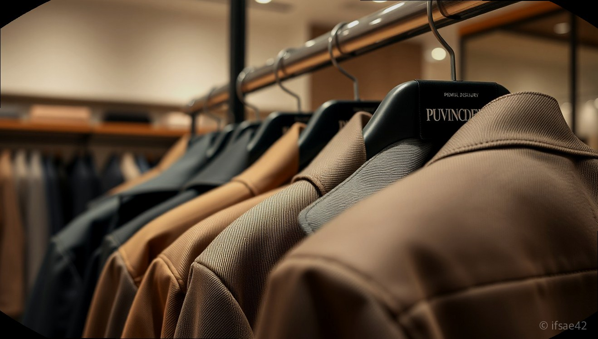

> 자동 생성 초안 · 2026-06-09

# 부산 럭스보이 본점 방문 후기: 정품 확인 팁과 스톤아일랜드 사이즈 정보

명품을 구매할 때 가장 고민되는 부분은 단연 '정품에 대한 신뢰'와 '나에게 딱 맞는 사이즈 선택'일 것입니다. 특히 온라인을 통한 병행수입 제품 구매가 활발해지면서, 믿을 수 있는 업체를 찾는 것이 무엇보다 중요해졌습니다. 오늘은 부산 사상구의 명품 쇼핑 랜드마크로 자리 잡은 '럭스보이' 본점을 직접 방문하여 느낀 매장 분위기와 신뢰도, 그리고 많은 분이 궁금해하시는 사이즈 팁까지 상세히 공유해 드리겠습니다.

부산 사상구 가야대로에 위치한 럭스보이 본점은 명품 편집샵을 찾는 이들에게 이미 입소문이 자자한 곳입니다. 매장에 들어서는 순간 깔끔하게 정돈된 진열대와 다양한 브랜드의 제품들을 한눈에 볼 수 있어 쇼핑 환경이 매우 쾌적합니다. 온라인으로만 보던 제품을 직접 만져보고 입어볼 수 있다는 점은 오프라인 매장만이 가진 가장 큰 강점이 아닐까 싶습니다.

## 럭스보이 본점 방문기 및 정품 신뢰도 검증

럭스보이 본점을 방문하면서 가장 인상 깊었던 점은 정품에 대한 확실한 자신감입니다. 병행수입 명품을 구매할 때 소비자들이 가장 걱정하는 것이 바로 '혹시 가품은 아닐까' 하는 불안함입니다. 럭스보이는 투명한 유통 경로를 통해 정품만을 취급하며, 구매 시 제공되는 영수증과 정품 보증 관련 안내를 통해 고객들에게 높은 신뢰를 주고 있습니다.

실제로 매장을 둘러보면 단순히 물건을 판매하는 것을 넘어, 각 제품의 특징과 정품 판별 기준에 대해 친절하게 설명해 주는 직원분들의 전문성이 돋보입니다. 온라인 스토어팜을 이용할 때도 꼼꼼한 검수 과정을 거쳐 배송되기 때문에, 제품을 받았을 때의 포장 상태나 품질 면에서 만족도가 매우 높습니다. 이미 많은 단골 고객이 럭스보이를 찾는 이유가 바로 이러한 철저한 관리 시스템 덕분이라는 생각이 들었습니다.

## 인기 브랜드 사이즈 팁: 스톤아일랜드와 버버리

럭스보이에서 가장 인기 있는 브랜드 중 하나인 스톤아일랜드는 사이즈 선택이 관건입니다. 스톤아일랜드는 대체로 슬림하게 나오는 편이라, 평소 입으시는 사이즈보다 한 치수 크게 선택하는 것을 추천합니다. 예를 들어 평소 100(L) 사이즈를 즐겨 입으신다면 럭스보이에서 스톤아일랜드 제품을 고를 때는 XL 사이즈를 선택했을 때 가장 안정적인 핏이 나옵니다. 특히 키즈 라인의 경우 아이들의 성장 속도를 고려하여 조금 여유 있게 구매하는 것이 오랫동안 입힐 수 있는 팁입니다.

버버리 제품군 역시 브랜드 특유의 클래식한 핏이 있어 체형에 따라 선택이 달라집니다. 럭스보이 본점에는 다양한 사이즈의 재고가 구비되어 있어 직접 시착해 볼 수 있다는 점이 큰 장점입니다. 온라인으로 구매하시더라도 스토어팜 상세 페이지에 기재된 실측 사이즈와 본인이 평소 잘 입는 옷의 단면을 비교해 보시면 실패 확률을 크게 줄일 수 있습니다. 럭스보이의 배송 속도 또한 매우 빨라, 사이즈 고민을 마친 후 주문하면 빠르게 제품을 받아볼 수 있습니다.

## 구매 전 체크리스트

1. 평소 본인이 즐겨 입는 옷의 실측 사이즈를 미리 메모해 두었나요?
2. 럭스보이 온라인 스토어팜의 상세 페이지 내 사이즈 가이드를 확인하셨나요?
3. 제품 구매 전 정품 인증 및 보증 관련 내용을 고객센터를 통해 다시 한번 확인하셨나요?
4. 오프라인 방문 시 원하는 모델의 재고 여부를 미리 문의하셨나요?
5. 교환 및 반품 규정을 숙지하여 혹시 모를 상황에 대비하셨나요?

## 자주 묻는 질문(FAQ)

**Q1. 럭스보이에서 판매하는 모든 제품은 정품인가요?**
A1. 럭스보이는 정식 유통 경로를 통해 수입된 100% 정품만을 취급하며 가품일 경우 200% 보상하는 정책을 운영하고 있습니다.

**Q2. 온라인으로 주문하면 배송은 얼마나 걸리나요?**
A2. 평일 기준 오후 3시 이전 주문 건은 당일 출고를 원칙으로 하여 대부분 다음 날 빠르게 제품을 받아보실 수 있습니다.

**Q3. 매장에 방문하면 온라인과 동일한 가격으로 구매할 수 있나요?**
A3. 네, 럭스보이 본점은 온라인과 오프라인의 가격 정책을 동일하게 운영하여 고객들이 언제 어디서든 합리적인 가격에 명품을 만나보실 수 있습니다.

**Q4. 사이즈가 맞지 않을 경우 교환이나 반품이 가능한가요?**
A4. 상품의 택을 제거하지 않은 상태라면 규정에 따라 교환 및 반품이 가능하므로 구매 전 상세 안내를 참고하시기 바랍니다.

럭스보이 본점은 정품에 대한 확신과 합리적인 가격, 그리고 친절한 서비스까지 갖춘 명품 편집샵입니다. 부산 인근에 거주하신다면 직접 방문하여 쇼핑의 즐거움을 느껴보시고, 멀리 계신 분들은 신뢰할 수 있는 온라인 스토어팜을 통해 편안한 쇼핑을 즐겨보시길 바랍니다. 제대로 된 명품 하나가 주는 만족감을 럭스보이에서 경험해 보세요.

#럭스보이 #명품편집샵 #부산명품매장
