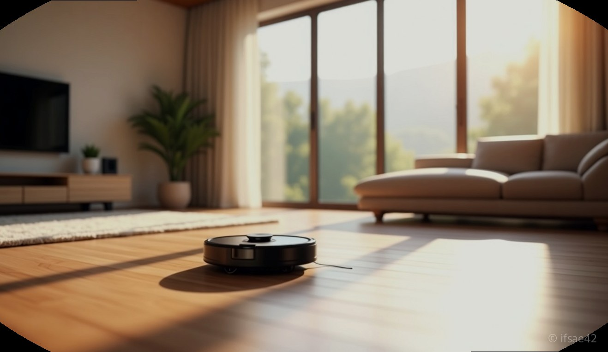
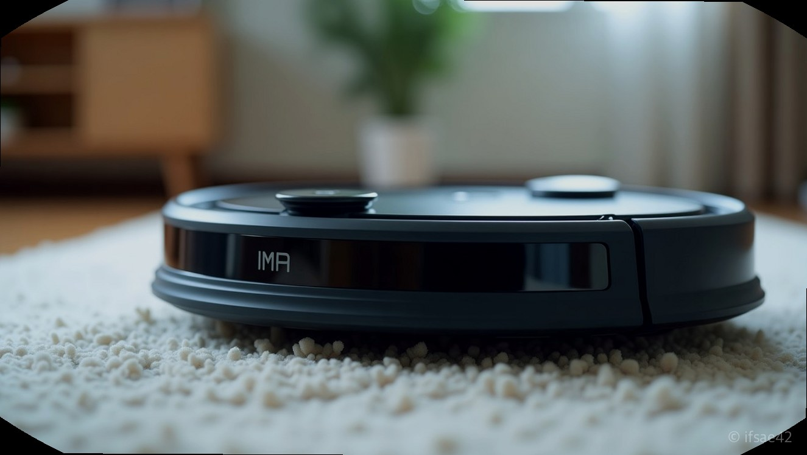
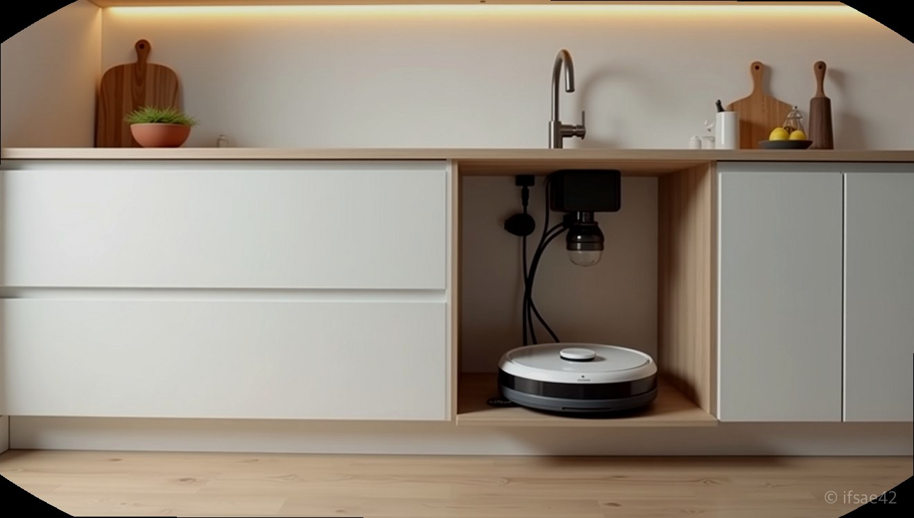

> 자동 생성 초안 · 2026-07-14

# 로봇락 S9 MaxV vs S8 MaxV 비교, 고민 끝에 선택한 실사용 후기

결론부터 말씀드립니다. 예산이 허락한다면 무조건 최신 모델인 로봇락 S9 MaxV를 선택하시기 바랍니다. 로봇청소기는 한 번 구매하면 최소 3년 이상 사용하는 가전인 만큼, 최신 기술이 집약된 모델을 구매하는 것이 결과적으로 가장 경제적인 선택입니다. 기존 S8 시리즈도 여전히 훌륭하지만, S9에서 개선된 정밀한 장애물 회피 능력과 흡입력은 삶의 질을 확실히 다르게 만듭니다.

## 압도적인 성능 차이 분석

많은 분이 S8 MaxV와 S9 MaxV 사이에서 고민하십니다. 두 모델의 핵심 차이는 '지능'과 '청소 효율'에 있습니다. S8 MaxV가 기존의 스테디셀러로서 탄탄한 기본기를 자랑한다면, S9 MaxV는 인공지능 알고리즘이 대폭 강화되어 가구 다리나 전선, 반려견 배변 등 바닥에 놓인 장애물을 인식하는 속도와 정확도가 비약적으로 상승했습니다.

흡입력 또한 수치상 변화를 넘어 체감 성능으로 이어집니다. 카펫 위 먼지를 제거하는 능력이 향상되었고, 특히 물걸레 세척 시 온수 세척 기능의 최적화로 냄새 유발을 더 확실하게 잡았습니다. 로봇락 특유의 강력한 매핑 시스템은 이제 더 복잡한 구조의 거실에서도 길을 잃지 않고 최적의 경로를 생성합니다.

## 설치를 위한 가구장 리폼

직배수 모델을 선택했다면 기기 성능만큼이나 중요한 것이 바로 '설치 환경'입니다. 로봇락 직배수 키트를 제대로 활용하려면 주방 싱크대 하부장 리폼이 거의 필수입니다. 단순히 공간을 확보하는 것을 넘어, 급수와 배수 호스가 꺾이지 않도록 적절한 여유 공간을 설계해야 합니다.

가구장을 리폼할 때는 로봇락 스테이션의 높이와 너비뿐만 아니라, 향후 AS를 고려한 탈부착 가능 여부도 반드시 체크해야 합니다. 특히 아파트라면 싱크대 걸레받이 부분의 훼손을 최소화하는 업체 선정과, 배수관 연결 시 누수 방지를 위한 꼼꼼한 마감이 필수입니다. "설치만 하면 끝"이라고 생각하기 쉽지만, 배수 호스에 이물질이 끼지 않게 관리하는 편의성을 위해 장의 깊이를 넉넉하게 잡는 것을 강력히 추천합니다.

## 매트 환경과 층간소음 체감

요즘 어린아이나 반려동물을 키우는 집에서는 층간소음 방지 매트를 많이 사용합니다. 로봇락 S9 MaxV는 이러한 매트 환경에 더욱 최적화되어 있습니다. 기존 모델들이 매트 턱을 넘을 때 간혹 멈칫하거나 헛바퀴를 돌리는 경우가 있었다면, 최신형은 바퀴의 접지력과 하단부 설계 변경으로 꽤 높은 매트 턱도 부드럽게 주행합니다.

또한, 물걸레 청소 시 소음 수준도 상당히 정숙해졌습니다. 야간 모드를 활용하면 옆방에서 잠을 자는 가족에게도 거의 방해가 되지 않을 정도로 소음 제어가 뛰어납니다. 다만, 매트 위에서 물걸레 청소를 할 경우 매트 이음새에 물기가 남을 수 있으니, 앱 설정을 통해 매트 위에서는 물걸레 압력을 조절하거나 구역을 나누어 청소하도록 세팅하는 것이 팁입니다.

## 구매 전 체크리스트

1. 예산: S9 MaxV가 더 비싸지만, 3년 사용을 가정하면 월 1만 원 내외의 차이입니다.
2. 환경: 우리 집 바닥에 전선이나 작은 물건이 자주 떨어져 있는가? (그렇다면 S9 추천)
3. 공간: 직배수 키트 설치를 위한 싱크대 하부장 폭이 최소 40cm 이상 확보 가능한가?
4. 매트: 거실 전체에 층간소음 매트가 깔려 있는가? (최신형의 주행 성능이 유리)

가전제품은 결국 '최신형이 최고'라는 명제가 가장 잘 들어맞는 품목이 로봇청소기입니다. 로봇락 라인업 중에서 고민 중이시라면, 초기 비용을 조금 더 투자하더라도 최신 기술이 적용된 S9 MaxV를 통해 쾌적한 일상을 누리시길 권해드립니다. 고민은 배송만 늦출 뿐, 일단 집에 들이는 순간 청소로부터 해방되는 진정한 자유를 느끼실 수 있을 것입니다.

#로봇락 #로봇청소기 #가전제품추천
