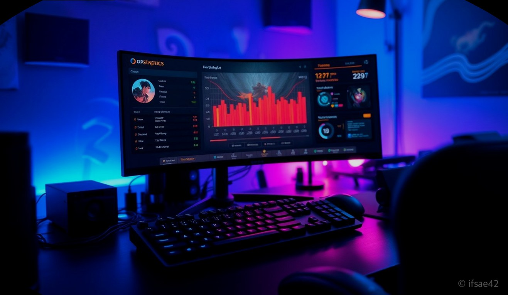
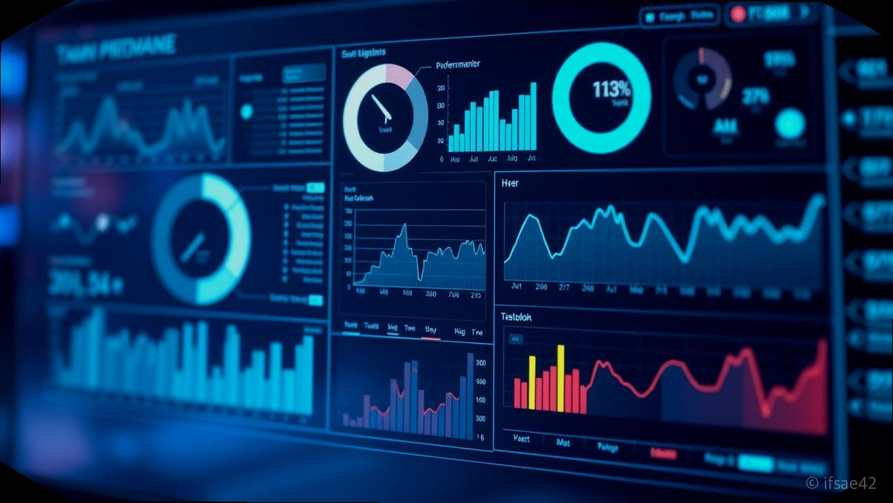

> 자동 생성 초안 · 2026-06-05

# 롤전적검색OP 완벽 활용법: 룬·템트리 최적화로 티어 올리는 법

리그 오브 레전드를 플레이하면서 자신의 실력을 객관적으로 파악하고, 승률을 높이기 위해 가장 먼저 해야 할 일은 무엇일까요? 바로 자신의 데이터를 분석하는 것입니다. 많은 유저들이 단순히 게임을 반복하는 것에 그치지만, 상위 티어로 올라가는 사람들은 항상 전적 검색 사이트를 통해 자신의 플레이를 복기하고 메타에 맞는 최적의 빌드를 연구합니다.

'롤전적검색OP'라는 키워드로 대표되는 전적 검색 서비스는 이제 단순한 승패 확인을 넘어, 실시간 룬 설정과 최신 템트리를 확인하는 필수 도구가 되었습니다. 오늘은 초보자부터 숙련자까지 티어 상승을 위해 반드시 알아야 할 전적 검색 사이트 활용법과 데이터를 승리로 연결하는 전략을 상세히 알려드리겠습니다.

## 3대 전적 검색 사이트 특징 및 비교 분석

국내에서 가장 많이 사용되는 3대 전적 검색 사이트는 OP.GG, FOW(포우), 그리고 포로지지(Porofessor)입니다. 각 사이트는 사용자 인터페이스와 데이터 제공 방식에서 뚜렷한 차이를 보입니다.

OP.GG는 가장 직관적인 UI와 방대한 데이터를 자랑합니다. 특히 챔피언별 승률과 픽률, 밴률을 한눈에 파악하기 좋아 메타 파악에 최적화되어 있습니다. FOW는 오랜 역사를 가진 사이트로, 데이터 업데이트 속도가 매우 빠르고 서버 상태나 게임 내 상세 기록을 확인하는 데 강점이 있습니다. 마지막으로 포로지지는 게임 내 실시간 오버레이 기능을 제공하여, 로딩 화면에서 아군과 적군의 숙련도 및 최근 승률을 분석해 주는 기능이 매우 뛰어납니다.

자신의 플레이 스타일이 데이터를 기반으로 정교한 빌드를 짜는 것을 선호한다면 OP.GG를, 게임 시작 전 팀원들의 성향을 빠르게 파악하고 싶다면 포로지지를 추천합니다.

## 전적 검색을 활용한 실시간 룬 및 템트리 최적화 방법

전적 검색 사이트를 100% 활용하는 핵심은 '데이터를 그대로 따라 하는 것'이 아니라 '상황에 맞게 응용하는 것'입니다. 먼저 OP.GG의 챔피언 분석 페이지에 접속하여 본인이 플레이하려는 챔피언의 최상위권 유저들이 선택한 룬과 아이템 트리를 확인하십시오. 이때 단순히 승률이 높은 아이템을 고르는 것이 아니라, 해당 아이템이 어떤 상황(상대 조합이 탱커 위주인지, 암살자 위주인지)에서 선택되었는지 파악하는 것이 중요합니다.

실전에서는 게임 로딩 중 전적 검색 사이트를 켜고, 상대방의 주력 챔피언이 최근 어떤 룬을 들고 어떤 아이템을 먼저 올리는지 확인하십시오. 예를 들어, 상대 라이너가 특정 룬을 사용한다면 그에 대응하는 방어적인 룬이나 아이템을 선제적으로 준비할 수 있습니다. 이러한 작은 준비가 라인전의 승패를 결정짓고, 결국 티어 상승으로 이어지는 밑거름이 됩니다.

## 내 실력 객관적 지표 확인 및 티어 상승 팁

전적 검색 사이트에서는 승패뿐만 아니라 '인분 측정'이나 'MMR'과 같은 지표를 제공합니다. 인분 측정은 내가 해당 게임에서 팀 승리에 얼마나 기여했는지를 수치화한 지표로, 단순히 KDA가 높은 것보다 딜량, 시야 점수, 오브젝트 관여도가 종합적으로 고려됩니다. 만약 승리했음에도 인분 측정 수치가 낮다면, 본인이 게임의 흐름을 주도하지 못하고 '버스'를 탔을 가능성이 높습니다.

티어를 올리고 싶다면 전적 검색 사이트에서 최근 20게임의 데이터를 살펴보며, 본인이 공통으로 실수하는 구간이나 승률이 유독 낮은 챔피언을 찾아내야 합니다. 특정 챔피언의 승률이 45% 미만이라면 과감히 해당 챔피언을 연습 모드에서 보완하거나, 메타에 맞는 다른 챔피언으로 교체하는 전략적 유연성이 필요합니다. 데이터는 거짓말을 하지 않으므로, 냉정한 자기 객관화가 티어 상승의 지름길입니다.

## 전적 검색 사이트 이용 시 자주 묻는 질문(FAQ)

**Q1. 전적 검색 사이트에서 내 게임 기록이 바로 업데이트되지 않을 때는 어떻게 하나요?**
A1. 게임 종료 후 데이터가 반영되기까지 최대 5분에서 10분 정도 소요될 수 있으며, 사이트 상단의 '전적 갱신' 버튼을 직접 클릭하면 더 빠르게 최신 데이터를 불러올 수 있습니다.

**Q2. 실시간으로 아군과 적군의 전적을 확인하려면 어떤 기능을 사용해야 하나요?**
A2. 포로지지와 같은 사이트에서 제공하는 데스크톱 앱을 설치하면 게임 로딩 화면에서 자동으로 팀원들의 전적과 주요 챔피언 데이터를 분석해 주는 기능을 이용할 수 있습니다.

**Q3. 전적 검색 사이트의 룬과 템트리 추천은 항상 정답인가요?**
A3. 추천 데이터는 통계적으로 가장 승률이 높은 조합을 보여주는 것이지만, 실제 게임 내 상황에 따라 유동적으로 아이템을 구매하는 것이 승률을 높이는 핵심입니다.

지금까지 롤전적검색OP를 활용한 티어 상승 전략에 대해 알아보았습니다. 데이터를 단순히 확인하는 단계를 넘어, 자신의 플레이에 어떻게 적용하고 개선할지 고민하는 과정이 여러분을 브론즈에서 실버로, 실버에서 골드 이상으로 이끌어줄 것입니다. 오늘 확인한 전적을 바탕으로 다음 게임에서는 어떤 점을 보완할지 계획을 세워보는 것은 어떨까요? 여러분의 건승을 빕니다.

#롤전적검색OP #롤티어올리기 #리그오브레전드
