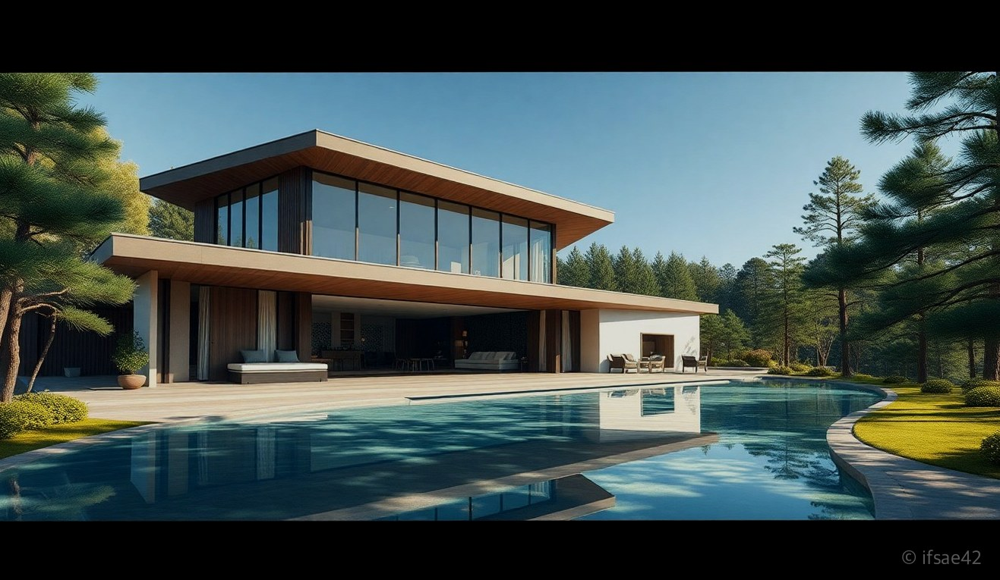
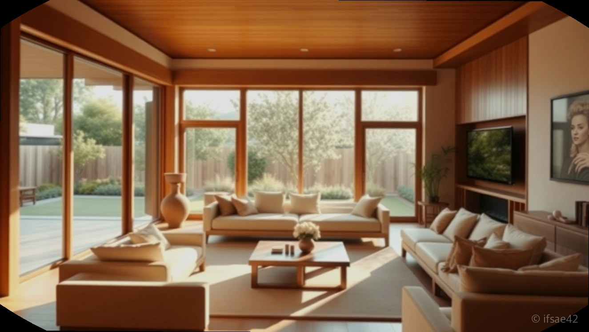
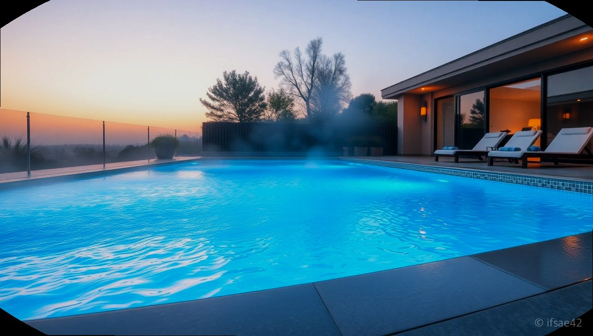

> 자동 생성 초안 · 2026-06-05

# 경주 독채 풀빌라 마동717 아이와 1박 2일 수영장부터 조식까지 솔직 후기

아이와 함께하는 경주 여행을 계획하다 보면 숙소 선택에 가장 많은 고민을 하게 됩니다. 이동 동선은 편리한지, 아이가 물놀이를 마음껏 즐길 수 있는지, 무엇보다 우리 가족만 오붓하게 쉴 수 있는 독채 공간인지가 중요하기 때문입니다. 이번에 다녀온 경주 마동717풀빌라는 이러한 까다로운 조건들을 모두 충족하는 곳이었습니다.

불국사 근처에 위치해 접근성이 뛰어나면서도, 마치 휴양지에 온 듯한 이국적인 분위기 덕분에 머무는 내내 힐링하는 기분이었습니다. 4인 가족이 묵기에 부족함 없는 쾌적한 시설과 세심한 서비스까지, 아이와 함께 다녀온 1박 2일의 솔직한 이용 후기를 공유해 드립니다.

## 마동717풀빌라 객실 특징과 4인 가족 숙박 후기

마동717풀빌라는 독채 구조로 설계되어 있어 프라이빗한 휴식을 즐기기에 최적입니다. 객실 타입은 1동부터 4동까지 다양하게 구성되어 있는데, 1동의 경우 침실이 2개 마련되어 있어 4인 가족이 방문해도 각자의 공간을 확보하며 쾌적하게 머물 수 있었습니다. 나머지 2, 3, 4동은 침실이 1개인 구조이니 예약 시 인원수에 맞춰 선택하시는 것을 추천합니다.

침구류는 호텔처럼 깨끗하고 관리가 잘 되어 있어 아이와 함께 이용하기에도 안심이 되었습니다. 전체적으로 인테리어가 감성적이라 사진을 찍는 곳마다 인생샷이 완성되더군요. 거실과 주방이 넓게 빠져 있어 아이들이 뛰어놀기에도 좋았고, 숙소 내부에 노래방 시설까지 갖춰져 있어 저녁 시간에는 가족들과 함께 노래를 부르며 즐거운 추억을 만들 수 있었습니다.

## 아이와 함께 즐기는 수영장 및 자쿠지 이용 팁

이곳을 선택한 가장 큰 이유는 바로 사계절 이용 가능한 수영장입니다. 아이들은 물놀이를 정말 좋아하는데, 날씨와 상관없이 온수풀로 운영되는 수영장 덕분에 시간 가는 줄 모르고 물놀이를 즐겼습니다. 수심이 너무 깊지 않아 아이들이 안전하게 놀 수 있었고, 부모님은 옆에서 여유롭게 지켜보며 휴식을 취하기 좋았습니다.

물놀이 후에는 자쿠지를 활용해 보세요. 따뜻한 물에 몸을 담그고 있으면 여행의 피로가 눈 녹듯 사라집니다. 특히 밤이 되면 조명이 켜진 수영장과 자쿠지 주변 분위기가 훨씬 더 아름다워집니다. 아이들이 잠든 뒤 조용히 자쿠지에서 즐기는 밤 시간은 이번 여행의 하이라이트였습니다.

## 조식 서비스와 주변 관광지 연계 코스

마동717풀빌라는 조식 서비스가 제공되어 아침 준비의 번거로움을 덜어줍니다. 든든하게 아침을 챙겨 먹고 체크아웃 후 여행을 시작할 수 있어 매우 편리했습니다. 숙소 내부에 작은 매점도 운영되고 있어 급하게 필요한 물품을 구매하기에도 용이합니다. 다만, 한 가지 꼭 기억하셔야 할 점은 이곳은 애완견 동반이 절대 불가하다는 점입니다. 예약 전 이 부분을 반드시 확인하시어 차질 없으시길 바랍니다.

불국사와 매우 가까운 위치 덕분에 여행 동선을 짜기에도 무척 효율적입니다. 체크아웃 후 불국사를 둘러보고, 아이와 함께 경주 보문단지나 인근의 키즈 친화적인 박물관을 방문하는 코스를 추천합니다. 경주의 주요 관광지와 접근성이 좋아 이동 시간을 줄이고 아이와 더 많은 시간을 보낼 수 있었습니다.

## 체크리스트
- [ ] 입실 시간 15:00, 퇴실 시간 11:00 엄수하기
- [ ] 1동과 2~4동의 침실 개수 차이 확인 후 예약하기
- [ ] 수영장 이용 시 아이용 튜브와 수영복 미리 챙기기
- [ ] 애완견 동반 불가 숙소이므로 반려동물 동반 금지
- [ ] 노래방 기기 등 부대시설 이용 시간 확인하기

## FAQ
**Q1. 마동717풀빌라 예약은 어떻게 진행하나요?**
A1. 공식 홈페이지나 실시간 예약 링크를 통해 간편하게 날짜별 잔여 객실을 확인하고 예약할 수 있습니다.
**Q2. 수영장 온수 추가 요금이 별도로 발생하나요?**
A2. 계절이나 패키지에 따라 상이할 수 있으니 예약 시 안내 문구를 확인하거나 문의를 통해 정확한 비용을 안내받으시는 것이 좋습니다.
**Q3. 주변에 마트나 편의점이 가깝게 있나요?**
A3. 숙소 내 매점이 있지만, 대량의 장보기는 불국사 인근 마트를 이용하시는 것이 편리합니다.
**Q4. 주차 공간은 충분한가요?**
A4. 독채 풀빌라 특성상 객실별로 주차 공간이 확보되어 있어 자차 이용 시 매우 편리합니다.

아이와 함께하는 경주 여행, 숙소 고민으로 시간을 보내고 계신다면 마동717풀빌라를 고려해 보시는 건 어떨까요? 프라이빗한 공간에서 누리는 여유와 아이들을 위한 물놀이 시설까지, 가족 모두가 만족할 만한 여행이 되실 것입니다. 여러분의 경주 여행이 더욱 특별해지길 바랍니다.

#경주풀빌라 #마동717풀빌라 #경주아이랑여행
