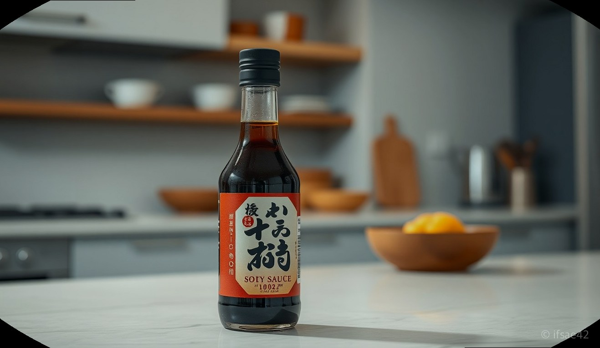
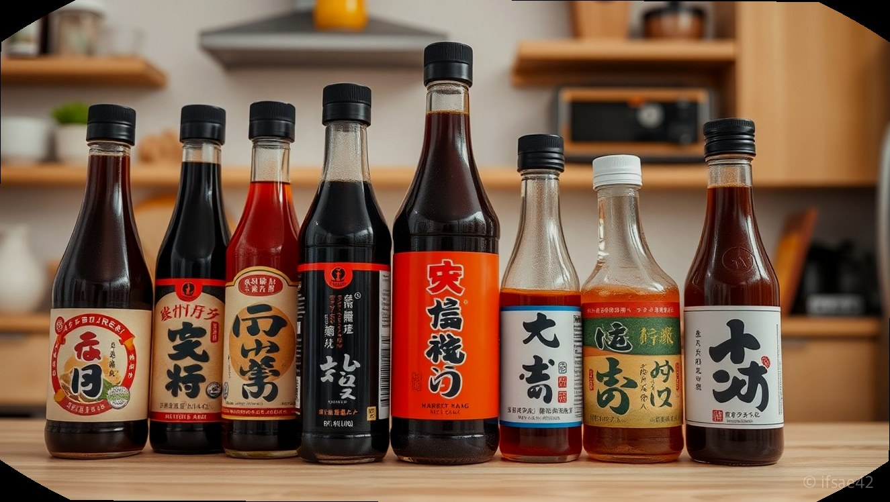
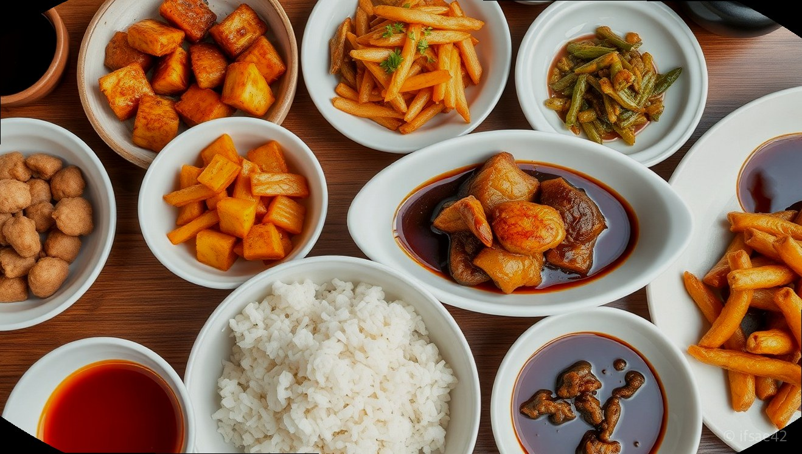
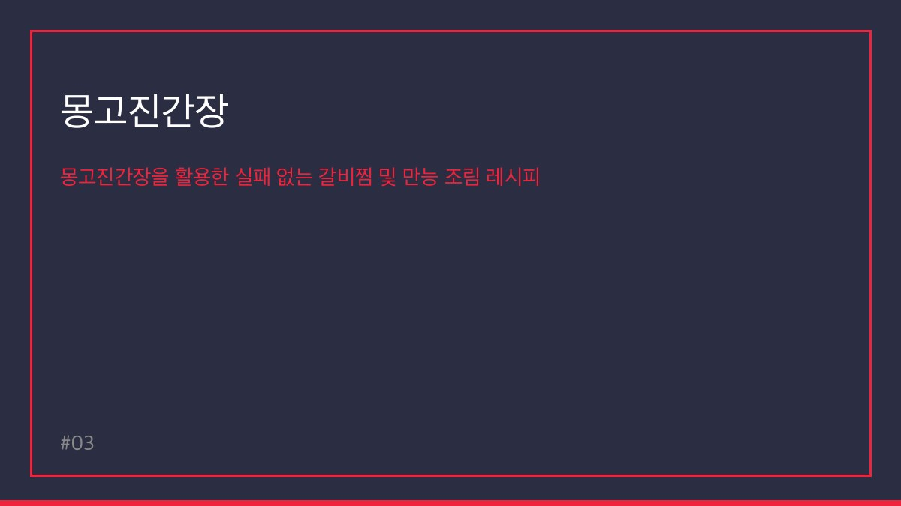
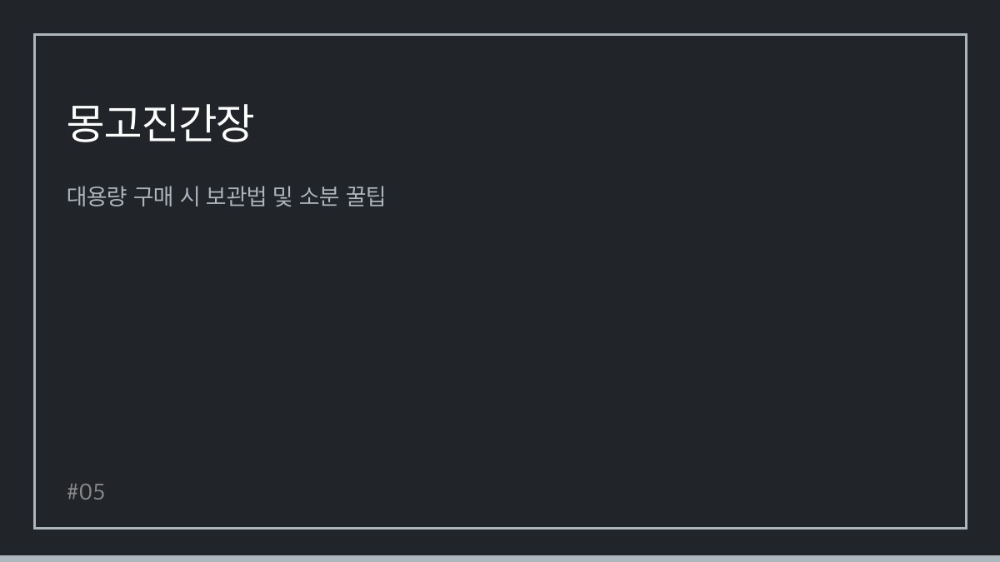

> 자동 생성 초안 · 2026-05-28

# 몽고진간장 1.8L vs 대용량 비교, 우리 집 주방에 딱 맞는 용량 선택 가이드

100년의 역사와 전통을 자랑하는 몽고진간장은 오랜 시간 동안 우리 밥상에 깊은 감칠맛을 더해왔습니다. 국민 간장이라 불릴 만큼 변함없이 사랑받는 몽고진간장을 우리 집에 딱 맞는 용량으로 선택하는 것은 맛있는 요리의 첫걸음이 될 것입니다. 가정에서 소량씩 사용하기 좋은 1.8L부터 넉넉한 양으로 온 가족이 즐기기 좋은 대용량까지, 몽고진간장은 다양한 용량으로 출시되어 소비자의 선택 폭을 넓히고 있습니다.

요리를 즐기시는 분들이라면, 자주 사용하는 조미료인 간장의 용량 선택이 얼마나 중요한지 잘 아실 겁니다. 너무 적은 용량은 금세 다 써버려 번거로움을 주고, 반대로 너무 큰 용량은 보관이나 사용에 불편함을 줄 수 있습니다. 따라서 우리 집 주방 환경, 요리 빈도, 식사 인원 등을 꼼꼼히 고려하여 최적의 몽고진간장 용량을 선택하는 것이 현명합니다.

이 글에서는 몽고진간장의 대표적인 용량별 특징과 가성비를 비교하고, 각 가정의 상황에 맞는 용량 선택 가이드를 제시해 드립니다. 더불어 몽고진간장의 다양한 제품 라인업과 활용 레시피, 그리고 대용량 구매 시 유용한 보관 및 소분 팁까지 상세하게 알려드리겠습니다. 몽고진간장과 함께 더욱 풍성하고 맛있는 요리를 즐기시기를 바랍니다.

## 몽고진간장 용량별 가성비 비교 및 선택 가이드

몽고진간장은 1.8L, 4.5L, 13L 등 다양한 용량으로 출시되어 소비자의 선택을 돕고 있습니다. 각 용량별 특징과 가격대를 비교하여 우리 집에 가장 적합한 용량을 선택하는 것이 중요합니다.

*   **1.8L 용량**: 가정에서 가장 보편적으로 사용되는 용량입니다. 1인 가구 또는 2~3인 가구에서 부담 없이 사용하기 좋으며, 비교적 좁은 주방 공간에도 보관이 용이합니다. 잦은 구매의 번거로움은 있지만, 신선하게 간장을 사용할 수 있다는 장점이 있습니다. 가격대는 할인 시 약 5천 원대부터 구매 가능하며, 몽고진간장 죽품 간장 1.8L의 경우 할인가 21,630원에 무료배송으로 판매되는 경우도 있어, 제품 라인에 따라 가격 차이가 있습니다.
*   **4.5L 용량**: 3~4인 가구 이상 또는 요리를 자주 하시는 가정에서 사용하기 좋은 용량입니다. 1.8L 용량보다 경제적인 가격으로 구매할 수 있으며, 자주 간장을 사용하는 요리(조림, 볶음 등)에 넉넉하게 활용하기 좋습니다.
*   **13L 용량**: 업소용으로 주로 사용되지만, 대가족이나 요리를 즐겨 하시는 분들 사이에서도 인기가 높습니다. 13L 용량은 13,000ml에 달하는 대용량으로, 1L당 가격으로 환산했을 때 가장 가성비가 뛰어납니다. 몽고진간장 13L 제품은 할인 시 21,020원 정도로 구매 가능하며, 이는 1.8L 용량 대비 훨씬 경제적입니다. 다만, 부피가 크기 때문에 보관 공간을 충분히 확보해야 하며, 사용 시에는 소분하여 사용하는 것이 편리합니다.

**용량 선택 가이드:**

*   **1인 가구 또는 2인 가구**: 1.8L 용량이 적합합니다.
*   **3~4인 가구 또는 요리 빈도 중간**: 1.8L 또는 4.5L 용량을 추천합니다.
*   **대가족, 요리 애호가, 업소**: 4.5L 또는 13L 대용량 용량을 고려해 보세요. 특히 13L 용량은 장기적으로 보았을 때 가장 경제적인 선택이 될 수 있습니다.

## 몽고진간장 제품 라인업별 특징 및 용도 차이

몽고진간장은 전통적인 진간장 외에도 다양한 제품 라인업을 갖추고 있어, 요리의 특성에 맞춰 최적의 풍미를 더할 수 있습니다.

*   **몽고진간장 (기본 라인업)**: 가장 기본적인 진간장으로, 국, 찌개, 나물, 조림, 볶음 등 거의 모든 요리에 두루 활용 가능합니다. 깊고 균형 잡힌 감칠맛을 자랑하며, 100년 전통의 몽고간장이 보증하는 품질을 느낄 수 있습니다.
*   **몽고진간장 죽품**: '죽품'은 좋은 품질의 간장을 의미합니다. 몽고진간장 죽품은 더욱 깊고 풍부한 감칠맛과 부드러운 풍미를 자랑합니다. 간장의 맛과 향이 중요한 요리, 예를 들어 고급스러운 조림이나 무침 요리에 사용하면 더욱 특별한 맛을 낼 수 있습니다. 1.8L 용량으로 출시되어 가정에서 사용하기 편리하며, 할인가 21,630원에 무료배송으로 구매 가능한 경우도 있어 가성비 또한 뛰어납니다.
*   **기타 제품**: 몽고간장 브랜드에서는 진간장 외에도 양조간장, 국간장 등 다양한 종류의 간장을 생산하고 있습니다. 국간장은 맑은 국물 요리에 사용하며, 양조간장은 옅은 색감과 깔끔한 맛이 특징입니다. 요리의 목적에 따라 적절한 종류의 간장을 선택하면 더욱 전문적인 맛을 낼 수 있습니다.

**용도별 추천:**

*   **일상적인 국, 찌개, 나물**: 기본 몽고진간장 또는 몽고진간장 죽품
*   **달콤 짭짤한 조림, 볶음**: 기본 몽고진간장 또는 몽고진간장 죽품
*   **맑은 국물 요리**: 몽고간장 국간장 (별도 구매 필요)
*   **깔끔한 맛을 살리는 요리**: 몽고간장 양조간장 (별도 구매 필요)

## 몽고진간장을 활용한 실패 없는 갈비찜 및 만능 조림 레시피

몽고진간장의 깊고 풍부한 감칠맛은 다양한 요리의 맛을 한층 끌어올립니다. 특히 명절이나 특별한 날 빠질 수 없는 갈비찜과 어떤 요리에도 활용 가능한 만능 조림 레시피를 소개합니다.

### 1. 몽고진간장으로 만드는 부드러운 돼지고기 갈비찜

**재료:**

*   돼지고기 생갈비 1kg
*   몽고진간장 2/3컵 (약 120ml)
*   설탕 1/2컵 (약 60ml)
*   맛술 90ml
*   다진 마늘 1 큰술
*   물 2컵 (약 400ml)
*   양파 1/2개, 대파 1/2대, 당근 1/3개, 표고버섯 2개 (선택 사항)

**만드는 법:**

1.  돼지고기 생갈비는 찬물에 담가 핏물을 제거한 후, 끓는 물에 살짝 데쳐 불순물을 제거합니다.
2.  압력솥에 데친 갈비와 몽고진간장, 설탕, 맛술, 다진 마늘, 물을 넣고 센 불에서 끓입니다.
3.  끓어오르면 중약불로 줄이고, 압력솥 추가 돌기 시작하면 약 15~20분간 더 익힙니다. (압력솥이 없을 경우 일반 냄비에 뚜껑을 덮고 약 40분~1시간 정도 푹 익혀줍니다.)
4.  갈비가 부드럽게 익으면, 썰어둔 양파, 당근, 표고버섯 등을 넣고 국물이 자작해질 때까지 조립니다.
5.  마지막에 대파를 넣고 한소끔 더 끓여 완성합니다.

**팁:** 몽고진간장의 깊은 감칠맛이 돼지고기의 잡내를 잡아주고, 부드러운 식감을 살려줍니다.

### 2. 만능 조림 양념장 (몽고진간장 활용)

이 양념장 하나로 다양한 재료를 맛있게 조릴 수 있습니다.

**재료:**

*   몽고진간장 1컵 (약 200ml)
*   설탕 1/4컵 (약 50ml)
*   물 1/2컵 (약 100ml)
*   맛술 2큰술
*   다진 마늘 1큰술
*   후추 약간

**만드는 법:**

1.  모든 재료를 냄비에 넣고 설탕이 녹을 때까지 잘 섞어줍니다.
2.  중약불에서 끓어오르면 약불로 줄여 5~10분 정도 졸여줍니다.
3.  완성된 만능 조림 양념장은 밀폐 용기에 담아 냉장 보관하면 2주 정도 사용 가능합니다.

**활용:**

*   **두부 조림**: 두부를 먹기 좋게 썰어 양념장에 넣고 졸입니다.
*   **감자, 애호박 조림**: 깍둑썰기 한 채소를 양념장에 넣고 익을 때까지 졸입니다.
*   **생선 조림**: 생선을 팬에 살짝 굽거나 튀긴 후 양념장에 넣어 졸여줍니다.

## 대용량 구매 시 보관법 및 소분 꿀팁

13L와 같은 대용량 몽고진간장을 구매하면 경제적이지만, 올바른 보관과 소분 방법을 알아두는 것이 중요합니다.

**보관법:**

*   **직사광선 피하기**: 간장은 직사광선에 노출되면 색이 변하고 맛이 변질될 수 있습니다. 서늘하고 그늘진 곳에 보관하는 것이 좋습니다.
*   **밀봉**: 사용 후에는 뚜껑을 반드시 꽉 닫아 공기와의 접촉을 최소화해야 합니다. 공기 접촉은 간장의 산패를 유발할 수 있습니다.
*   **냉장 보관 (선택 사항)**: 개봉 후에는 냉장 보관하는 것이 가장 신선도를 오래 유지하는 방법입니다. 특히 여름철이나 장기간 보관할 경우 냉장 보관을 권장합니다.

**소분 꿀팁:**

1.  **깨끗한 용기 준비**: 소분할 용기는 반드시 깨끗하게 세척하고 물기를 완전히 말린 후 사용해야 합니다.
2.  **소분 용기 활용**: 1.8L 또는 4.5L 용기의 빈 병이나, 식품용으로 안전하게 사용할 수 있는 밀폐 용기를 활용합니다.
3.  **깔때기 사용**: 간장을 따를 때 흘리지 않도록 깔때기를 사용하면 편리합니다.
4.  **소분 후 냉장 보관**: 소분한 용기는 각각 냉장 보관하여 사용할 때마다 꺼내 씁니다. 이렇게 하면 대용량 간장을 꺼내지 않아도 되어 편리하고, 간장의 신선도를 유지하는 데도 도움이 됩니다.
5.  **작은 병 활용**: 자주 사용하는 양념장 용기나 작은 유리병에 소분하여 식탁 위에 두고 사용하면 더욱 편리합니다.

**체크리스트: 우리 집에 맞는 몽고진간장 용량은?**

*   [ ] 1인 가구 또는 2인 가구인가요? (→ 1.8L 추천)
*   [ ] 3~4인 가구 또는 요리 빈도가 중간인가요? (→ 1.8L 또는 4.5L 고려)
*   [ ] 대가족이거나 요리를 매우 즐기시나요? (→ 4.5L 또는 13L 대용량 고려)
*   [ ] 주방 공간이 넉넉하여 대용량 보관이 가능한가요? (→ 13L 대용량 추천)
*   [ ] 1L당 가격으로 보았을 때 가장 경제적인 선택을 원하시나요? (→ 13L 대용량 추천)
*   [ ] 간장을 자주 사용하지 않아 신선도 유지가 더 중요한가요? (→ 1.8L 추천)

**FAQ: 몽고진간장 용량 선택, 이것이 궁금해요!**

*   **Q: 13L 대용량 간장을 구매했는데, 금방 상하지는 않나요?**
    A: 올바르게 보관한다면 장기간 사용 가능합니다. 직사광선을 피해 서늘한 곳에 보관하고, 사용 후에는 반드시 뚜껑을 잘 닫아 밀봉해주세요. 특히 개봉 후에는 냉장 보관하는 것이 가장 좋습니다. 소분하여 사용하면 더욱 신선하게 유지할 수 있습니다.
*   **Q: 1.8L 용량은 얼마나 오래 사용할 수 있나요?**
    A: 사용 빈도에 따라 다르지만, 일반적인 2~3인 가구에서 매일 요리에 사용한다고 가정했을 때 약 1~2개월 정도 사용할 수 있습니다.
*   **Q: 몽고진간장 죽품과 일반 진간장의 차이가 무엇인가요?**
    A: 몽고진간장 죽품은 더 깊고 풍부한 감칠맛과 부드러운 풍미를 자랑합니다. 간장의 맛과 향이 중요한 요리에 사용하면 더욱 특별한 맛을 낼 수 있으며, 일반 진간장은 다양한 요리에 두루 활용하기 좋은 균형 잡힌 맛을 가지고 있습니다.
*   **Q: 대용량 간장을 소분할 때 어떤 용기를 사용하는 것이 좋나요?**
    A: 식품용으로 안전하게 사용할 수 있는 유리병이나 플라스틱 용기를 사용하는 것이 좋습니다. 사용 전 반드시 깨끗하게 세척하고 완전히 건조한 후 사용해야 합니다.

우리 집 주방에 딱 맞는 몽고진간장 용량을 선택하셨나요? 100년 전통의 깊은 맛을 자랑하는 몽고진간장과 함께라면 매일의 식탁이 더욱 풍성해질 것입니다.

#몽고진간장 #간장용량 #주방필수템

