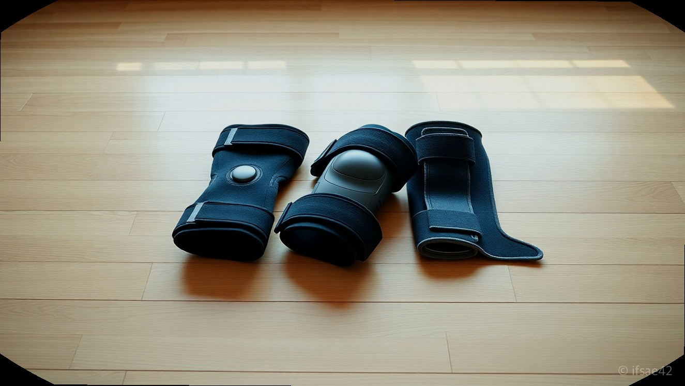
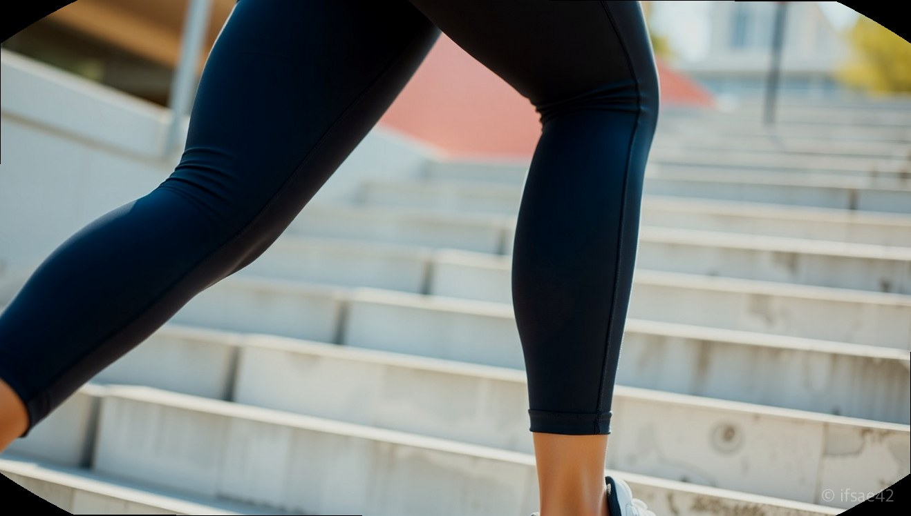

> 자동 생성 초안 · 2026-06-09

# 러닝할 때 무릎이 찌릿? 운동별 무릅보호대 추천 및 고르는 법 총정리

운동을 즐기다 보면 누구나 한 번쯤 무릎이 찌릿하거나 뻐근한 통증을 경험하곤 합니다. 특히 러닝을 하거나 스쿼트와 같은 하체 운동을 할 때 무릎이 덜그럭거리는 느낌을 받으면 운동의 즐거움보다 부상에 대한 걱정이 앞서게 됩니다. 단순한 근육통이라 생각하고 방치하다가는 만성 통증으로 이어질 수 있어 각별한 주의가 필요합니다.

많은 분이 운동 중 발생하는 통증을 관리하기 위해 무릅보호대를 찾기 시작합니다. 하지만 시중에 출시된 수많은 제품 중에서 내 무릎 상태와 운동 목적에 딱 맞는 제품을 고르기란 쉽지 않습니다. 오늘은 운동 종류별로 적합한 무릎보호대 선택 기준과 올바른 착용법, 그리고 통증 관리에 도움이 되는 팁을 상세히 정리해 드리겠습니다.

## 운동 종류별 무릎보호대 선택 가이드

운동의 특성에 따라 무릎에 가해지는 부하가 다르기 때문에 보호대의 형태도 달라져야 합니다. 먼저 러닝을 즐기는 분들에게는 가벼운 압박형 보호대가 적합합니다. 러닝은 반복적으로 무릎을 굽히고 펴는 동작이 많으므로, 지나치게 두꺼운 제품은 오히려 움직임을 제한하고 땀이 차 불편함을 줄 수 있습니다. 통기성이 좋으면서도 무릎 슬개골 주위를 안정적으로 잡아주는 니 슬리브 형태를 추천합니다.

등산의 경우, 하산할 때 무릎에 실리는 체중 부하가 상당합니다. 이때는 무릎 측면을 지지해 주는 사이드 와이어가 포함된 보호대가 효과적입니다. 무릎이 좌우로 흔들리는 것을 방지해 주어 장시간 산행에도 피로도를 낮춰줍니다. 반면, 헬스장에서 스쿼트나 런지 같은 고중량 하체 운동을 할 때는 무릎을 강력하게 압박해 주는 니 랩(Knee Wrap)이나 탄탄한 소재의 보호대가 적합합니다. 이는 무릎 관절의 정렬을 바로잡아 부상을 예방하는 데 큰 도움을 줍니다.

## 무릎보호대 착용 전후의 확실한 차이

실제로 많은 사용자가 무릅보호대를 착용한 뒤 운동 효율이 달라졌다고 입을 모읍니다. 착용 전에는 앉았다 일어날 때마다 무릎에서 삐끗하는 느낌이 들거나, 운동 후 무릎 아래가 뻐근하게 쑤시는 통증을 자주 느꼈다면 보호대가 이를 완화해 줄 수 있습니다. 무릎보호대는 관절을 물리적으로 잡아줄 뿐만 아니라, 심리적인 안정감을 주어 더 자신 있게 운동에 집중할 수 있게 도와줍니다.

일상생활에서도 보호대의 효과는 빛을 발합니다. 특히 많이 걷거나 계단을 오르내릴 때 무릎이 불안정하다면, 옷 속에 착용해도 티가 나지 않는 슬림한 디자인의 무릎보호대를 활용해 보세요. 처음에는 답답할까 봐 걱정하는 분들도 많지만, 최근에는 신축성이 뛰어난 소재를 사용하여 장시간 착용해도 불편함이 적은 제품이 많습니다. 통증이 느껴질 때 참기보다는 보호대를 통해 미리 관절을 보호하는 것이 장기적인 운동 라이프를 위한 현명한 선택입니다.

## 올바른 선택을 위한 체크리스트

나에게 맞는 무릅보호대를 고르기 위해 다음 항목들을 꼭 확인해 보시기 바랍니다.

- [ ] 내 무릎 둘레에 맞는 사이즈인가? (너무 조이면 혈액순환을 방해하고, 너무 헐거우면 보호 효과가 없습니다.)
- [ ] 운동 목적에 맞는 지지력을 갖췄는가? (러닝은 경량성, 등산은 측면 지지력, 헬스는 강력한 압박력)
- [ ] 통기성이 우수한 소재인가? (땀이 차면 피부 트러블이 발생할 수 있으므로 흡습속건 기능 확인)
- [ ] 일상생활이나 운동 시 움직임에 방해가 되지 않는가?
- [ ] 세탁과 관리가 용이한 소재인가?

## 자주 묻는 질문(FAQ)

**Q1. 무릎보호대를 하루 종일 착용하고 있어도 괜찮은가요?**
A1. 보호대는 운동 중이나 통증이 있을 때만 착용하는 것이 좋으며 일상생활에서 장시간 착용하면 오히려 무릎 주변 근육이 약해질 수 있으니 주의해야 합니다.

**Q2. 무릅보호대 사이즈는 어떻게 측정하는 것이 정확한가요?**
A2. 무릎뼈 중심에서 위로 약 10~15cm 정도 떨어진 허벅지 둘레를 줄자로 측정하여 제품 상세 페이지의 사이즈 가이드를 확인하는 것이 가장 정확합니다.

**Q3. 세탁은 어떻게 하는 것이 좋은가요?**
A3. 보호대의 탄성을 유지하기 위해 미지근한 물에 중성세제를 풀어 가볍게 손세탁한 후 그늘에서 자연 건조하는 것을 권장합니다.

오늘 소개해 드린 정보가 여러분의 무릎 건강을 지키는 데 도움이 되기를 바랍니다. 운동은 꾸준함이 중요하지만, 그보다 더 중요한 것은 부상 없이 건강하게 오래 즐기는 것입니다. 지금 무릎에 미세한 통증이 느껴진다면 고민하지 말고 나에게 맞는 무릅보호대를 찾아보세요. 여러분의 건강한 러닝과 운동 라이프를 응원합니다.

#무릅보호대 #무릎보호대 #운동부상방지
