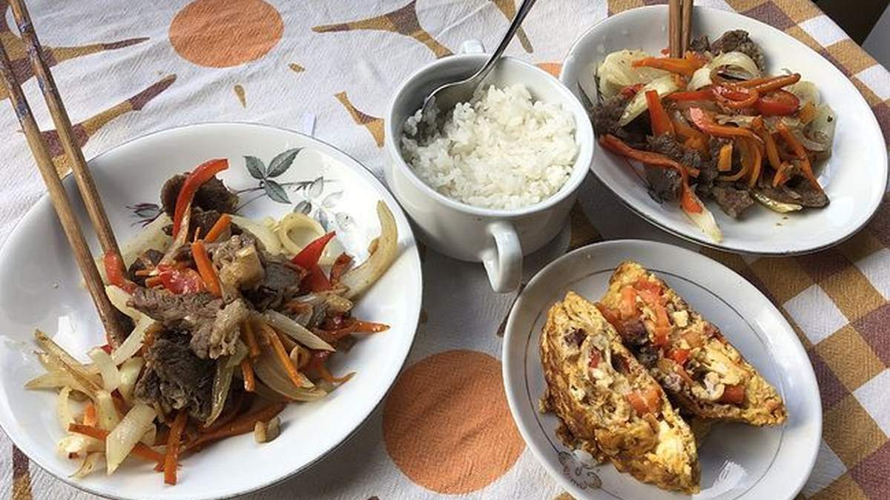
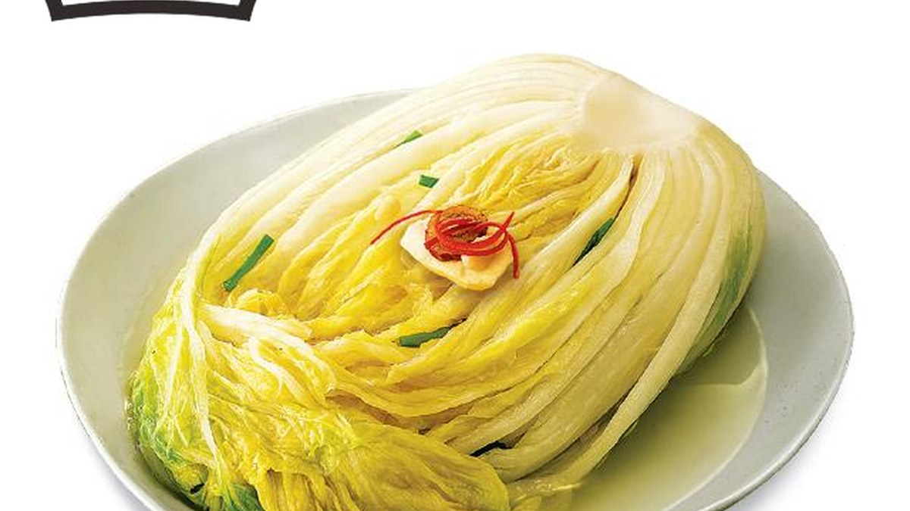
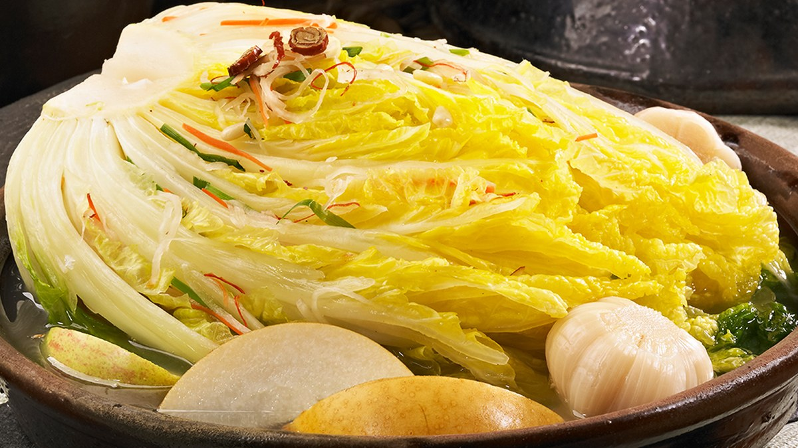
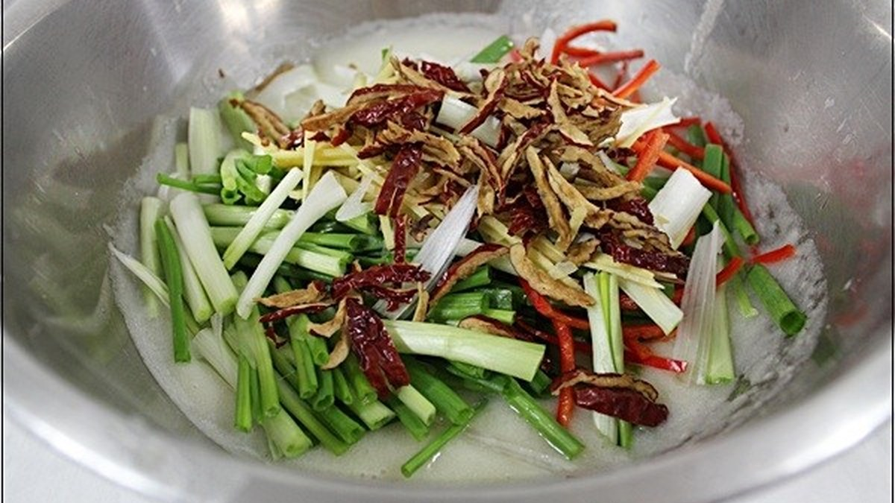
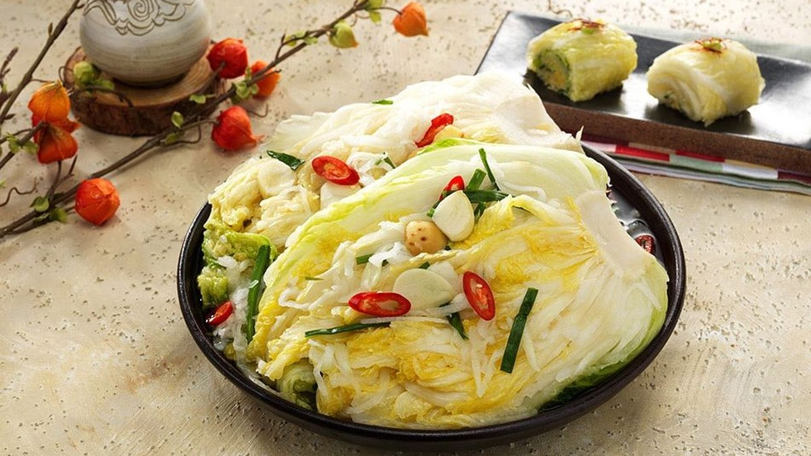

> 자동 생성 초안 · 2026-05-28

## 알배추로 담그는 시원한 백김치 담그는 방법 (풀 없이, 사과 활용)

안녕하세요! 김장철이 다가오면 가장 먼저 떠오르는 김치 중 하나가 바로 시원하고 깔끔한 맛의 백김치입니다. 하얗게 익어가는 백김치는 보기만 해도 군침이 돌지만, 막상 직접 담그려고 하면 복잡한 과정과 재료 때문에 망설여지기도 합니다. 특히 처음 백김치를 담그시는 분들은 '어렵지 않을까?', '맛있게 될까?' 하는 걱정을 많이 하시는데요.

하지만 걱정하지 마세요! 오늘은 풀 없이도 아삭하고 시원한 맛을 낼 수 있는 알배추 백김치 담그는 방법을 자세하게 알려드리겠습니다. 여기에 달콤한 사과를 활용하여 더욱 깊고 풍부한 맛을 더하는 비법까지 공개할 예정이니, 끝까지 집중해 주세요. 이 레시피만 따라 하시면 누구나 맛있는 백김치를 완성하실 수 있을 겁니다.

## 알배추를 활용한 시원한 백김치 담그는 법

백김치의 가장 큰 매력은 바로 그 시원하고 깔끔한 맛에 있습니다. 알배추는 일반 배추보다 잎이 부드럽고 속이 꽉 차 있어 백김치를 담그기에 아주 적합한 재료입니다. 잎이 연하고 달큰한 맛이 있어 따로 간을 많이 하지 않아도 자연스러운 단맛을 느낄 수 있다는 장점이 있습니다.

**재료 준비:**

*   알배추 2포기 (약 2kg)
*   무 1/2개 (약 500g)
*   쪽파 1줌
*   미나리 1줌 (선택 사항)
*   홍고추 2개 (색감용)
*   청양고추 1개 (선택 사항, 칼칼한 맛 추가)

**양념 재료:**

*   찹쌀가루 2큰술 (풀 대신 사용)
*   물 1컵 (찹쌀가루 개는 용도)
*   새우젓 3큰술 (국물까지 함께)
*   멸치액젓 또는 까나리액젓 3큰술
*   다진 마늘 2큰술
*   다진 생강 1/2큰술
*   양파 1/4개
*   사과 1/2개
*   배 1/4개 (선택 사항, 단맛과 시원함 추가)
*   물 1.5리터 (김치 국물용)
*   소금 (배추 절임용)

**만드는 과정:**

1.  **알배추 절이기:**
    *   알배추는 겉잎을 떼어내고 깨끗하게 씻어줍니다.
    *   밑동에 칼집을 살짝 넣어 4등분하거나 6등분하여 먹기 좋은 크기로 잘라줍니다. (포기째 담글 경우 밑동만 살짝 잘라주세요.)
    *   큰 볼에 알배추를 담고, 굵은 소금을 뿌려가며 줄기 부분 위주로 절여줍니다.
    *   배추가 잠길 정도의 물을 붓고 1~2시간 정도 절여줍니다. 중간에 한 번 뒤집어주어 골고루 절여지도록 합니다.
    *   배추가 부드럽게 휘어질 정도로 절여지면 찬물에 2~3번 깨끗하게 헹궈 소금기를 제거하고 체에 밭쳐 물기를 충분히 빼줍니다.

2.  **풀 대신 찹쌀풀 쑤기:**
    *   냄비에 찹쌀가루 2큰술과 물 1컵을 넣고 잘 풀어줍니다.
    *   약불에서 저어가며 끓여 투명한 농도가 될 때까지 끓여줍니다. 덩어리가 지지 않도록 잘 저어주는 것이 중요합니다.
    *   완성된 찹쌀풀은 완전히 식혀줍니다.

3.  **양념 만들기:**
    *   믹서기에 양파 1/4개, 사과 1/2개, 배 1/4개(선택 사항), 물 1.5리터, 새우젓, 액젓, 다진 마늘, 다진 생강을 넣고 곱게 갈아줍니다.
    *   갈아놓은 양념에 식힌 찹쌀풀을 넣고 잘 섞어줍니다.
    *   간을 보고 싱거우면 소금을 약간 추가하여 입맛에 맞게 조절합니다. (새우젓과 액젓의 염도에 따라 달라질 수 있습니다.)

4.  **속 재료 준비:**
    *   무는 굵은 채로 썰어줍니다.
    *   쪽파와 미나리(선택 사항)는 3~4cm 길이로 썰어줍니다.
    *   홍고추와 청양고추(선택 사항)는 어슷 썰어줍니다.

5.  **백김치 버무리기:**
    *   물기를 뺀 알배추에 준비한 무채, 쪽파, 미나리, 고추를 넣고 살살 버무려줍니다. 너무 세게 버무리면 배추가 뭉개질 수 있으니 주의합니다.
    *   만들어둔 양념 국물을 자작하게 부어줍니다. 배추가 국물에 잠길 정도로 부어주세요.
    *   김치통에 배추와 속 재료가 골고루 섞이도록 담아줍니다. 꾹꾹 눌러 담아 공기를 최대한 빼주는 것이 좋습니다.

## 풀 없이 간단하게 백김치 담그는 법

많은 분들이 백김치를 담글 때 풀을 쑤어 넣는 과정이 번거롭다고 느끼십니다. 하지만 찹쌀가루를 활용하면 풀 없이도 충분히 맛있는 백김치를 만들 수 있습니다. 찹쌀가루는 국물을 걸쭉하게 만들어주고, 발효 과정에서 자연스러운 단맛과 감칠맛을 더해주는 역할을 합니다.

**풀 없이 백김치를 담글 때의 장점:**

*   **간편함:** 풀 쑤는 과정을 생략하여 시간과 노력을 절약할 수 있습니다.
*   **깔끔한 맛:** 풀의 텁텁한 맛 없이 재료 본연의 맛을 살릴 수 있습니다.
*   **쉬운 보관:** 국물이 맑아져 백김치 특유의 시원함을 더욱 잘 느낄 수 있습니다.

찹쌀가루 대신 쌀가루를 사용해도 좋지만, 찹쌀가루가 좀 더 부드러운 질감과 단맛을 내는 데 효과적입니다. 찹쌀가루의 양은 기호에 따라 조절할 수 있으며, 너무 많이 넣으면 국물이 탁해질 수 있으니 주의하세요.

## 사과를 넣어 시원하고 깔끔한 맛을 내는 백김치 레시피

백김치의 시원하고 깊은 맛을 더해주는 비법 중 하나는 바로 사과와 배를 활용하는 것입니다. 사과와 배는 천연 단맛을 가지고 있어 설탕을 따로 넣지 않아도 백김치의 맛을 풍부하게 만들어 줍니다. 또한, 과일의 수분이 김치 국물을 더욱 시원하고 맑게 만들어주는 역할을 합니다.

**사과와 배 활용 팁:**

*   **갈아서 사용:** 사과와 배를 믹서기에 갈아 양념 국물에 섞으면 과일의 맛과 향이 국물에 잘 배어듭니다.
*   **씨와 껍질 제거:** 갈기 전에 사과와 배의 씨와 껍질은 반드시 제거해야 합니다. 껍질은 국물을 탁하게 만들 수 있습니다.
*   **적절한 양 조절:** 너무 많은 양의 사과나 배를 넣으면 백김치가 너무 달아질 수 있으니, 처음에는 적은 양으로 시작하여 기호에 맞게 조절하는 것이 좋습니다.
*   **다른 과일 활용:** 사과와 배 외에도 배, 양파 등을 함께 갈아 넣으면 더욱 깊고 다채로운 맛의 백김치를 만들 수 있습니다.

사과와 배를 활용한 백김치는 매콤한 김치와는 또 다른 매력을 선사합니다. 아이들도 부담 없이 즐길 수 있으며, 느끼한 음식을 먹을 때 곁들이면 입안을 개운하게 해주는 효과도 있습니다.

## 백김치 담글 때 주의할 점 및 팁

맛있는 백김치를 완성하기 위해서는 몇 가지 주의할 점과 팁을 알아두는 것이 좋습니다.

*   **배추 절이기:** 배추를 너무 오래 절이면 물러지고, 덜 절이면 아삭함이 부족할 수 있습니다. 손으로 눌렀을 때 부드럽게 휘어지는 정도가 적당합니다.
*   **간 맞추기:** 새우젓과 액젓의 염도가 다를 수 있으므로, 양념을 만들 때 간을 보면서 소금을 추가하는 것이 좋습니다. 처음부터 너무 짜게 하면 나중에 싱겁게 만들기가 어렵습니다.
*   **국물 양:** 백김치는 국물이 자작해야 맛있습니다. 김치통에 담았을 때 배추가 국물에 잠길 정도로 국물을 넉넉하게 만들어 주세요.
*   **숙성:** 백김치는 담근 직후보다 하루 이틀 정도 실온에서 숙성시킨 후 냉장 보관하면 더욱 맛있습니다. 처음에는 국물이 맑지만, 시간이 지나면서 자연스럽게 익어 맛이 깊어집니다.
*   **김치통:** 김치통에 담을 때는 공기가 최대한 들어가지 않도록 꾹꾹 눌러 담는 것이 좋습니다. 이렇게 하면 백김치가 더 오래 신선하게 유지됩니다.
*   **분량 조절:** 위에 제시된 레시피는 2포기 기준입니다. 김장량이 많을 경우 재료의 비율을 맞춰 늘리거나 줄여서 담그시면 됩니다. 예를 들어 5포기를 담글 경우, 모든 재료의 양을 2.5배 정도로 늘려주시면 됩니다.

## 백김치 담글 때 자주 묻는 질문 (FAQ)

**Q1. 풀 없이 백김치를 담가도 괜찮나요?**
A1. 네, 괜찮습니다. 찹쌀가루를 활용하면 풀 없이도 충분히 맛있는 백김치를 만들 수 있습니다. 찹쌀가루는 국물을 걸쭉하게 하고 발효를 도와주는 역할을 합니다.

**Q2. 사과나 배를 넣으면 너무 달아지지 않나요?**
A2. 사과와 배는 천연 단맛을 내지만, 적절한 양을 사용하면 과하게 달지 않고 시원하고 깔끔한 맛을 더해줍니다. 레시피에 제시된 양을 기준으로 시작하여 기호에 따라 조절하는 것을 추천합니다.

**Q3. 백김치가 금방 시어지는데, 어떻게 하면 오래 보관할 수 있나요?**
A3. 백김치는 담근 후 바로 냉장 보관하는 것보다 하루 정도 실온에서 숙성시킨 후 냉장 보관하면 더 맛있게 즐길 수 있습니다. 김치통에 담을 때 공기가 들어가지 않도록 꾹꾹 눌러 담고, 국물이 항상 배추를 덮고 있도록 유지하는 것이 중요합니다.

**Q4. 알배추 대신 일반 배추로 담가도 되나요?**
A4. 네, 일반 배추로도 담글 수 있습니다. 다만 알배추가 잎이 연하고 단맛이 강해 백김치에 더 적합할 수 있습니다. 일반 배추를 사용할 경우, 줄기 부분이 단단하므로 조금 더 오래 절여주는 것이 좋습니다.

**Q5. 백김치 국물을 활용할 수 있는 방법이 있나요?**
A5. 백김치 국물은 그 자체로도 시원하고 맛있지만, 냉면 육수나 만둣국 국물로 활용해도 좋습니다. 또한, 쌀뜨물과 섞어 맑은 탕을 끓일 때 사용하면 감칠맛을 더할 수 있습니다.

## 마무리 질문

오늘 알려드린 알배추 백김치 담그는 방법, 어떠셨나요? 풀 없이도 사과를 활용하여 시원하고 깔끔한 맛을 낼 수 있다는 점이 매력적이지 않으신가요? 혹시 백김치를 담그면서 궁금한 점이 있다면 언제든지 댓글로 남겨주세요. 여러분의 맛있는 백김치 담그기를 응원합니다!

#백김치담그는방법 #알배추백김치 #풀없이백김치
