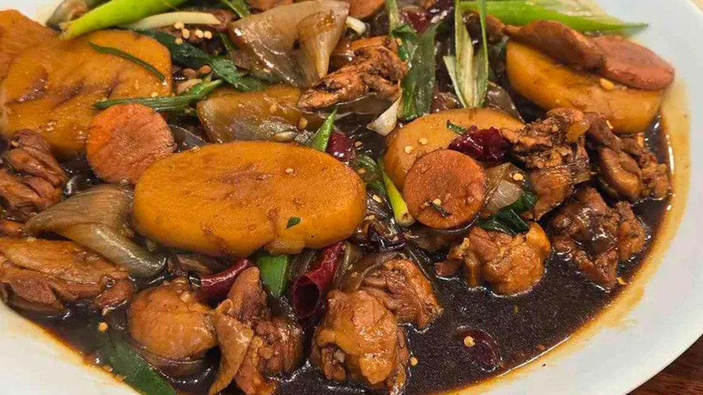
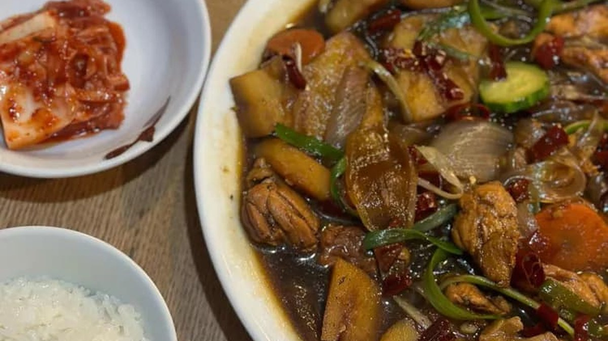
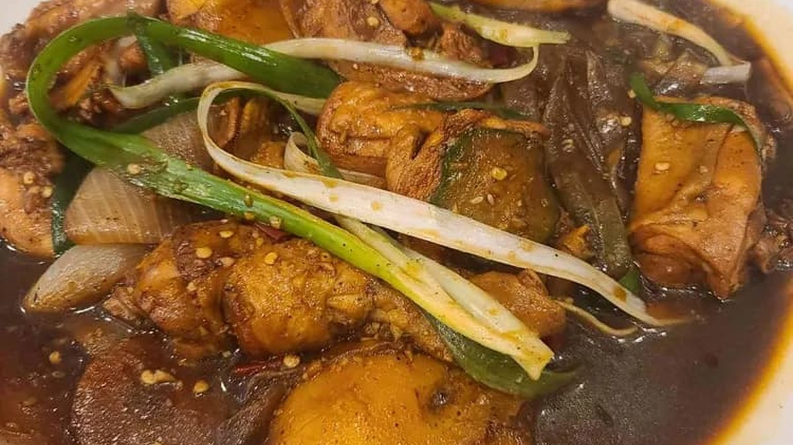
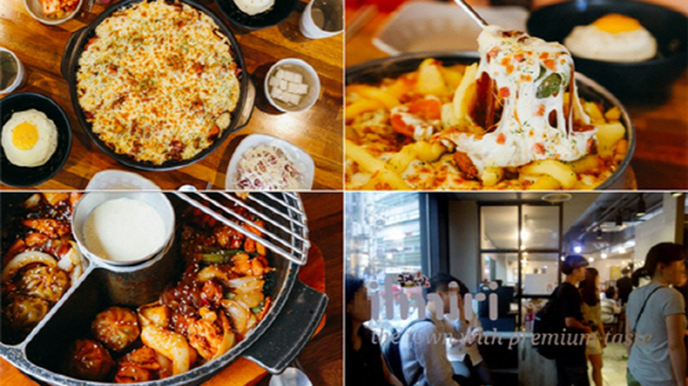

> 자동 생성 초안 · 2026-05-28

# 선릉역 맛집 추천: 실패 없는 봉추찜닭 선릉역점 방문 후기

서울 강남구 선릉역 근처에서 만족스러운 식사를 할 만한 곳을 찾고 계신가요? 수많은 맛집들 속에서 어떤 곳을 선택해야 할지 고민이라면, 오늘 제가 소개해 드릴 **봉추찜닭 선릉역점** 방문 후기가 여러분의 고민을 덜어드릴 수 있기를 바랍니다. 오랫동안 많은 이들의 입맛을 사로잡아온 찜닭의 명가, 봉추찜닭이 선릉역에도 자리 잡았다는 소식을 듣고 직접 방문해보았습니다. 깔끔한 매장 분위기와 정성스러운 서비스, 그리고 무엇보다 훌륭한 찜닭의 맛까지, 왜 봉추찜닭이 오랜 시간 동안 꾸준히 사랑받는지 다시 한번 확인할 수 있었습니다.

특히 점심시간이나 저녁 식사 시간에 선릉역 주변에서 든든하고 맛있는 한 끼를 원하신다면, 봉추찜닭 선릉역점은 분명 후회 없는 선택이 될 것입니다. 맵기 조절이 가능하고, 쫄깃한 누룽지까지 곁들여 먹는 재미까지 더해져 남녀노소 누구나 즐길 수 있는 메뉴라는 점도 큰 매력입니다. 지금부터 봉추찜닭 선릉역점에서의 즐거웠던 경험을 자세히 들려드리겠습니다.

## 봉추찜닭 선릉역점 방문 후기: 매장 분위기와 서비스

선릉역 5번 출구에서 도보로 약 224m 거리에 위치한 봉추찜닭 선릉역점은 접근성이 매우 뛰어납니다. 새로 오픈한 만큼 매장은 전체적으로 깔끔하고 정돈된 분위기였습니다. 쾌적한 환경에서 식사를 할 수 있다는 점은 맛집을 선택할 때 중요한 요소 중 하나인데, 봉추찜닭 선릉역점은 이 부분에서부터 좋은 인상을 주었습니다. 테이블 간 간격도 적당하여 편안하게 식사에 집중할 수 있었습니다.

무엇보다 인상 깊었던 것은 직원분들의 친절한 서비스였습니다. 저희를 맞이해주시는 순간부터 주문, 식사, 그리고 계산까지 모든 과정에서 세심하고 친절한 응대를 받을 수 있었습니다. 특히 남자 사장님께서 직접 응대해주시는 모습에서 가게에 대한 자부심과 손님을 향한 따뜻한 마음이 느껴졌습니다. 이러한 친절함은 음식의 맛을 더욱 돋우는 역할을 하는 것 같습니다. 바쁘더라도 웃음을 잃지 않고 손님 한 분 한 분에게 정성을 다하는 모습은 칭찬받아 마땅하다고 생각합니다.

## 메뉴 추천: 봉추찜닭 선릉역점만의 특별함

봉추찜닭의 대표 메뉴는 역시 '찜닭'입니다. 저희는 4명이 방문했기에 찜닭 대자를 주문했습니다. 봉추찜닭은 맵기 조절이 가능하다는 점이 큰 매력입니다. 저희는 중간 맛으로 주문했는데, 매콤하면서도 달콤한 양념이 닭고기와 당면, 채소에 잘 배어 있어 누구나 맛있게 즐길 수 있는 정도였습니다. 만약 매운 음식을 잘 못 드시는 분이라면 순한 맛으로, 매콤한 맛을 즐기고 싶으신 분이라면 매운맛으로 조절하여 주문하시면 좋습니다.

봉추찜닭 선릉역점에서 빼놓을 수 없는 또 다른 별미는 바로 '누룽지'입니다. 볶음밥과는 또 다른 매력을 가진 누룽지는 찜닭의 짭짤한 양념과 함께 곁들여 먹으면 정말 훌륭한 조합을 이룹니다. 처음 봉추찜닭을 방문했을 때 이 누룽지의 독특한 식감에 반했던 기억이 생생합니다. 찜닭을 어느 정도 먹은 후, 남은 양념에 누룽지를 비벼 먹으면 또 다른 별미를 맛볼 수 있습니다. 찜닭 사이즈는 2인, 3인, 대자 등 다양하게 준비되어 있어 인원수에 맞게 선택하기 좋습니다. 점심시간에는 뼈 없는 찜닭과 누룽지, 음료를 함께 제공하는 세트 메뉴도 있다고 하니, 점심 식사를 계획하신다면 이 세트 메뉴를 활용하는 것도 좋은 방법입니다.

## 점심/저녁 식사 장소로서의 봉추찜닭 선릉역점

봉추찜닭 선릉역점은 선릉역 주변에서 점심 식사나 저녁 식사를 하기에 아주 좋은 장소입니다. 점심시간에는 직장인들이 많이 찾는 만큼, 빠르고 든든하게 식사를 해결할 수 있다는 장점이 있습니다. 특히 앞서 언급한 점심 세트 메뉴는 합리적인 가격으로 푸짐하게 즐길 수 있어 점심시간에 더욱 인기가 많을 것으로 예상됩니다.

저녁 식사 장소로도 손색이 없습니다. 친구나 동료와 함께 방문하여 맛있는 찜닭에 시원한 맥주 한잔을 곁들이기에도 좋습니다. 깔끔한 매장 분위기와 친절한 서비스 덕분에 편안하게 저녁 시간을 보낼 수 있습니다. 선릉역 주변에는 다양한 종류의 음식점들이 있지만, 한국인이 사랑하는 맛, 그리고 누구나 좋아할 만한 메뉴를 찾는다면 봉추찜닭이 좋은 선택이 될 것입니다.

## 재방문 의사 및 총평

결론적으로, 봉추찜닭 선릉역점은 **재방문 의사가 매우 높은 곳**입니다. 맛있는 찜닭은 물론, 깨끗한 매장 환경과 친절한 서비스까지 모든 면에서 만족스러운 경험을 하였습니다. 선릉역 근처에서 실패 없는 맛집을 찾는다면 봉추찜닭 선릉역점을 적극 추천해 드립니다. 특히 찜닭의 근본적인 맛을 느끼고 싶거나, 특별한 곁들임 메뉴를 즐기고 싶으신 분들에게는 더욱 만족스러운 방문이 될 것입니다.

---

### 봉추찜닭 선릉역점 방문 체크리스트

*   **위치:** 선릉역 5번 출구 도보 약 224m
*   **영업시간:** 11:00 ~ 22:00 (확인 필요)
*   **주요 메뉴:** 찜닭 (사이즈 선택 가능), 누룽지
*   **맵기 조절:** 가능 (순한 맛, 중간 맛, 매운맛)
*   **추천 메뉴:** 찜닭 대자 (4인 기준), 누룽지 추가
*   **점심 특선:** 뼈 없는 찜닭 세트 (점심시간 한정, 확인 필요)
*   **서비스:** 친절하고 세심한 응대
*   **매장 분위기:** 깔끔하고 쾌적함

---

### 봉추찜닭 선릉역점 FAQ

**Q1. 봉추찜닭 선릉역점은 어떤 메뉴가 가장 인기가 많나요?**
A1. 봉추찜닭의 대표 메뉴인 찜닭이 가장 인기가 많습니다. 특히 맵기 조절이 가능하며, 쫄깃한 누룽지와 함께 즐기는 것을 추천합니다.

**Q2. 점심시간에 방문해도 괜찮을까요?**
A2. 네, 점심시간에 방문해도 좋습니다. 점심시간에는 뼈 없는 찜닭과 누룽지, 음료를 함께 제공하는 세트 메뉴가 있어 합리적으로 식사를 즐길 수 있습니다. 다만, 점심시간에는 손님이 많을 수 있으니 참고하시기 바랍니다.

**Q3. 맵기 조절은 어떻게 되나요?**
A3. 순한 맛, 중간 맛, 매운맛으로 조절 가능합니다. 취향에 맞게 직원분께 말씀하시면 됩니다.

**Q4. 누룽지는 어떤 방식으로 나오나요?**
A4. 찜닭을 어느 정도 먹은 후, 남은 양념에 비벼 먹기 좋은 형태로 제공됩니다. 찜닭의 짭짤한 양념과 누룽지의 조합이 일품입니다.

---

선릉역 근처에서 맛있는 식사를 고민하고 계신다면, 봉추찜닭 선릉역점에서 든든하고 맛있는 한 끼를 즐겨보시는 것은 어떠신가요? 여러분의 맛있는 식사 경험에 도움이 되었기를 바랍니다.

#선릉역맛집 #봉추찜닭 #선릉역점심

