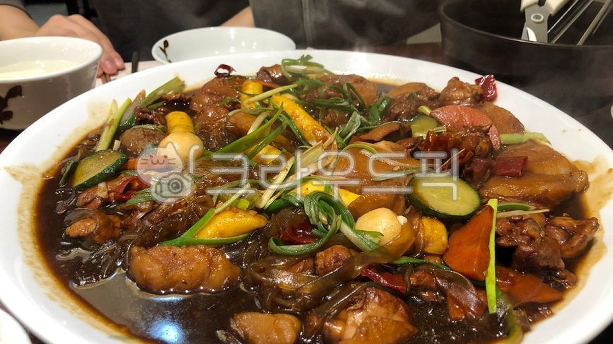
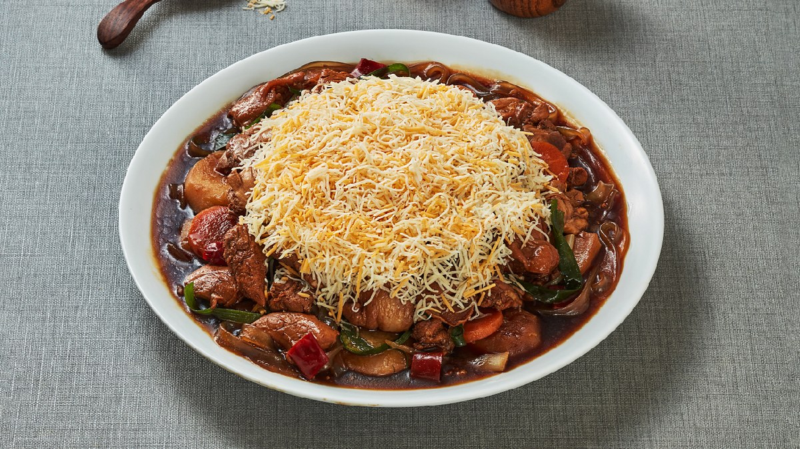
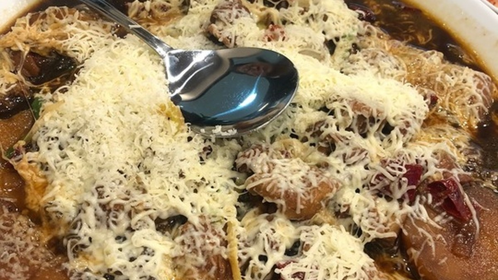
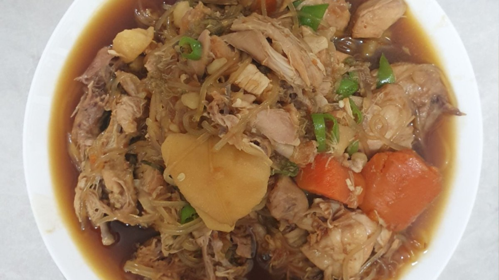
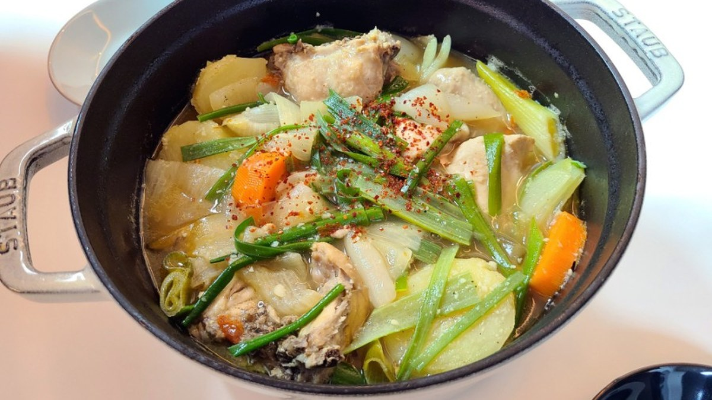
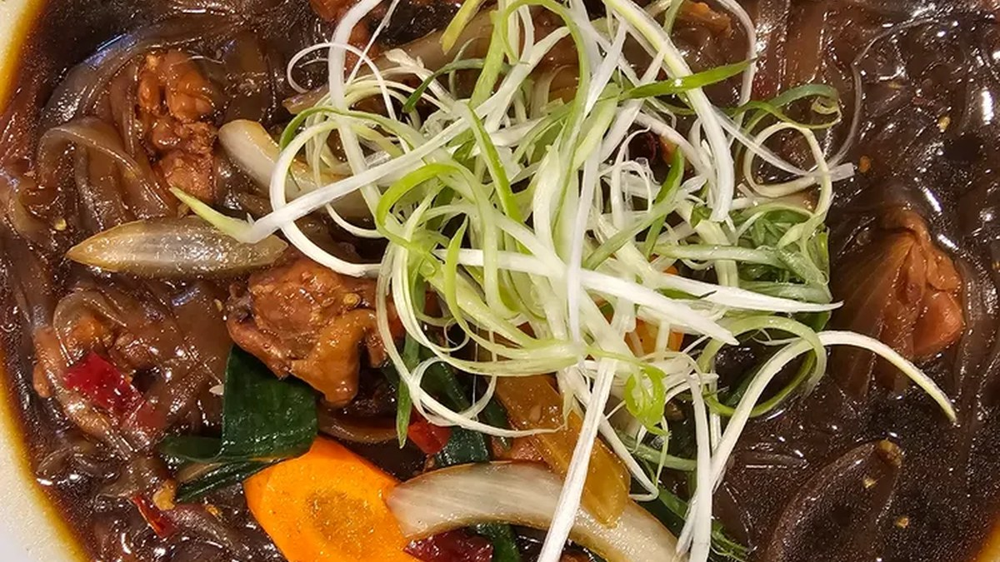

> 자동 생성 초안 · 2026-05-28

# 봉추찜닭 솔직 후기: OO점 맛집 탐방, 인생 찜닭 메뉴 추천!

안녕하세요! 오늘은 많은 분들의 사랑을 받는 찜닭 맛집, 봉추찜닭에 대한 솔직한 후기를 공유해 드리고자 합니다. 봉추찜닭은 특유의 깊고 진한 양념과 부드러운 닭고기로 오랜 시간 사랑받아온 곳인데요. 과연 어떤 매력이 숨어 있는지, 직접 방문한 OO점의 생생한 후기와 함께 인생 찜닭 메뉴 추천까지 자세히 알려드리겠습니다.

봉추찜닭은 단순히 맛있는 찜닭을 넘어, 한국인의 입맛을 사로잡는 매콤달콤한 맛의 조화로 전국적인 인기를 누리고 있습니다. 특히 쫄깃한 넓적 당면과 아삭한 채소, 그리고 푹 익은 닭고기의 조합은 한번 맛보면 잊을 수 없는 중독성을 자랑합니다. 이번 포스팅에서는 봉추찜닭의 다양한 메뉴를 맛보고, 각 메뉴의 특징과 솔직한 평가를 덧붙여 여러분의 현명한 선택을 돕고자 합니다.

## 봉추찜닭 메뉴 추천 및 솔직 후기

봉추찜닭은 기본 찜닭 외에도 다양한 메뉴를 선보이며 고객들의 선택 폭을 넓히고 있습니다. 저희가 방문한 OO점에서는 대표 메뉴인 **봉추찜닭**과 매콤한 맛을 선호하는 분들을 위한 **빨간찜닭**, 그리고 닭볶음탕 스타일의 **닭매운탕**까지 준비되어 있었습니다.

가장 먼저 맛본 **봉추찜닭**은 역시나 기대를 저버리지 않았습니다. 달콤하면서도 짭짤한 간장 베이스의 양념이 닭고기와 당면에 깊숙이 배어들어 있었습니다. 특히 봉추찜닭의 시그니처인 넓적 당면은 쫄깃한 식감이 살아있어 양념을 머금고 더욱 풍성한 맛을 선사했습니다. 닭고기는 부드럽게 씹혔고, 함께 들어있는 채소들도 신선함을 더해 조화로운 맛을 이루었습니다. 이 메뉴는 남녀노소 누구나 좋아할 만한 맛으로, 봉추찜닭을 처음 방문하시는 분들께 가장 먼저 추천해 드리고 싶은 메뉴입니다.

다음으로 맛본 **빨간찜닭**은 봉추찜닭의 매콤한 버전이라고 할 수 있습니다. 기본 찜닭의 양념에 매콤한 맛이 더해져 더욱 강렬한 풍미를 느낄 수 있었습니다. 매운맛의 정도는 적당히 매콤하여 땀이 살짝 송골송골 맺히는 정도였지만, 계속해서 손이 가는 중독성이 있었습니다. 매콤한 음식을 즐기시는 분들이라면 분명 만족하실 메뉴입니다.

저희는 이 외에도 밥반찬으로도 훌륭한 **닭매운탕**도 맛보았습니다. 닭매운탕은 찜닭과는 또 다른 매력으로, 얼큰한 국물이 일품이었습니다. 밥과 함께 먹기에도 좋고, 술안주로도 손색없는 메뉴였습니다.

각 메뉴마다 고유의 매력이 있었지만, 개인적으로는 역시 기본에 충실한 **봉추찜닭**이 가장 인상 깊었습니다. 깔끔하면서도 깊은 맛의 양념과 쫄깃한 당면의 조화는 봉추찜닭만의 특별함이라고 생각합니다.

## 봉추찜닭 맛집 방문 경험 (지역별)

봉추찜닭은 전국적으로 많은 지점을 운영하고 있어 어디서든 쉽게 맛볼 수 있다는 장점이 있습니다. 저희는 이번에 **OO점**을 방문하였는데, 깔끔한 내부와 친절한 서비스 덕분에 기분 좋은 식사를 할 수 있었습니다. 특히 OO점은 넓은 주차 공간을 갖추고 있어 자가용을 이용하는 분들도 편리하게 방문할 수 있다는 점이 좋았습니다.

참고로, 다른 지역의 봉추찜닭 지점들을 방문했던 경험을 떠올려보면, 대부분의 지점에서 일관된 맛과 서비스를 제공하고 있었습니다. 예를 들어, **종로타워점**에서는 안동찜닭 골목의 일반 당면과는 다른 봉추찜닭만의 넓적 당면을 사용하여 또 다른 별미를 느낄 수 있었습니다. 달짝 짭쪼름한 안동찜닭의 맛을 제대로 느낄 수 있었던 곳이었습니다.

또한, **가산디지털단지역점**에서는 점심시간에 방문했는데도 불구하고 신속한 서빙과 맛있는 찜닭으로 만족스러운 식사를 할 수 있었습니다. 이곳에서는 빨간찜닭과 닭매운탕도 인기 메뉴라고 하니, 다음 방문 시에는 꼭 맛보고 싶다는 생각이 들었습니다.

지역별로 미묘한 차이가 있을 수는 있겠지만, 봉추찜닭은 전국 어디에서나 믿고 방문할 수 있는 맛집이라는 것을 다시 한번 느꼈습니다. 각 지점마다의 특색을 찾아보는 재미도 쏠쏠할 것 같습니다.

## 봉추찜닭 레시피 (집에서 만들기)

봉추찜닭의 맛을 집에서도 그대로 재현하고 싶으신 분들을 위해, 간단한 레시피를 소개해 드립니다. 특히 아이들이 먹기 편하도록 **순살 닭다리살**을 활용하면 더욱 좋습니다.

**재료:**

*   순살 닭다리살 500g
*   넓적 당면 100g
*   양파 1/2개
*   당근 1/4개
*   대파 1/2대
*   청양고추 1~2개 (선택 사항)
*   물 300ml

**양념장:**

*   간장 5큰술
*   설탕 2큰술
*   올리고당 1큰술
*   다진 마늘 1큰술
*   맛술 1큰술
*   참기름 1큰술
*   후추 약간

**만드는 법:**

1.  **재료 준비:** 닭다리살은 먹기 좋은 크기로 썰고, 양파는 채 썰고, 당근은 반달 모양으로 썰고, 대파는 길게 썹니다. 넓적 당면은 미리 찬물에 30분 정도 불려둡니다.
2.  **닭고기 익히기:** 냄비에 닭다리살과 물 300ml를 넣고 끓입니다. 끓어오르면 떠오르는 불순물을 제거하고 중약불에서 10분 정도 익힙니다.
3.  **양념 넣기:** 닭고기가 어느 정도 익으면 준비한 양념장을 모두 넣고 잘 섞어줍니다.
4.  **채소 넣기:** 양파, 당근을 넣고 5분 정도 더 끓입니다.
5.  **당면 넣기:** 불려둔 넓적 당면과 대파, 청양고추(선택 사항)를 넣고 당면이 익을 때까지 5~7분 정도 더 끓여줍니다. 당면이 눌어붙지 않도록 중간중간 저어주는 것이 중요합니다.
6.  **마무리:** 마지막으로 참기름을 살짝 둘러주면 봉추찜닭 스타일의 찜닭 완성입니다.

여러 번 만들어보니 맛의 차이는 양념의 비율과 재료를 넣는 순서에 있었습니다. 이 레시피로 집에서도 외식하는 듯한 맛있는 찜닭을 즐겨보세요!

## 봉추찜닭 vs 다른 찜닭 비교

봉추찜닭은 안동찜닭, 혹은 일반적인 간장찜닭과 비교했을 때 몇 가지 차별점을 가지고 있습니다.

가장 큰 차이점은 **당면**입니다. 봉추찜닭은 쫄깃한 식감이 뛰어난 **넓적 당면**을 사용하는 반면, 전통적인 안동찜닭은 일반 당면을 사용하는 경우가 많습니다. 넓적 당면은 양념을 더 잘 머금고 씹는 맛이 있어 봉추찜닭만의 독특한 매력을 더합니다.

**양념 맛**에서도 차이가 있습니다. 봉추찜닭의 양념은 달콤함과 짭짤함의 조화가 매우 뛰어나며, 깊고 진한 풍미를 자랑합니다. 다른 찜닭 브랜드나 집에서 만든 찜닭에 비해 좀 더 자극적이면서도 중독성 있는 맛을 가지고 있다고 할 수 있습니다.

또한, **매운맛 옵션**에서도 차이가 있습니다. 봉추찜닭은 기본 찜닭 외에도 매콤한 맛을 즐길 수 있는 빨간찜닭을 선보이고 있어, 매운맛을 선호하는 고객들의 니즈를 충족시키고 있습니다.

물론, 찜닭의 맛은 개인의 취향에 따라 다르게 느껴질 수 있습니다. 하지만 봉추찜닭은 특유의 넓적 당면과 깊은 양념 맛으로 다른 찜닭들과는 확실히 구분되는 매력을 가지고 있다고 평가할 수 있습니다.

## 봉추찜닭 특별 메뉴 (예: 빨간찜닭, 누룽지)

앞서 메뉴 소개에서 언급했지만, 봉추찜닭의 **빨간찜닭**은 매콤한 맛을 좋아하는 분들에게 강력 추천하는 메뉴입니다. 기본 찜닭의 맛을 기반으로 매콤한 양념이 더해져, 땀 흘리면서도 계속해서 먹게 되는 매력이 있습니다. 스트레스 해소에도 제격인 메뉴라고 할 수 있습니다.

봉추찜닭은 모든 메뉴에 밥을 비벼 먹기 좋은 양념이 특징입니다. 특히 찜닭의 남은 양념에 밥을 비벼 먹는 것은 많은 분들이 즐기는 방법 중 하나입니다. 만약 밥을 조금 더 특별하게 즐기고 싶다면, **누룽지**를 추가하여 밥과 함께 끓여 먹는 것도 좋은 방법입니다. 누룽지의 고소함과 찜닭 양념의 조화는 예상외로 훌륭하며, 씹는 맛까지 더해져 색다른 경험을 선사할 것입니다.

이 외에도 봉추찜닭은 시즌별로 특별한 메뉴를 선보이기도 합니다. 방문하실 때마다 새로운 메뉴가 있는지 확인해 보시는 것도 좋겠습니다.

---

### 봉추찜닭 맛집 탐방 체크리스트

*   [ ] **메인 메뉴 선택:** 봉추찜닭 vs 빨간찜닭 vs 닭매운탕
*   [ ] **사이드 메뉴 고려:** 밥, 공기밥 추가, 누룽지 등
*   [ ] **매운맛 조절:** 매운맛 선호도에 따라 메뉴 선택
*   [ ] **방문 지점 정보 확인:** 주차, 영업시간, 포장 가능 여부
*   [ ] **함께 간 사람 고려:** 어린이, 매운맛 못 먹는 사람 등

---

### 봉추찜닭 FAQ

**Q1. 봉추찜닭은 매운 편인가요?**

A1. 기본 봉추찜닭은 매콤달콤한 맛으로, 아주 맵지는 않습니다. 하지만 매운맛을 더 선호하신다면 '빨간찜닭' 메뉴를 선택하시면 됩니다.

**Q2. 봉추찜닭의 당면은 어떤 종류인가요?**

A2. 봉추찜닭은 쫄깃한 식감이 특징인 넓적 당면을 사용합니다.

**Q3. 봉추찜닭은 포장이 가능한가요?**

A3. 대부분의 봉추찜닭 지점에서 포장 서비스를 제공합니다. 방문 전에 미리 확인해 보시는 것이 좋습니다.

**Q4. 집에서 봉추찜닭처럼 맛있게 만들려면 어떤 팁이 있나요?**

A4. 신선한 닭고기를 사용하고, 양념장 비율을 잘 맞추는 것이 중요합니다. 또한, 넓적 당면을 미리 불려두면 더욱 쫄깃하게 즐길 수 있습니다. (위 레시피 참고)

---

오늘 봉추찜닭 OO점 방문 후기와 함께 다양한 정보를 소개해 드렸습니다. 봉추찜닭은 언제 방문해도 맛있는 찜닭을 맛볼 수 있는 매력적인 곳입니다. 여러분도 오늘 저녁, 맛있는 봉추찜닭과 함께 즐거운 시간을 보내시는 것은 어떨까요?

#봉추찜닭 #찜닭맛집 #인생찜닭

