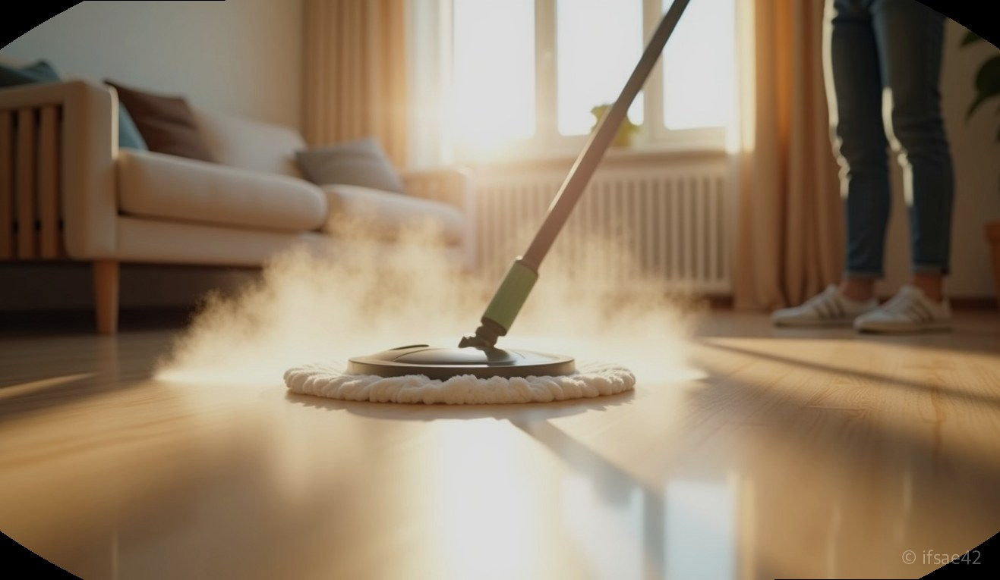
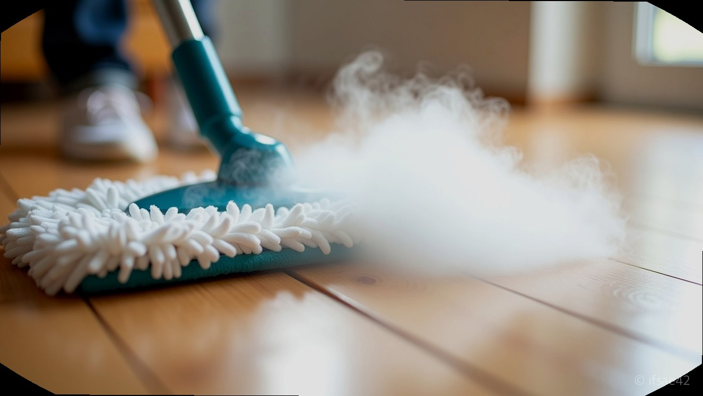
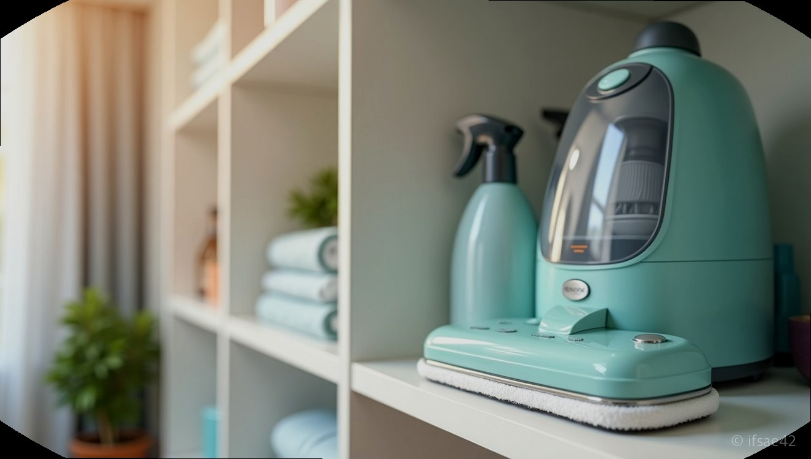

> 자동 생성 초안 · 2026-07-09

# 비셀 스팀청소기 내돈내산 솔직 후기, 1개월 사용 후 느낀 장단점과 관리법

"청소가 운동이 되어서는 안 된다"라는 생각으로 고민 끝에 들였던 가전이 바로 비셀 스팀청소기입니다. 1개월 동안 매일같이 집안 곳곳을 누비며 느낀 결론부터 말씀드리자면, '강력한 살균력은 확실하나 무게와 관리의 번거로움은 반드시 고려해야 할 숙제'입니다. 무작정 구매하기보다는 본인의 청소 스타일과 집안 환경에 맞는지 꼼꼼히 따져보고 결정하시길 권합니다.

## 실사용 1개월 장단점 분석

비셀 스팀청소기의 가장 큰 강점은 단연 '스팀의 온도와 분사력'입니다. 일반 물걸레질로는 해결되지 않던 끈적거림이나 반려동물의 발자국, 아이가 흘린 음식물 자국이 스팀 한 번에 말끔히 닦여 나가는 쾌감은 이루 말할 수 없습니다. 특히 고온 스팀이 지나간 자리는 눈으로 보기에도 위생적인 느낌이 들어 심리적인 만족감이 매우 큽니다.

하지만 현실적인 단점도 존재합니다. 가장 먼저 체감되는 부분은 '무게감'입니다. 본체와 물통, 그리고 전선까지 더해지면 결코 가볍지 않습니다. 거실을 다 닦고 나면 손목에 꽤 묵직한 피로감이 쌓입니다. 또한, 유선 방식이기 때문에 청소 중 콘센트를 옮겨 꽂아야 하는 번거로움이 있습니다. 무선 청소기의 편리함에 익숙해진 분들이라면 처음 며칠간은 이 줄이 꽤나 거슬릴 수 있습니다.

## 샤크 등 타사 제품 비교

시장에서 비셀과 가장 많이 비교되는 브랜드는 샤크(Shark)입니다. 샤크 제품은 비셀보다 상대적으로 경량화에 초점을 맞추어 설계되었습니다. 손목이 약하신 분들에게는 샤크가 좀 더 나은 선택지가 될 수 있습니다. 반면, 비셀은 내구성과 스팀의 지속적인 분사 안정성에 더 무게를 둔 느낌입니다.

저가형 가성비 모델인 휴빅이나 기타 국산 브랜드들과 비교하면 가격대는 확실히 높습니다. 하지만 고온 스팀이 필요한 이유가 살균과 찌든 때 제거라면, 비셀의 출력은 확실히 돈값을 합니다. 단순히 닦는 용도라면 저가형도 충분하지만, 스팀의 '질'을 따진다면 비셀을 선택하는 것이 후회 없는 길입니다.

## 고장 예방과 관리법

비셀 스팀청소기를 오래 사용하기 위한 핵심은 바로 '물 관리'입니다. 스팀청소기 고장의 주된 원인은 내부 석회질 축적입니다. 가급적 정수기 물을 사용하되, 제조사에서 권장하는 전용 필터가 있다면 정기적으로 교체해 주는 것이 좋습니다. 수돗물을 그대로 사용하면 내부 배관이 막혀 스팀 분사력이 급격히 떨어질 수 있습니다.

패드 세탁도 중요합니다. 사용 후 즉시 패드를 분리해 세척해야 냄새가 나지 않습니다. 섬유 유연제는 패드의 흡수력을 떨어뜨리니 가급적 피하고, 뜨거운 물에 삶거나 중성세제로 가볍게 손세탁하는 방식을 추천합니다. 저는 여분 패드를 3장 정도 구비해두고 매번 깨끗한 것으로 교체하며 사용 중인데, 이렇게 관리해야 청소 시 찝찝함이 없습니다.

## 상황별 활용 가이드

이 제품은 단순히 바닥 청소용으로만 쓰기엔 아깝습니다. 함께 제공되는 노즐을 활용하면 욕실 타일 줄눈 청소나 주방 가스레인지 후드의 찌든 기름때를 제거하는 데에도 탁월합니다. 다만, 침구 살균 기능을 사용할 때는 원단이 고온 스팀에 손상되지 않는지 반드시 구석진 곳에 먼저 테스트해보아야 합니다.

매일 전체를 다 닦으려 하지 마세요. 일주일에 한두 번, 정기적으로 스팀 살균이 필요한 날을 정해두는 것이 좋습니다. 바닥이 평소보다 조금 더 끈적거리거나, 아이나 반려동물이 있는 집이라면 일상의 청소 루틴 속에 비셀을 한 번 섞어주는 것만으로도 집안 공기 자체가 달라지는 경험을 하실 수 있을 겁니다.

무거운 무게를 감당할 수 있고, 유선의 번거로움보다 살균의 확실함을 우선시하신다면 비셀은 충분히 만족스러운 투자가 될 것입니다. 반대로 가볍고 빠른 청소를 원하시는 분들은 조금 더 가벼운 입문형 모델을 고려해보시길 바랍니다.

#비셀스팀청소기 #스팀청소기추천 #살균청소 #내돈내산후기 #가전리뷰
