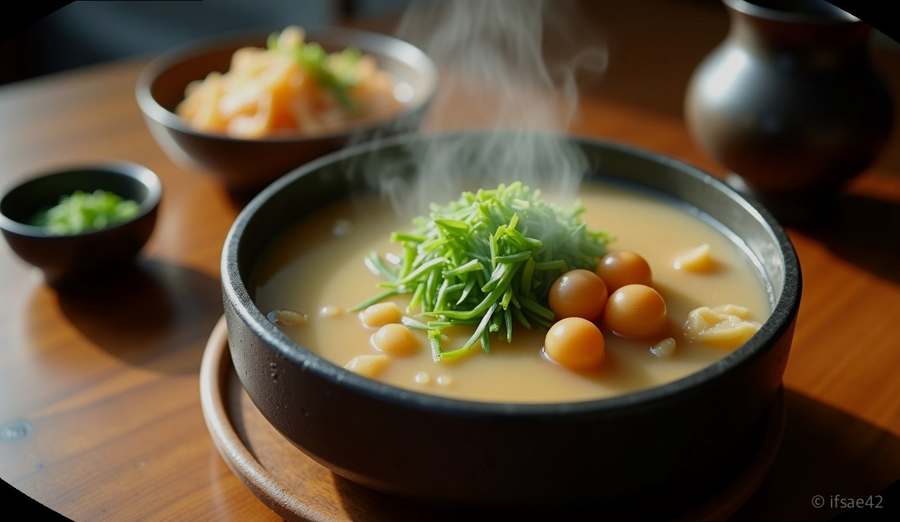
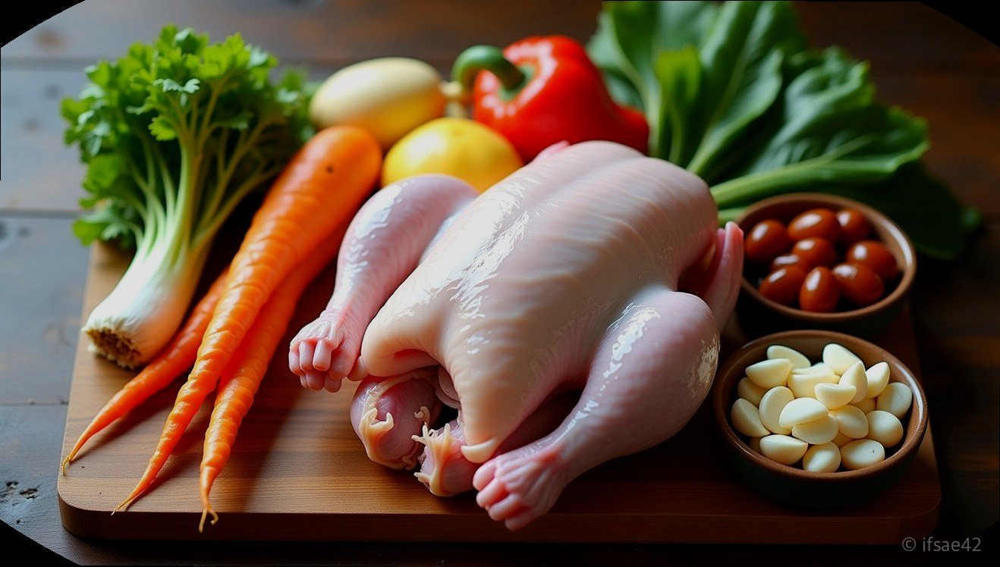

> 자동 생성 초안 · 2026-07-14

# 삼계플이란 무엇일까? 삼계탕 효능부터 맛집까지 보양식 정보 총정리

무더운 여름철, 기력이 떨어질 때 가장 먼저 생각나는 음식은 단연 삼계탕입니다. 최근 온라인상에서 '삼계플'이라는 단어를 검색하며 궁금해하는 분들이 부쩍 늘었습니다. 혹시 '삼계탕 플러스'의 줄임말일까, 혹은 새로운 보양식 트렌드일까 고민하셨다면 주목해 주세요. 사실 삼계플은 특정 커뮤니티나 지역에서 삼계탕을 즐기는 자신만의 '플레이리스트' 혹은 '플랜'을 지칭하는 은어로 사용되기도 하며, 삼계탕을 더욱 맛있게 즐기기 위한 하나의 문화적 코드로 자리 잡고 있습니다.

## 삼계플의 정확한 의미

많은 분이 궁금해하시는 '삼계플'은 표준 국어 사전에 등재된 단어는 아닙니다. 하지만 삼계탕을 즐기는 미식가들 사이에서는 '삼계탕을 즐기는 나만의 플랜'이라는 의미로 통용되곤 합니다. 단순히 닭 한 마리를 먹는 것을 넘어, 어떤 인삼주와 곁들일지, 어떤 반찬과 조화를 이룰지, 혹은 식사 후 어떤 코스로 카페를 갈지까지 계획하는 과정을 일컫습니다.

이 용어가 검색되는 이유는 삼계탕이 단순히 한 끼 식사가 아니라, 현대인들에게는 '여름을 나기 위한 전략적 보양식'으로 인식되기 때문입니다. 삼계탕의 주재료인 닭고기는 단백질이 풍부하고 소화가 잘 되며, 함께 들어가는 인삼, 마늘, 대추 등은 혈액 순환을 돕고 면역력을 높여줍니다. 삼계플이라는 단어를 검색하셨다면, 올바른 삼계탕 선택법과 효능을 알고 싶어 하는 건강한 식습관의 소유자일 가능성이 높습니다.

## 삼계탕이 보양식인 이유

삼계탕이 오랜 시간 국민 보양식으로 사랑받는 데에는 과학적인 이유가 있습니다. 닭고기는 다른 육류에 비해 지방 함량이 적고 필수 아미노산이 풍부합니다. 여기에 들어가는 인삼의 사포닌 성분은 피로 회복과 원기 회복에 탁월하며, 대추는 신경 안정 효과가 있습니다.

특히 삼계탕의 뜨거운 성질은 여름철 찬 음식을 많이 먹어 차가워진 위장을 따뜻하게 보호해 줍니다. '이열치열'이라는 말처럼 뜨거운 삼계탕을 먹으며 땀을 흘리는 것은 체내 독소를 배출하고 신진대사를 원활하게 만드는 데 도움을 줍니다. 삼계플을 짜실 때, 이왕이면 찹쌀이 든든하게 들어간 전통 삼계탕을 선택하여 위장을 보호하는 것을 추천합니다.

## 맛집 선택 시 체크리스트

나만의 삼계플, 즉 삼계탕 외식 계획을 완벽하게 마무리하고 싶다면 아래의 기준을 참고해 보시기 바랍니다.

*   **닭의 크기:** 너무 큰 닭보다는 영계(삼계)를 사용하여 육질이 연한 곳이 좋습니다.
*   **육수의 깊이:** 한약재 향이 너무 강하지 않으면서도 닭 본연의 진한 맛이 우러나는지 확인해야 합니다.
*   **밑반찬의 조화:** 삼계탕의 짝꿍인 깍두기나 겉절이가 신선하고 알맞게 익었는지가 맛의 완성을 결정합니다.
*   **위생 상태:** 보양식인 만큼 조리 시설이 청결하고 재료 회전율이 높은 곳을 선택하는 것이 안전합니다.
*   **사이드 메뉴:** 인삼주를 기본으로 제공하는지, 혹은 닭발이나 닭똥집 등 곁들임 메뉴가 있는지 확인하면 더욱 풍성한 식사가 됩니다.

## 건강한 보양식 즐기기

삼계탕을 드실 때는 너무 뜨거운 상태에서 급하게 먹기보다는, 살을 발라내며 적당한 온도로 식혀 먹는 것이 소화에 좋습니다. 또한, 삼계탕에 들어있는 인삼은 기력을 보충해 주지만 체질에 따라 열이 많을 경우 주의가 필요합니다. 만약 삼계탕 이외의 다른 보양식을 찾고 계신다면, 전복이 들어간 '전복 삼계탕'이나 능이버섯을 넣은 '능이 삼계탕'을 대안으로 고려해 보시는 것도 좋은 선택입니다.

삼계플이라는 키워드를 통해 삼계탕 한 그릇의 가치를 다시 한번 생각하게 됩니다. 바쁜 일상 속에서 자신을 위해 보양식을 챙겨 먹는 것만큼 소중한 자기 관리는 없습니다. 이번 주말에는 정성 가득한 삼계탕 한 그릇으로 지친 몸과 마음을 달래보시는 건 어떨까요? 올바른 보양식 정보가 여러분의 건강한 여름나기에 작은 도움이 되었기를 바랍니다.

#삼계탕 #보양식 #삼계플
