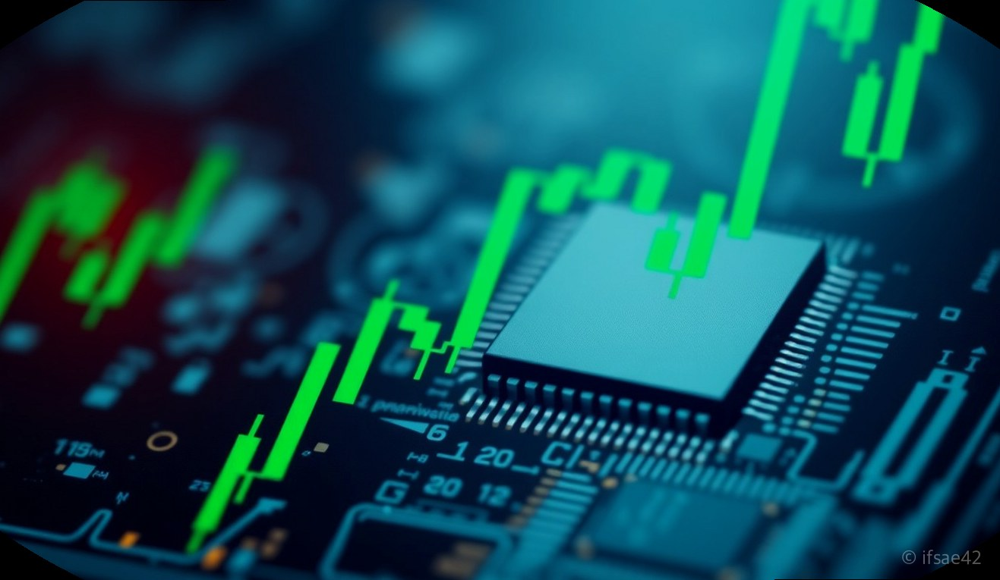
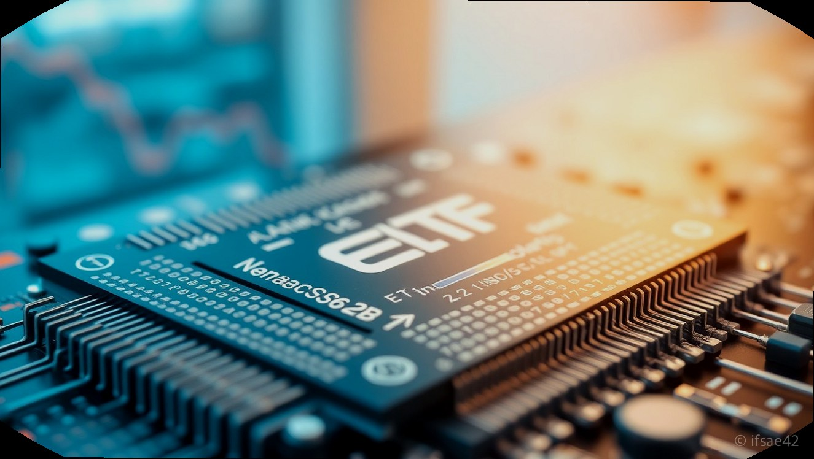

> 자동 생성 초안 · 2026-06-01

# 삼성전자 레버리지 ETF 사는법 및 필수 교육 이수 방법 완벽 정리

최근 국내 주식 시장에서 반도체 대장주인 삼성전자와 SK하이닉스를 기초자산으로 하는 단일종목 레버리지 ETF가 큰 주목을 받고 있습니다. 기존에는 지수 전체를 추종하는 상품만 존재했지만, 이제는 특정 종목의 일일 수익률을 2배로 추종하는 상품이 출시되면서 투자자들의 선택지가 넓어졌습니다.

하지만 레버리지 상품은 일반 주식과는 투자 성격이 완전히 다릅니다. 높은 수익을 기대할 수 있는 만큼 원금 손실 위험 또한 매우 크기 때문에, 금융당국에서는 투자자 보호를 위해 사전 교육 이수와 기본 예탁금 제도를 의무화하고 있습니다. 오늘은 삼성전자 ETF 레버리지 상품을 안전하게 매수하는 방법부터 필수 교육 과정까지 상세히 정리해 드립니다.

## 삼성전자 레버리지 ETF의 구조와 특징 이해하기

삼성전자 레버리지 ETF는 기초자산인 삼성전자 주식의 일일 수익률을 2배로 추종하도록 설계된 파생상품입니다. 예를 들어 삼성전자 주가가 당일 3% 상승하면 해당 ETF는 6%의 수익을 내지만, 반대로 3% 하락하면 6%의 손실이 발생하는 구조입니다.

이러한 상품은 단기적인 변동성을 활용해 수익을 극대화하려는 투자자에게 적합합니다. 다만, '일일 수익률의 2배'를 추종하기 때문에 장기 보유 시에는 '음의 복리 효과'가 발생하여 기초자산의 등락이 반복될 경우 실제 수익률이 2배를 크게 하회할 수 있다는 점을 반드시 인지해야 합니다. 따라서 장기 투자보다는 시장의 방향성이 확실한 단기 대응용으로 활용하는 것이 권장됩니다.

## 투자 전 필수 과정: 금융투자교육원 사전 교육 및 예탁금

단일종목 레버리지 ETF를 매수하기 위해서는 반드시 두 가지 관문을 통과해야 합니다.

1. **사전 교육 이수**: 금융투자교육원 홈페이지(kifin.or.kr)에 접속하여 '레버리지 ETF 투자자 사전 교육'을 수강해야 합니다. 약 1시간 분량의 온라인 강의를 시청하고 테스트를 완료하면 수료증이 발급됩니다. 이 수료증 번호를 본인이 거래하는 증권사 MTS/HTS에 등록해야 매수 주문이 가능합니다.
2. **기본 예탁금 확인**: 레버리지 상품은 파생상품 계좌와 유사한 성격으로 분류되어, 최소 1,000만 원 이상의 기본 예탁금이 계좌에 있어야 합니다. 증권사별로 예탁금 기준이 조금씩 다를 수 있으니, 반드시 본인의 증권사 공지사항을 확인하시기 바랍니다.

## 증권사별 MTS 매수 방법 및 메뉴 위치 가이드

대부분의 증권사 MTS에서는 '투자자 교육 이수 등록' 메뉴를 별도로 제공합니다.

*   **메뉴 찾기**: 증권사 앱 내 검색창에 '레버리지' 또는 '교육 등록'을 입력하면 관련 메뉴가 바로 나타납니다.
*   **수료증 등록**: 금융투자교육원에서 발급받은 수료증 번호를 해당 메뉴에 입력하고 '등록' 버튼을 누르면 즉시 매수 자격이 부여됩니다.
*   **매수 방법**: 교육 등록이 완료되면 일반 주식 종목을 매수하는 것과 동일하게 종목명(예: KODEX 삼성전자 레버리지 등)을 검색하여 주문을 넣으시면 됩니다. 다만, 거래량이 적은 시간대에는 괴리율이 발생할 수 있으므로 가급적 장중 활발한 시간대를 이용하는 것이 좋습니다.

## 레버리지 투자 시 주의사항: 괴리율과 변동성

레버리지 ETF 투자 시 가장 주의해야 할 지표는 바로 '괴리율'입니다. 괴리율이란 ETF가 보유한 실제 자산 가치(NAV)와 시장에서 거래되는 가격 간의 차이를 말합니다. 괴리율이 지나치게 높다면 실제 가치보다 비싸게 사는 꼴이 되므로, 매수 전 반드시 실시간 NAV와 현재가를 비교해야 합니다.

또한, 단일종목 레버리지 ETF는 기존 지수형 ETF보다 변동성이 훨씬 큽니다. 따라서 본인만의 명확한 손절매 기준을 세우고, 전체 자산에서 레버리지 상품이 차지하는 비중을 일정 수준 이하로 제한하는 자산 배분 전략이 필수입니다.

### 투자 체크리스트
- [ ] 금융투자교육원에서 사전 교육(1시간)을 이수했는가?
- [ ] 증권사 MTS에 수료증 번호를 정상적으로 등록했는가?
- [ ] 계좌에 최소 기본 예탁금(1,000만 원 이상)이 준비되어 있는가?
- [ ] 매수 전 실시간 괴리율을 확인했는가?
- [ ] 변동성 확대에 대비한 손절 계획을 세웠는가?

### 자주 묻는 질문(FAQ)

**Q1. 교육 이수는 매번 해야 하나요?**
A: 아니요, 한번 이수하면 등록된 증권사에서 유효기간 동안 반복적으로 사용할 수 있습니다. 다만, 유효기간이 만료되면 재이수가 필요합니다.

**Q2. 왜 삼성전자 레버리지 ETF는 장기 투자에 부적합한가요?**
A: 일일 수익률을 2배 추종하는 특성상, 주가가 횡보하거나 등락을 반복하면 복리 효과로 인해 기초자산 대비 수익률이 낮아지는 '음의 복리' 현상이 발생하기 때문입니다.

**Q3. 모든 증권사에서 매수 가능한가요?**
A: 네, 대부분의 국내 주요 증권사에서 매수 가능합니다. 다만, 교육 등록 메뉴 위치가 조금씩 다르므로 검색 기능을 활용하시기 바랍니다.

삼성전자 레버리지 ETF는 시장의 상승 흐름을 활용할 수 있는 강력한 도구이지만, 그만큼 위험성도 큰 상품입니다. 오늘 정리해 드린 절차를 꼼꼼히 확인하시고, 철저한 리스크 관리를 통해 성공적인 투자 하시길 바랍니다.

#삼성전자ETF #레버리지ETF #단일종목레버리지
