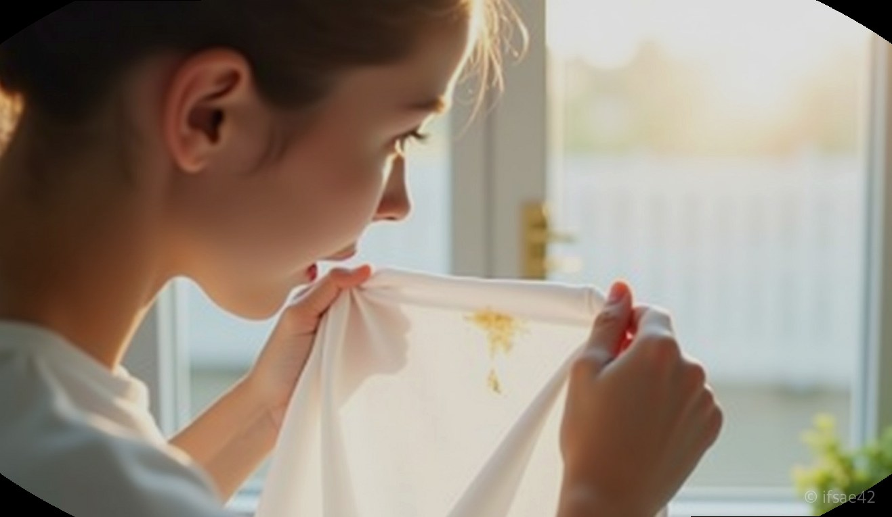
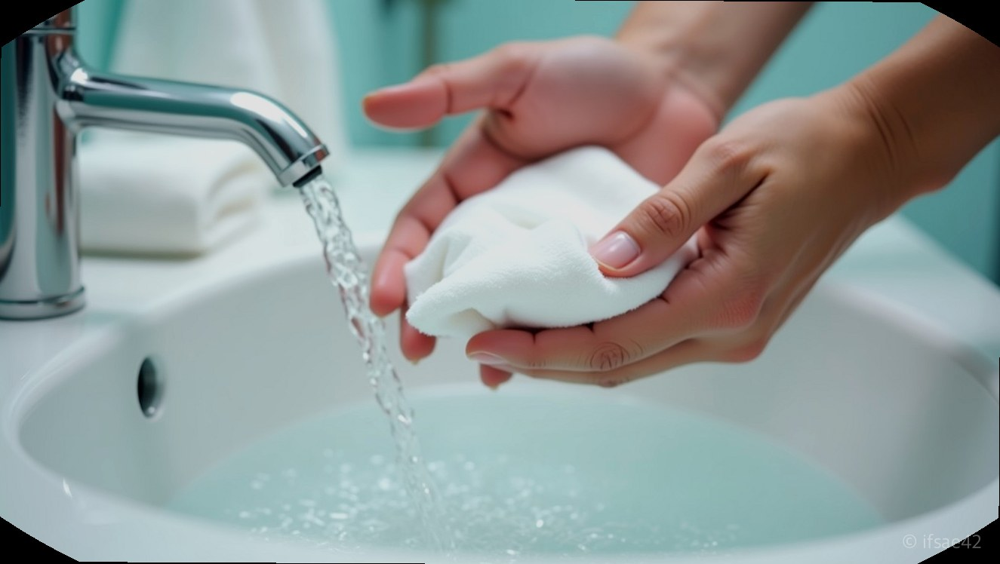
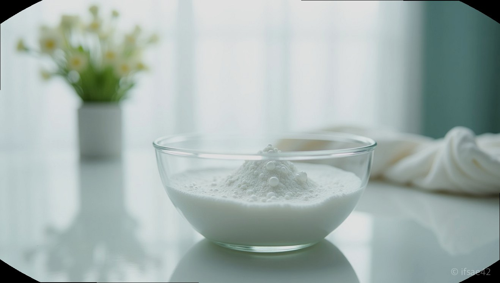

> 자동 생성 초안 · 2026-07-14

# 생리혈 지우기 완벽 가이드: 흰바지 이불 핏자국 찬물로 흔적 없이 해결하는 법

아침에 일어나 마주한 이불의 붉은 자국, 혹은 외출했다가 발견한 흰 바지의 얼룩만큼 당혹스러운 순간이 또 있을까요. 특히 아끼는 옷이나 세탁이 힘든 침구류에 묻은 생리혈은 그야말로 난감 그 자체입니다. 하지만 너무 걱정하지 마세요. 생리혈의 성분과 그에 맞는 적절한 대응법만 알고 있다면, 당황스러운 상황에서도 흔적 없이 깨끗하게 되돌릴 수 있습니다. 지금부터 가장 효과적인 **생리혈지우기** 노하우를 정리해 드립니다.

## 가장 중요한 것은 찬물 세탁

생리혈을 제거할 때 가장 먼저 기억해야 할 핵심은 바로 '온도'입니다. 피의 주성분은 단백질인데, 이 단백질은 뜨거운 물을 만나면 응고되는 성질이 있습니다. 흔히 얼룩을 지우겠다고 습관적으로 따뜻한 물을 사용하는 경우가 많은데, 이는 오히려 핏자국을 섬유 조직 깊숙이 고착시켜 얼룩을 영구적으로 남게 만드는 지름길입니다.

따라서 갓 묻은 얼룩이든 시간이 지난 얼룩이든, 무조건 찬물을 사용하는 것이 원칙입니다. 우선 흐르는 찬물에 얼룩 부위를 충분히 헹궈내어 혈액의 양을 줄여주는 것이 1단계입니다. 이때 비비기보다는 물의 압력을 이용해 핏물을 밖으로 밀어낸다는 느낌으로 헹궈야 섬유 손상을 최소화할 수 있습니다.

## 얼룩 유형별 맞춤 제거법

시간이 얼마나 흘렀느냐에 따라 사용하는 도구와 방법이 달라져야 합니다.

**1. 갓 묻은 얼룩일 때**
얼룩을 발견한 즉시 대처할 수 있다면 아주 간단합니다. 찬물에 충분히 헹군 뒤, 주변에서 쉽게 구할 수 있는 '풋샴푸'나 일반 비누를 이용해 보세요. 특히 풋샴푸는 단백질 분해 성분이 포함된 경우가 많아 핏자국 제거에 탁월한 효과를 보입니다. 샴푸를 얼룩 부위에 묻혀 살살 문지르면 금세 거품과 함께 핏자국이 희미해지는 것을 볼 수 있습니다.

**2. 시간이 꽤 지난 얼룩일 때**
이미 말라버린 얼룩이라면 조금 더 강력한 화학적 도움이 필요합니다. 이때 추천하는 것이 '과탄산소다'입니다. 대야에 40~50도 정도의 따뜻한 물(이때는 이미 섬유에 고착된 얼룩을 녹이기 위해 약간의 온기가 필요합니다)을 받고 과탄산소다를 적당량 풀어준 뒤, 얼룩진 의류를 20~30분 정도 담가두세요. 이후 찬물로 헹구면 신기할 정도로 깨끗해집니다. 다만, 과탄산소다는 표백 효과가 강하므로 색깔 있는 옷은 변색 위험이 있으니 주의가 필요합니다.

**3. 가정 내 응급 처치 아이템**
집에 과탄산소다가 없다면 과산화수소를 활용해 보세요. 약국에서 쉽게 구할 수 있는 과산화수소를 얼룩 부위에 뿌리면 보글보글 거품이 올라오는데, 이는 산소 반응을 통해 혈액 성분을 분해하는 과정입니다. 거품이 나면 살짝 문지른 뒤 물로 헹궈내면 됩니다. 급할 때는 치약을 소량 묻혀 살살 문지르는 방법도 효과적이지만, 치약의 연마제 성분이 섬유를 상하게 할 수 있으니 마지막 수단으로 사용하는 것이 좋습니다.

## 소재별 주의사항과 팁

흰 바지나 침대 시트 같은 면 소재는 위의 방법들로 대부분 깔끔하게 복구가 가능합니다. 하지만 실크나 울 같은 섬유는 자극에 매우 약합니다. 이런 소재라면 무리하게 문지르지 말고, 반드시 전문 세탁소에 맡기는 것이 안전합니다.

집에서 세탁할 때는 반드시 옷감 안쪽의 케어 라벨을 확인하세요. 중성세제를 사용해야 하는 옷에 강한 표백 성분을 사용하면 옷감이 상해 다시는 입지 못하게 될 수도 있습니다. 또한, 이불처럼 부피가 큰 경우에는 부분 얼룩 제거를 먼저 진행한 뒤 전체 세탁을 하는 것이 얼룩이 번지는 것을 막는 현명한 방법입니다.

**Q1. 오래된 생리혈 자국도 완전히 지울 수 있나요?**
A1. 네, 과탄산소다를 활용해 장시간 불림 세탁을 하면 고착된 얼룩도 대부분 말끔히 지울 수 있습니다.

**Q2. 과탄산소다 사용 시 모든 옷에 써도 괜찮나요?**
A2. 아니요, 과탄산소다는 표백 성분이 강하므로 색깔 있는 의류나 섬세한 소재에는 변색 위험이 있어 주의해야 합니다.

**Q3. 피얼룩 제거에 치약을 사용해도 되나요?**
A3. 네, 급한 경우 효과가 있지만 치약의 연마 성분이 섬유를 마모시킬 수 있으니 가급적이면 풋샴푸나 비누를 권장합니다.

생리혈지우기는 결국 '얼마나 빠르게 찬물로 대응하느냐'와 '적절한 분해제를 사용하느냐'의 싸움입니다. 갑작스러운 상황에 당황하지 마시고, 오늘 알려드린 방법들로 소중한 옷과 이불을 깨끗하게 관리해 보시길 바랍니다.

#생리혈지우기 #핏자국지우기 #생활꿀팁
