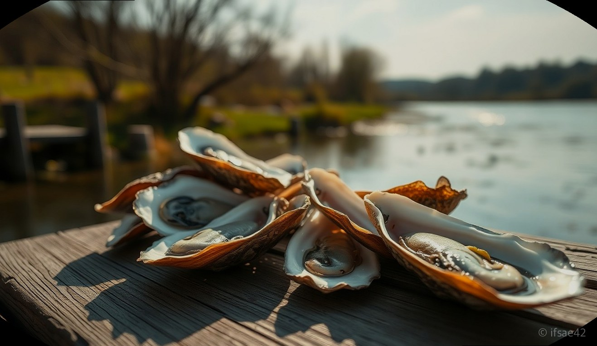
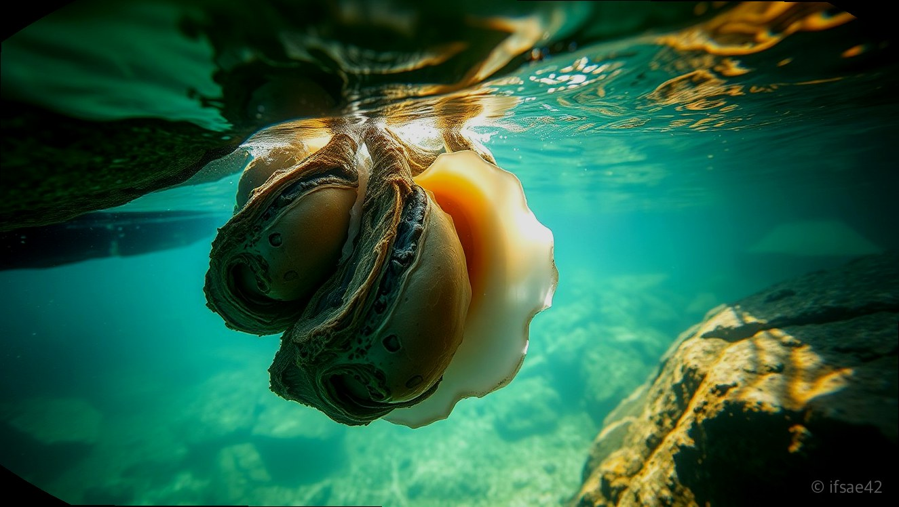
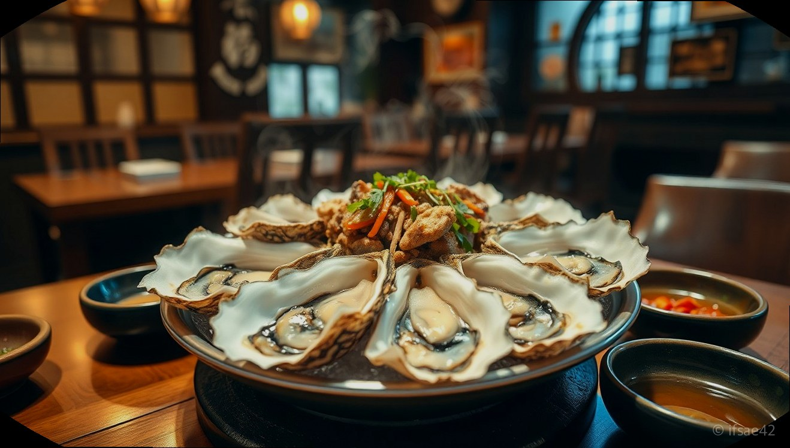

> 자동 생성 초안 · 2026-06-09

# 섬진강 벚굴 제철 가격부터 택배 주문까지 하동 화개장터 맛집 총정리

봄바람이 살랑거리기 시작하면 경남 하동과 전남 광양을 잇는 섬진강변에는 아주 특별한 제철 별미가 찾아옵니다. 바로 일반 굴보다 몇 배는 큰 압도적인 크기와 담백한 풍미를 자랑하는 '섬진강 벚굴'입니다. 봄의 전령사인 벚꽃이 필 무렵 가장 맛이 좋다고 하여 붙여진 이름인 벚굴은, 오직 이맘때만 맛볼 수 있는 귀한 식재료로 많은 미식가들의 발걸음을 하동으로 이끄는 주역입니다.

섬진강의 민물과 남해의 바닷물이 만나는 기수지역에서 자라는 벚굴은 일반 바다 굴과는 차원이 다른 깊은 맛을 냅니다. 특히 3월에서 4월 사이는 벚굴의 살이 가장 통통하게 오르고 영양가가 풍부해지는 시기입니다. 오늘은 하동 화개장터 인근 맛집 방문 팁부터 집에서 편하게 즐기는 택배 주문 방법까지, 섬진강 벚굴을 완벽하게 즐기는 모든 정보를 정리해 드립니다.

## 섬진강 벚굴의 특징과 이름의 유래

섬진강 벚굴은 강물 속 바위에 붙어 자라기 때문에 '강굴'이라고도 불립니다. 민물과 바닷물이 섞이는 기수지역의 영양분을 먹고 자라 바다 굴 특유의 비린내는 적고, 담백하면서도 은은한 단맛이 강한 것이 특징입니다. 일반 굴의 5~10배에 달하는 거대한 크기는 처음 보는 이들에게 놀라움을 선사합니다.

이 굴을 '벚굴'이라 부르는 이유는 단순히 벚꽃이 필 무렵에 가장 맛있기 때문이기도 하지만, 굴이 바위에서 자라는 모습이 마치 강물 속에 벚꽃이 하얗게 핀 것처럼 보인다는 데서 유래했습니다. 자연산으로만 채취가 가능하고 양식이 되지 않아 더욱 귀한 대접을 받는 봄철 최고의 보양식입니다.

## 하동 화개장터 맛집 방문 후기와 가격대

하동 화개장터 주변과 섬진강변을 따라가다 보면 가게 앞에 거대한 벚굴 껍데기가 산처럼 쌓여 있는 풍경을 쉽게 볼 수 있습니다. 현지 식당들은 보통 벚굴을 찜이나 구이, 그리고 신선한 회로 제공합니다.

현지 식당의 평균 가격대는 벚굴 구이와 찜을 기준으로 한 접시에 약 5만 원에서 7만 원 선으로 형성되어 있습니다. 2~3인이 방문한다면 벚굴 요리와 함께 벚굴 죽이나 칼국수를 곁들이면 든든한 한 끼 식사가 됩니다. 화개장터 인근 맛집들은 강변 뷰를 자랑하는 곳이 많아 벚꽃 축제 기간에 방문하면 아름다운 풍경과 함께 봄의 정취를 만끽할 수 있습니다.

## 벚굴 택배 주문 방법 및 신선하게 먹는 법

직접 방문이 어려운 분들을 위해 많은 현지 수산 업체에서는 산지 직송 택배 서비스를 운영하고 있습니다. 택배 주문 시에는 껍데기가 있는 상태로 배송받을지, 혹은 손질된 알굴 상태로 받을지 선택할 수 있습니다.

택배로 받은 벚굴은 신선도가 생명입니다. 수령 즉시 흐르는 물에 껍데기를 솔로 깨끗이 씻어내고, 찜기에 넣어 10분 내외로 찌는 것이 가장 맛있습니다. 너무 오래 익히면 크기가 줄어들고 식감이 질겨질 수 있으니 주의해야 합니다. 생굴로 드실 분들은 받자마자 바로 섭취하시고, 남은 굴은 밀폐 용기에 담아 냉장 보관하되 가급적 1~2일 내에 모두 드시는 것을 권장합니다.

## 화개장터 벚꽃축제와 연계한 여행 코스

3월 말에서 4월 초, 화개장터 벚꽃축제 기간에 맞춰 하동을 방문하신다면 벚굴 맛집 탐방은 필수 코스입니다. 십리벚꽃길을 따라 흐드러지게 핀 벚꽃을 감상한 뒤, 강변 식당에서 따끈한 벚굴 찜을 맛보는 일정은 하동 여행의 백미입니다.

축제 기간에는 화개장터 주변이 매우 혼잡하므로 무료 주차장 위치를 미리 확인하고 조금 서둘러 방문하는 것이 좋습니다. 섬진강변을 따라 드라이브를 즐기며 광양 쪽으로 넘어가 벚굴 전문점을 찾는 것도 현지인들이 추천하는 알짜배기 여행 팁입니다.

## 자주 묻는 질문(FAQ)

**Q1. 섬진강 벚굴은 언제 가장 맛있게 먹을 수 있나요?**
A1. 벚꽃이 피는 시기인 3월부터 4월까지가 살이 가장 통통하게 오르고 맛이 좋은 제철입니다.

**Q2. 택배로 받은 벚굴은 어떻게 보관하고 손질해야 하나요?**
A2. 수령 즉시 껍데기를 솔로 닦아내고 가급적 당일 섭취하며 남은 굴은 냉장 보관하되 2일 내에 드셔야 합니다.

**Q3. 하동 화개장터 인근에서 벚굴을 먹을 때 평균 비용은 어느 정도인가요?**
A3. 식당마다 차이가 있지만 보통 2~3인 기준 한 접시에 5만 원에서 7만 원 정도의 예산을 잡으시면 됩니다.

봄의 기운이 완연한 섬진강에서 맛보는 제철 벚굴은 잊지 못할 미식 경험을 선사할 것입니다. 이번 봄, 가족이나 연인과 함께 하동으로 떠나 벚꽃 구경도 하고 건강한 보양식인 벚굴을 즐겨보시는 건 어떨까요? 직접 방문이 어렵다면 택배로 산지의 신선함을 집 식탁 위에서 편안하게 즐겨보시길 바랍니다.

#섬진강벚굴 #하동화개장터맛집 #봄제철음식
