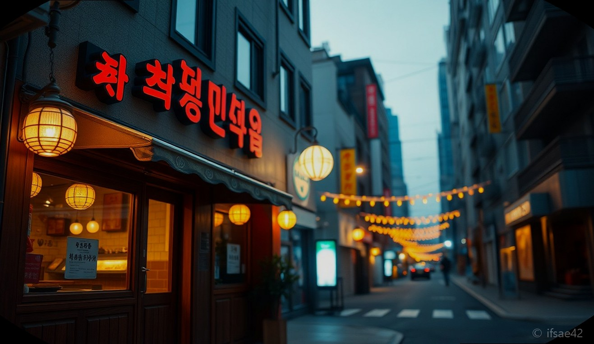
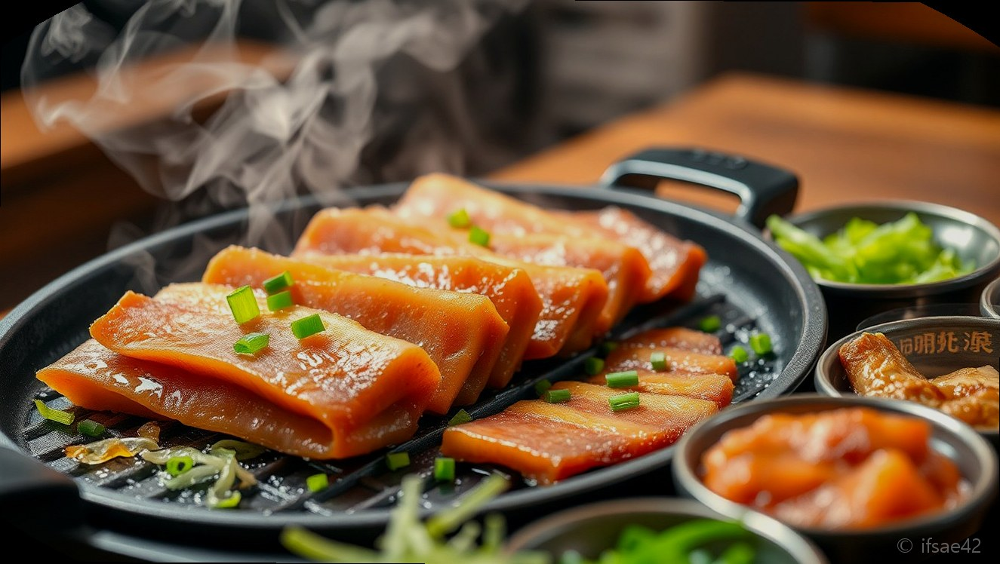
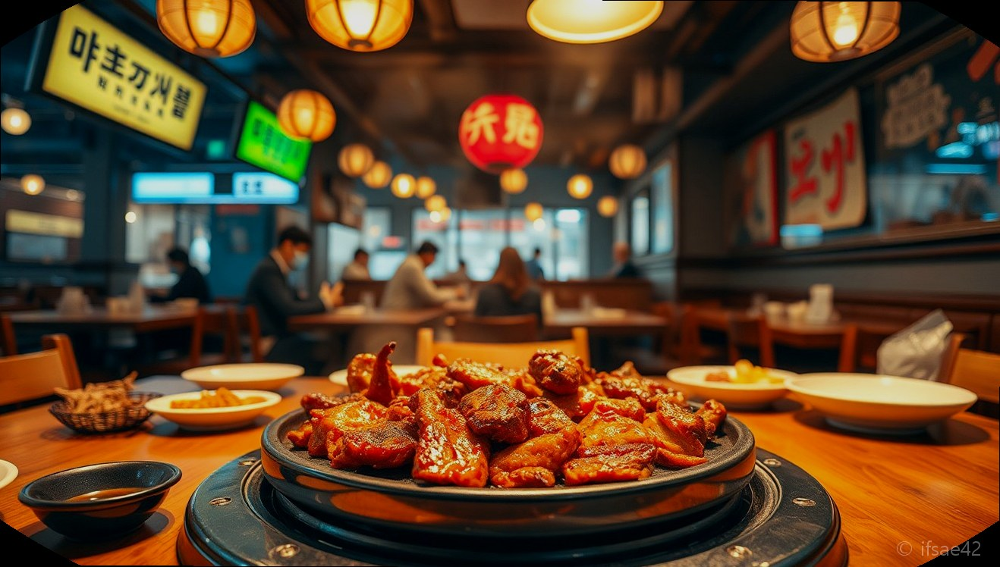

> 자동 생성 초안 · 2026-06-03

# 신방화역 맛집 추천, 현지인이 인정한 가성비 식당 빙그레식당 솔직 후기

퇴근 후 지친 몸을 이끌고 집으로 향하는 길, 유독 고소한 기름 냄새가 발길을 붙잡는 날이 있습니다. 특히 신방화역 인근은 마곡지구의 화려한 신축 건물들 사이로 숨은 보석 같은 맛집들이 즐비해 있어 퇴근길 외식 장소를 고르는 즐거움이 큰 곳인데요. 오늘은 그중에서도 레트로한 분위기와 압도적인 가성비로 현지인들의 사랑을 한 몸에 받고 있는 '빙그레식당'을 직접 다녀온 솔직한 후기를 공유해 드립니다.

신방화역 주변에서 단순히 끼니를 때우는 것이 아니라, 합리적인 가격에 질 좋은 고기를 즐기고 싶으신 분들이라면 오늘 포스팅에 주목해 주세요. 친구, 연인, 혹은 동료와 함께 부담 없이 방문하기 좋은 이곳의 매력을 꼼꼼하게 정리해 보았습니다.

## 매장 위치 및 접근성, 주차 정보 확인하기

빙그레식당은 신방화역 인근에서 접근성이 매우 좋은 곳에 위치해 있습니다. 대중교통을 이용하신다면 9호선 신방화역에서 도보로 충분히 이동 가능한 거리라 퇴근 후 약속 장소로 잡기에 최적입니다. 주변이 복잡한 마곡 상권이지만, 매장을 찾는 길은 어렵지 않아 처음 방문하시는 분들도 쉽게 찾아가실 수 있습니다.

*   **위치:** 서울특별시 강서구 마곡중앙5로 (상세 주소는 지도 앱 확인 필수)
*   **영업시간:** 매일 16:00 ~ 23:00 (라스트 오더 22:00)
*   **주차:** 건물 내 지하 주차장 이용 가능 (주차 등록 시 무료 지원)

차량을 가지고 방문하시는 분들도 건물 지하 주차장이 쾌적하게 마련되어 있어 주차 걱정 없이 방문할 수 있다는 점이 큰 장점입니다. 대중교통과 자차 이용객 모두를 배려한 위치 선정 덕분에 회식이나 모임 장소로도 손색이 없습니다.

## 대표 메뉴 맛과 가성비 분석: 왜 냉삼인가?

이곳의 대표 메뉴는 단연 급냉 삼겹살입니다. 최근 유행하는 두툼한 숙성 삼겹살과는 또 다른 매력이 있는 냉삼은, 얇게 썰어낸 고기가 불판 위에서 빠르게 익어가는 소리와 냄새만으로도 식욕을 자극합니다. 특히 빙그레식당은 고기의 질이 상당히 좋아 잡내가 전혀 없고, 함께 제공되는 밑반찬들이 고기의 풍미를 한층 더 끌어올려 줍니다.

가성비 측면에서도 매우 훌륭합니다. 1인분 가격이 합리적으로 책정되어 있어, 배불리 먹어도 지갑 걱정을 크게 하지 않아도 된다는 점이 현지인들이 이곳을 '단골집'으로 꼽는 이유입니다. 함께 나오는 파절이와 김치, 그리고 특제 소스에 고기를 곁들여 먹다 보면 어느새 2~3인분은 금방 사라지는 경험을 하시게 될 겁니다.

## 레트로 감성 가득한 분위기와 방문 추천 상황

매장 내부에 들어서면 마치 80~90년대로 돌아간 듯한 레트로한 인테리어가 눈길을 끕니다. 깔끔하고 현대적인 마곡의 식당들 사이에서 이런 정겨운 분위기는 오히려 특별한 외식 경험을 선사합니다. 

*   **데이트:** 너무 격식 차리지 않은 편안한 분위기를 선호하는 커플에게 추천합니다.
*   **회식:** 호불호 없는 냉삼 메뉴와 넓은 좌석 덕분에 팀 단위 회식 장소로도 제격입니다.
*   **혼밥:** 분위기가 편안해 고기가 당기는 날 혼자 방문해도 전혀 눈치 보이지 않는 아늑함이 있습니다.

시끌벅적한 분위기 속에서 술 한잔 기울이며 대화를 나누기에 이보다 더 좋은 장소는 없을 것 같습니다. 

## 신방화역 맛집 방문 전 체크리스트

1.  **예약 여부 확인:** 저녁 피크 타임에는 웨이팅이 발생할 수 있으니 가급적 미리 전화로 확인하거나 일찍 방문하시는 것을 권장합니다.
2.  **사이드 메뉴 조합:** 고기만 드시지 말고, 꼭 볶음밥이나 된장찌개를 함께 주문하세요. 마무리가 완벽해집니다.
3.  **주차 확인:** 결제 시 매장에 차량 번호를 말씀드려 무료 주차 혜택을 꼭 챙기세요.

## 자주 묻는 질문 (FAQ)

**Q1. 신방화역에서 도보로 얼마나 걸리나요?**
A: 역 출구에서 도보로 약 5~7분 내외로 접근성이 매우 좋습니다.

**Q2. 주말에도 웨이팅이 많은가요?**
A: 주말 저녁 시간대는 손님이 많은 편입니다. 가능하시다면 오픈 직후인 오후 5시 전후로 방문하시면 여유롭게 식사하실 수 있습니다.

**Q3. 아이와 함께 가도 괜찮을까요?**
A: 매장이 넓고 메뉴 구성이 호불호가 없어 가족 단위 외식 장소로도 충분히 추천할 만합니다.

## 총평: 재방문 의사 200%

신방화역 맛집 빙그레식당은 단순히 맛있는 고기를 파는 곳을 넘어, 퇴근 후의 고단함을 잊게 해주는 따뜻한 공간이었습니다. 가성비 좋은 가격과 변함없는 맛, 그리고 레트로한 분위기까지 삼박자가 고루 갖춰져 있어 앞으로도 고기가 생각날 때마다 가장 먼저 떠오를 것 같습니다. 마곡이나 신방화역 근처에서 실패 없는 맛집을 찾고 계신다면, 고민하지 말고 방문해 보시길 바랍니다.

#신방화역맛집 #마곡냉삼 #빙그레식당
