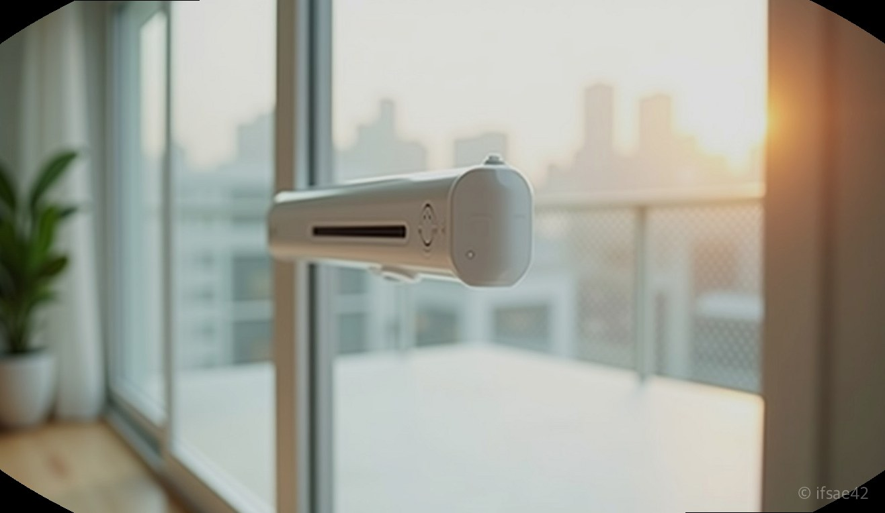
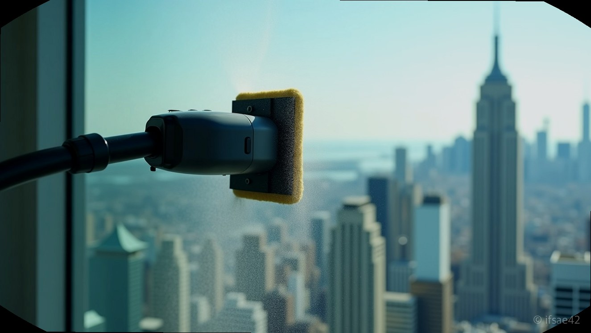
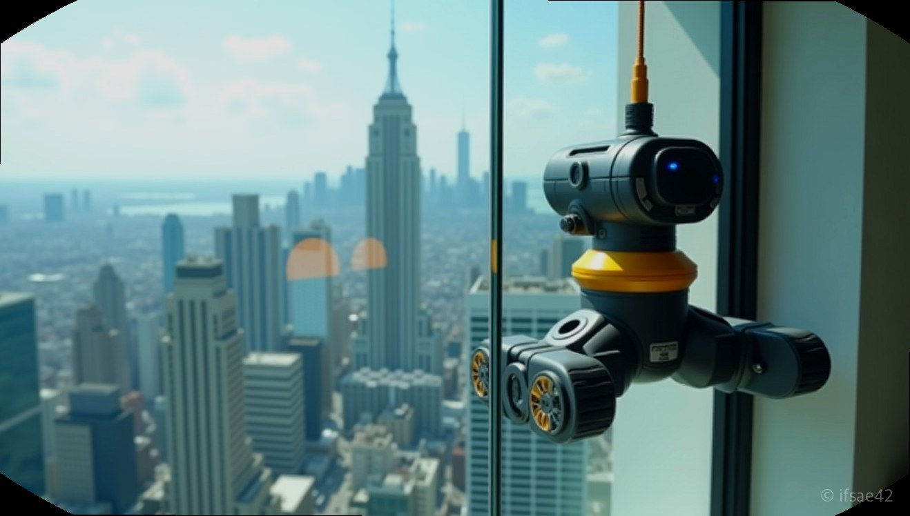

> 자동 생성 초안 · 2026-07-14

# 아이뮤즈 클링봇 3세대 내돈내산, 렌탈보다 저렴한 고층 아파트 창문 청소 꿀팁

뿌연 창문 너머로 보이는 풍경을 볼 때마다 '저거, 내가 닦을 수 있을까?' 하는 생각, 고층 아파트 사시는 분들이라면 누구나 한 번쯤 해보셨을 겁니다. 업체를 부르자니 비용이 부담스럽고, 직접 하자니 아찔한 높이 때문에 엄두가 나지 않죠. 저 역시 2년이라는 긴 시간 동안 렌탈과 구매 사이에서 고민만 거듭하다가, 결국 '아이뮤즈클링봇 3세대'를 내돈내산으로 들였습니다. 결론부터 말씀드리면, 진작 살 걸 그랬다는 후회만 남을 정도로 만족도가 높습니다.

## 가성비 따져보니 정답은 구매

창문 청소 업체에 한 번 맡길 때 드는 비용을 생각하면, 렌탈 서비스는 언뜻 합리적인 것처럼 보입니다. 하지만 1년에 서너 번만 깨끗하게 닦고 싶어도 매번 비용이 발생하죠. 제가 계산해보니, 렌탈 비용 두 번 정도만 모아도 아이뮤즈클링봇 3세대 본품을 충분히 사고도 남았습니다.

특히 아이뮤즈클링봇은 단순히 일회성 서비스가 아니라, 우리 집 창문을 원할 때마다 언제든 깨끗하게 유지할 수 있다는 점이 가장 큰 장점입니다. 한 번 사두면 온 집안의 유리창을 관리할 수 있으니, 장기적으로는 렌탈보다 압도적으로 저렴한 가성비 템인 셈이죠.

## 성능과 안전, 직접 써보니

가장 걱정했던 부분은 역시 '잘 닦일까?'와 '떨어지진 않을까?'였습니다. 막상 작동시켜 보니 기우였습니다. 제가 청소 전후를 비교해봤는데, 클링봇이 지나간 자리와 그렇지 않은 자리의 투명도 차이가 확연히 드러났습니다. 찌든 때가 층층이 쌓여있던 창문이 투명한 유리 본연의 모습을 되찾으니, 거실로 들어오는 채광 자체가 달라지더군요.

특히 3세대의 핵심은 '자동 분사 기능'입니다. 기존 제품들은 걸레를 적셔서 끼워야 하거나 중간에 물을 뿌려줘야 하는 번거로움이 있었는데, 이 모델은 알아서 미세하게 물을 분사하며 닦아주니 훨씬 효율적입니다. 고층 아파트에서 창밖으로 몸을 내밀 필요 없이, 버튼 하나로 안전하게 청소를 끝낼 수 있다는 점이 정말 큰 매력입니다.

## 세대별 차이와 선택 가이드

많은 분이 클링봇 S와 3세대 사이에서 고민하시곤 합니다. 클링봇 S도 훌륭한 입문용 기기이지만, 3세대로 넘어오면서 편의 기능이 대폭 개선되었습니다. 자동 분사 시스템의 정밀도나 소음 제어, 그리고 이동 경로 최적화 면에서 3세대가 조금 더 똑똑한 느낌입니다.

**Q1. 고층 아파트인데 사용하다가 떨어질 위험은 없나요?**
A1. 강력한 진공 흡착력과 함께 안전 로프가 포함되어 있어 안심하고 사용할 수 있습니다.

**Q2. 유리창에 물 얼룩이 남지는 않나요?**
A2. 자동 분사 기능을 활용해 적정량의 물을 사용하면 얼룩 없이 말끔하게 닦입니다.

## 구매 전 마지막 팁

마지막으로 사용 팁을 하나 드리자면, 너무 더운 여름 낮보다는 해가 조금 꺾인 시간대에 청소하시는 것을 권장합니다. 유리창 온도가 너무 높으면 분사된 물이 금방 말라버려 얼룩이 생길 수 있기 때문입니다. 또한, 청소 전 걸레를 충분히 적셔두는 것만으로도 훨씬 깔끔한 마무리 결과를 얻을 수 있습니다.

고민은 배송만 늦출 뿐이라는 말을 이번에 제대로 체감했습니다. 렌탈의 굴레에서 벗어나고 싶으신 분들, 우리 집 뷰를 다시 찾고 싶으신 분들에게 아이뮤즈클링봇 3세대는 후회 없는 선택이 될 것입니다.

#아이뮤즈클링봇 #창문청소로봇 #고층아파트청소 #살림꿀팁 #내돈내산후기
