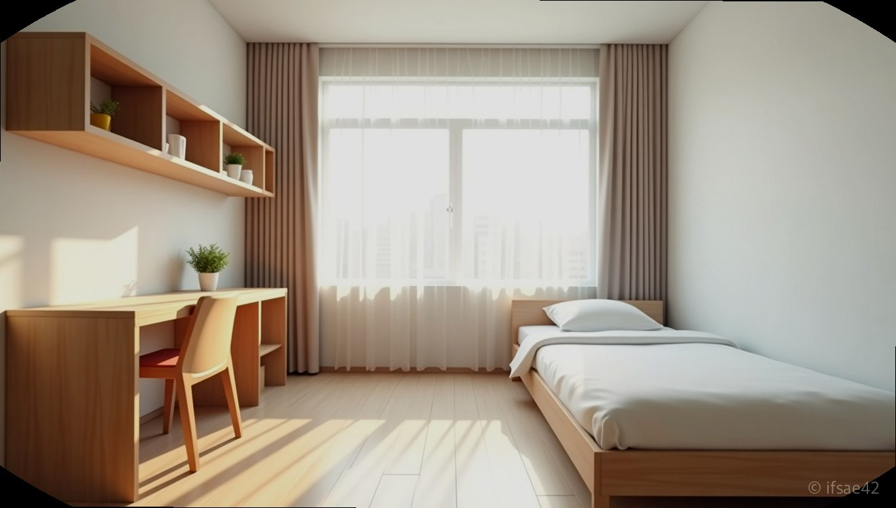

> 자동 생성 초안 · 2026-07-09

# 안성비상에듀 기숙학원 솔직 후기: 100명 소수정예 반수 성공을 위한 선택 기준

"대학 간판을 바꿀 수 있을까?" 반수를 결심한 많은 학생이 가장 먼저 던지는 질문입니다. 하지만 시간이 턱없이 부족한 반수생에게는 대형 학원의 북적이는 강의실이나 관리가 소홀한 환경은 독이 될 수 있습니다. 1학기를 보낸 뒤 다시 시작하는 만큼, 나만을 위한 밀착 관리가 절실한 시점이죠. 최근 학습 효율을 극대화할 수 있는 환경으로 입소문을 타고 있는 안성비상에듀 기숙학원을 선택해야 하는 이유를 짚어보았습니다.

## 100명 정예 밀착 관리

반수생에게 가장 필요한 것은 '방황하지 않는 시간'입니다. 수백 명의 학생이 한꺼번에 움직이는 대형 기숙학원에서는 질문 하나를 하려 해도 긴 줄을 서야 하고, 선생님의 세심한 피드백을 기대하기 어려운 경우가 많습니다.

안성비상에듀가 내세우는 핵심 전략은 바로 '100명 소수정예'입니다. 전교생이 100명으로 제한되어 있어 담임 선생님과 교과 선생님들이 학생 개개인의 취약점을 완벽하게 파악하고 있습니다. 단순히 강의를 듣는 것에 그치지 않고, 매일 무엇을 공부했는지, 어떤 부분이 막히는지 실시간으로 확인하는 밀착 관리 시스템이 가동됩니다. 실제로 재원생들은 "선생님들이 내 이름을 부르며 학습 상태를 체크해주니 딴짓할 틈이 없다"고 입을 모읍니다. 이러한 촘촘한 관리는 공부 습관이 무너지기 쉬운 반수생들에게 강력한 학습 동력이 됩니다.

## 쾌적한 시설과 접근성

공부도 환경이 뒷받침되어야 합니다. 특히 기숙학원은 24시간 생활하는 공간이기에 시설의 질이 곧 학습 컨디션으로 직결됩니다. 안성비상에듀는 호텔급 숙식 환경을 제공하는 것으로 유명합니다. 깔끔한 1인실 혹은 2인실 위주의 숙소와 쾌적한 학습 공간은 반수 기간 동안 학생이 겪을 수 있는 피로감을 최소화해 줍니다.

지리적 이점 또한 빼놓을 수 없습니다. 서울 강남에서 한 시간이면 닿을 수 있는 거리에 위치해 있어 수도권 학생들의 접근성이 매우 뛰어납니다. 천안이나 청주 등 인근 지역에서도 통학이 아닌 입소를 통해 학습에만 온전히 집중하러 오는 학생들이 많습니다. 서울과 가까우면서도 도심의 유혹으로부터 완벽하게 격리된 안성의 지리적 위치는, 오직 수능 점수 향상이라는 단 하나의 목표를 향해 달리는 학생들에게 최적의 베이스캠프가 되어줍니다.

## 반수생 맞춤형 전략

반수생은 재수생과 다릅니다. 기초 개념부터 다시 시작하기에는 시간이 부족하고, 그렇다고 실전 문제만 풀기에는 구멍이 많습니다. 안성비상에듀는 이런 반수생들의 특수성을 고려해 '학습 터닝포인트' 전략을 운영합니다.

짧은 시간 내에 등급을 올리기 위해서는 자신의 약점을 정확히 타격하는 맞춤 커리큘럼이 필수입니다. 이곳은 입소 직후 개별 상담을 통해 학습 수준을 정밀하게 진단하고, 필요한 과목에 집중할 수 있는 개인별 시간표를 구성합니다. 수학에 강점을 보이는 학원답게, 취약 과목인 수학에서 확실한 점수를 따낼 수 있도록 수준별 소그룹 수업이 진행됩니다.

혼자 공부하다 보면 분명 방향을 잃는 순간이 옵니다. 그럴 때마다 전문가의 조언을 즉각적으로 받을 수 있고, 나를 지켜보는 선생님들이 있다는 사실만으로도 학습 집중도는 완전히 달라집니다. "학원에 온 뒤로 멍하니 앉아 있는 시간이 사라졌다"는 후기는 이곳이 단순히 공간만 빌려주는 곳이 아니라, 실질적인 성적 향상을 이끄는 코칭 학원임을 증명합니다.

진정한 반수 성공을 원하신다면, 단순히 유명세만 쫓지 마십시오. 나를 얼마나 밀착해서 케어해 줄 수 있는지, 내가 공부에만 집중할 수 있는 환경인지 냉정하게 판단해야 합니다. 안성비상에듀는 소수정예의 장점을 살려 여러분의 남은 반년이 헛되지 않도록 최선을 다해 지원할 것입니다. 지금 바로 공식 홈페이지를 통해 상담을 예약하고, 여러분의 수능 성적을 바꿀 터닝포인트를 직접 확인해 보시기 바랍니다.

#안성비상에듀 #기숙학원추천 #반수성공
