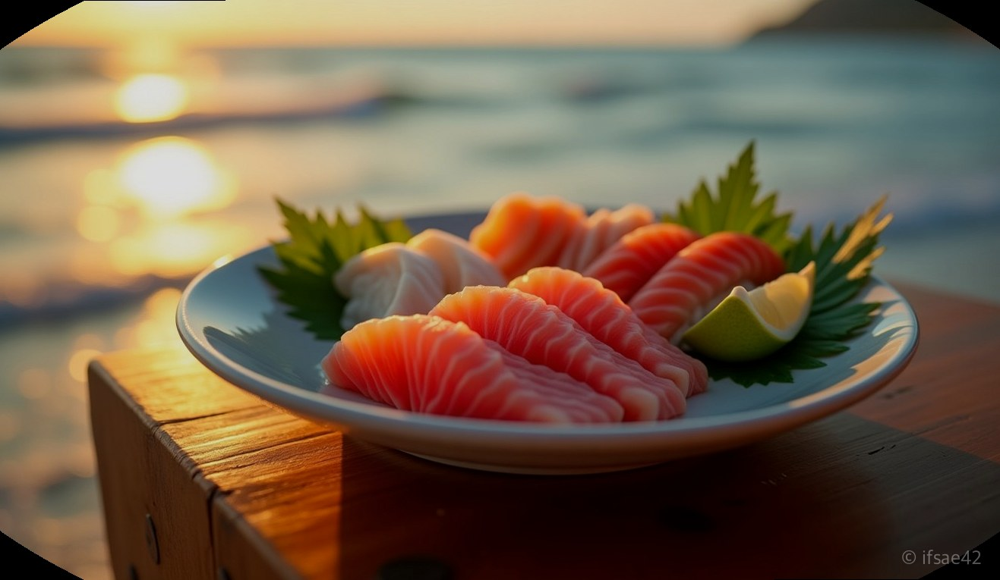
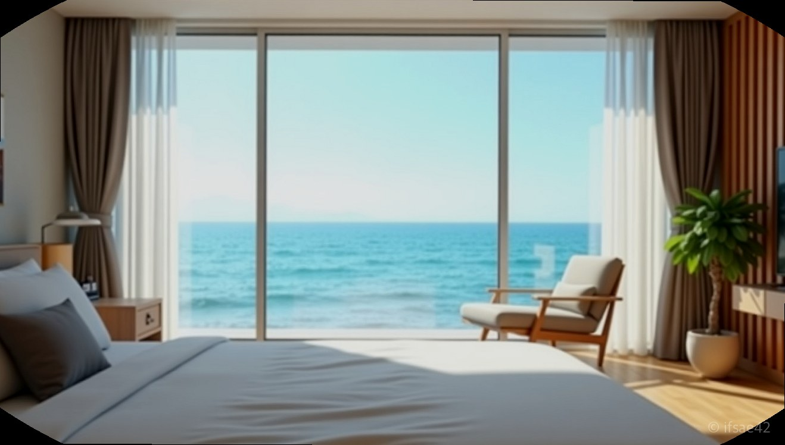

> 자동 생성 초안 · 2026-07-10

# 양양 삼팔횟집 숙박 패키지 내돈내산 후기, 예약 성공 꿀팁과 솔직 장단점 정리

양양 여행을 계획할 때 가장 큰 고민은 역시 '숙소와 저녁 식사'입니다. 특히 바닷가 근처에서 술 한잔 곁들인 회를 먹고 나면 운전 걱정 없이 바로 쉴 수 있는 곳이 간절해지죠. 이런 니즈를 완벽하게 충족시켜 주는 곳이 바로 양양삼팔횟집입니다. 수많은 여행객이 예약 경쟁에 뛰어드는 이유, 그리고 직접 경험해 본 내돈내산 후기를 지금부터 솔직하게 풀어보겠습니다.

## 예약 성공을 위한 꿀팁

양양삼팔횟집 패키지는 '전화 연결'이 전부라고 해도 과언이 아닙니다. 온라인 예약 시스템이 따로 없기에, 오로지 사장님과의 통화로만 예약이 가능한데요. 성수기나 주말에는 수십 통을 걸어도 신호음만 가기 일쑤입니다.

가장 좋은 방법은 오전 10시부터 오후 6시 사이, 브레이크 타임을 피해서 집중적으로 공략하는 것입니다. 한 번에 연결되길 기대하기보다는, 통화 중일 때 재다이얼 기능을 활용해 끊임없이 시도하는 인내심이 필요합니다. 연결된 후에는 인원수와 원하는 날짜를 확실히 말씀하시고, 패키지 구성(회+숙박) 여부를 명확히 확인받으시길 바랍니다. 포기하지 않고 50~60번 정도 시도하면 대부분 연결된다는 후기가 많으니, 희망을 잃지 마세요.

## 숙소 컨디션과 솔직 평가

패키지로 제공되는 숙소인 '삼팔파크'에 대해 미리 알고 가셔야 할 점이 있습니다. 결론부터 말씀드리면, 현대적인 호텔이나 감성 숙소를 기대하신다면 실망하실 수 있습니다.

건물 자체는 연식이 꽤 느껴지는 편입니다. 로비에 들어섰을 때 화려한 인테리어를 기대하기는 어렵고, 시설 전반에서 세월의 흔적이 묻어납니다. 하지만 청소 상태는 깔끔하게 관리되고 있어 하룻밤 머물기에는 전혀 부족함이 없습니다. 무엇보다 큰 장점은 횟집과의 접근성입니다. 배부르게 회를 먹고 바로 숙소로 걸어 들어갈 수 있다는 동선의 편리함은 이런 사소한 단점들을 모두 덮어버릴 만큼 강력합니다. 가성비를 중시하는 가족 단위 여행객에게는 이보다 더 좋은 선택지가 없다는 생각이 듭니다.

## 횟집의 맛과 패키지 구성

삼팔횟집의 핵심은 역시 압도적인 스끼다시입니다. 테이블이 부족할 정도로 깔끔하게 차려지는 밑반찬들은 하나하나 젓가락이 갈 만큼 퀄리티가 높습니다. 신선한 자연산 회는 쫄깃한 식감이 일품이며, 바닷가에서 먹는 회 특유의 신선함이 입안 가득 느껴집니다.

패키지를 이용하면 비용적인 측면에서도 큰 이점이 있습니다. 따로 숙소를 잡고 식당을 찾아 헤매는 번거로움을 줄일 수 있을 뿐만 아니라, 전체적인 여행 경비를 계산해 봐도 훨씬 경제적입니다. 특히 성수기 양양의 높은 숙박료를 고려하면, 패키지 구성은 그야말로 '혜자'로운 선택이라고 볼 수 있습니다. 회를 다 먹고 난 뒤 매운탕까지 코스로 즐기다 보면, 왜 이곳이 부모님 세대부터 입소문이 났는지 금방 이해하게 됩니다.

## 여행 코스 추천

숙소에서 도보권으로 이동 가능한 기사문해변은 아침 산책 코스로 제격입니다. 사람이 너무 붐비지 않으면서도 탁 트인 바다를 볼 수 있어 조용한 힐링이 가능합니다. 차로 조금만 이동하면 도착하는 휴휴암은 바다를 바라보며 마음을 차분하게 정리할 수 있는 명소이니, 체크아웃 후에 꼭 들러보시길 권장합니다.

**Q1. 숙박 패키지 예약 시 특실과 일반실의 차이는 무엇인가요?**
A1. 인원수에 따른 방 크기 차이가 크며, 특실은 가족 단위가 머물기에 충분히 넓지만 기본적으로 연식은 비슷합니다.
**Q2. 체크인 시간은 언제인가요?**
A2. 보통 오후 4시부터 입실이 가능하며, 구체적인 시간은 예약 시 사장님께 다시 한번 확인하는 것이 정확합니다.
**Q3. 주차 공간은 넉넉한 편인가요?**
A3. 횟집과 숙소 인근에 주차 공간이 마련되어 있으나, 성수기에는 다소 혼잡할 수 있으니 가급적 일찍 도착하시는 것이 좋습니다.

양양삼팔횟집 패키지는 세련된 인테리어보다는 '맛'과 '편리함'이라는 여행의 본질에 집중한 곳입니다. 화려한 시설보다는 실속 있는 여행을 원하신다면, 이번 휴가 때는 이곳에서의 하룻밤을 고민해 보시는 건 어떨까요? 여러분이 경험한 양양의 가장 맛있는 기억은 무엇인가요?

#양양삼팔횟집 #양양숙박패키지 #강원도여행추천
