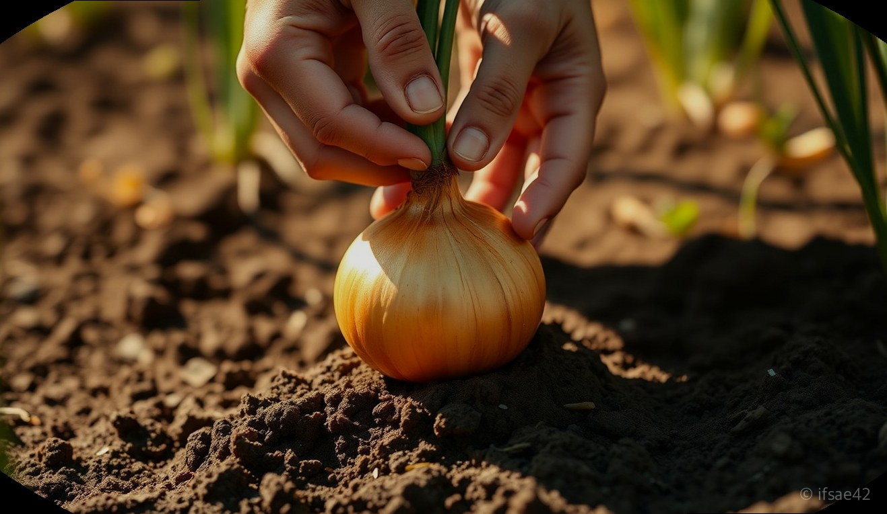
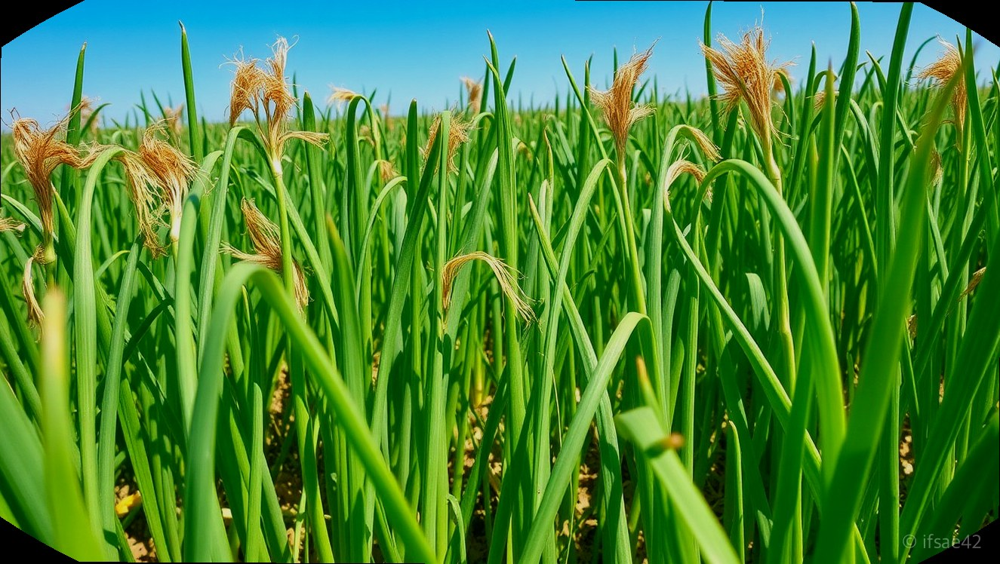
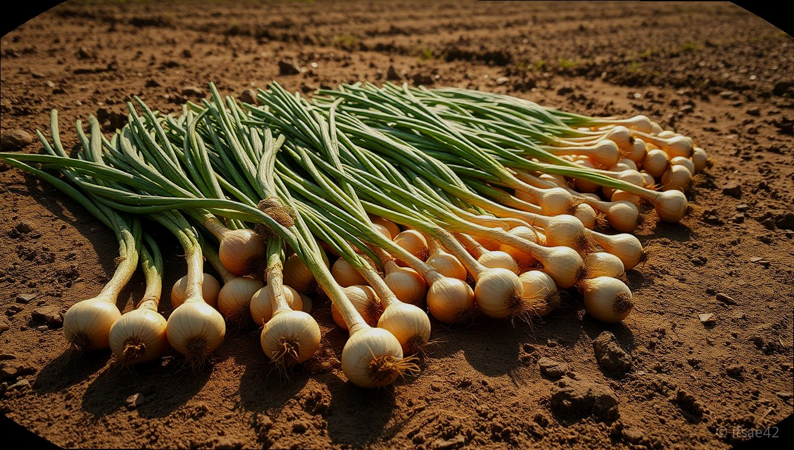

> 자동 생성 초안 · 2026-06-09

# 양파 캐는 시기 완벽 정리! 줄기 쓰러짐 확인법과 햇양파 보관 꿀팁까지

정성껏 가꾼 텃밭에서 가장 설레는 순간 중 하나가 바로 수확의 기쁨을 누리는 때입니다. 특히 우리 식탁에서 절대 빠질 수 없는 식재료인 양파는 수확 시기만 잘 맞춰도 일 년 내내 맛있는 햇양파를 즐길 수 있습니다. 많은 분이 막연히 6월쯤이면 수확해야 한다고 생각하시지만, 정확한 타이밍을 놓치면 양파가 너무 무르거나 저장성이 떨어져 금방 썩어버릴 수 있습니다.

오늘은 초보 농부님들도 실패 없이 따라 할 수 있는 양파 캐는 시기 판단법부터, 수확 후 가장 중요한 건조 과정, 그리고 오래 두고 먹을 수 있는 보관법까지 상세히 정리해 드립니다. 맛과 영양을 모두 잡는 양파 수확의 핵심 노하우를 지금 바로 확인해 보세요.

## 양파 수확 적기 판단법: 줄기와 껍질을 확인하세요

양파 캐는 시기를 결정하는 가장 확실한 기준은 바로 양파 줄기의 상태입니다. 일반적으로 양파를 심은 후 약 7~8개월이 지나 6월 초중순이 되면 양파 줄기가 스스로 힘을 잃고 옆으로 쓰러지기 시작합니다. 이때 밭 전체의 양파 줄기가 70~80% 정도 자연스럽게 쓰러졌을 때가 바로 수확의 적기입니다. 줄기가 완전히 마르기를 기다리다가 너무 늦어지면 양파가 흙 속에서 다시 자라거나 병해충에 노출될 위험이 커지니 주의해야 합니다.

또한, 시각적으로 확인할 수 있는 확실한 방법은 양파의 겉껍질 색깔입니다. 수확할 때가 다가오면 양파의 겉껍질이 얇아지면서 선명한 갈색으로 변하기 시작합니다. 흙을 살짝 파보았을 때 양파 윗부분이 갈색 빛을 띠며 단단하게 형성되어 있다면 수확할 준비가 되었다는 신호입니다. 줄기가 쓰러진 뒤 약 3~5일 정도 지나 껍질이 잘 형성되었을 때 캐는 것이 가장 이상적입니다.

## 양파 캐는 방법 및 주의사항

양파를 캘 때는 상처가 나지 않도록 주의하는 것이 무엇보다 중요합니다. 양파는 껍질이 얇아 호미나 삽으로 찍히면 그 상처를 통해 균이 침투하여 저장 중에 쉽게 썩어버립니다. 따라서 양파 주변의 흙을 충분히 파낸 뒤, 줄기를 잡고 가볍게 들어 올리는 방식으로 수확해야 합니다.

가급적이면 비가 오지 않는 맑은 날을 택해 수확하십시오. 땅이 젖어 있을 때 캐면 양파에 흙이 많이 묻고 습기를 머금게 되어 건조 과정이 길어지며, 이는 곧 부패의 원인이 됩니다. 수확한 양파는 밭에서 바로 줄기를 자르지 말고, 그대로 2~3일 정도 밭에 널어두어 겉면을 1차적으로 말려주는 것이 좋습니다. 이 과정을 통해 양파의 수분이 어느 정도 빠져나가야 나중에 보관할 때 훨씬 오랫동안 신선함을 유지할 수 있습니다.

## 수확 후 건조와 장기 보관 꿀팁

양파 보관의 성패는 바로 '말리기'에 달려 있습니다. 밭에서 1차 건조를 마친 양파는 줄기를 5~10cm 정도 남기고 가위로 깔끔하게 자릅니다. 이때 줄기를 너무 짧게 자르면 단면을 통해 세균이 침투할 수 있으니 적당한 길이를 남기는 것이 포인트입니다.

그다음은 통풍이 잘되는 그늘진 곳에서 2주 정도 충분히 건조해야 합니다. 습기가 많은 곳은 피하고 바람이 잘 통하는 서늘한 곳에 펼쳐두세요. 완전히 건조된 양파는 양파 망에 담아 보관하는 것이 가장 좋습니다. 비닐봉지에 담아 밀봉하면 습기가 차서 금방 무르기 때문에 반드시 통풍이 원활한 망 형태를 권장합니다. 만약 양파 양이 많다면 서로 닿지 않게 매달아 두는 것도 좋은 방법입니다.

### 수확 전후 체크리스트
- [ ] 밭 전체 양파 줄기가 70~80% 정도 쓰러졌는가?
- [ ] 겉껍질이 갈색으로 변하며 단단해졌는가?
- [ ] 비가 오지 않는 맑은 날을 선택했는가?
- [ ] 수확 후 밭에서 2~3일간 충분히 말렸는가?
- [ ] 통풍이 잘되는 서늘한 곳에 망을 이용해 보관하는가?

### FAQ
**Q1. 양파 줄기가 다 쓰러지기 전에 미리 캐면 안 되나요?**
A1. 줄기가 다 쓰러지기 전에 캐면 양파의 비대가 덜 이루어져 크기가 작고 저장성이 현저히 떨어지므로 권장하지 않습니다.
**Q2. 양파를 보관할 때 냉장고에 넣어도 되나요?**
A2. 습기가 많은 냉장고는 양파가 금방 무르게 만들므로 통풍이 잘되는 서늘한 실온에 보관하는 것이 가장 좋습니다.
**Q3. 양파 줄기를 바짝 잘라야 하나요?**
A3. 줄기를 너무 짧게 자르면 절단면으로 병균이 침투해 썩을 수 있으니 5~10cm 정도 남기고 자르는 것이 안전합니다.

양파는 수확하는 과정보다 수확 후 말리는 과정이 더 중요합니다. 오늘 알려드린 수확 시기와 건조법을 잘 지키셔서 올여름, 직접 키운 건강하고 맛있는 햇양파를 오랫동안 즐겨보시길 바랍니다. 텃밭 농사의 마지막 결실인 만큼 꼼꼼하게 마무리하여 풍성한 수확의 기쁨을 누리시길 응원합니다.

#양파캐는시기 #햇양파보관법 #텃밭가꾸기
