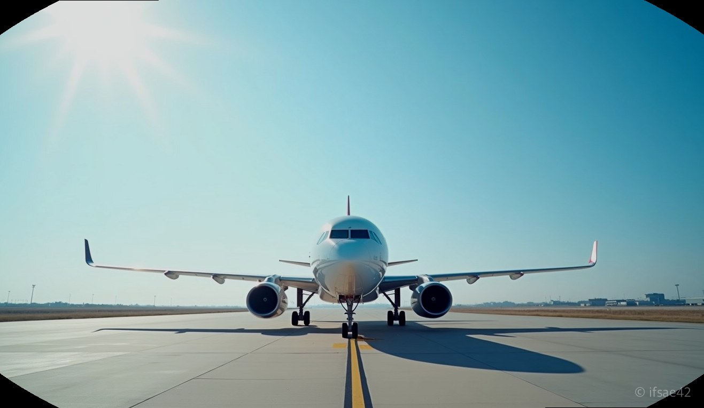
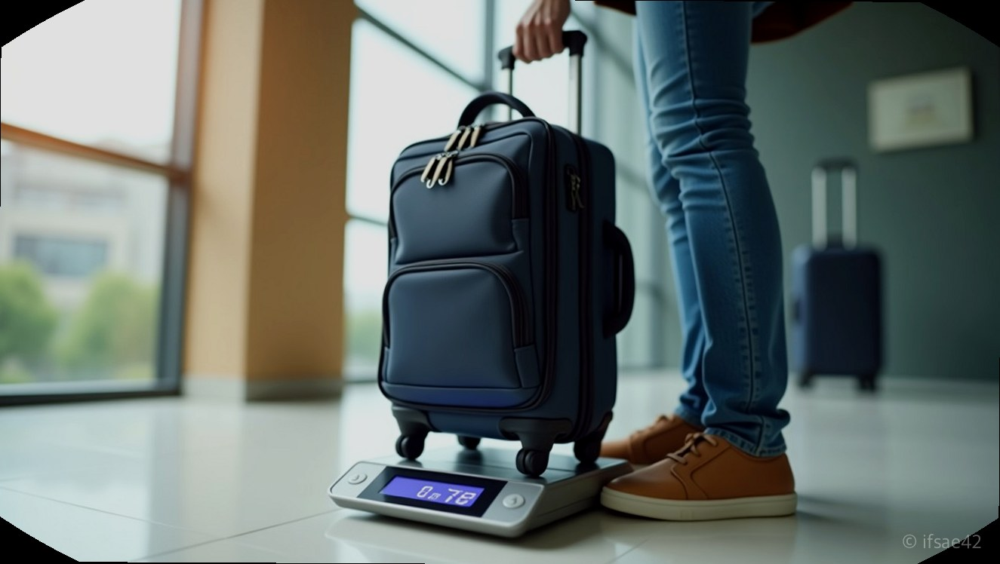

> 자동 생성 초안 · 2026-07-14

# 에어로케이 수화물 규정 총정리: 기내 10kg 제한과 위탁 추가 비용 아끼는 꿀팁

설레는 마음으로 공항에 도착했는데, 수화물 무게 규정에 걸려 당황하며 짐을 다시 싸는 모습. 상상만 해도 여행의 시작이 꼬이는 기분일 것입니다. 특히 합리적인 가격으로 인기를 끌고 있는 에어로케이 항공을 이용할 때, 수화물 규정을 미리 숙지하지 않으면 공항 현장에서 생각지도 못한 추가 비용을 지불해야 할 수도 있습니다. 쾌적한 여행을 위해 꼭 알아두어야 할 에어로케이 수화물 핵심 가이드를 정리해 드립니다.

## 기내 반입 규정 10kg
에어로케이 기내 수화물은 운임 종류와 상관없이 누구에게나 동일하게 적용됩니다. 무게는 10kg 이내이며, 규격은 가로 55cm, 세로 40cm, 높이 20cm를 넘지 않아야 합니다. 여기서 주의할 점은 개수입니다. 기내에는 1개의 휴대 수화물과 함께 노트북 가방, 작은 핸드백, 혹은 면세품 쇼핑백 중 1개를 추가로 들고 탈 수 있습니다.

많은 분이 실수하는 부분이 바로 무게 측정입니다. 기내용 캐리어뿐만 아니라 본인이 어깨에 멘 백팩이나 크로스백의 무게까지 합산하여 10kg을 초과하지 않는지 확인해야 합니다. 만약 게이트 앞에서 무게를 측정했을 때 10kg을 넘긴다면 현장에서 위탁 수화물로 부쳐야 하며, 이때는 규정에 따른 추가 요금이 발생하므로 미리 집에서 무게를 체크하는 습관이 중요합니다.

## 위탁 수화물 운임 체크
위탁 수화물은 구매하신 운임 등급에 따라 혜택이 천차만별입니다. 에어로케이의 특가 운임 상품을 선택했다면 무료 수화물이 포함되어 있지 않을 가능성이 큽니다. 반면, 스마트나 일반 운임 등급의 항공권에는 일정 무게의 무료 수화물이 포함되어 있습니다.

따라서 항공권을 예매할 때 본인의 짐이 대략 어느 정도인지 가늠해보는 것이 좋습니다. 만약 짐이 많을 것으로 예상된다면, 출발 당일 공항에서 결제하는 것보다 항공권 예매 시점에 미리 수화물을 추가하는 것이 훨씬 경제적입니다. 현장 결제는 사전 구매보다 가격이 높게 책정되어 있으니, 여행 예산을 아끼고 싶다면 예매 단계에서부터 수화물 옵션을 꼼꼼히 살피시기 바랍니다.

## 청주공항 스마트 체크인
청주공항을 거점으로 하는 에어로케이를 이용하신다면, 셀프 체크인 키오스크 활용은 필수입니다. 공항에 도착하자마자 키오스크를 통해 탑승권을 발권하고, 위탁 수화물이 있다면 체크인 카운터나 전용 수화물 카운터를 방문하여 짐을 부치면 됩니다.

셀프 발권을 미리 진행하면 대기 시간을 획기적으로 줄일 수 있습니다. 특히 주말이나 성수기에는 창구 대기 줄이 길게 늘어설 수 있는데, 사전에 모바일 체크인이나 키오스크를 이용하면 여유롭게 출국장으로 향할 수 있습니다. 짐을 맡길 때는 액체류나 보조배터리, 라이터 등이 위탁 수화물에 포함되지 않았는지 다시 한번 확인하는 센스가 필요합니다.

**[에어로케이 수화물 체크리스트]**
- [ ] 기내 수화물은 10kg 이내, 크기는 55x40x20cm 이하인지 확인했나요?
- [ ] 본인이 구매한 운임 등급에 무료 위탁 수화물이 포함되어 있는지 확인했나요?
- [ ] 짐이 많다면 현장 결제 대신 홈페이지에서 사전 구매를 완료했나요?
- [ ] 위탁 수화물에 보조배터리나 전자담배가 들어있지는 않은가요?

여행의 시작과 끝을 책임지는 수화물 관리는 조금만 신경 써도 비용과 시간을 모두 절약할 수 있는 부분입니다. 에어로케이의 명확한 규정을 바탕으로 꼼꼼히 준비하셔서, 공항에서의 번거로움 없이 즐거운 비행 시작하시길 바랍니다.

#에어로케이수화물 #에어로케이 #청주공항 #기내수화물규정 #여행꿀팁
