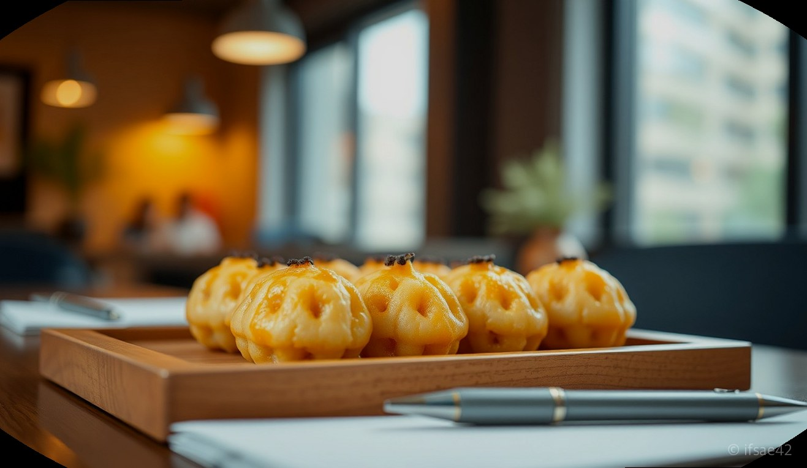
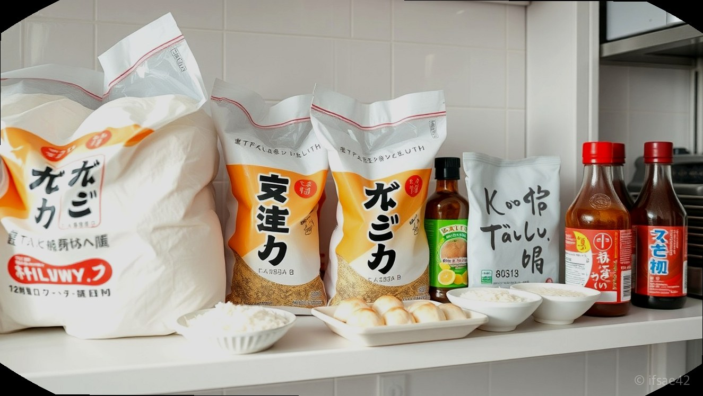
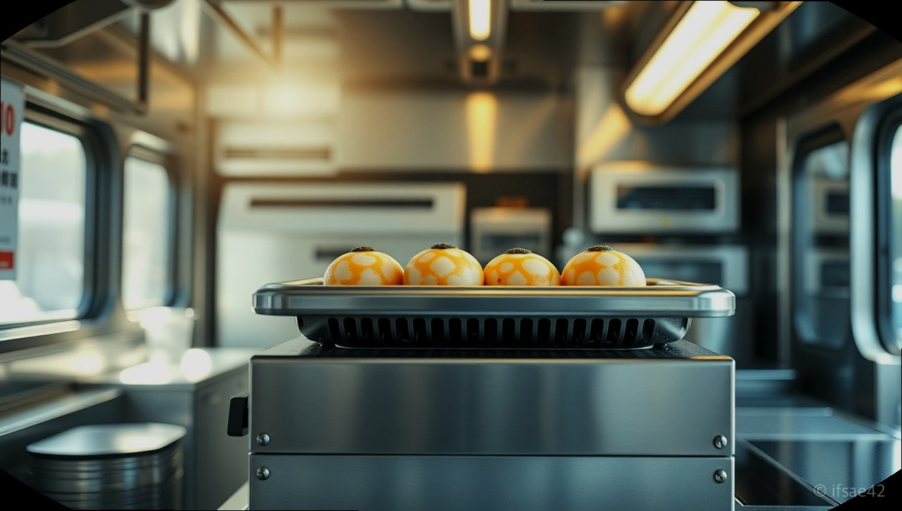

> 자동 생성 초안 · 2026-06-04

# 타코야끼 창업 준비, 엠제이푸드몰에서 원가율 분석부터 업소용 재료까지 한 번에 해결하기

최근 소자본 창업에 대한 관심이 높아지면서, 적은 평수에서도 높은 효율을 낼 수 있는 타코야끼 전문점이 큰 주목을 받고 있습니다. 타코야끼는 남녀노소 누구나 좋아하는 간식일 뿐만 아니라, 회전율이 빠르고 운영 방식이 비교적 단순하여 초보 창업자분들도 도전하기 좋은 아이템입니다. 하지만 막상 시작하려고 하면 어디서부터 재료를 수급해야 할지, 기기는 어떤 것을 선택해야 할지 막막한 경우가 많습니다.

성공적인 창업을 위해서는 단순히 맛있는 레시피를 개발하는 것을 넘어, 안정적인 재료 공급처를 확보하고 철저한 원가 분석을 통해 수익 구조를 만드는 것이 핵심입니다. 오늘은 타코야끼 창업의 든든한 파트너인 엠제이푸드몰을 중심으로, 창업 준비 과정에서 반드시 체크해야 할 요소들을 상세히 살펴보겠습니다.

## 타코야끼 창업의 핵심, 원가율 분석과 재료 선택의 중요성

타코야끼 창업에서 수익을 결정짓는 가장 중요한 지표는 바로 '원가율'입니다. 아무리 매출이 높아도 재료비 비중이 높으면 실제 손에 쥐는 순이익은 줄어들 수밖에 없습니다. 2024년 3월 기준 엠제이푸드몰의 재료 단가를 활용해 분석해 보면, 타코야끼 파우더 3kg 한 봉지를 기준으로 했을 때 전체적인 원가율을 합리적으로 관리할 수 있는 가이드라인이 나옵니다.

엠제이푸드몰은 타코야끼 전문 쇼핑몰로서 업소용 대용량 파우더부터 가쓰오부시, 텐카스, 타코야끼 소스 등 필수 식자재를 최적의 가격으로 제공합니다. 특히 업소용 재료는 품질의 일관성이 매우 중요한데, 엠제이푸드몰은 검증된 품질의 제품만을 취급하여 고객들에게 항상 균일한 맛을 제공할 수 있도록 돕습니다. 가정용으로 소량 구매하는 것보다 업소용 대용량 제품을 체계적으로 수급하는 것이 원가 절감의 첫걸음임을 명심하시기 바랍니다.

## 기기 선택부터 스낵카 제작까지, 원스톱 창업 솔루션

타코야끼는 기기의 성능이 결과물의 퀄리티를 좌우합니다. 열전도율이 일정하고 내구성이 뛰어난 업소용 타코야끼 기기는 장기적인 운영을 위해 필수적인 투자입니다. 엠제이푸드몰에서는 다양한 규격의 타코야끼 기기를 구비하고 있어, 매장의 규모와 예상 판매량에 맞춰 최적의 장비를 선택할 수 있습니다.

또한, 최근 트렌드인 푸드트럭이나 스낵카 창업을 고려하시는 분들을 위해 엠제이푸드몰은 단순 재료 공급을 넘어 창업 상담 및 스낵카 제작 지원 서비스도 운영하고 있습니다. 이동식 매장은 입지 선정의 유연성이 크다는 장점이 있지만, 설비 배치와 위생 관리 등 고려할 점이 많습니다. 엠제이푸드몰의 전문적인 컨설팅을 활용한다면 시행착오를 줄이고 빠르게 안정적인 매출 궤도에 진입할 수 있습니다.

## 성공적인 타코야끼 창업을 위한 체크리스트

1. 예상 상권 내 타코야끼 수요와 경쟁점 분석을 마쳤습니까?
2. 엠제이푸드몰을 통해 업소용 재료의 단가를 확인하고 원가율 계산을 완료했습니까?
3. 매장의 평수와 예상 판매량에 적합한 업소용 타코야끼 기기를 선정했습니까?
4. 초기 물품 수급 계획과 정기적인 재료 배송 시스템을 구축했습니까?
5. 푸드트럭이나 스낵카 창업을 원한다면 전문가와 제작 상담을 진행했습니까?

## 자주 묻는 질문(FAQ)

**Q1. 타코야끼 창업 시 엠제이푸드몰을 이용하면 어떤 장점이 있나요?**
A1. 엠제이푸드몰은 타코야끼 전문 쇼핑몰로서 업소용 재료부터 기기까지 창업에 필요한 모든 것을 원스톱으로 제공하며 안정적인 품질 관리와 합리적인 원가율 분석을 지원합니다.

**Q2. 가정용 재료와 업소용 재료의 가장 큰 차이점은 무엇인가요?**
A2. 업소용 재료는 대량 조리에 최적화된 용량과 일정한 맛을 유지하도록 설계되어 있으며, 원가 절감 측면에서 대량 구매 시 훨씬 경제적입니다.

**Q3. 스낵카나 푸드트럭 창업 상담은 어떻게 진행되나요?**
A3. 엠제이푸드몰 고객센터나 홈페이지를 통해 문의하시면 매장 운영 형태에 맞춘 설비 구성과 스낵카 제작 전반에 대한 전문적인 상담을 받아보실 수 있습니다.

지금 바로 타코야끼 창업을 준비하고 계신다면, 신뢰할 수 있는 파트너 엠제이푸드몰에서 첫 단추를 끼워보시기 바랍니다. 체계적인 재료 공급과 전문적인 상담이 여러분의 성공적인 창업을 앞당겨 줄 것입니다. 자세한 상품 정보와 창업 상담은 아래 링크에서 확인하실 수 있습니다.

[엠제이푸드몰 바로가기](https://www.mj-foodmall.co.kr/shop/)

#타코야끼창업 #엠제이푸드몰 #소자본창업
