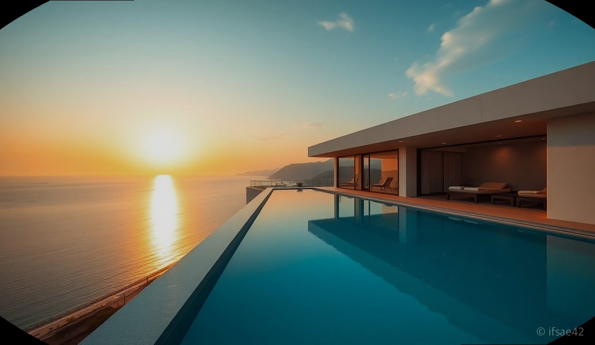
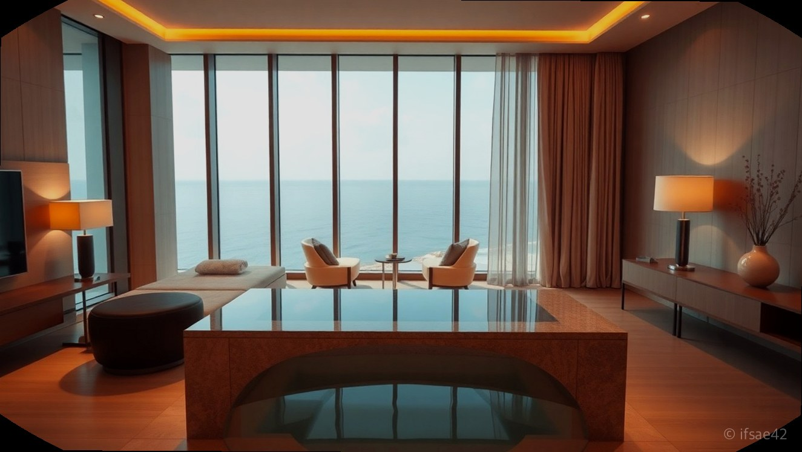
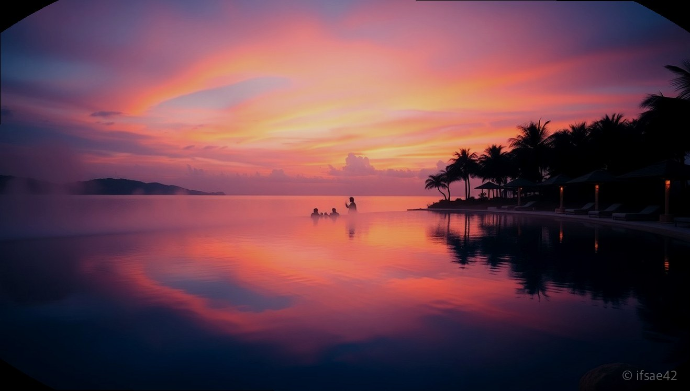

> 자동 생성 초안 · 2026-06-09

# 여수 블루망고 풀빌라 내돈내산 후기: 온수풀 수영장부터 객실 타입별 비교 정리

여수로 떠나는 여행을 계획할 때 가장 고민되는 것이 바로 숙소입니다. 특히 바다를 바라보며 물놀이를 즐길 수 있는 풀빌라는 여행의 질을 결정짓는 핵심 요소인데요. 오늘은 여수 여행의 로망을 완벽하게 실현해 줄 여수블루망고풀빌라를 직접 다녀온 생생한 후기를 공유해 드립니다. 전남 여수시 돌산읍 계동해안길 90에 위치한 이곳은 압도적인 오션뷰와 사계절 이용 가능한 온수풀로 이미 많은 여행객에게 검증된 명소입니다.

체크인 시간은 오후 3시, 체크아웃은 오전 11시로 운영되고 있습니다. 성수기에는 예약 마감이 매우 빠른 편이니 방문 계획이 있으시다면 최소 한 달 전에는 예약을 서두르시는 것을 추천합니다. 리조트 내부에 편의점과 레스토랑 등 편의시설이 잘 갖춰져 있어 외부로 나갈 필요 없이 숙소 안에서 모든 것을 해결할 수 있다는 점이 큰 장점입니다. 지금부터 객실 타입부터 수영장 이용 꿀팁까지 꼼꼼하게 정리해 드리겠습니다.

## 객실 타입별 특징 및 추천 대상

여수블루망고풀빌라는 여행 목적에 따라 선택할 수 있는 다양한 객실 타입을 보유하고 있습니다. 먼저 커플 여행객에게는 프라이빗한 스파가 포함된 스파룸을 추천합니다. 바다를 보며 따뜻한 물에 몸을 담그고 있으면 일상의 피로가 눈 녹듯 사라집니다. 가족 단위 여행객이라면 넓은 거실과 개별 풀이 완비된 풀빌라룸이나 패밀리스파룸을 선택하는 것이 좋습니다. 특히 아이들과 함께라면 안전하게 물놀이를 즐길 수 있는 개별 풀이 있는 객실이 만족도가 훨씬 높습니다.

반면, 가성비를 중요하게 생각하신다면 스탠다드 형태의 객실도 훌륭한 선택입니다. 전체적으로 모든 객실이 오션뷰를 지향하고 있어 어디에 머물더라도 여수 앞바다의 정취를 충분히 느낄 수 있습니다. 객실 내에서 개별 바비큐가 가능한 타입도 있으니 저녁 식사를 프라이빗하게 즐기고 싶다면 예약 시 바비큐 가능 여부를 반드시 확인하시길 바랍니다.

## 인피니티풀과 온수풀 이용 꿀팁

이곳의 하이라이트는 단연 사계절 운영되는 대형 인피니티풀입니다. 여수의 푸른 바다와 수영장의 경계가 사라지는 듯한 풍경은 인생 사진을 남기기에 더할 나위 없이 좋습니다. 특히 온수풀로 운영되기 때문에 날씨가 쌀쌀한 환절기나 겨울에도 따뜻하게 물놀이를 즐길 수 있다는 점이 큰 메리트입니다.

수영장을 더 알차게 즐기려면 체크인 직후인 오후 3시에서 5시 사이를 공략하는 것이 좋습니다. 이 시간대에는 햇살이 좋아 사진이 가장 예쁘게 나오며, 저녁 식사 시간 전이라 비교적 여유롭게 수영장을 이용할 수 있습니다. 수영장 주변에는 썬베드와 휴식 공간이 잘 마련되어 있으니 물놀이 중간중간 충분한 휴식을 취하며 여유로운 시간을 보내시길 바랍니다. 밤이 되면 조명이 켜지면서 더욱 낭만적인 분위기가 연출되니 야간 수영도 꼭 놓치지 마세요.

## 방문객을 위한 주요 체크리스트

- 예약은 여행 성수기 기준 최소 1개월 전 완료하기
- 체크인 시간(15:00)을 준수하여 여유롭게 부대시설 즐기기
- 리조트 내 편의점이 있으나 필요한 간식은 미리 장을 봐서 입실하기
- 수영장 이용 시 래시가드나 수영복은 필수이며 개인 튜브를 챙기면 아이들과 놀기 좋음
- 개별 바비큐를 이용할 경우 예약 시 사전 신청이 필요한지 다시 한번 확인하기
- 주변 관광지인 향일암이나 예술랜드와 연계하면 알찬 2박 3일 코스 완성

## 자주 묻는 질문(FAQ)

**Q1. 여수블루망고풀빌라의 체크인 시간과 체크아웃 시간은 어떻게 되나요?**
A1. 체크인 시간은 오후 3시이며 체크아웃 시간은 오전 11시로 운영되고 있습니다.

**Q2. 수영장은 사계절 내내 온수풀로 운영되나요?**
A2. 네, 사계절 내내 따뜻한 온수풀로 운영되어 날씨와 상관없이 물놀이를 즐기실 수 있습니다.

**Q3. 리조트 내부에 편의점이나 식당 같은 편의시설이 있나요?**
A3. 네, 리조트 로비 근처에 편의점이 있으며 조식 레스토랑 등 다양한 편의시설이 마련되어 있습니다.

**Q4. 아이와 함께 가기에 적합한 객실 타입은 무엇인가요?**
A4. 개별 풀이 포함된 풀빌라룸이나 넓은 공간을 확보한 패밀리스파룸을 추천드립니다.

여수블루망고풀빌라는 아름다운 오션뷰와 훌륭한 수영장 시설 덕분에 다시 찾고 싶은 숙소로 기억될 것입니다. 이번 여수 여행에서 특별한 추억을 만들고 싶다면 고민하지 말고 블루망고에서 힐링의 시간을 가져보시는 건 어떨까요? 여러분의 여수 여행이 더욱 행복하고 풍성해지기를 바랍니다.

#여수블루망고풀빌라 #여수풀빌라추천 #여수여행숙소
