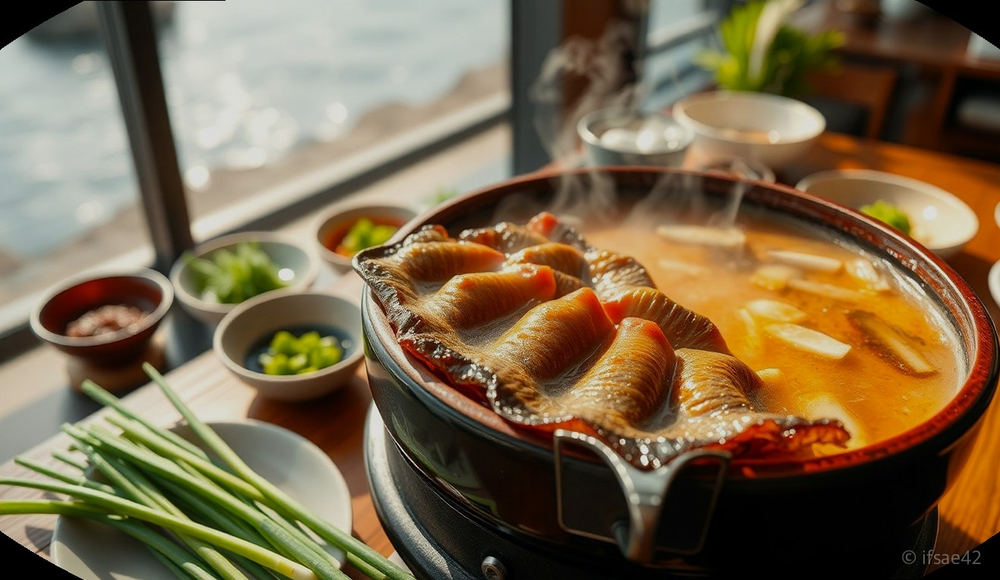
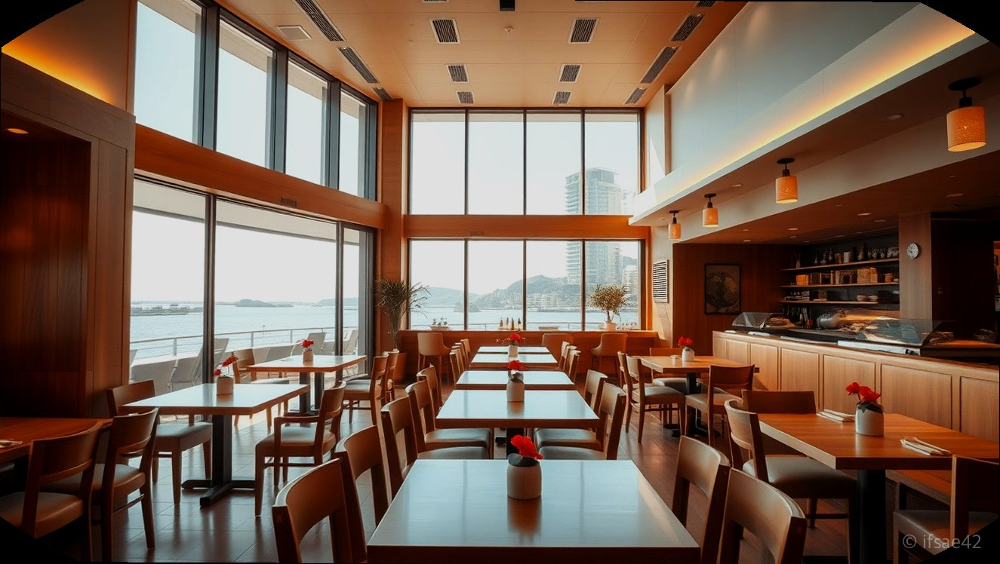
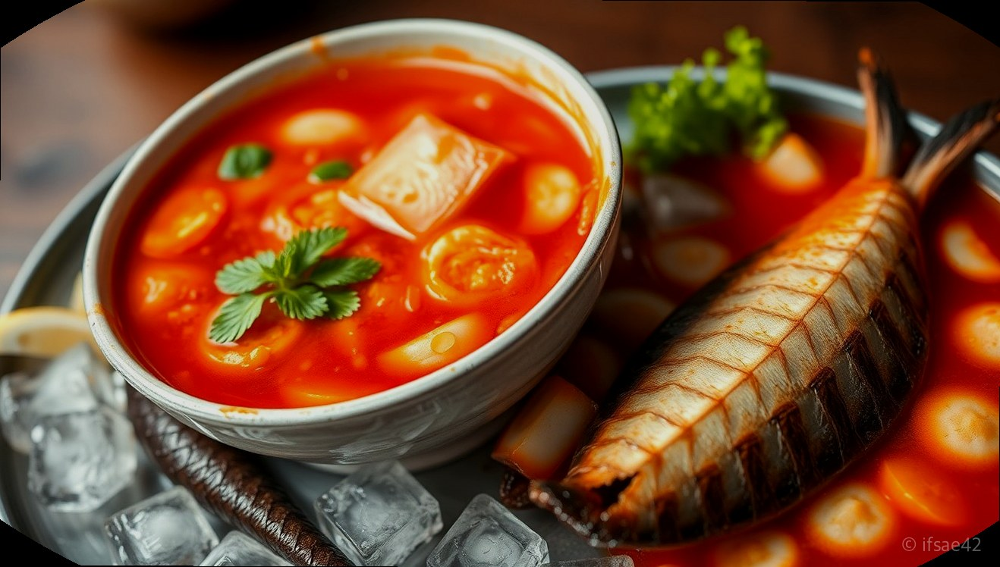

> 자동 생성 초안 · 2026-06-09

# 여수 진남횟집 하모샤브샤브 물회까지 완벽했던 현지인 맛집 후기

여수 여행을 계획하면서 가장 고민되는 부분 중 하나가 바로 실패 없는 식당을 찾는 일입니다. 특히 여수의 명물인 하모샤브샤브는 제대로 하는 곳에서 맛봐야 그 깊은 풍미를 온전히 느낄 수 있는데, 이번에 방문한 여수진남횟집은 현지인들 사이에서도 입소문이 자자한 곳이라 큰 기대를 안고 다녀왔습니다.

이순신광장과 돌산공원 등 여수의 주요 관광지에서 차로 5~10분 내외면 도착할 수 있는 뛰어난 접근성 덕분에 여행 동선을 짜기에도 매우 편리했습니다. 깔끔한 외관만큼이나 내부 시설도 쾌적하여 가족 여행객이나 연인들이 방문하기에 부족함이 없었던 여수진남횟집의 생생한 후기를 공유해 드립니다.

## 관광지 접근성과 쾌적한 매장 분위기

여수진남횟집은 돌산읍 강남로 46에 위치하고 있어 돌산공원과 이순신광장을 오가는 길목에 자리 잡고 있습니다. 여행객들에게 이동 시간은 곧 금과 같은데, 주요 명소들과 이렇게 가까운 거리에 있다는 점은 큰 장점입니다. 매장 앞에 도착하면 한눈에 들어오는 깔끔한 외관 덕분에 처음 방문하는 분들도 쉽게 찾을 수 있습니다.

내부로 들어서면 넓고 쾌적한 홀이 펼쳐지는데, 테이블 간격이 여유로워 가족 단위 방문객들도 편안하게 식사를 즐길 수 있는 분위기입니다. 직원분들의 서비스 역시 친절하고 세심하여 대접받는 기분으로 식사를 시작할 수 있었습니다. 주차 공간도 마련되어 있어 자차를 이용하는 여행객들도 주차 걱정 없이 방문하기에 좋습니다.

## 하모샤브샤브와 물회의 조화로운 맛

이곳의 대표 메뉴인 하모샤브샤브는 등장부터 압도적인 비주얼을 자랑합니다. 신선한 하모와 함께 제공되는 육수는 깊고 진한 맛을 내며, 살짝 데쳐낸 하모를 부추와 함께 곁들여 먹으면 입안에서 사르르 녹는 부드러운 식감을 경험할 수 있습니다. 자극적이지 않으면서도 보양식다운 든든함이 느껴져 남녀노소 누구나 좋아할 만한 맛입니다.

함께 주문한 물회 역시 빼놓을 수 없는 별미입니다. 신선한 해산물이 아낌없이 들어가 있어 씹는 재미가 쏠쏠하며, 새콤달콤한 육수가 입맛을 제대로 돋워줍니다. 하모샤브샤브의 담백함과 물회의 시원하고 칼칼한 조합은 그야말로 완벽한 밸런스를 이룹니다. 현지인들이 왜 이곳을 꾸준히 찾는지 맛을 보는 순간 바로 이해가 되었습니다.

## 여수진남횟집 방문 전 필수 체크리스트

- 주소: 전남 여수시 돌산읍 강남로 46 1층 진남횟집
- 영업시간: 매일 10:30 ~ 22:00
- 전화번호: 0507-1495-2306
- 예약 팁: 주말이나 공휴일에는 손님이 많을 수 있으니 방문 전 전화로 미리 예약하는 것을 추천합니다.
- 주차 정보: 매장 인근 주차 공간을 활용할 수 있으며, 방문 전 매장에 문의하면 더욱 상세한 안내를 받을 수 있습니다.
- 추천 메뉴: 보양식으로 제격인 하모샤브샤브와 입맛을 살려주는 물회 조합을 강력하게 추천합니다.

## 자주 묻는 질문(FAQ)

**Q1. 여수진남횟집은 이순신광장에서 얼마나 걸리나요?**
A1. 이순신광장에서 차로 이동할 경우 약 5분에서 7분 정도 소요되는 가까운 거리에 위치해 있습니다.

**Q2. 하모샤브샤브를 처음 먹어보는데 어떻게 먹어야 맛있나요?**
A2. 육수가 끓어오를 때 하모를 살짝 데친 뒤, 함께 제공되는 부추와 깻잎에 싸서 전용 소스에 찍어 드시면 가장 맛있게 즐길 수 있습니다.

**Q3. 주차는 어디에 하면 되나요?**
A3. 매장 인근에 주차 가능한 공간이 마련되어 있으며, 방문 전 전화로 문의하시면 더욱 원활한 주차 안내를 받으실 수 있습니다.

여수 여행의 즐거움을 더해줄 맛있는 식당을 찾고 계신다면, 접근성과 맛, 서비스까지 모두 잡은 여수진남횟집을 방문해 보시길 바랍니다. 하모샤브샤브의 깊은 맛과 시원한 물회 한 그릇이면 여수 여행의 피로가 눈 녹듯 사라질 것입니다. 여러분의 여수 여행이 더욱 맛있는 추억으로 가득하길 바랍니다.

#여수진남횟집 #여수하모샤브샤브 #여수현지인맛집
