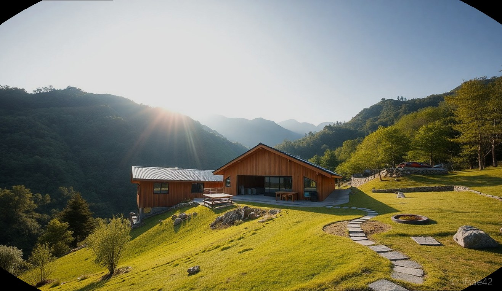
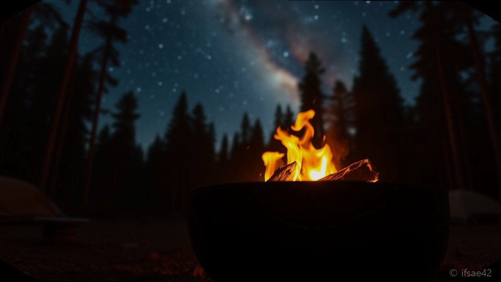
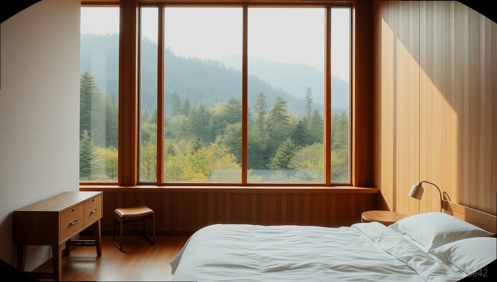

> 자동 생성 초안 · 2026-06-28

# 영월 에코빌리지 예약부터 불멍까지, 의도된 불편함이 주는 힐링 1박 2일 솔직 후기

스마트폰을 손에서 놓지 못하는 일상에서 벗어나, 과감히 '불편함'을 선택해 보는 여행은 어떨까요? 강원도 영월의 깊은 산속, 디지털 디톡스를 실천하며 자연의 소리에 집중할 수 있는 곳이 있습니다. 바로 **영월에코빌리지**입니다. 이곳은 단순히 잠만 자는 숙소가 아니라, 환경을 생각하고 나 자신과 마주하는 독특한 시간을 선물하는 공간입니다.

## 의도된 불편함이 주는 쉼
영월에코빌리지의 가장 큰 특징은 이름 그대로 '친환경'과 '불편함'을 컨셉으로 한다는 점입니다. 객실 내에는 TV나 일회용 어메니티가 없습니다. 처음에는 당황스러울 수 있지만, 창밖으로 펼쳐지는 동강의 푸른 풍경과 고요한 산바람을 마주하는 순간 이 불편함이 왜 필요한지 깨닫게 됩니다.

자연 속에서 온전히 나만의 시간에 집중하는 경험은 그 어떤 럭셔리 호텔보다 깊은 힐링을 선사합니다. 밤이 되면 인공 조명이 최소화된 이곳에서 영월의 밤하늘을 가득 채운 별들을 감상할 수 있습니다. 쏟아질 듯한 은하수를 바라보며 즐기는 불멍 시간은 이번 여행의 하이라이트라 할 수 있습니다.

## 예약 정보 및 객실 가이드
합리적인 가격으로 자연을 누릴 수 있다는 점도 큰 매력입니다. 예약은 주로 네이버 예약이나 공식 홈페이지를 통해 진행하며, 주말에도 큰 부담 없는 가격대를 형성하고 있습니다.

* **체크인/아웃**: 15:00 / 11:00
* **객실 타입 및 가격대**
* 더블룸/트윈룸: 평일 7~9만 원대 / 주말 13만 원 내외
* **예약 꿀팁**: 평일 방문 시 더욱 한적한 환경에서 '나만의 공간'을 누릴 수 있습니다. 주말은 예약이 빠르게 마감되니 최소 2~3주 전 예약을 추천합니다.
* **부대시설**: 야외 불멍 존, 공동 주방, 조식 서비스 등 (불멍 세트는 현장에서 추가 구매가 가능합니다.)

## 영월 여행 1박 2일 추천 코스
영월은 볼거리가 많지만, 에코빌리지의 평온함을 제대로 느끼려면 동선을 효율적으로 짜는 것이 좋습니다.

1일 차: 영월 도착 후 청령포 산책 → 시내 맛집(영월 한우 추천) 방문 → 에코빌리지 체크인 및 주변 산책 → 밤하늘 별 구경과 불멍
2일 차: 에코빌리지 조식 → 동강 래프팅 또는 어라연 탐방 → 영월 관광센터 방문 후 귀가

## 방문 전 알아두면 좋을 점 가장 궁금해하실 만한 내용을 간단히 정리해 드립니다.

**Q1. 객실 내에 정말 세면도구가 하나도 없나요?**
A1. 환경 보호를 위해 일회용 칫솔, 치약, 샴푸 등은 제공되지 않으니 반드시 개인 용품을 챙겨 오셔야 합니다.

**Q2. 밤에 많이 어두운가요?**
A2. 주변이 산이라 밤에는 매우 어둡습니다. 별을 보기엔 최적이지만, 숙소로 이동하실 때 운전이나 도보 이동 시 각별히 유의하시기 바랍니다.

영월에코빌리지는 화려한 서비스보다는 마음의 여유를 채워주는 곳입니다. 도시의 소음과 복잡한 일상을 잠시 끄고, 오직 자연과 나 자신에게만 집중하고 싶은 분들께 이곳을 진심으로 추천합니다. 이번 주말, 조금은 불편하지만 가장 완벽한 휴식을 위해 영월로 떠나보시는 건 어떨까요?

#영월에코빌리지 #강원도영월여행 #영월숙소추천
