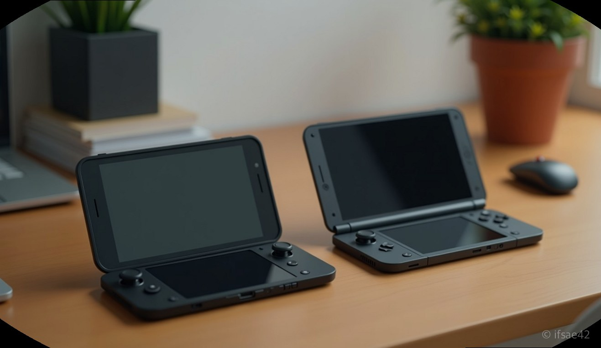
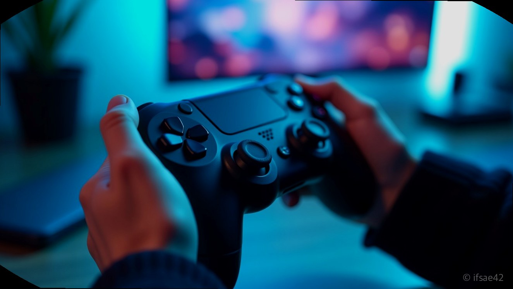

> 자동 생성 초안 · 2026-07-14

# 원엑스플레이어3 vs X1 비교, UMPC 구매 전 꼭 알아야 할 스펙과 실사용 후기

지하철에서 닌텐도 스위치를 넘어 고사양 AAA급 게임을 즐기는 사람들을 보면, 이제는 UMPC가 단순한 취미를 넘어 하나의 고성능 모바일 컴퓨팅 시장으로 자리 잡았음을 실감합니다. 특히 '원엑스'라는 브랜드는 매번 파격적인 시도로 유저들을 설레게 하곤 하죠. 오늘은 많은 분이 고민하시는 원엑스플레이어3와 X1, 두 모델의 핵심 차이와 실제 체감 성능을 정리해 보았습니다.

## 원엑스 라인업 성능 분석

우선 두 모델은 추구하는 방향성이 확연히 다릅니다. X1은 태블릿 형태를 기본으로 하여 탈착식 컨트롤러를 제공하는 일종의 '하이브리드 PC'에 가깝습니다. 대화면 디스플레이를 선호하거나, 게임뿐만 아니라 영상 편집, 문서 작업 등 생산성 도구로도 활용하려는 유저에게 적합합니다.

반면 원엑스플레이어3는 전통적인 UMPC 폼팩터를 유지하며 최적의 그립감과 무게 밸런스에 집중했습니다. 프로세서 세대교체에 따라 전력 효율과 그래픽 성능이 비약적으로 상승했기에, 오직 '게임 플레이' 그 자체에 몰입하고 싶은 사용자라면 3 시리즈가 보여주는 안정적인 프레임 유지력에 더 높은 점수를 줄 수밖에 없습니다.

## 실사용자가 느끼는 차이

실제로 두 기기를 사용해보면 가장 먼저 체감되는 것은 무게와 발열 관리입니다. X1은 화면이 큰 만큼 시각적 만족도는 최상이지만, 장시간 들고 게임을 하기엔 손목에 다소 무리가 갈 수 있습니다. 거치대에 두고 게임패드를 연결해 즐긴다면 최고의 환경이 되겠지만, 침대에 누워 즐기는 '침대 게이밍'의 자유도는 역시 원엑스플레이어3가 앞섭니다.

발열 처리 역시 3 시리즈가 조금 더 세련된 모습을 보여줍니다. 좁은 폼팩터 안에서 공기 흐름을 최적화한 설계 덕분에 고사양 게임 구동 시에도 스로틀링 발생 빈도가 현저히 낮습니다. 배터리 타임의 경우 두 모델 모두 60Wh급 이상의 용량을 탑재했으나, 디스플레이 크기에 따른 전력 소모 차이로 인해 실사용 시간은 3 시리즈가 소폭 우위를 점합니다.

## 구매를 위한 마지막 팁

UMPC를 처음 고민하시는 분들은 스펙표의 수치보다 '본인이 주로 어디서 게임을 하는가'를 먼저 생각해야 합니다. 밖에서 이동 중에 주로 즐긴다면 고민할 것 없이 원엑스플레이어3를 추천합니다. 휴대성과 성능의 밸런스가 가장 잘 잡혀 있기 때문입니다. 반면, 집안 곳곳에서 사용하거나 외부 모니터와의 연결성이 중요하고 영상 시청 비중이 높다면 X1의 멀티태스킹 능력이 압도적인 만족감을 줄 것입니다.

참고로, 최근 검색어 데이터에서 혼선을 빚는 '원엑스코어(onexcore)'는 게이밍 기기와는 전혀 무관한 가상자산 거래소입니다. 혹시라도 기기 구매를 위해 검색하셨다가 금융 관련 정보가 나와 당황하셨다면, 해당 플랫폼은 거래 환경의 직관성과 인터페이스 편의성을 강조하는 서비스일 뿐이니 게이밍 기기 브랜드와는 완전히 다른 카테고리로 분류하시는 것이 좋습니다.

결국 가장 좋은 선택은 본인의 라이프스타일입니다. 화려한 스펙에 매몰되기보다는, 자신이 매일 들고 다닐 수 있는 무게인지, 평소 즐기는 게임 장르와 화면 크기가 조화로운지를 먼저 따져보시길 바랍니다. 기술의 발전으로 두 모델 모두 현존하는 대부분의 게임을 원활하게 구동할 수 있으니, 스펙보다는 '손에 쥐었을 때의 즐거움'을 선택하는 것이 정답에 가깝습니다.

#원엑스플레이어 #UMPC #게이밍기기
