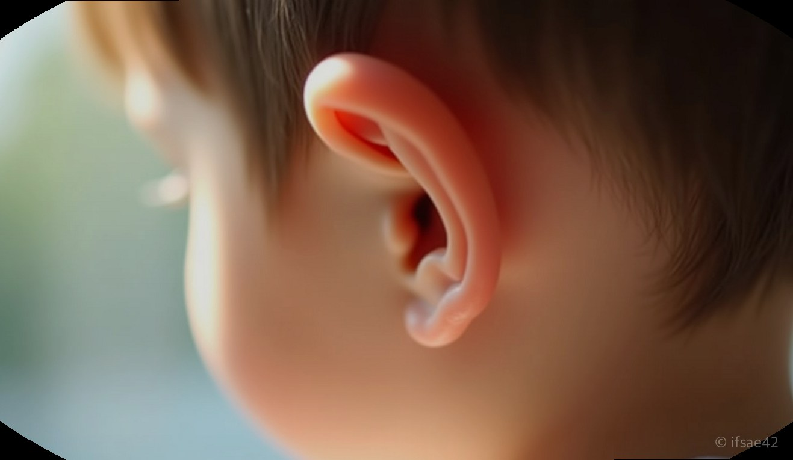
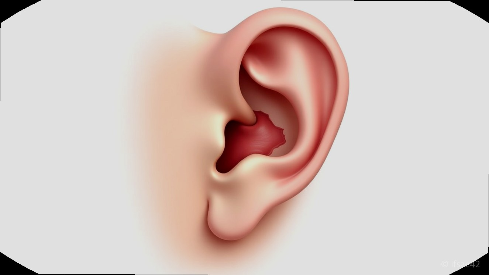

> 자동 생성 초안 · 2026-07-10

# 선천성 이루공 수술 꼭 해야 할까? 증상부터 병원 선택 기준 및 관리법 총정리

귀 주변을 유심히 보다 보면 아주 작은 점처럼 보이는 구멍을 발견할 때가 있습니다. 처음에는 그저 점인 줄 알았는데, 시간이 지나면서 그 부위가 붓고 고름이 나오기 시작하면 부모님들은 적지 않게 당황하게 됩니다. 이를 ‘선천성 이루공’이라고 부르는데, 생소한 이름 때문에 수술이 반드시 필요한 것인지 고민하는 분들이 정말 많습니다. 결론부터 말씀드리면, 모든 이루공이 수술 대상은 아닙니다.

## 이루공의 원인과 증상

선천성 이루공은 태아 시기 귀가 형성되는 과정에서 귓바퀴의 융합이 불완전하게 이루어지면서 발생하는 일종의 선천적 기형입니다. 귓바퀴 앞쪽에 작은 구멍이 있는 것이 특징인데, 겉으로 보기에는 미세한 구멍 하나지만 피부 안쪽으로는 낭종(주머니) 형태의 통로가 길게 연결되어 있습니다.

평소에는 아무런 증상이 없거나 가끔 분비물이 나오는 정도로 그치기도 합니다. 하지만 이 낭종 내부에 세균이 증식하면 이야기가 달라집니다. 갑자기 부어오르거나 통증을 동반하고, 심할 경우 고름이 차올라 절개 배농을 해야 하는 상황이 생깁니다. 한 번 염증이 시작되면 재발률이 높기 때문에, 반복적인 염증은 일상생활에 큰 불편을 초래합니다.

## 수술 결정과 과정 안내

염증이 단 한 번도 발생하지 않았다면 굳이 수술을 서두를 필요는 없습니다. 하지만 이미 염증으로 인해 항생제를 여러 번 복용했거나, 고름이 차서 배농 치료를 받은 경험이 있다면 근본적인 해결책인 ‘이루공 제거술’을 고려해야 합니다.

수술은 국소 마취 혹은 전신 마취로 진행되는데, 환자의 연령이나 협조도에 따라 결정됩니다. 아이들의 경우 움직임이 많아 보통 전신 마취를 시행하는 경우가 많습니다. 입원 기간은 보통 당일 수술 후 퇴원하거나, 상태에 따라 1박 2일 정도 입원하는 것이 일반적입니다. 수술 핵심은 피부 속 깊숙이 자리 잡은 누관 전체를 완벽하게 제거하는 것입니다. 일부만 남을 경우 재발할 가능성이 매우 높기에, 경험이 풍부한 이비인후과 전문의를 찾는 것이 무엇보다 중요합니다.

## 병원 선택과 사후 관리

이루공 수술은 간단해 보이지만 미세한 조직을 모두 제거해야 하는 섬세한 작업입니다. 병원을 선택할 때는 단순히 집에서 가까운 곳을 찾기보다, 해당 병원 홈페이지나 상담을 통해 ‘선천성 이루공 수술’을 전문적으로 다루는지, 이비인후과 전문의가 직접 집도하는지 반드시 확인해야 합니다. 특히 대학병원이나 전문 수술 센터를 이용하면 마취과 전문의가 상주해 있어 보다 안전한 수술이 가능합니다.

수술 후에는 흉터 관리가 중요합니다. 실밥을 제거한 뒤에는 약 3개월 정도 흉터 예방 연고를 꾸준히 바르는 것이 좋습니다. 자외선에 노출되면 흉터가 짙어질 수 있으므로 외출 시에는 자외선 차단제를 꼼꼼히 발라주세요.

**Q1. 염증이 한 번도 없었는데 예방 차원에서 수술해도 될까요?**
A1. 의학적으로는 증상이 없는 경우 굳이 수술을 권장하지 않으며, 평소 구멍을 손으로 만지지 않고 청결하게 유지하는 것만으로도 충분합니다.

지금까지 선천성 이루공에 대해 알아보았습니다. 우리 아이 귀 옆의 작은 구멍, 무조건 겁먹기보다는 염증 여부를 잘 관찰하고 전문가와 상담하여 현명한 결정을 내리시길 바랍니다.

#이루공 #선천성이루공 #이루공수술 #귀질환 #이비인후과수술
