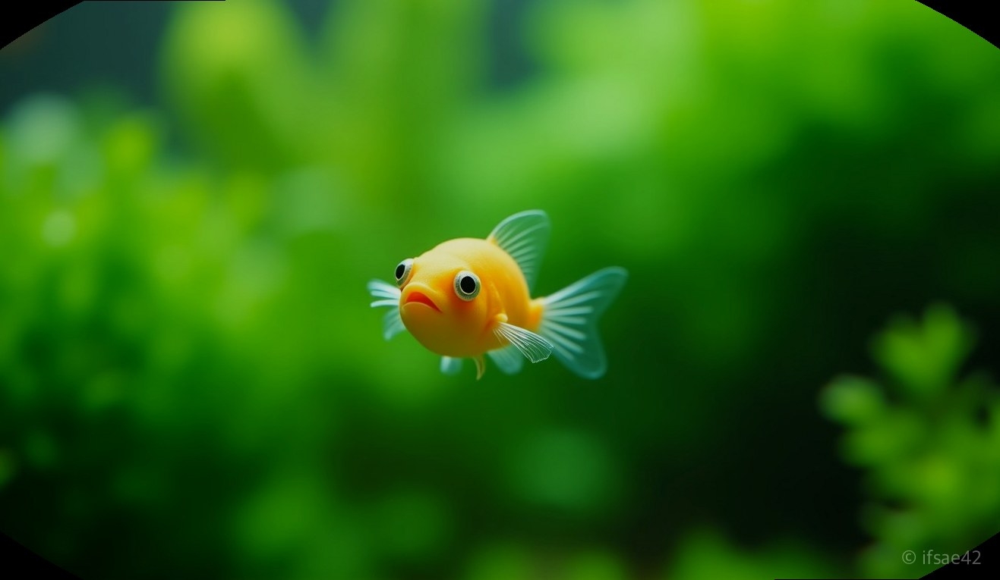
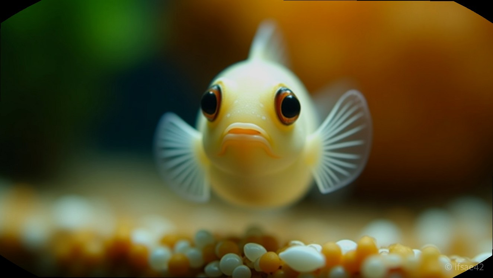
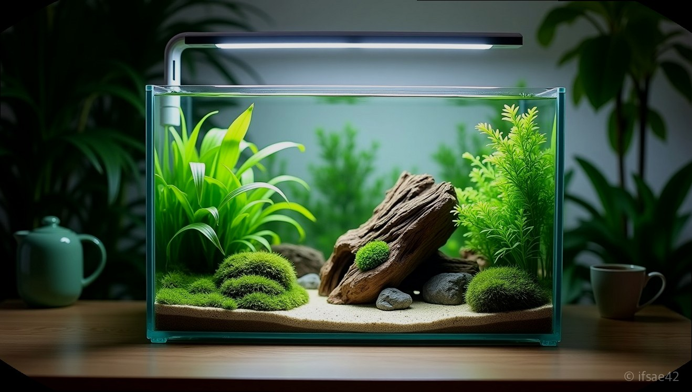

> 자동 생성 초안 · 2026-07-14

# 인디언복어 키우기 전 필수 가이드! 합사부터 먹이, 수명까지 완벽 정리

작고 앙증맞은 몸짓으로 어항 속을 유영하며 주인을 빤히 쳐다보는 물고기가 있습니다. 바로 '드워프 복어'라고도 불리는 인디언복어입니다. 복어라고 하면 으레 바닷물에서 키워야 한다고 생각하기 쉽지만, 이 친구들은 완전히 민물에서 생활하는 담수어입니다. 결론부터 말씀드리면, 인디언복어는 철저한 먹이 관리와 수질 환경만 갖춰진다면 초보자도 충분히 매력을 느낄 수 있는 영리한 반려동물입니다.

## 드워프 복어의 매력과 특징

인디언복어는 성체가 되어도 3cm 내외로 자라는 아주 작은 체구를 가지고 있습니다. 인도 남부의 민물 지역이 고향인 이 어종은 '피그미 복어'라는 별명처럼 귀여운 외모를 자랑합니다. 하지만 외모에 속으면 안 됩니다. 작은 몸집 속에 호기심 많은 성격과 주인과 눈을 맞추는 영리함을 동시에 지니고 있기 때문입니다.

일반적인 열대어들이 군영을 이루며 유유히 헤엄치는 것과 달리, 인디언복어는 특유의 헬리콥터 같은 유영법으로 어항 곳곳을 탐색합니다. 무엇보다 사람을 알아보고 졸졸 따라오는 행동 덕분에 '물속의 강아지'라는 별명으로 불리기도 합니다. 이러한 지능적인 면모가 많은 애호가들이 이 작은 생명체에게 마음을 뺏기는 이유입니다.

## 실패 없는 사육 환경 세팅

이 친구들을 건강하게 키우기 위해서는 몇 가지 까다로운 조건을 맞춰야 합니다. 첫째는 단연 먹이입니다. 인디언복어는 일반적인 인공 사료에 쉽게 적응하지 못합니다. 냉동 장구벌레나 실지렁이 같은 생먹이를 급여하는 것이 필수적이며, 이 과정에서 발생하는 찌꺼기가 수질을 급격히 오염시킵니다. 따라서 여과력이 뒷받침되는 세팅이 반드시 선행되어야 합니다.

수질 관리 측면에서는 주 1~2회 정도의 환수가 필수입니다. 먹이 급여 시 발생하는 잔여물은 독성 암모니아를 유발하기 쉽기 때문입니다. 수온은 24~26도 사이를 유지해 주는 것이 가장 이상적입니다. 수류는 너무 강하지 않게 조성해야 작은 몸집의 복어들이 스트레스를 받지 않고 안정적으로 지낼 수 있습니다.

## 합사 지옥을 피하는 방법

인디언복어 입양을 고민하는 분들이 가장 많이 하는 실수가 바로 '합사'입니다. 결론부터 말씀드리면, 인디언복어는 단독 사육이 가장 권장됩니다. 이들의 성격은 겉보기와 달리 매우 공격적입니다. 특히 지느러미가 길고 화려한 구피나 움직임이 느린 관상용 새우는 복어의 주 공격 대상이 됩니다.

실제로 많은 사육자가 '혹시나' 하는 마음에 새우와 함께 넣었다가 며칠 지나지 않아 새우의 꼬리가 뜯기거나 개체 수가 줄어드는 참사를 경험하곤 합니다. 물론 어항의 크기가 매우 크고 수초가 빽빽하게 우거져 은신처가 충분하다면 예외적인 사례도 존재하지만, 초보자라면 스트레스 없는 단독 사육을 1순위로 고려하시길 바랍니다.

## 수명과 오래 키우는 비결

인디언복어의 평균 수명은 약 3년에서 5년 정도로 알려져 있습니다. 작고 예민한 생명체인 만큼 관리에 따라 수명의 차이가 큽니다. 건강하게 오래 키우기 위해서는 정기적인 검역과 먹이의 다양성이 중요합니다. 생먹이만 고집하다 보면 영양 불균형이 올 수 있으니, 점진적으로 사료 적응 훈련을 시도해보는 것도 방법입니다.

또한, 복어는 자신의 건강 상태를 몸의 색이나 행동으로 표현합니다. 갑자기 몸의 색이 탁해지거나 식욕이 떨어졌다면 수질에 문제가 생겼다는 신호입니다. 이때는 즉시 수질 테스트를 진행하고 환수를 통해 환경을 개선해 주어야 합니다.

작은 어항 속에 나만의 작은 복어를 키운다는 것은 큰 기쁨이지만, 그만큼 생명에 대한 책임감이 따르는 일입니다. 먹이 급여의 번거로움과 합사의 어려움을 충분히 이해하고 대비한다면, 인디언복어는 여러분의 반려 생활에 누구보다 큰 활력을 불어넣어 줄 것입니다. 오늘부터 이 쪼꼬미들의 매력에 한번 빠져보시는 건 어떨까요?

#인디언복어 #드워프복어 #민물복어키우기
