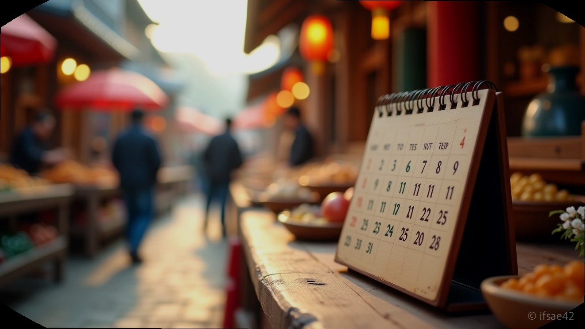
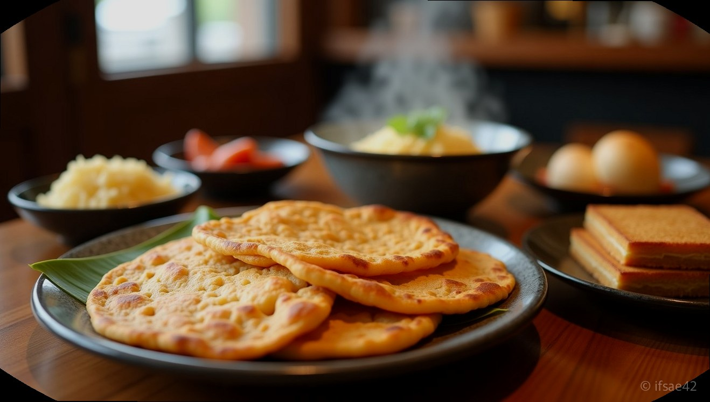

> 자동 생성 초안 · 2026-07-14

# 정선장날 날짜 2일 7일 확인하고 떠나는 정선 아리랑시장 맛집 주차 꿀팁 총정리

구수한 메밀전병 냄새가 코끝을 스치고, 상인들의 정겨운 흥정이 들려오는 곳. 강원도 정선의 활기를 온전히 느끼고 싶다면 달력부터 확인해야 합니다. 왠지 모를 활력이 필요할 때, 서울에서 훌쩍 떠나기 좋은 정선 아리랑시장은 언제 방문하느냐에 따라 여행의 질이 완전히 달라지기 때문입니다.

## 정선장날 정확한 날짜

정선 아리랑시장은 매월 2일과 7일, 12일, 17일, 22일, 27일에 열리는 오일장입니다. 여기에 더해 관광객이 많은 주말을 고려해 매주 토요일에도 장이 서고 있습니다. 즉, 2와 7이 들어가는 날짜 혹은 토요일에 방문하시면 시장이 가장 활기찬 모습을 볼 수 있습니다.

평일 일반적인 날에 방문해도 상설 시장은 운영되지만, 역시 오일장만의 왁자지껄한 분위기와 갓 튀겨낸 먹거리를 즐기려면 반드시 장날에 맞추는 것이 좋습니다. 운영 시간은 보통 오전 9시경부터 오후 6시 전후까지 이어지며, 장날 분위기를 제대로 느끼려면 오전 11시에서 오후 2시 사이 방문을 추천합니다.

## 웨이팅 필수 맛집 정보

정선 아리랑시장의 하이라이트는 단연 먹거리입니다. 가장 유명한 곳은 '회동집'인데, 이곳은 콧등치기 국수와 모둠전으로 전국적인 명성을 얻은 곳입니다. 장날에는 기본 20분에서 30분 이상의 웨이팅이 발생하므로, 시장에 도착하자마자 번호표를 확인하는 전략이 필요합니다.

회동집 외에도 시장 곳곳에는 메밀 부치기, 수수부꾸미, 곤드레 나물을 활용한 식당들이 즐비합니다. 식사 후에는 디저트로 제격인 윤경이네 한과나 지역 특산품인 피나무꿀을 구경해 보세요. 시식 인심이 넉넉해 시장을 걷는 것만으로도 배가 부를 정도입니다.

## 주차 스트레스 줄이기

정선장날의 최대 난관은 주차입니다. 워낙 많은 인파가 몰리기 때문에 시장 바로 앞 도로는 정체가 심합니다. 가장 권장하는 방법은 정선 공영주차장이나 시장 인근 탄천 주차장을 이용하는 것입니다.

장날에는 통행량이 많아 오전 10시 이전에 도착하는 것이 가장 좋습니다. 만약 늦게 도착했다면 시내 외곽에 주차하고 도보로 이동하는 것이 오히려 시간을 절약하는 길입니다. 일부 도로변 주차가 허용되는 구간이 있지만, 혼잡한 상황에서 안전과 주차 공간 확보를 생각한다면 가급적 공식 주차장을 우선순위에 두시길 바랍니다.

## 알찬 당일치기 여행 코스

시장만 보고 오기엔 정선의 자연이 너무 아쉽습니다. 장날을 활용해 방문한다면 '나전역'을 엮은 코스를 추천합니다. 나전역은 과거 탄광촌의 애환이 서린 간이역으로, 지금은 레트로한 감성의 카페로 변신해 사진 찍기에 최적입니다.

특히 정선 아리랑열차(A-train)를 이용하면 청량리에서 오전 8시 30분에 출발해 정선으로 편하게 이동할 수 있습니다. 장날과 주말에 맞춰 운행되는 이 열차를 타면, 운전의 피로 없이 강원도의 산세를 감상하며 여행의 정취를 더할 수 있습니다. 시장에서 든든하게 배를 채우고 나전역에서 따뜻한 차 한 잔을 곁들이면, 그보다 완벽한 주말 나들이는 없을 것입니다.

**Q1. 정선장날이 아닌 날에 방문해도 시장 구경이 가능한가요?**
A1. 네, 상설 시장은 매일 운영되므로 언제든 방문하여 특산물을 구매하고 식사를 하실 수 있습니다.

**Q2. 정선장날 주차는 어디가 가장 편한가요?**
A2. 정선 공영주차장과 탄천 주차장이 가장 넓으며, 장날에는 매우 혼잡하므로 가급적 오전 일찍 방문하시는 것을 권장합니다.

이번 주말, 2일이나 7일이 포함되어 있나요? 그렇다면 정선행 기차나 자동차에 몸을 싣고 시장의 활기를 직접 느껴보시는 건 어떨까요?

#정선장날 #정선아리랑시장 #강원도여행
