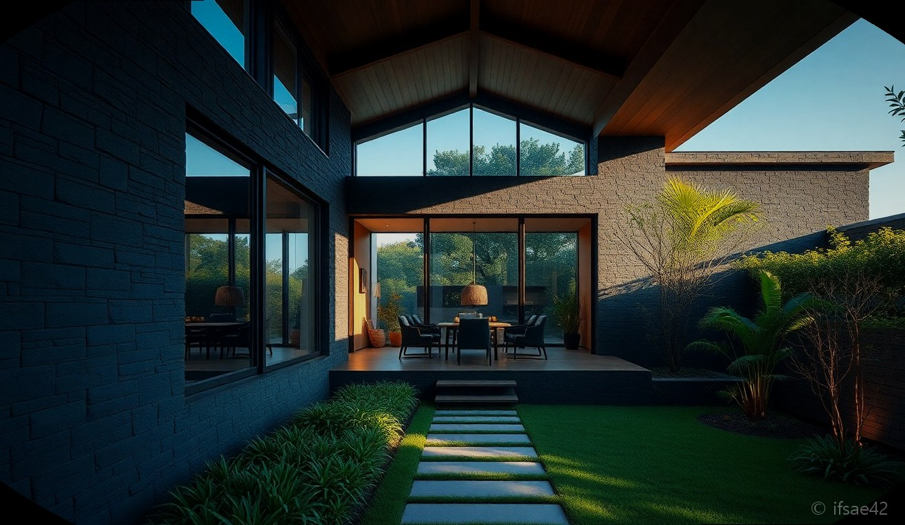
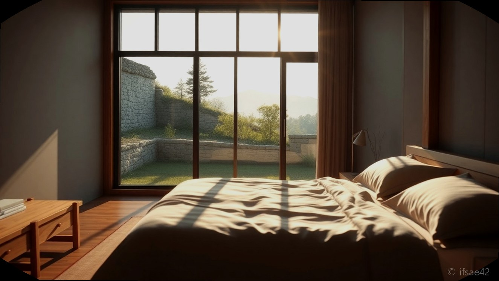
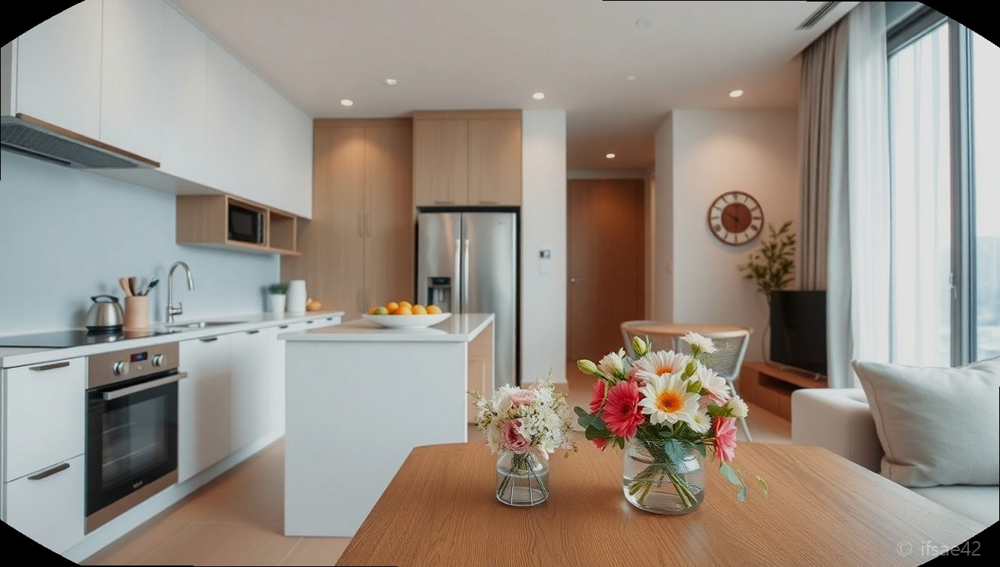

> 자동 생성 초안 · 2026-06-28

# 제주드렌토드 제주도 감성 숙소 추천, 직접 다녀온 솔직 후기와 예약 꿀팁

제주도 여행을 계획할 때 가장 고민되는 지점은 단연 '어디에서 머물 것인가'입니다. 화려한 호텔도 좋지만, 때로는 제주만의 고즈넉한 돌담길과 조용한 풍경 속에서 온전한 쉼을 누리고 싶을 때가 있죠. 최근 제주 서쪽의 여유를 그대로 담아낸 감성 숙소, **제주드렌토드**에서 보낸 2박 3일은 이번 여행의 가장 큰 수확이었습니다. 단순히 잠만 자는 공간을 넘어, 머무는 것 자체가 여행의 목적이 되었던 이곳의 솔직한 방문기를 공유합니다.

## 제주드렌토드만의 매력

제주드렌토드는 들어서는 순간부터 공간이 주는 압도적인 분위기에 매료되는 곳입니다. 제주도의 전통적인 건축미를 현대적으로 재해석하여, 투박한 돌담과 세련된 인테리어가 절묘한 조화를 이룹니다. 이곳은 단순히 숙박 시설을 넘어, 바쁜 일상에서 벗어나 온전히 나에게 집중할 수 있도록 설계된 공간이라는 인상을 받았습니다.

가장 먼저 눈에 띄는 것은 창밖으로 펼쳐지는 제주의 자연 풍경입니다. 채광이 잘 드는 통창 너머로 계절마다 변하는 제주의 색감을 감상할 수 있는데, 아침에 눈을 뜨자마자 보이는 평화로운 풍경은 그 어떤 여행지보다 강력한 힐링을 선사합니다. 인테리어 역시 무채색 톤과 따뜻한 우드 소재를 적절히 배치하여 마음이 편안해지는 안정감을 줍니다. 소품 하나하나에서도 호스트의 세심한 배려와 감각이 느껴져, 머무는 내내 대접받는다는 기분을 지울 수 없었습니다.

## 상세 시설 및 위치 정보

제주드렌토드는 제주 서부권의 한적한 마을에 위치해 있어 조용하게 휴식을 취하기에 최적의 장소입니다. 주변이 번잡하지 않아 밤에는 쏟아질 듯한 별을 감상할 수 있고, 낮에는 새소리를 들으며 여유로운 산책을 즐길 수 있습니다. 숙소 내부 시설 또한 부족함이 없습니다. 고급 어메니티는 물론, 주방 기구와 가전제품까지 감성적이면서도 실용적인 제품들로 구성되어 있어 장기 투숙을 하기에도 무리가 없습니다.

침구류의 청결 상태는 매우 훌륭했습니다. 예민한 분들도 안심하고 머무를 수 있을 만큼 쾌적하게 관리되고 있었고, 공간마다 은은하게 퍼지는 향기는 여행의 피로를 씻어내기에 충분했습니다. 또한 독립적인 프라이빗 공간이 잘 보장되어 있어, 일행과 함께 오붓한 시간을 보내거나 혼자만의 시간을 가지기에 더할 나위 없는 곳입니다.

## 주변 즐길 거리와 맛집

숙소에서 차량으로 15분 내외로 이동하면 제주의 푸른 바다를 만날 수 있습니다. 특히 금능해수욕장과 협재해수욕장이 가까워 에메랄드빛 바다를 즐기기에 좋습니다. 또한 서쪽 특유의 감성이 묻어나는 예쁜 카페와 로컬 맛집이 인근에 즐비합니다.

개인적으로는 숙소 근처의 작은 베이커리에서 빵을 사 와 아침에 드립 커피와 함께 즐겼던 시간이 가장 기억에 남습니다. 근처 판포포구에서 가벼운 물놀이를 즐기거나, 저녁 무렵에는 신창풍차해안도로를 따라 드라이브를 하며 노을을 감상하는 코스를 강력히 추천합니다. 자연과 미식, 그리고 숙소의 안락함이 완벽한 삼박자를 이루는 위치 선정입니다.

## 예약 및 이용 꿀팁

제주드렌토드는 이미 아는 사람들은 다 아는 감성 숙소로 자리 잡고 있어, 방문을 원하신다면 최소 한 달 전에는 예약을 서두르시는 것이 좋습니다. 공식 인스타그램이나 예약 플랫폼을 통해 실시간 잔여 객실을 확인할 수 있는데, 평일과 주말의 예약률 차이가 크니 비교적 여유로운 평일 방문을 권장합니다.

예약 시에는 호스트가 제공하는 주변 관광 가이드북을 꼭 확인해 보세요. 온라인 검색으로는 알기 힘든 숨겨진 명소들이 적혀 있어 여행 계획을 세우는 데 큰 도움이 됩니다. 마지막으로, 체크인 시 호스트가 전달해 주는 안내 사항을 잘 숙지하여 주변 이웃들에게 피해가 가지 않도록 매너 있는 여행자가 되어주시는 센스도 잊지 마시기 바랍니다. 고요함이 매력인 곳인 만큼, 이곳을 찾는 여행객들의 성숙한 태도가 숙소의 가치를 더욱 높여주는 듯합니다.

#제주드렌토드 #제주도감성숙소 #제주도여행추천
