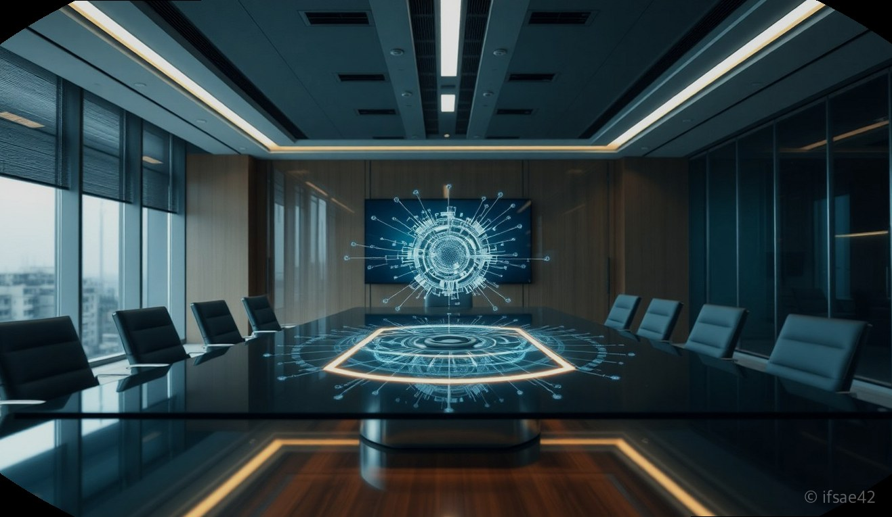
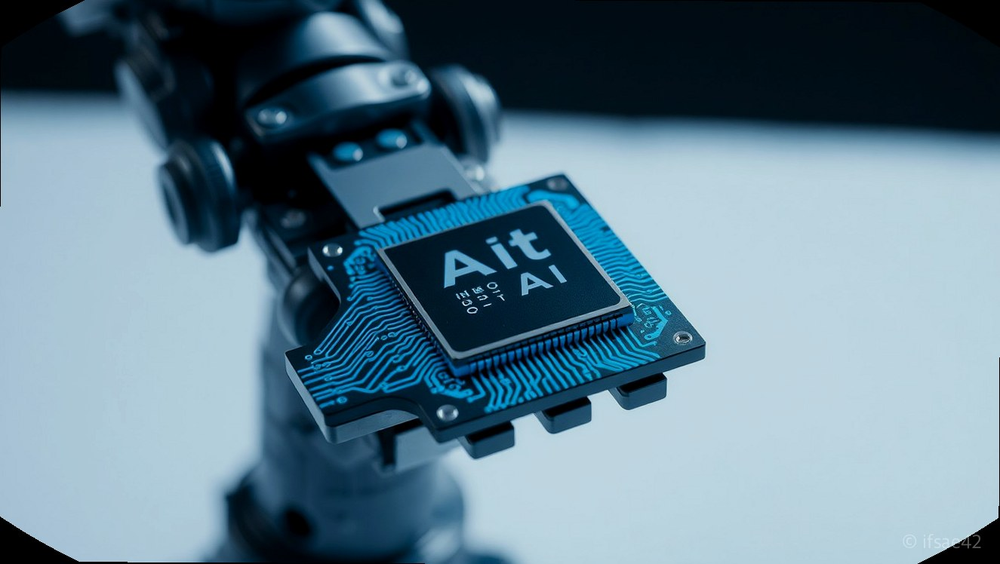
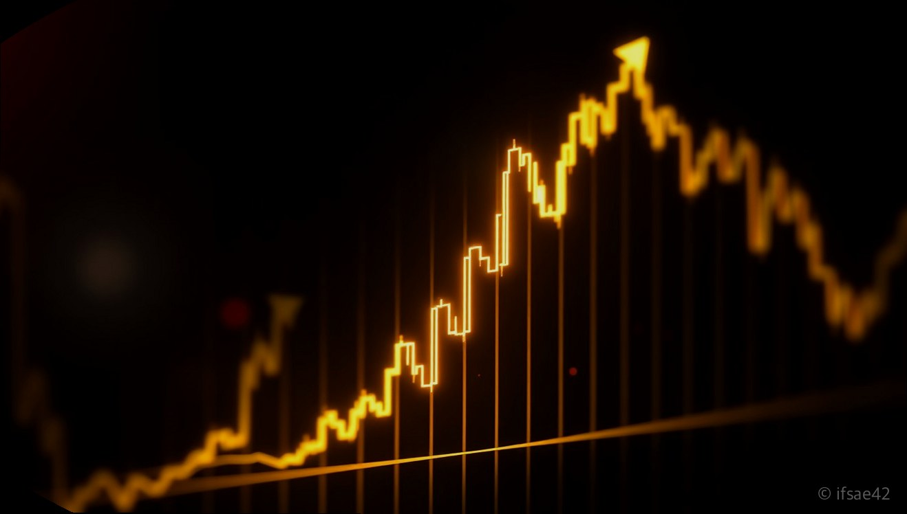

> 자동 생성 초안 · 2026-06-02

# 젠슨 황 방한 일정 및 수혜주 총정리: 진짜 주목해야 할 핵심 기업은?

최근 글로벌 AI 반도체 시장의 독보적인 1위 기업, 엔비디아의 젠슨 황 CEO가 한국을 방문하며 국내 증시가 뜨겁게 달아올랐습니다. 젠슨 황의 행보는 단순한 기업 방문을 넘어, 전 세계 AI 산업의 향후 로드맵을 가늠할 수 있는 중요한 지표로 여겨지기 때문입니다. 특히 국내 주요 대기업들과의 연쇄 회동 소식이 전해지면서 관련주들이 급등락을 반복하는 등 투자자들의 관심이 집중되고 있습니다.

하지만 이러한 시장의 뜨거운 반응 속에서도 우리는 냉철한 시각을 유지할 필요가 있습니다. '젠슨 황 방한'이라는 이벤트가 가진 파급력은 분명하지만, 일시적인 기대감에 의한 주가 상승인지, 아니면 실질적인 AI 협력 의제에 기반한 기업 가치 상승인지를 명확히 구분해야 합니다. 이번 글에서는 젠슨 황 방한의 핵심 내용과 실질적인 수혜 가능성, 그리고 투자자가 반드시 주의해야 할 '셀온(Sell-on)' 리스크를 상세히 분석해 보겠습니다.

## 젠슨 황 방한의 핵심 의제와 주요 회동 기업 분석

젠슨 황의 이번 방한 일정에서 가장 주목해야 할 점은 단순한 만남이 아니라 '어떤 기술적 협력 의제가 논의되는가'입니다. 엔비디아는 현재 AI 가속기 시장을 완전히 장악하고 있으며, 이를 뒷받침할 고대역폭메모리(HBM)와 로봇, 소프트웨어 생태계 확장에 사활을 걸고 있습니다.

1. **LG그룹 (LG전자·LG유플러스):** 젠슨 황은 LG전자와의 회동에서 AI 기반의 스마트홈 및 로봇 생태계 확장을 논의한 것으로 알려졌습니다. 특히 LG전자의 전장 사업과 로봇 플랫폼에 엔비디아의 칩셋을 최적화하는 방안이 핵심 의제입니다. 이는 단기 테마를 넘어 향후 LG의 AI 가전 및 로봇 시장 점유율 확대에 실질적인 동력이 될 수 있습니다.
2. **네이버:** 네이버는 자체 거대언어모델(LLM)인 '하이퍼클로바X'를 보유하고 있습니다. 젠슨 황은 네이버가 추진하는 '소버린 AI(국가별 자체 AI)' 구축 전략에 큰 관심을 보였으며, 이는 양사의 기술적 파트너십 강화로 이어질 가능성이 큽니다.
3. **두산 및 현대차 그룹:** 로봇 및 자율주행 분야에서의 협력 가능성도 꾸준히 제기됩니다. 두산로보틱스의 협동 로봇이나 현대차의 자율주행 소프트웨어에 엔비디아의 플랫폼이 도입된다면, 이는 글로벌 시장에서의 경쟁력을 한 단계 높이는 계기가 될 것입니다.

## '셀온(Sell-on)' 주의보: 이벤트 소멸과 변동성 리스크

주식 시장에는 "뉴스에 팔아라"라는 격언이 있습니다. 젠슨 황 방한 역시 전형적인 '이벤트 드리븐(Event-Driven)' 성격이 강합니다. 방한 기간 동안 기대감으로 주가가 급등했다가, 막상 구체적인 계약 내용이 발표되거나 방한 일정이 종료되는 시점에 실망 매물이나 차익 실현 매물이 쏟아져 나오는 '셀온(Sell-on)' 현상이 발생할 가능성이 매우 높습니다.

따라서 단순히 젠슨 황이 방문했다는 뉴스 하나만 보고 추격 매수를 하는 것은 매우 위험합니다. 특히 실적 기반이 약한 테마주들은 방한 종료 직후 급격한 주가 조정기를 겪을 수 있습니다. 투자자들은 해당 기업이 엔비디아와 실제 매출을 발생시킬 수 있는 구조를 갖추었는지, 아니면 일시적인 협력 기대감에 의한 수급 쏠림인지를 반드시 확인해야 합니다.

## 단기 테마주와 장기적 AI 산업 협력의 차이점

투자 전략을 세울 때는 '단기 테마'와 '장기적 산업 협력'을 분리해서 접근해야 합니다.

* **단기 테마주:** 방한 일정에 맞춰 뉴스 헤드라인에 따라 움직이는 종목들입니다. 수급에 의해 주가가 결정되므로 변동성이 극심하며, 기술적 분석과 손절매 기준이 필수적입니다.
* **장기적 협력 기업:** 엔비디아의 공급망(Supply Chain)에 포함되어 실질적인 매출 성장이 기대되는 기업들입니다. 삼성전자나 SK하이닉스처럼 HBM을 공급하거나, 엔비디아의 생태계에 깊숙이 관여된 소프트웨어/로봇 기업들이 이에 해당합니다. 이러한 기업들은 젠슨 황의 방한 여부와 관계없이 AI 산업의 성장과 함께 장기적인 우상향을 기대할 수 있습니다.

---

### 투자 전 체크리스트
- [ ] 현재 주가 상승이 실적 기반인가, 단순 뉴스 기대감인가?
- [ ] 엔비디아와의 협력이 구체적인 계약(MOU 등)으로 이어졌는가?
- [ ] 방한 이벤트 종료 후 발생할 수 있는 차익 실현 물량을 감당할 수 있는가?
- [ ] 해당 기업이 엔비디아의 대체 불가능한 파트너인가?

### FAQ
**Q1. 젠슨 황 방한 이후 관련주를 지금 사도 될까요?**
A: 방한 이벤트가 이미 반영된 상태라면 추격 매수는 지양해야 합니다. 이벤트 소멸 이후의 주가 조정을 기다리거나, 실적이 뒷받침되는 기업 위주로 장기적인 관점에서 접근하시길 권장합니다.

**Q2. 어떤 ETF가 수혜를 입을 수 있나요?**
A: 특정 기업에 집중 투자하기보다 LG그룹주 전반이나 AI 반도체 밸류체인에 투자하는 ETF를 통해 리스크를 분산하는 것도 좋은 방법입니다. 다만, ETF 구성 종목 중 실제 엔비디아와 협력하는 비중이 높은지 확인이 필요합니다.

**Q3. '셀온'은 보통 언제 발생하나요?**
A: 통상적으로 방한 일정이 종료되는 시점이나, 기대했던 대규모 계약 발표가 나오지 않았을 때 실망 매물이 출회하며 발생합니다.

---

젠슨 황의 방한은 한국 AI 산업의 위상을 다시 한번 확인하는 계기가 되었습니다. 하지만 투자의 본질은 화려한 뉴스 뒤에 숨겨진 기업의 펀더멘털을 파악하는 데 있습니다. 이벤트에 휘둘리기보다, 엔비디아와의 협력이 기업의 실질적인 이익으로 연결될 수 있는지를 꼼꼼히 따져보고 현명한 투자를 이어가시길 바랍니다.

#젠슨황방한 #엔비디아수혜주 #AI반도체투자
