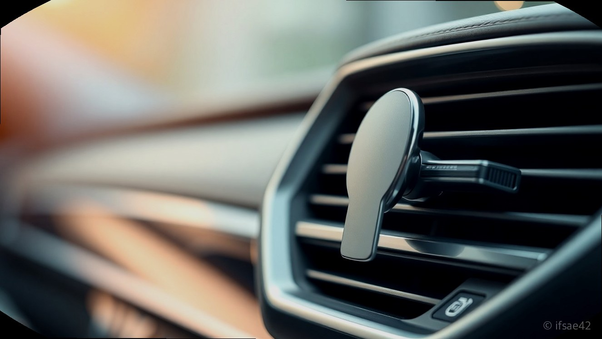
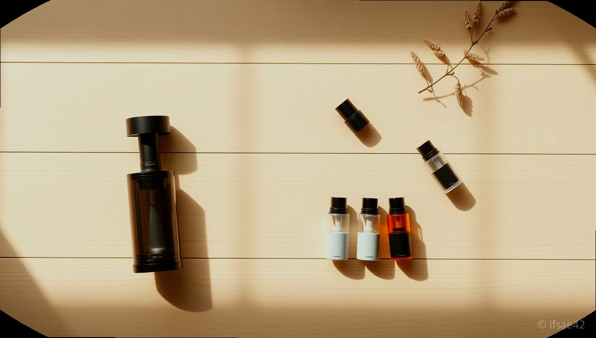

> 자동 생성 초안 · 2026-06-04

# 조말론 차량방향제 내돈내산 솔직 후기, 가격만큼 향기 만족할까?

매일 출퇴근길을 함께하는 자동차는 이제 단순한 이동 수단을 넘어 나만의 프라이빗한 공간이 되었습니다. 차 문을 열었을 때 은은하게 퍼지는 고급스러운 향기는 운전자의 기분을 좌우할 뿐만 아니라, 동승자에게도 세련된 인상을 남겨주곤 하죠. 저 역시 차 안의 분위기를 바꾸기 위해 고민 끝에 '조말론차량방향제'를 선택하게 되었습니다.

특유의 감각적인 패키지와 조말론만의 독보적인 향기는 역시나 기대 이상이었습니다. 처음 제품을 개봉했을 때 느껴지는 고급스러움은 왜 많은 사람이 차량용 방향제로 조말론을 고집하는지 단번에 이해하게 만들었는데요. 오늘은 제가 직접 경험한 조말론 차량용 방향제의 장단점과 함께, 유지비 고민을 해결할 수 있는 현실적인 팁까지 꼼꼼하게 정리해 드리겠습니다.

## 조말론 차량용 방향제 실사용 솔직 후기: 디자인과 향의 조화

조말론차량방향제를 선택하는 가장 큰 이유는 단연 '디자인'과 '향의 퀄리티'입니다. 메탈 소재의 세련된 케이스는 어떤 차종의 송풍구에 설치해도 이질감 없이 인테리어 오브제 역할을 톡톡히 해냅니다. 제가 선택한 라임 바질 앤 만다린 향은 상쾌하면서도 묵직한 잔향이 남아서, 차 안의 공기를 순식간에 고급 호텔 로비처럼 바꿔주는 느낌을 받았습니다.

하지만 솔직한 실사용 후기를 말씀드리자면, 발향력에 대해서는 호불호가 갈릴 수 있습니다. 처음 개봉 직후에는 향이 강하게 퍼지지만, 생각보다 향의 지속력이 길지 않다는 점이 아쉬움으로 남았습니다. 차 안을 향으로 가득 채우기에는 발향 범위가 다소 좁게 느껴지기도 합니다. 따라서 은은한 향을 선호하시는 분들께는 적합하지만, 강한 발향을 원하시는 분들께는 다소 부족하게 느껴질 수 있습니다.

## 가격 대비 만족도 분석 및 유지비용 관리 팁

조말론차량방향제는 가격대가 꽤 높은 편에 속합니다. 본체 구매 비용은 물론이고, 주기적으로 교체해야 하는 리필 카트리지의 가격도 무시할 수 없는 수준입니다. 그럼에도 불구하고 많은 분이 이 제품을 구매하는 이유는 조말론만의 대체 불가능한 향기 때문일 것입니다.

하지만 매번 정품 리필을 구매하기에 비용 부담이 크다면, 최근 커뮤니티에서 화제가 되는 '스멜릿'이나 '912 방향제'와 같은 가성비 대체 브랜드를 고려해보시는 것도 방법입니다. 조말론의 향기와 유사한 계열을 구현하면서도 가격 부담을 낮춘 제품들이 많아, 메인 제품은 조말론을 사용하되 리필은 가성비 좋은 제품을 병행하거나 교체 주기를 조절하는 식으로 유지비를 관리하는 사용자들이 늘고 있습니다.

## 차종별 설치 위치 및 인테리어 효과

조말론차량방향제는 송풍구 클립형으로 제작되어 대부분의 차량에 쉽게 설치가 가능합니다. 제 차의 경우 대시보드 중앙 송풍구에 설치했는데, 블랙 톤의 실내 인테리어와 메탈 케이스가 어우러져 훨씬 깔끔하고 모던한 분위기를 연출할 수 있었습니다.

설치 시 팁을 드리자면, 바람 세기를 강하게 설정하면 향이 빠르게 퍼지지만 그만큼 리필 소모 속도도 빨라집니다. 따라서 평소에는 약한 바람으로 은은하게 향을 즐기다가, 차 안의 냄새를 빠르게 제거하고 싶을 때만 일시적으로 송풍 세기를 높이는 것을 추천합니다. 

---

### 구매 전 체크리스트
- [ ] 현재 차량의 송풍구 형태가 클립형 설치에 적합한가?
- [ ] 너무 강한 향보다는 은은하고 고급스러운 향을 선호하는가?
- [ ] 리필 카트리지의 주기적인 비용 지출을 감당할 의사가 있는가?
- [ ] 차량 인테리어와 메탈 디자인이 잘 어우러질 것인가?

### 자주 묻는 질문 (FAQ)

**Q1. 조말론 차량방향제 향은 얼마나 오래가나요?**
A: 사용 환경과 송풍구 바람 세기에 따라 다르지만, 보통 개봉 후 1개월에서 2개월 정도 지속됩니다.

**Q2. 리필은 꼭 정품만 써야 하나요?**
A: 정품의 향이 가장 정확하지만, 비용 부담이 크다면 조말론과 유사한 향을 구현한 가성비 브랜드의 리필 제품을 활용하는 것도 좋은 대안입니다.

**Q3. 발향이 너무 약하게 느껴지면 어떻게 하나요?**
A: 송풍구의 위치를 조정하거나, 차량 내부 온도를 적절히 유지하면 향이 더 잘 퍼집니다.

---

결론적으로 조말론차량방향제는 가격만큼의 확실한 만족감을 주는 '감성 아이템'입니다. 향에 민감하고 차량 인테리어의 완성도를 중요하게 생각하신다면 충분히 투자할 가치가 있는 제품입니다. 여러분의 차 안은 지금 어떤 향으로 채워져 있나요? 이번 기회에 나만의 시그니처 향기를 찾아보시는 건 어떨까요?

#조말론차량방향제 #차량용방향제 #자동차방향제추천
