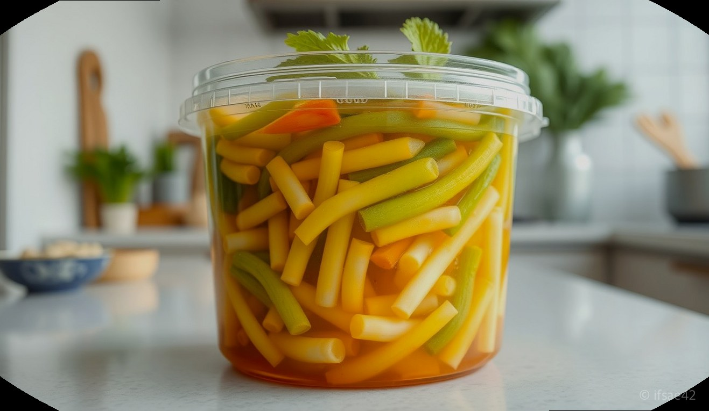
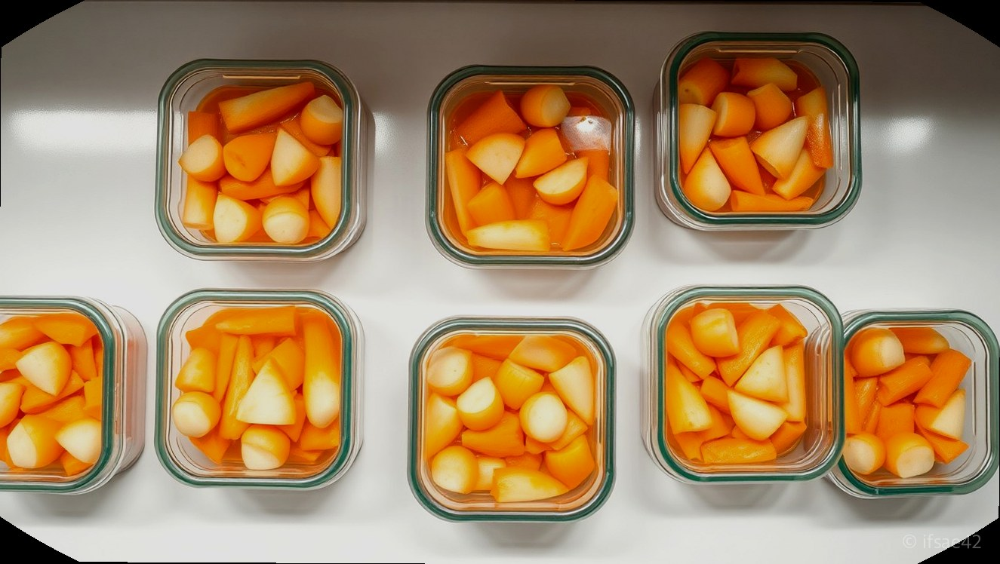
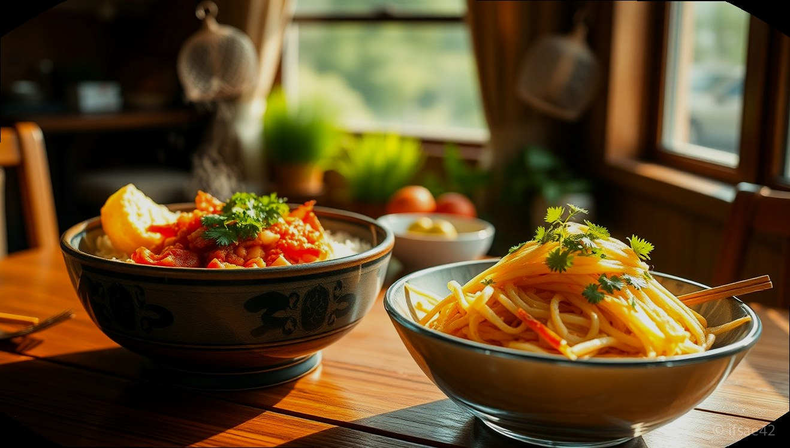

> 자동 생성 초안 · 2026-06-09

# 종가집 열무김치 5kg 내돈내산 솔직후기, 억세지 않고 아삭해서 여름 필수템이에요

본격적인 무더위가 시작되면서 입맛을 돋워줄 시원하고 아삭한 김치를 찾게 됩니다. 여름철 식탁에서 절대 빠질 수 없는 메뉴가 바로 열무김치인데요. 매번 직접 담가 먹기에는 번거로움이 커서, 이번에는 믿고 먹는 브랜드인 종가집 열무김치 5kg 제품을 직접 구매해 보았습니다.

많은 분이 온라인으로 김치를 주문할 때 가장 걱정하시는 부분이 바로 '열무가 너무 억세지 않을까' 하는 점일 텐데요. 결론부터 말씀드리면 이번에 받아본 제품은 어린 열무 특유의 연하고 아삭한 식감이 살아있어 아주 만족스러웠습니다. 5kg이라는 대용량임에도 불구하고 끝까지 맛있게 먹을 수 있는 보관 팁과 활용법까지 상세히 공유해 드리겠습니다.

## 종가집 열무김치 5kg 배송 상태와 맛 평가

주문 후 다음 날 바로 도착한 종가집 열무김치 5kg은 꼼꼼한 이중 포장 덕분에 국물 한 방울 새지 않고 아주 신선한 상태로 배송되었습니다. 아이스팩과 함께 안전하게 담겨 있어 갓 담근 듯한 생김치의 싱싱함이 그대로 느껴졌습니다.

가장 중요한 맛과 식감을 살펴보면, 줄기가 질기지 않고 아주 연해서 아이들이나 어르신들이 드시기에도 전혀 부담이 없습니다. 양념은 과하게 짜거나 달지 않고 깔끔하면서도 깊은 감칠맛이 돌아, 바로 먹어도 맛있고 살짝 익혀 먹으면 풍미가 더욱 살아납니다. 특히 열무 특유의 풋내 없이 깔끔하게 손질되어 있어 따로 다듬을 필요가 없다는 점이 대용량 구매의 가장 큰 장점입니다.

## 5kg 대용량 보관 꿀팁과 소분 방법

5kg이라는 용량이 처음에는 많게 느껴질 수 있지만, 여름철에는 열무비빔밥이나 열무국수 등 활용할 곳이 많아 금방 소비하게 됩니다. 김치를 받자마자 김치냉장고에 그대로 넣기보다는, 먹기 좋은 분량으로 소분하는 과정을 거치면 훨씬 신선하게 보관할 수 있습니다.

먼저 깨끗하게 세척한 밀폐 용기를 여러 개 준비합니다. 한 번에 먹을 만큼씩 나누어 담되, 김치 국물이 열무 위로 자작하게 잠기도록 담아주어야 공기와의 접촉을 줄여 맛이 변하는 것을 방지할 수 있습니다. 바로 먹을 한 통은 실온에 반나절 정도 두어 살짝 익힌 뒤 김치냉장고에 넣으면 가장 맛있는 상태로 숙성됩니다. 나머지 용기는 바로 김치냉장고 깊숙한 곳에 보관하여 천천히 익혀 드시는 것을 추천합니다.

## 여름 별미 레시피: 열무비빔밥과 열무국수

종가집 열무김치를 활용해 가장 추천하는 메뉴는 역시 열무비빔밥입니다. 갓 지은 밥에 잘 익은 열무김치를 듬뿍 올리고, 고추장 한 큰술과 참기름을 넉넉히 둘러 슥슥 비비면 다른 반찬이 필요 없을 정도입니다. 여기에 계란 후라이를 하나 곁들이면 완벽한 한 끼 식사가 완성됩니다.

시원한 국물이 당길 때는 열무국수를 만들어 보세요. 시판 냉면 육수에 열무김치 국물을 1:1 비율로 섞고, 삶은 소면 위에 열무김치를 고명으로 얹으면 전문점 부럽지 않은 여름 별미가 됩니다. 억세지 않은 열무의 아삭한 식감이 면의 부드러움과 어우러져 입안 가득 청량감을 선사합니다.

## 가성비 분석 및 총평

종가집 열무김치 5kg은 1kg이나 3kg 소포장 제품과 비교했을 때 킬로그램당 단가가 훨씬 저렴하여 경제적입니다. 가족 구성원이 많거나 평소 열무김치를 즐겨 드시는 분들이라면 5kg 구매가 훨씬 합리적인 선택입니다. 매번 마트에서 소량 구매하는 번거로움도 줄고, 언제든 맛있는 김치를 꺼내 먹을 수 있다는 점이 큰 매력입니다.

이번 내돈내산 경험을 통해 종가집 열무김치의 품질과 맛을 다시 한번 확인했습니다. 재구매 의사는 200%이며, 앞으로도 여름철 식탁을 책임질 든든한 지원군으로 애용할 예정입니다. 여러분도 고민 중이시라면 이번 기회에 넉넉하게 구비해 보시는 것을 추천드립니다.

## 체크리스트
- [ ] 배송 직후 국물 누수 여부 확인하기
- [ ] 먹기 좋은 양으로 밀폐 용기에 소분하기
- [ ] 김치 국물이 열무 위로 충분히 덮이도록 담기
- [ ] 바로 먹을 분량은 실온에서 살짝 익히기
- [ ] 김치냉장고에 보관하여 일정한 온도 유지하기

## FAQ
**Q1. 종가집 열무김치 5kg은 보통 얼마나 먹을 수 있나요?**
A1. 4인 가족 기준으로 일주일에 2~3회 정도 열무김치를 활용한 요리를 즐긴다면 약 한 달 정도 맛있게 드실 수 있는 양입니다.
**Q2. 열무가 너무 억세지 않을까 걱정되는데 괜찮을까요?**
A2. 종가집 열무김치는 엄선된 어린 열무를 사용하여 식감이 매우 연하고 아삭하기 때문에 억센 느낌 없이 부드럽게 드실 수 있습니다.
**Q3. 처음 받았을 때 바로 먹는 게 좋나요, 익혀 먹는 게 좋나요?**
A3. 취향에 따라 다르지만, 아삭한 생김치를 선호하신다면 바로 드시고, 깊은 맛을 원하신다면 실온에 하루 정도 숙성 후 냉장 보관하는 것을 추천드립니다.

#종가집열무김치5KG #열무김치추천 #여름김치
