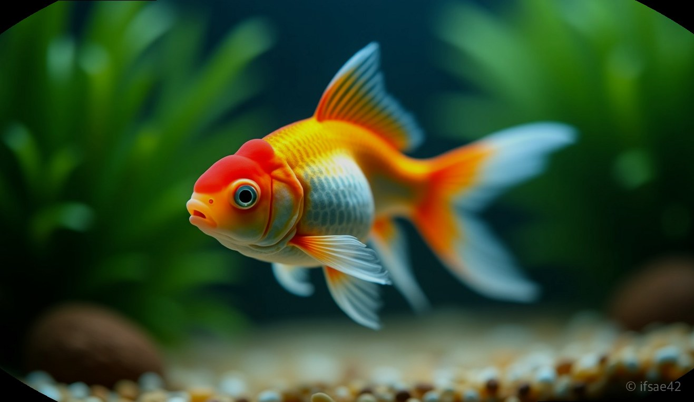
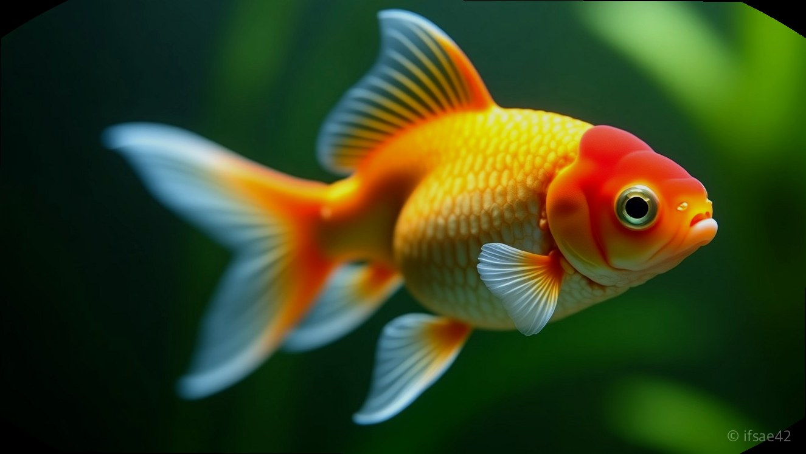
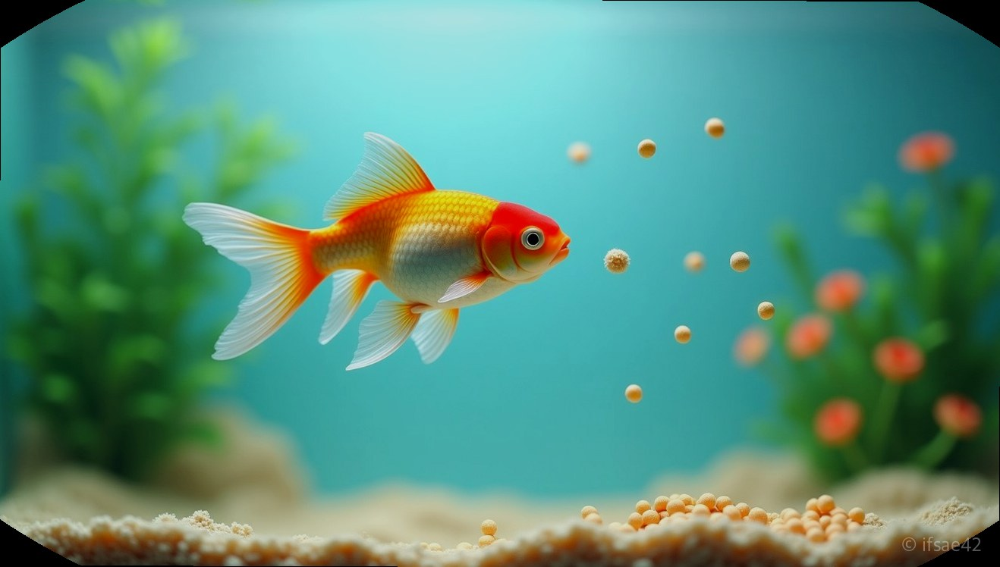

> 자동 생성 초안 · 2026-07-14

# 진주린 키우기 초보 가이드: 수명 늘리는 물갈이와 부레병 예방법 완벽 정리

탁구공처럼 동글동글한 몸매에 보석 같은 비늘을 가진 진주린은 금붕어 애호가들 사이에서 단연 인기 있는 어종입니다. 하지만 겉모습만 보고 덜컥 입양했다가는 금세 건강을 잃기 쉬운 까다로운 품종이기도 합니다. 진주린을 건강하게 오래 키우기 위한 핵심은 ‘급격한 변화 최소화’와 ‘부레병 예방을 위한 식단 조절’에 있습니다. 오늘 이 글을 통해 여러분의 진주린이 건강한 수명을 누릴 수 있도록 사육의 정석을 짚어드리겠습니다.

## 진주린만의 독특한 매력과 체질
진주린은 팽팽하게 부풀어 오른 배와 비늘 하나하나가 진주처럼 솟아오른 독특한 외형 때문에 '핑퐁진주'라는 별명으로 불립니다. 이런 귀여운 모습은 사실 개량 과정에서 고정된 인위적인 체형이며, 이로 인해 일반적인 금붕어보다 소화 기관과 부레가 압박을 받기 쉬운 구조를 가지고 있습니다.

외형이 독특한 만큼 유영 실력도 일반 금붕어보다 다소 떨어집니다. 강한 물살은 진주린에게 엄청난 스트레스를 주며, 체형 특성상 작은 질병에도 금세 무너질 만큼 체질이 민감합니다. 따라서 진주린을 키울 때는 관상용이라는 가벼운 마음보다, 세심한 관리가 필요한 반려 생물이라는 인식을 먼저 가지는 것이 중요합니다.

## 부레병을 막는 급여 전략
진주린 사육의 최대 난관은 바로 '부레병'입니다. 부레병에 걸리면 물고기가 몸을 가누지 못하고 뒤집히거나 수면 위로 둥둥 뜨게 되는데, 이는 주로 소화 불량이나 가스 축적으로 인해 발생합니다.

부레병을 예방하는 가장 확실한 방법은 먹이 급여 습관을 바꾸는 것입니다. 첫째, 사료는 반드시 물에 5~10분 정도 충분히 불려서 급여하세요. 건조된 사료가 뱃속에서 불어나면 소화기관에 무리를 주어 부레를 압박합니다. 둘째, 한 번에 많이 주는 것보다 하루 2~3회에 나누어 조금씩 주는 것이 좋습니다. 셋째, 가라앉는 타입의 사료(침강성)를 선택하여 먹이를 먹을 때 공기를 함께 삼키는 현상을 줄여주는 것도 큰 도움이 됩니다.

## 적정 환경과 물갈이 루틴
진주린의 수명을 좌우하는 것은 결국 수질 관리입니다. 이 어종은 대사가 활발해 배설물을 많이 배출하므로 여과력이 충분한 어항이 필수입니다.

1. **수온 관리**: 20~24도 사이를 유지하는 것이 가장 안정적입니다. 급격한 온도 변화는 면역력을 떨어뜨려 백점병이나 각종 질병을 유발합니다.
2. **환수 주기**: 일주일에 1~2회, 전체 물의 20~30% 정도만 부분 환수하는 것이 적당합니다. 이때 반드시 염소 제거제를 사용하고, 기존 어항 물과 새로운 물의 온도를 똑같이 맞춰주는 '온도 맞댐' 과정을 생략하지 마세요.
3. **물살 조절**: 여과기에서 나오는 물살이 너무 세다면 출수구 방향을 벽 쪽으로 돌리거나 레인바를 사용하여 물살을 최대한 부드럽게 만들어야 합니다.

초보자들이 흔히 하는 가장 큰 실수는 '너무 자주, 혹은 너무 많이' 무언가를 해주는 것입니다. 어항에 손을 자주 넣거나, 먹이를 과하게 주거나, 물을 너무 자주 전체 환수하는 행위는 진주린에게 치명적입니다.

자연 상태가 아닌 인공적인 환경에서 사는 만큼, 진주린에게는 변화 없는 평온한 일상이 곧 장수의 비결입니다. 오늘부터는 먹이를 줄 때 조금 더 신중하게, 환수를 할 때는 조금 더 천천히 진행해 보세요. 여러분의 정성 어린 관리가 진주린의 건강한 삶을 결정합니다.

#진주린 #금붕어키우기 #부레병예방
