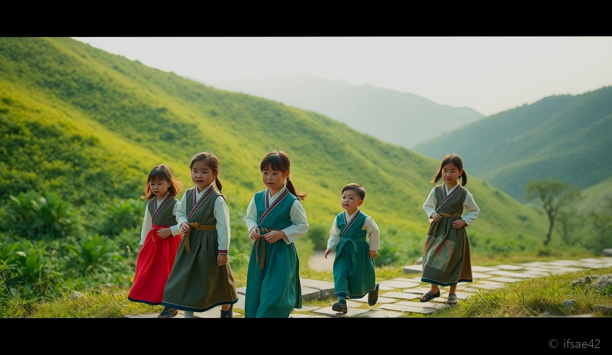
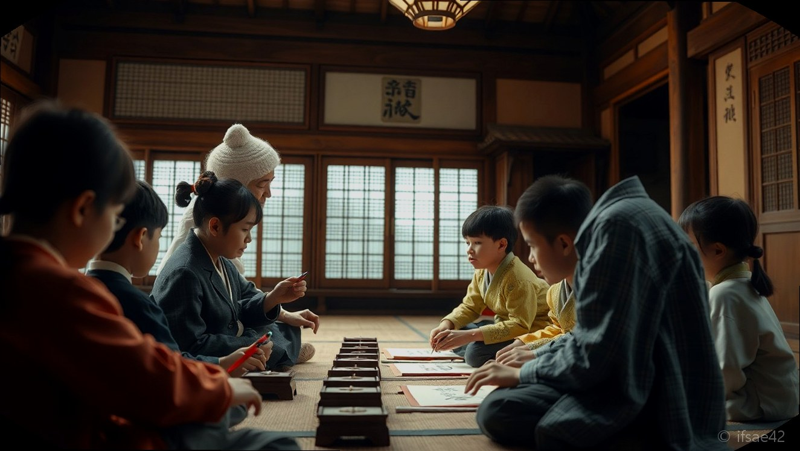
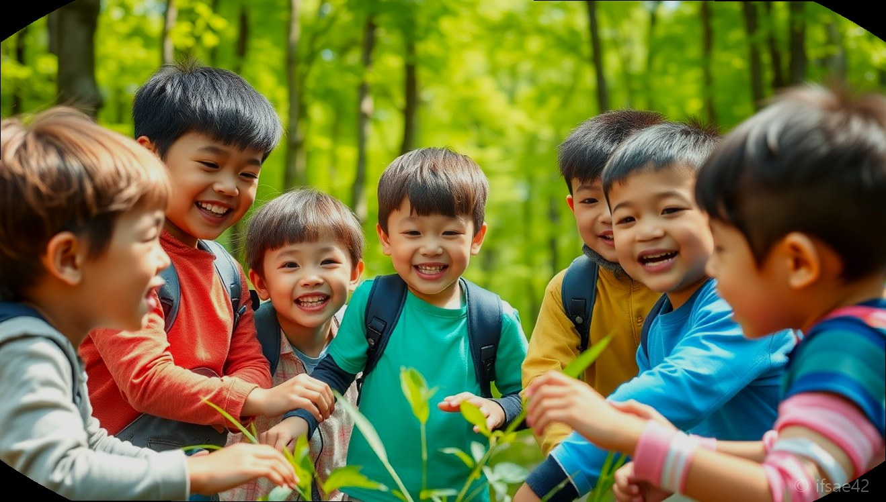

> 자동 생성 초안 · 2026-06-28

# 청학동예절학교 가격 및 프로그램 총정리: 초등 방학 인성캠프 추천

스마트폰과 게임에 익숙해진 우리 아이에게 잠시나마 자연 속에서 스스로를 돌아볼 시간을 선물하고 싶으신가요? 방학 기간을 활용해 예의범절과 올바른 가치관을 배우는 청학동예절학교는 매년 많은 학부모님이 찾는 교육 코스입니다. 단순히 엄격한 규율만 강요하는 곳이 아니라, 단체 생활을 통해 배려와 협동을 배우는 실질적인 인성 교육의 장으로 주목받고 있습니다. 오늘은 대표적인 청학동 예절학교인 '청림서당'의 정보와 함께, 아이를 캠프에 보내기 전 반드시 확인해야 할 사항들을 정리해 드립니다.

## 청학동 예절학교 일과표
청학동예절학교의 하루는 일반적인 가정 생활과는 180도 다르게 흘러갑니다. 아이들은 새벽 일찍 일어나 세면을 하고, 훈장님과 함께 아침 인사를 나누며 하루를 시작합니다.

오전 시간에는 한자 교육이나 서예 수업 등 정적인 활동을 통해 집중력을 기르고, 오후에는 지리산 청학동의 맑은 자연을 만끽하며 전통 놀이나 예절 교육을 수행합니다. 식사 예절부터 옷 입는 법, 웃어른을 공경하는 태도까지 몸소 익히게 되죠. 이러한 일과는 아이들에게 스마트폰 없는 세상이 생각보다 재미있고, 스스로의 행동을 조절하는 법을 배우는 소중한 기회가 됩니다.

## 캠프 선택 고려 체크리스트
방학 캠프를 고를 때는 무엇보다 아이의 정서적 안정을 최우선으로 고려해야 합니다. 다음 사항들을 체크해 보시기 바랍니다.

- 교육 환경: 자연과 어우러진 쾌적한 시설인가?
- 교육 철학: 훈장님의 교육 방식이 자녀의 성향과 맞는가?
- 안전 관리: 응급 상황 대처 매뉴얼과 상주 인력이 있는가?
- 후기 확인: 실제 경험한 아이들과 부모님들의 만족도는 어떠한가?
- 식단 구성: 아이들의 성장기를 고려한 영양 식단인가?

청림서당과 같은 전문 기관은 이러한 부분에서 체계적인 시스템을 갖추고 있어 신뢰도가 높습니다. 부모님과 떨어져 지내는 시간인 만큼, 최소한의 연락 체계와 보호 시스템을 갖춘 곳인지 확인하는 것이 핵심입니다.

## 청림서당 정보 및 비용
많은 학부모님이 궁금해하시는 실질적인 정보입니다. 지리산 자락에 위치한 청림서당은 전통적인 가르침을 현대적 교육과 조화롭게 녹여낸 곳으로 유명합니다.

주소: 경남 하동군 청암면 청학로 2569-2 문의 전화: 0507-1402-8077

비용은 캠프의 기간(단기, 장기)과 프로그램 구성에 따라 차이가 발생할 수 있습니다. 일반적으로 방학 시즌별로 모집 인원과 프로그램 내용이 업데이트되므로, 구체적인 금액은 위 연락처를 통해 직접 상담하시는 것이 가장 정확합니다. 단순히 비용만 비교하기보다는, 아이가 이 기간 동안 어떤 성취를 얻어올 수 있을지에 대한 기대 효과를 상담 시 꼼꼼히 확인해 보세요.

예절학교를 다녀온 아이들은 대체로 부모님을 대하는 태도가 부드러워지거나, 스스로 할 일을 챙기는 자립심이 강해졌다는 피드백이 많습니다. 짧은 시간이지만 아이의 인생 전체를 관통하는 바른 인성의 씨앗을 심어주고 싶다면, 이번 방학을 활용해 보시길 권장합니다.

#청학동예절학교 #청림서당 #초등방학캠프 #인성교육 #하동청학동
