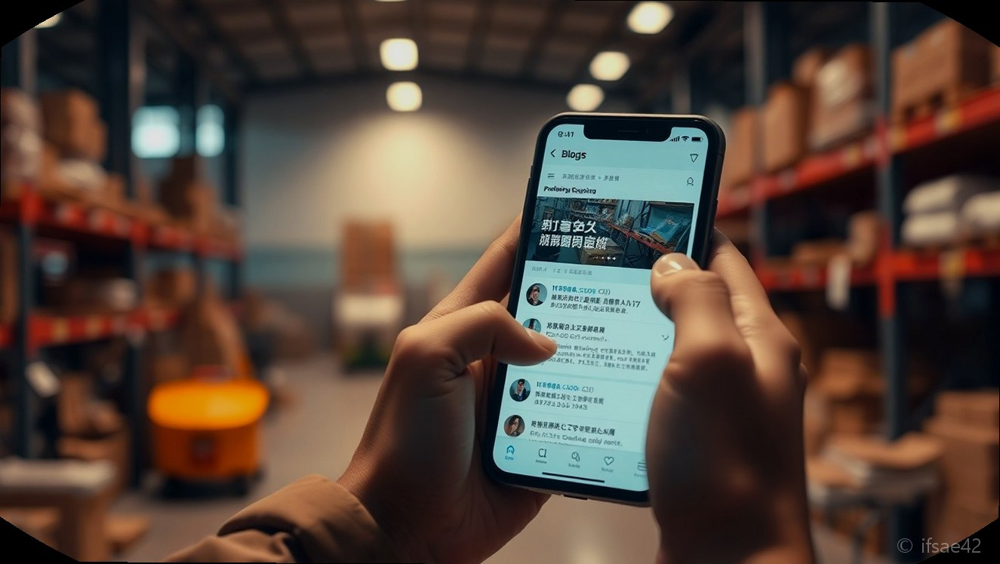
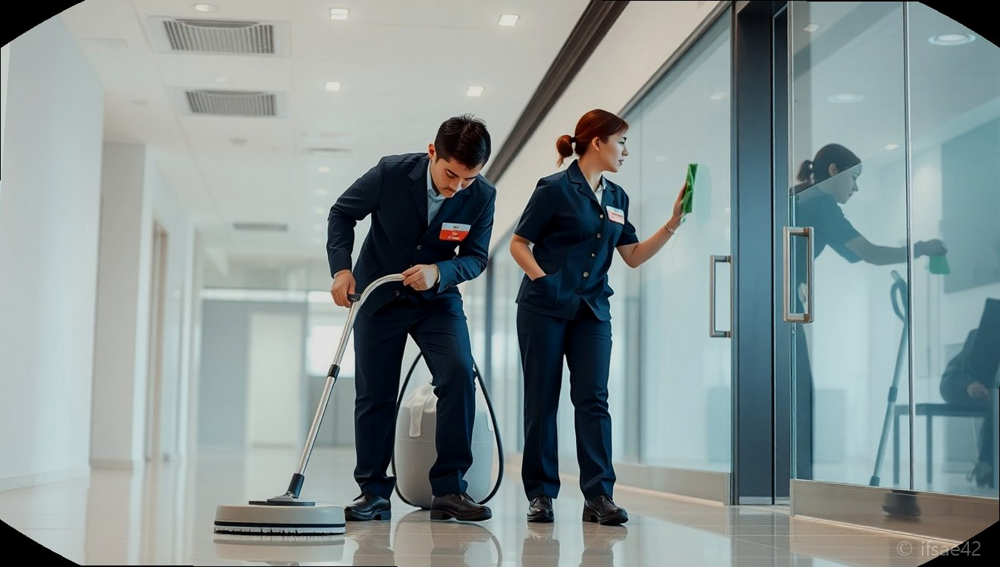

> 자동 생성 초안 · 2026-06-28

# 청소동우회 가입 전 필독! 창업 성공을 위한 현실적인 조언과 정보 활용법

창업 시장에서 '청소업'은 진입 장벽이 낮으면서도 기술력에 따라 수익이 극명하게 갈리는 분야입니다. 막상 시작하려니 무엇부터 해야 할지 막막해 가장 먼저 찾게 되는 곳이 바로 '청소동우회'입니다. 하지만 선배들의 노하우를 얻고자 가입한 카페나 모임에서 정작 성장은커녕 시간만 낭비하고 계시지는 않나요? 청소동우회는 잘 활용하면 강력한 무기가 되지만, 잘못 의존하면 늪이 될 수도 있습니다. 성공적인 창업을 위해 우리가 반드시 알아야 할 동우회의 실체와 활용 전략을 짚어봅니다.

## 동우회의 장점과 한계

청소동우회에 가입하는 가장 큰 이유는 '정보의 비대칭성'을 해소하기 위해서입니다. 현장에서 겪는 돌발 상황 대처법, 장비 선택의 기준, 혹은 구인 문제 등 혼자서는 해결하기 어려운 고민을 먼저 겪은 이들에게 물어볼 수 있다는 것은 큰 자산입니다. 특히 초기 창업자에게는 실무적인 가이드를 얻을 수 있는 유일한 통로가 되기도 합니다.

하지만 주의할 점은 이곳이 '교육기관'이 아니라는 사실입니다. 동우회는 기본적으로 친목과 정보 교류가 목적인 집단입니다. 따라서 여기 올라오는 모든 정보가 정답은 아니며, 때로는 과장되거나 특정 업체 홍보를 목적으로 하는 정보도 섞여 있습니다. 동우회 활동을 '공부'라고 착각하고 끊임없이 눈팅만 하는 것은 시간 낭비입니다. 동우회는 정보를 얻는 '도구'로만 활용하고, 최종적인 판단과 실행은 철저히 본인의 몫임을 명심해야 합니다.

## 실무와 거래처 확보법

현장에서 성공하는 사장님들의 공통점은 동우회의 커뮤니티 기능을 '거래처 확보'와 '업무 협력'의 장으로 활용한다는 것입니다. 혼자서는 감당하기 힘든 큰 평수의 현장이나, 갑작스러운 일정이 겹쳤을 때 동료 사장님들과 팀을 이뤄 작업하는 '협업 시스템'은 동우회 활동의 백미입니다.

단순히 "어떻게 청소하나요?"라는 질문을 던지기보다, 내가 가진 기술을 증명하고 신뢰를 쌓아 동료들의 추천을 받는 것이 중요합니다. 청소업의 핵심은 화려한 기술이 아니라 '고객 만족'입니다. 고객은 여러분이 어떤 장비를 쓰는지, 어떤 세제를 쓰는지 크게 관심이 없습니다. 그들이 원하는 결과물은 '내가 돈을 낸 만큼 깨끗해진 공간' 그 자체입니다. 동우회에서 얻은 노하우를 나만의 서비스 방식으로 정립하여 고객에게 신뢰를 주는 것, 그것이 수익을 창출하는 본질적인 비즈니스 모델입니다.

## 창업 시 필수 마인드셋

많은 분이 청소동우회 게시판의 화려한 매출 인증글을 보며 조급함을 느낍니다. 하지만 기억하세요. 청소는 예술이 아니라 서비스업입니다. 완벽하게 닦아내겠다는 강박보다는 시간 내에 효율적으로 최상의 결과물을 내는 것이 사업적 마인드입니다.

동우회 안에서만 머물지 말고 밖으로 나가세요. 교육생을 만나고, 실제로 현장을 발로 뛰며 고객을 대면하는 경험이 동우회 글 100개를 읽는 것보다 낫습니다. 스스로 사업 역량을 키우지 않고 커뮤니티의 정보에만 의존하면, 결국 남의 방식만 따라 하다가 정체되기 십상입니다.

**Q1. 청소동우회에서 정보를 얻기만 해도 창업에 성공할 수 있나요?**
A1. 정보 습득은 시작일 뿐이며, 실전 경험과 고객 응대 능력을 스스로 갖추지 못하면 성장에 한계가 있습니다.

**Q2. 동우회 활동을 통해 거래처를 늘리려면 어떻게 해야 하나요?**
A2. 단순히 눈팅하기보다는 협업이 필요한 현장에서 성실함과 실력을 증명하여 신뢰 관계를 구축하는 것이 가장 빠릅니다.

청소업은 분명 성장하고 있는 시장이며, 고객들의 눈높이도 나날이 높아지고 있습니다. 동우회는 그 흐름을 읽는 안테나로 활용하시되, 여러분의 사업을 지탱하는 것은 결국 현장에서 마주하는 고객과의 약속과 스스로의 기술 연마라는 점을 잊지 마시기 바랍니다. 커뮤니티라는 징검다리를 건너, 이제는 여러분만의 브랜드를 가진 사장님이 되시길 응원합니다.

#청소창업 #청소동우회 #창업마인드셋
