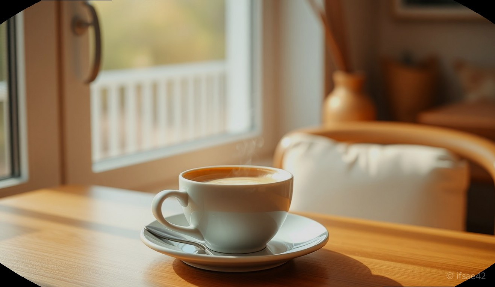
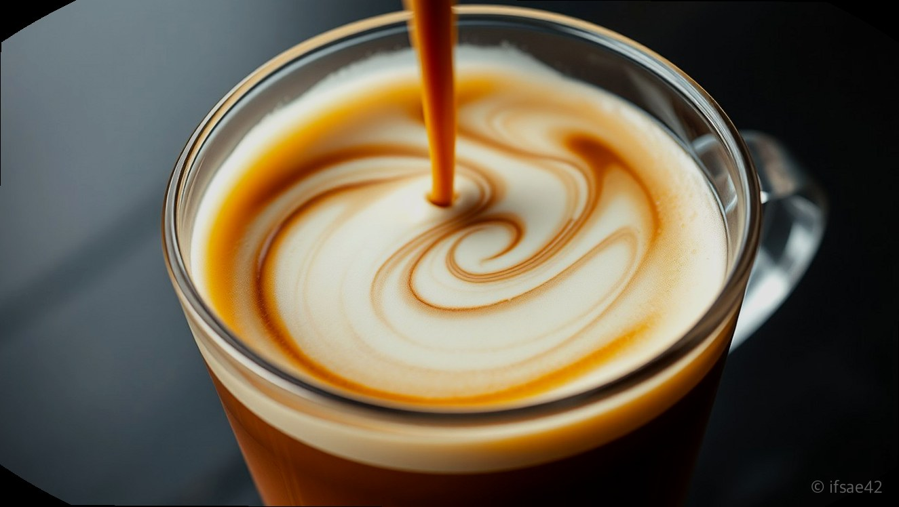
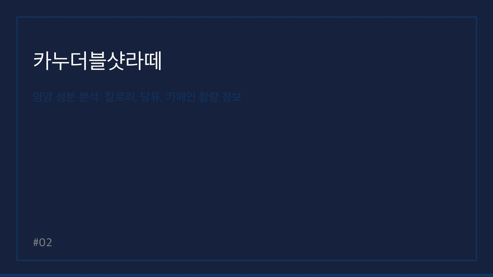

> 자동 생성 초안 · 2026-06-05

# 카누 더블샷 라떼 솔직 후기: 칼로리, 카페인 함량부터 맛있게 타는 물 양까지 총정리

바쁜 아침, 카페에 들를 시간은 부족하고 진하고 고소한 라떼 한 잔이 간절할 때 가장 먼저 떠오르는 제품이 바로 카누 더블샷 라떼입니다. 이름에서부터 알 수 있듯이 일반 라떼보다 더 진한 에스프레소의 풍미와 우유의 부드러운 고소함이 조화롭게 어우러져 많은 직장인과 학생들에게 꾸준히 사랑받고 있습니다.

특히 인스턴트 커피 특유의 밍밍함을 싫어하시는 분들이라면 카누 더블샷 라떼가 제공하는 묵직한 바디감에 만족하실 가능성이 큽니다. 오늘은 많은 분이 궁금해하시는 영양 성분부터 가장 맛있게 즐길 수 있는 레시피, 그리고 타 브랜드와의 비교까지 꼼꼼하게 정리해 드립니다.

## 카누 더블샷 라떼 맛과 풍미, 일반 라떼와의 차이점

카누 더블샷 라떼의 가장 큰 특징은 '더블샷'이라는 이름에 걸맞은 진한 커피 본연의 씁쓸함과 우유의 풍미가 균형을 잘 이루고 있다는 점입니다. 일반 라떼 제품들이 우유의 맛에 집중하여 다소 가볍게 느껴진다면, 이 제품은 에스프레소 추출액의 함량을 높여 커피의 존재감을 확실히 드러냅니다.

실제로 마셔보면 첫 모금에서 느껴지는 쌉싸름한 커피 향이 입안을 감싸고, 뒤이어 우유 크리머의 부드러운 고소함이 따라옵니다. 평소 연한 라떼를 선호하시는 분들보다는 진한 카페 스타일의 라떼를 즐기시는 분들에게 최적화된 맛입니다. 특히 사무실에서 오후 업무 중 당 충전이 필요하거나, 잠을 깨워줄 강력한 한 잔이 필요할 때 그 진가를 발휘합니다.

## 영양 성분 분석: 칼로리, 당류, 카페인 함량 정보

많은 분이 다이어트나 건강을 위해 꼼꼼히 체크하시는 영양 성분 정보입니다. 카누 더블샷 라떼 1스틱(13.5g 기준)을 기준으로 대략적인 수치를 정리했습니다.

*   **칼로리:** 약 65kcal
*   **당류:** 약 5~6g 내외
*   **카페인 함량:** 약 70~80mg 내외

일반적인 믹스커피와 비교했을 때 칼로리가 지나치게 높지 않으면서도, 라떼의 풍미를 충분히 살린 것이 특징입니다. 다만 카페인에 민감하신 분들은 하루에 2~3잔 이상 마실 경우 카페인 권장량을 초과할 수 있으니 본인의 컨디션에 맞춰 섭취량을 조절하시기 바랍니다.

## 맛있게 타는 법: 황금 비율과 물 조절 팁

카누 더블샷 라떼를 가장 맛있게 마시는 방법은 의외로 간단합니다. 핵심은 물의 양을 조절하여 진한 풍미를 유지하는 것입니다.

1.  **최적의 물 양:** 스틱 1개당 물 100ml~120ml를 넣는 것을 권장합니다. 물을 너무 많이 넣으면 라떼 특유의 고소함이 희석되어 밍밍해질 수 있으니, 종이컵의 절반 정도만 물을 채운다는 느낌으로 타시는 것이 가장 좋습니다.
2.  **온도 조절:** 너무 뜨거운 물보다는 80~90도 정도의 따뜻한 물이 커피의 향을 가장 잘 살려줍니다.
3.  **얼음 활용:** 아이스로 즐기고 싶다면 물 60~70ml에 먼저 녹인 뒤, 얼음을 가득 채워 시원하게 드시는 것을 추천합니다.

## 타 브랜드 비교 및 구매 가이드

시중의 루카스나인 등 타사 라떼 제품과 비교했을 때, 카누 더블샷 라떼는 '커피의 쓴맛'을 더 선호하는 분들에게 적합합니다. 루카스나인이 좀 더 우유의 부드러움과 달콤한 향에 집중했다면, 카누는 에스프레소의 정체성을 더 강조한 스타일입니다.

가성비를 따진다면 온라인 오픈마켓에서 대용량(100개입 이상) 패키지를 구매하는 것이 가장 저렴합니다. 스틱당 가격을 계산해 보면 카페 라떼 한 잔 값의 1/5 수준으로 즐길 수 있어 매일 마시는 분들에게는 매우 경제적인 선택지입니다.

### 체크리스트: 이런 분들께 추천합니다!
- [ ] 아침마다 진한 카페 라떼가 생각나시는 분
- [ ] 사무실에서 간편하게 고퀄리티 라떼를 즐기고 싶은 분
- [ ] 너무 달지 않고 커피 본연의 맛이 살아있는 믹스를 찾는 분
- [ ] 카페인으로 오후 업무 효율을 높이고 싶으신 분

### FAQ
**Q1. 카누 더블샷 라떼는 하루에 몇 잔까지 마시는 게 적당한가요?**
A1. 성인 기준 하루 카페인 권장량은 400mg 이하이므로 보통 2~3잔 정도는 무리 없이 즐기실 수 있습니다.
**Q2. 카누 더블샷 라떼를 아이스로 마실 때 물 양은 어떻게 하나요?**
A2. 뜨거운 물을 60ml 정도만 부어 충분히 녹인 후 얼음을 컵 가득 채우면 진하고 시원한 아이스 라떼가 완성됩니다.
**Q3. 일반 카누 라떼와 더블샷 라떼의 가장 큰 차이는 무엇인가요?**
A3. 더블샷 라떼는 에스프레소 함량이 높아 커피의 쓴맛과 풍미가 훨씬 진하며 바디감이 더 묵직하게 느껴집니다.

카누 더블샷 라떼는 바쁜 일상 속 작은 휴식을 선물해 주는 고마운 존재입니다. 오늘 알려드린 레시피로 나만의 홈카페를 완성해 보시는 건 어떨까요? 여러분의 일상이 이 작은 라떼 한 잔으로 조금 더 향긋해지길 바랍니다.

#카누더블샷라떼 #카누커피 #홈카페레시피
