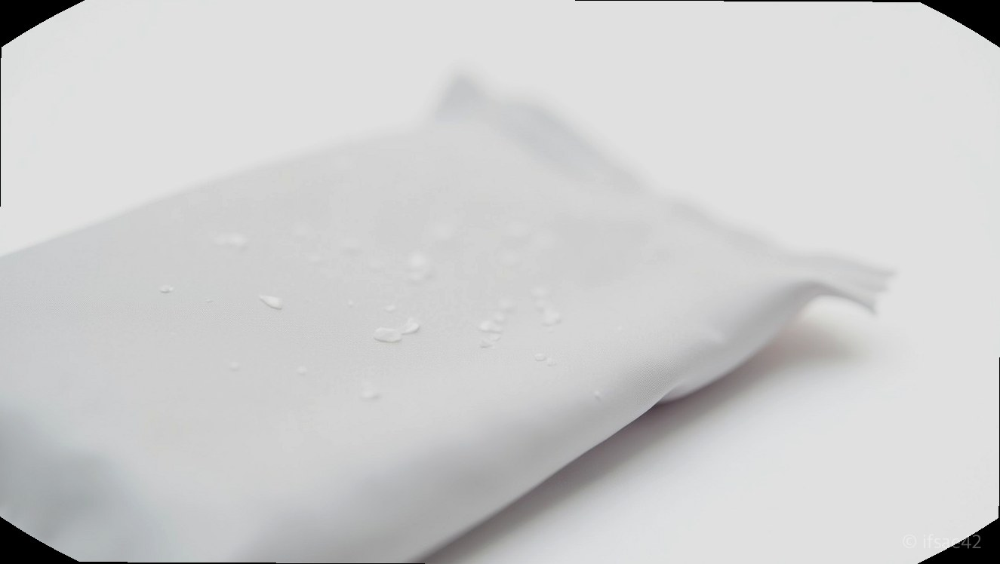
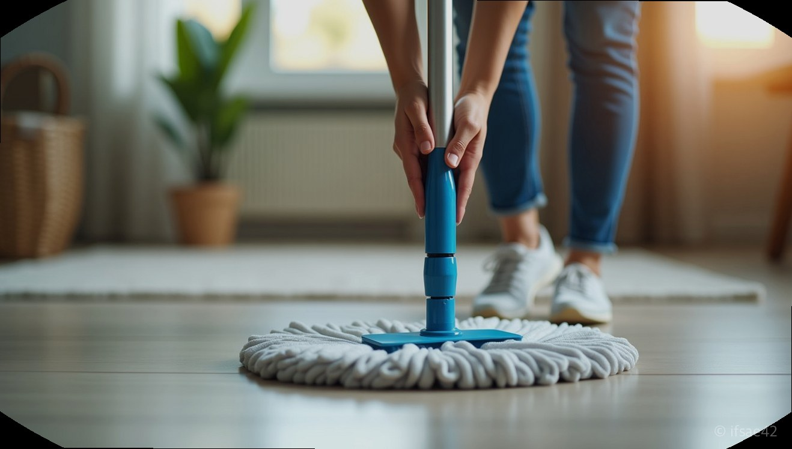

> 자동 생성 초안 · 2026-07-10

# 쿼시 청소포 내돈내산 2년 사용기, 먼지 흡착력 진짜일까? 밀대 호환부터 단점까지 솔직 후기

청소기를 돌리고 나서도 뒤돌아서면 보이는 머리카락과 미세한 먼지들 때문에 스트레스받으신 적 있으신가요? 분명 방금 청소했는데 왜 다시 먼지가 쌓이는지, 살림하는 분들이라면 누구나 겪는 고민일 겁니다. 저 역시 먼지와의 전쟁에 지쳐 정착한 아이템이 바로 '쿼시 청소포'입니다. 벌써 2년째 내돈내산으로 쟁여두고 사용하는 입장에서, 왜 이 제품이 입소문이 났는지 그리고 어떤 점이 아쉬운지 가감 없이 정리해 드립니다.

## 점착식의 강력한 흡착력

일반적인 정전기 청소포가 먼지를 '밀어내며' 모으는 방식이라면, 쿼시 청소포는 '점착식'이라는 독보적인 특징을 가지고 있습니다. 처음 이 제품을 썼을 때 가장 놀랐던 점은 바닥에 닿는 순간 느껴지는 쫀쫀함입니다.

수용성 점착 성분이 도포되어 있어, 가벼운 먼지뿐만 아니라 청소기로는 잘 안 빨려 올라오는 머리카락, 반려동물의 털까지 아주 찰떡같이 잡아냅니다. 한번 지나간 자리에 먼지가 다시 흩날리지 않으니 바닥을 몇 번씩 왕복할 필요가 없어 청소 시간이 확실히 단축됩니다. 특히 아이가 있는 집이나 반려동물을 키우는 분들에게는 이 흡착력이 엄청난 만족감을 줄 거예요.

## 밀대 호환과 사용 꿀팁

많은 분이 궁금해하시는 점 중 하나가 바로 '기존에 쓰던 밀대와 호환이 될까?'입니다. 결론부터 말씀드리면, 시중에서 흔히 볼 수 있는 대부분의 밀대와 호환이 가능합니다.

저는 집에 굴러다니던 저렴한 밀대에 쿼시 청소포를 끼워 사용 중인데, 사이즈가 넉넉하게 나와서 모서리 부분을 밀대 홈에 꾹꾹 눌러 끼우면 청소하는 내내 빠지지 않고 안정적으로 고정됩니다. 또한, 굳이 밀대를 쓰지 않아도 반으로 접어 가구 위나 TV 선반, 문틀의 먼지를 닦아내는 용도로도 아주 훌륭합니다. 특히 창틀이나 좁은 틈새에 쌓인 먼지를 닦을 때 손바닥으로 가볍게 문지르면 먼지가 날리지 않고 그대로 붙어 나오니 청소가 훨씬 수월해집니다.

## 2년 실사용 장단점

**장점**
- 먼지 비산이 거의 없습니다. 정전기 방식보다 훨씬 깔끔합니다.
- 대용량으로 구매하면 가성비가 훌륭합니다. 200매씩 쟁여두면 든든합니다.
- 바닥뿐만 아니라 가구 위, 건조기 필터 청소 등 활용도가 무궁무진합니다.

**단점**
- 점착 성분 때문에 아주 미세하게 끈적임이 느껴질 수 있습니다. (맨발로 밟았을 때 예민하신 분들은 바로 느끼실 수도 있습니다.)
- 물걸레질을 완벽하게 대체할 수는 없습니다. 찌든 때를 지우는 용도보다는 먼지 제거에 최적화된 제품입니다.

## 구매 전 고민되는 질문

**Q1. 일반 정전기 청소포보다 더 비싼데 그만한 값어치를 하나요?**
A1. 먼지 흡착력 면에서 확실히 차이가 납니다. 일반 청소포는 먼지를 옆으로 밀다가 중간에 놓치는 경우가 많은데, 쿼시는 끝까지 잡아주어 뒤처리가 훨씬 깔끔합니다.

**Q2. 청소포의 끈적임이 바닥에 남아서 찝찝하지 않을까요?**
A2. 일상적인 수준에서는 전혀 문제 되지 않습니다. 다만 너무 오랫동안 한 자리를 집중적으로 문지르면 미세한 잔여감이 남을 수 있으니, 넓은 면적을 빠르게 훑는 방식으로 청소하는 것을 추천합니다.

**Q3. 200매는 너무 많은데 보관은 어떻게 하나요?**
A3. 쿼시 청소포는 지퍼백 형태나 밀봉이 잘 되는 패키지로 나오는 경우가 많아, 습기만 피해서 서늘한 곳에 두면 마지막 한 장까지 끈적임 유지력이 좋습니다.

결론적으로 쿼시 청소포는 '먼지를 완벽하게 제거하고 싶다'는 갈증을 해소해 주는 아이템입니다. 청소기만으로는 부족했던 2%를 채워주는 제품이라, 한번 써보시면 다시 일반 청소포로 돌아가기 어려우실 겁니다. 여러분은 지금 집안의 어떤 구역 먼지가 가장 고민이신가요?

#쿼시청소포 #살림꿀템 #먼지제거 #내돈내산후기 #청소노하우
